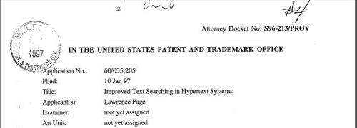

*I like looking at patents and whitepapers and other primary sources from search engines to help me in with understanding SEO. I’ve been writing about them for more than 5 years now. I am putting together this series of the 10 most important SEO patents to share what I’ve learned during that time. These aren’t patents about SEO. They are ones I would recommend anyone interested in learning about SEO look at patents from sources like Google or Microsoft or Yahoo.*

The first PageRank patent application was never published by the United States Patent and Trademark Office (USPTO). It was never assigned to a particular company or organization. It was never granted. It does not use dense legal language and mathematics that can make reading patents difficult. It captures the excitement of a candidate Ph.D. student, Larry Page, who has had a breakthrough in indexing webpages with the potential to be a vast improvement over other search engines.

The patent is [Improved Text Searching in Hypertext Systems](https://www.seobythesea.com/improved-text-searching-in-hypertext-systems.pdf) (pdf – 1.7mb), Patent Application number 60/035,205, filed on January 10, 1997. I was looking through the USPTO’s Patent Information Retrieval Database this March when I came across it, and I wrote about it in a blog post at [The First PageRank Patent and the Newest](https://www.seobythesea.com/2011/03/the-first-pagerank-patent-and-the-newest/). I hadn’t seen it referred to anywhere else on the Web, which is a shame.

This provisional patent does not have the weight or legal value of the continuation patents that followed it, but it captures the excitement and personality of its inventor, Larry Page. It also shows head-to-head examples of search results from Google and AltaVista for specific queries to show how the link analysis involved with PageRank made a difference.

Another aspect of the patent is “PageRank” showing next to individual pages in search results. This isn’t the ToolBar PageRank that we see these days, but rather actual PageRank numbers. It also shows a count of the actual backlinks for pages in search results as well. On a search for [University], the top-ranked page is the homepage of the University of Illinois at Urbana-Champaign, with a PageRank of 694.687, and 8,460 backlinks. At the time, the search engine returning these results was “Backrub” rather than Google.

The introduction and summary in the patent tell us, in part, about the invention within the patent:

> Described here is a system that yields radically improved results for these queries using the additional information available from a large database of web links. This database of Web citations is used to determine a citation importance ranking for every web page, which is then used to sort the query results.
>
> This system has been implemented, and yields excellent results, even on a relatively small database of four million web pages.
>
> Not only does the system yield better results, but it does so at a significantly reduced computational cost, which can be a very large expense for web search engines.
>
> Demonstrating the improvement is as easy as picking a general query, for example, “weather”, and comparing the results to the results from a traditional web search engine, like AltaVista (the results section shows some sample queries).

PageRank turned out to be a significant improvement over algorithms used by other search engines, and Google was granted an exclusive license to use the technology from Stanford University, until the year 2011. I don’t know if that license was extended at any point in time, but patents from Microsoft and Yahoo and other organizations have been filed and granted which build upon PageRank in many ways.

It’s also very much likely that the original PageRank algorithm was altered and improved upon almost immediately upon implementation, and I’ll be pointing to at least one set of improvements later in this series of the 10 Most Important SEO Patents.

In addition to reading patents about PageRank, it’s also worth looking at some of the early papers about it as well, such as the one penned by Google Founders Page and Brin, [The Anatomy of a Large-Scale Hypertextual Web Search Engine](http://infolab.stanford.edu/~backrub/google.html), and [The PageRank Citation Ranking: Bringing Order to the Web](http://web.archive.org/web/20170106094458/http://ilpubs.stanford.edu:8090/422/1/1999-66.pdf).

Like many patents, it’s not unusual to see other patents spawn from a single patent as a continuation or divisional patents that either includes the original patent, supersede it, or take one aspect of it and build upon it. There were several PageRank patents from Stanford University authored by Larry Page which built upon this original patent, and added to it, as follows:

[Method for node ranking in a linked database](http://patft.uspto.gov/netacgi/nph-Parser?Sect1=PTO2&Sect2=HITOFF&p=1&u=%2Fnetahtml%2FPTO%2Fsearch-adv.htm&r=1&f=G&l=50&d=PALL&S1=06285999&OS=PN/06285999&RS=PN/06285999)
Invented by Lawrence Page
Assigned to The Board of Trustees of the Leland Stanford Junior University
US Patent 6,285,999
Granted September 4, 2001
Filed: January 9, 1998

Abstract

> A method assigns importance ranks to nodes in a linked database, such as any database of documents containing citations, the world wide web or any other hypermedia database. The rank assigned to a document is calculated from the ranks of documents citing it. Also, the rank of a document is calculated from a constant representing the probability that a browser through the database will randomly jump to the document. The method is particularly useful in enhancing the performance of search engine results for hypermedia databases, such as the world wide web, whose documents have a large variation in quality.

Continuation to 6,285,999…

[Method for scoring documents in a linked database](http://patft.uspto.gov/netacgi/nph-Parser?Sect1=PTO2&Sect2=HITOFF&p=1&u=%2Fnetahtml%2FPTO%2Fsearch-adv.htm&r=1&f=G&l=50&d=PALL&S1=07058628&OS=PN/07058628&RS=PN/07058628)
Invented by Lawrence Page
Assigned to The Board of Trustees of the Leland Stanford Junior University
US Patent 6,799,176
Granted September 28, 2004
Filed: July 6, 2001

Abstract

> A method is presented for scoring documents stored in a network. The method includes identifying links from linking documents to linked documents in the network and determining the importance of the identified links. The method further includes weighting the identified links based on the determined importance and scoring the linked documents based on the weighted links.

Continuation to 6,285,999…

[Method for node ranking in a linked database](http://patft.uspto.gov/netacgi/nph-Parser?Sect1=PTO2&Sect2=HITOFF&p=1&u=%2Fnetahtml%2FPTO%2Fsearch-adv.htm&r=1&f=G&l=50&d=PALL&S1=07058628&OS=PN/07058628&RS=PN/07058628)
Invented by Lawrence Page
Assigned to The Board of Trustees of the Leland Stanford Junior University
US Patent 7,058,628
Granted June 6, 2006
Filed: July 2, 2001

Abstract

> A method assigns importance ranks to nodes in a linked database, such as any database of documents containing citations, the world wide web or any other hypermedia database. The rank assigned to a document is calculated from the ranks of documents citing it. Besides, the rank of a document is calculated from a constant representing the probability that a browser through the database will randomly jump to the document. The method is particularly useful in enhancing the performance of search engine results for hypermedia databases, such as the world wide web, whose documents have a large variation in quality.

Continuation to 7,058,628…

[Scoring documents in a linked database](http://patft.uspto.gov/netacgi/nph-Parser?Sect1=PTO2&Sect2=HITOFF&p=1&u=%2Fnetahtml%2FPTO%2Fsearch-adv.htm&r=1&f=G&l=50&d=PALL&S1=07269587&OS=PN/07269587&RS=PN/07269587)
Invented by Lawrence Page
Assigned to The Board of Trustees of the Leland Stanford Junior University
US Patent 7,269,587
Granted September 11, 2007
Filed: December 1, 2004

Abstract

> A method assigns importance ranks to nodes in a linked database, such as any database of documents containing citations, the world wide web or any other hypermedia database. The rank assigned to a document is calculated from the ranks of documents citing it. Also, the rank of a document is calculated from a constant representing the probability that a browser through the database will randomly jump to the document.

Continuation to 7,058,628…

[Annotating links in a document based on the ranks of documents pointed to by the links](http://patft.uspto.gov/netacgi/nph-Parser?Sect1=PTO2&Sect2=HITOFF&p=1&u=%2Fnetahtml%2FPTO%2Fsearch-adv.htm&r=1&f=G&l=50&d=PALL&S1=07908277&OS=PN/07908277&RS=PN/07908277)
Invented by Lawrence Page
Assigned to The Board of Trustees of the Leland Stanford Junior University
US Patent 7,908,277
Granted March 15, 2011
Filed: February 5, 2007

Abstract

> A method may identify a document that includes a link that points to a linked document, determine a score for the link in the identified document based on a score of the linked document, modify the identified document based on the determined score, and provide the modified document.

These weren’t the only patents that were based in part upon the PageRank algorithm, and there’s an excellent overview of some of the patents and papers that followed it from Yahoo’s Pavel Berhkin, in his paper [A Survey on PageRank Computing](http://www.cs.kent.edu/~javed/class-CXNET09S/papers-CXNET-2009/Berk05-Berkhin.pdf). He was also co-inventor on a Yahoo patent that I wrote about in [Yahoo Replaces PageRank Assumptions with User Data](https://www.seobythesea.com/2008/01/yahoo-replaces-pagerank-assumptions-with-user-data/), which includes several thoughtful criticisms of PageRank. The patent at the heart of that post is [User-sensitive pagerank](http://appft1.uspto.gov/netacgi/nph-Parser?Sect1=PTO2&Sect2=HITOFF&u=%2Fnetahtml%2FPTO%2Fsearch-adv.html&r=1&p=1&f=G&l=50&d=PG01&S1=20080010281.PGNR.&OS=dn/20080010281&RS=DN/20080010281).

If you want to dig even more deeply into PageRank, and the approaches that followed it, the book [Google’s PageRank and Beyond: The Science of Search Engine Rankings](https://press.princeton.edu/books/paperback/9780691152660/googles-pagerank-and-beyond) by Amy N. Langville and Carl D. Meyer is worth spending some time on.

**Conclusion**

A few notes on this series. I called this the “10 Most Important SEO Patents” rather than the “10 Most Important Search Patents” because I’ve been having people ask me for a few years to point out the patents that they should read that might be most helpful for them in their practice of SEO. I’ve made several lists over that time and found that it was easy to come up with the first 5 or so, but the last 5 proved considerably more elusive.

I’ve now nailed down at least the top 7 that I would recommend, and I’m hoping that by the time I reach number 8, I’ll have some idea of the last three that I want to include in this list. Of course, I’m open to suggestions and to hearing from readers of this series which patents they would recommend, as well as questions about these patents themselves.

There are other ways to learn about SEO, and actual execution and experience in building web pages and optimizing them can’t be rivaled, but looking at patents and papers from the people who build search engines provides a window into the challenges they’ve faced, the assumptions that they’ve made, and the ambitions that they hold. Gaining the perspective of search engineers in how they intended search engines to work is invaluable to those who practice search engine optimization.

I also want to note that it’s important to avoid placing too much faith in any one patent and the methods that it describes as to the actual practices of search engines these days. What a patent describes is only a summary of an approach that a search engine might take, and what is developed by a search engine may change in actual practice.

Like PageRank, an algorithm may transform over time as it is implemented and tweaked by a search engine. Look at these patents for the assumptions search engineers have made about the Web, about search, and searchers. As you read them, come up with questions that you can ask yourself and others. Look for ways to experiment with the ideas within them as well.

Note that PageRank is only one of many signals that Google uses at this time and that the search engine is exploring the use of many other signals regularly. It was first introduced back in 1997, almost 15 years ago. But it had a tremendous impact in its day, and likely continues to be an important part of how Google ranks Web pages.

**All parts of the 10 Most Important SEO Patents series:**

[Part 1 – The Original PageRank Patent Application](https://www.seobythesea.com/2011/12/10-most-important-seo-patents-part-1-the-original-pagerank-patent-application/)
[Part 2 – The Original Historical Data Patent Filing and its Children](https://www.seobythesea.com/2011/12/10-most-important-seo-patents-original-historical-data-patent-filing-children/)
[Part 3 – Classifying Web Blocks with Linguistic Features](https://www.seobythesea.com/2011/12/10-most-important-seo-patents-part-3-classifying-web-blocks-with-linguistic-features/)
[Part 4 – PageRank Meets the Reasonable Surfer](https://www.seobythesea.com/2011/12/most-important-seo-patents-reasonable-surfer/)
[Part 5 – Phrase Based Indexing](https://www.seobythesea.com/2011/12/10-most-important-seo-patents-part-5-phrase-based-indexing/)
[Part 6 – Named Entity Detection in Queries](https://www.seobythesea.com/2012/01/named-entity-detection-in-queries/)
[Part 7 – Sets, Semantic Closeness, Segmentation, and Webtables](https://www.seobythesea.com/2012/01/sets-semantic-closeness-segmentation-and-webtables/)
[Part 8 – Assigning Geographic Relevance to Web Pages](https://www.seobythesea.com/2012/02/assigning-geographic-relevance-web-pages/)
[Part 9 – From Ten Blue Links to Blended and Universal Search](https://www.seobythesea.com/2012/02/ten-blue-links-to-blended-universal-search/)
[Part 10 – Just the Beginning](https://www.seobythesea.com/2012/03/just-the-beginning/)
