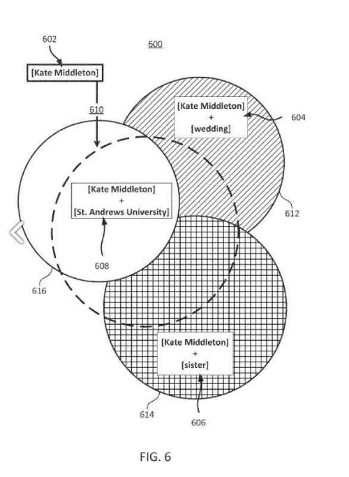
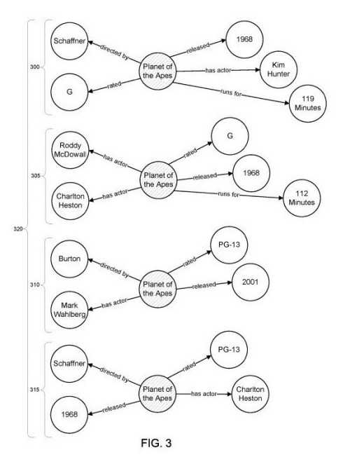
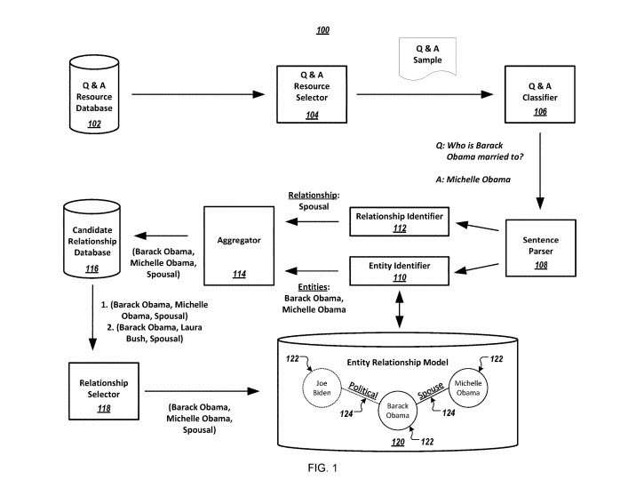
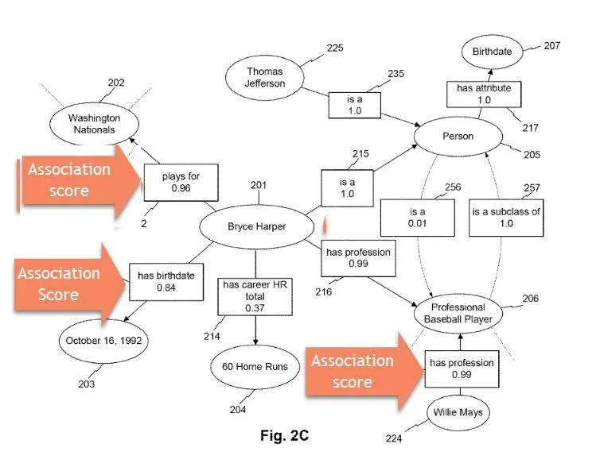
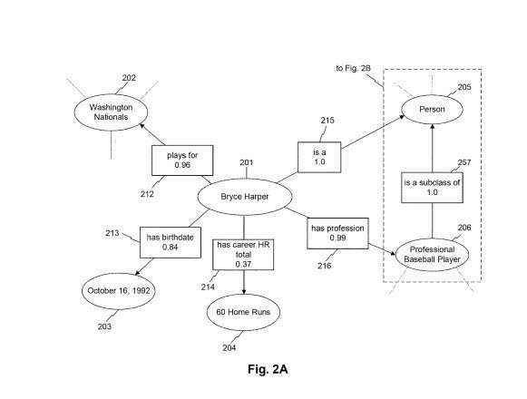
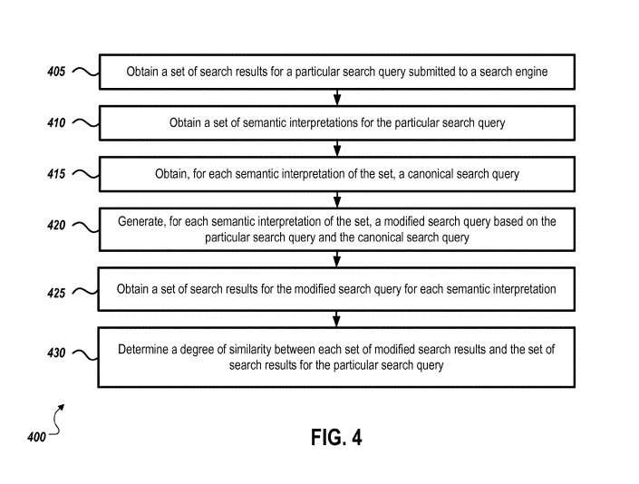
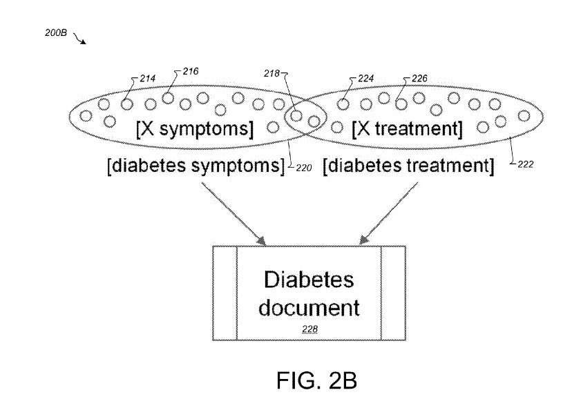

I was on the Webcology podcast last week, with fellow guest [David Harry](https://twitter.com/theGypsy), talking with hosts [Dave Davies](https://twitter.com/beanstalkim?lang=en) and [Jim Hedger](https://twitter.com/jimhedger?lang=en) talking about search engine patents.

Both David and Dave also write about search engine patents from time to time, so it was a fun discussion.

David and I were talking about patents before the show started. Then, we both began to compare the most memorable patents we had come across in the last year. This post is my top ten list, along with blog posts I wrote about each of these search engine patents.

The majority of my favorite patents from 2019 cover the use of knowledge graphs and entity extraction.

Another favorite was a news-related patent updated for the 6th time. On its last update (in 2013), the magazine/website ComputerWorld reported on the update. Unfortunately, they didn’t look at the updated claims in the new patent but reported on the description (copied from the original 2003 version of the patent) and missed out on the actual changes to that patent. It has changed a lot since the first version.

Another favorite is a hybrid search/knowledge-based patent that tries to understand and anticipate query templates that might be asked.

The last of the bunch is about better information local searches by using actual visits to businesses to calculate quality visit scores to boost local results’ rankings.

These are my top ten Search Engine Patents posts of 2019 (I only chose ones that I spent enough time with to write about them.) Hopefully, David Harry will share his Top 10 search engine patents from this year with us, too.

## Knowledge-Based Patents

1. [User-Specific Knowledge Graphs to Support Queries and Predictions Structured user graph to support querying and predictions](https://www.seobythesea.com/2019/11/user-specific-knowledge-graphs/), is a post about the patent [Structured user graph to support querying and predictions](http://patft.uspto.gov/netacgi/nph-Parser?Sect1=PTO1&Sect2=HITOFF&d=PALL&p=1&u=%2Fnetahtml%2FPTO%2Fsrchnum.htm&r=1&f=G&l=50&s1=10,482,139.PN.&OS=PN/10,482,139&RS=PN/10,482,139). This patent was originally filed in 2013. however, it makes a lot of the same points as this very similar 2019 whitepaper from Google on [Personal Knowledge Graphs](https://krisztianbalog.com/files/ictir2019-pkg.pdf).

_A user-specific Knowledge Graph with knowledge relationships between entities._

2. [Augmented Search Queries Using Knowledge Graph Information](https://www.seobythesea.com/2019/08/augmented-search-queries/) – The patent behind this one explains how Google has been including knowledge graph-based results, such as knowledge panels, Related Questions, Related Entities, and more in Search Results for queries, where they have recognized that there is an entity in a query that you may have searched for. The post is about the patent [Providing search results using augmented search queries](https://patentscope.wipo.int/search/en/detail.jsf?docId=US107424060)

3. In [Google Knowledge Graph Reconciliation](https://www.seobythesea.com/2019/08/google-knowledge-graph-reconciliation/), I wrote about a patent that explains how Google works to understand better knowledge graphs and entities that appear in those in tuples and reverse tuples, and how to expand what those knowledge graphs cover. The patent behind it was [Automatic discovery of new entities using graph reconciliation](http://patft.uspto.gov/netacgi/nph-Parser?Sect1=PTO1&Sect2=HITOFF&d=PALL&p=1&u=%2Fnetahtml%2FPTO%2Fsrchnum.htm&r=1&f=G&l=50&s1=10,331,706.PN.&OS=PN/10,331,706&RS=PN/10,331,706).

4. In [How Might Google Extract Entity Relationship Information from Q&A Pages?](https://gofishdigital.com/entity-relationship-information/), I wrote about the patent [Information extraction from question and answer websites](http://patft.uspto.gov/netacgi/nph-Parser?Sect1=PTO1&Sect2=HITOFF&d=PALL&p=1&u=%2Fnetahtml%2FPTO%2Fsrchnum.htm&r=1&f=G&l=50&s1=10,452,694.PN.&OS=PN/10,452,694&RS=PN/10,452,694), which focuses upon relationships between entities, and how confidence scores might be developed to determine the likelihood that those relationships are true. It also looks at the natural language parsing behind finding answers to questions regarding such relationships.

5. In the post [Answering Questions Using Knowledge Graphs](https://gofishdigital.com/answering-questions-using-knowledge-graphs/), I wrote about [Natural Language Processing With An N-Gram Machine](https://patentscope.wipo.int/search/en/detail.jsf?docId=WO2019083519), which tells us about how Google may create a knowledge graph to answer a query by performing a search on a question submitted to the search engine and then use the results (or a percentage of the results) to create a knowledge graph that it can then use to answer the query. This reminded me of the User-Specific knowledge graphs that I wrote about in the first patent I wrote about in this post, and how it pointed out that Google was engaged in creating many more knowledge graphs than just the one that we think about when they told us they were going to index real-world objects back in 2012.

6. The post [Entity Extractions for Knowledge Graphs at Google](https://gofishdigital.com/entity-extractions-knowledge-graphs/) is about the patent [Computerized systems and methods for extracting and storing information regarding entities](http://patft.uspto.gov/netacgi/nph-Parser?Sect1=PTO1&Sect2=HITOFF&d=PALL&p=1&u=%2Fnetahtml%2FPTO%2Fsrchnum.htm&r=1&f=G&l=50&s1=10,198,491.PN.&OS=PN/10,198,491&RS=PN/10,198,491) about how Google uses natural language processing to extract entities from the text on Web Pages, and how it also parses that text to understand relationships between the entities it finds, and facts and attributes and classifications of those entities, and the confidence scores between those entities and facts about them.

7. In [How Google May Interpret An Ambiguous Query Using a Semantic Interpretation](https://gofishdigital.com/ambiguous-query/), I wrote about how Google may decide to answer a query that may seem ambiguous by trying to decide upon the intent behind the query and comparing the results that Google search returns for the ambiguous query from the searcher with ones that cover different intents to see how similar the SERPs are for each of those. Google tells us that each of the different semantic interpretations that guess at the intent behind a query might be associated with a canonical query that it would test to see the similarity between it and the original query. This approach is described in the patent [Evaluating semantic interpretations of a search query](http://patft.uspto.gov/netacgi/nph-Parser?Sect1=PTO1&Sect2=HITOFF&d=PALL&p=1&u=%2Fnetahtml%2FPTO%2Fsrchnum.htm&r=1&f=G&l=50&s1=10,353,964.PN.&OS=PN/10,353,964&RS=PN/10,353,964).

## News-Based Patents

8. I compared earlier claims in [Evolution of Google’s News Ranking Algorithm](https://www.seobythesea.com/2019/10/news-ranking-algorithm/) to the claims from the 6th update to one of the original Google News patents at Google, which started by ranking articles based upon features of the sources of that news in the first version and evolved in several ways to focus upon originality by how much it references different entities, as described in updated claims in the patent [Systems and methods for improving the ranking of news articles](http://patft.uspto.gov/netacgi/nph-Parser?Sect1=PTO1&Sect2=HITOFF&d=PALL&p=1&u=%2Fnetahtml%2FPTO%2Fsrchnum.htm&r=1&f=G&l=50&s1=10,459,926.PN.&OS=PN/10,459,926&RS=PN/10,459,926) (6th version of this patent, updating the claims as a continuation patent)

## Search-Based Patents

9. The post [Automatic query pattern generation](https://gofishdigital.com/query-pattern-generation/) is about a patent that takes a hybrid search/knowledge approach to better understanding queries that searchers may perform by looking in query logs for questions that searchers may perform as templates and using entities from Google’s Knowledge Graph as part of those questions. An example would be, “what are the symptoms of pneumonia?” The patent behind this post is [Automatic query pattern generation](http://patft.uspto.gov/netacgi/nph-Parser?Sect1=PTO1&Sect2=HITOFF&d=PALL&p=1&u=%2Fnetahtml%2FPTO%2Fsrchnum.htm&r=1&f=G&l=50&s1=10,467,256.PN.&OS=PN/10,467,256&RS=PN/10,467,256). Google combines the use of query log information with knowledge graph information to learn about what people might search for and anticipate such questions shows us how they may combine information as they do with augmentation queries and answer questions using knowledge graphs.

## Local Search-Based Patents

10. In the post [Quality Visit Scores to Businesses May Influence Rankings in Google Local Search](https://gofishdigital.com/quality-visit-scores/), I wrote about how Google might combine real-world information about visits to businesses, as captured using navigational devices such as smartphones, as described by the patent [Quality visit measure for controlling computer response to a query associated with physical location](http://patft.uspto.gov/netacgi/nph-Parser?Sect1=PTO1&Sect2=HITOFF&d=PALL&p=1&u=%2Fnetahtml%2FPTO%2Fsrchnum.htm&r=1&f=G&l=50&s1=10,366,422.PN.&OS=PN/10,366,422&RS=PN/10,366,422). Google referred to the use of such quality visit scores in one of their support pages about ads and analytics and mentioned that they might be awarding digital and physical badges to the most visited locations as [local favorites](https://support.google.com/business/answer/9561440?hl=en) (which Google is now awarding in New York City, Chicago, and Los Angeles.)
