## Which Google Link Analysis Approach May Have Changed?

In the Google Inside Search blog, Google’s Amit Singhal published a post titled [Search quality highlights: 40 changes for February](https://search.googleblog.com/2012/02/search-quality-highlights-40-changes.html) that told us about many changes to how Google ranks pages, including the following:

> Link evaluation. We often use characteristics of links to help us figure out the topic of a linked page. We have changed how we evaluate links; in particular, we are turning off a method of link analysis that we used for several years. We often rearchitect or turn off parts of our scoring to keep our system maintainable, clean and understandable.

Curious about which link analysis method Google may have stopped using, I decided to look at different link analysis methods I have seen that Google has used in the past, to try to identify a link analysis approach that they may have stopped using. I couldn’t decide which one they may have stopped, but it was interesting seeing all of these link analysis approaches in one place.

A lot of people were guessing which method of link analysis might have been changed, from PageRank being turned off, to anchor text being devalued, to Google ignoring rel=”nofollow” attributes in links, to others. I was asked my opinion by a few people and mentioned that there were several potential link analysis approaches that Google might have stopped using.

I’ve made a list of a dozen possibilities and granted Google patents that describe them, but Google uses link analysis in a lot of ways, and what Google turned off might involve something else entirely, and/or something that might not even be described in a patent.

Here’s my list of Link Analysis Methods:

## 1. Link Analysis Using Local Inter-connectivity

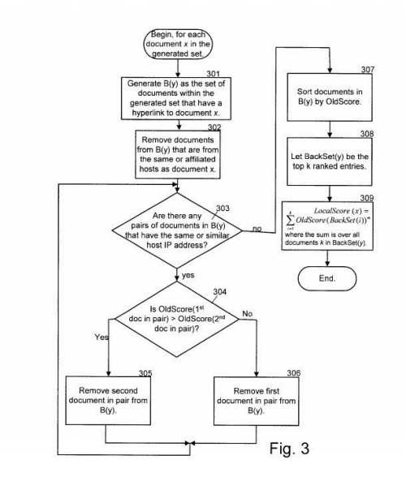

Search Results are ranked normally in response to a query, and then before they are displayed to searchers, the links between the pages in that smaller subset are explored and some results may be boosted in the results based upon links between those results.

The book In the Plex mentions that the inventor behind this patent, Krishna Bharat, developed an algorithm similar to the [HITS algorithm](http://pi.math.cornell.edu/~mec/Winter2009/RalucaRemus/Lecture4/lecture4.html) that was incorporated into what Google does in 2003. This patent was granted in 2003, and it’s similar in many ways to the HITS algorithm.

This process might be somewhat unnecessary these days, especially if Google is reranking search results based on something like the co-occurrence of terms in a result set based upon phrase-based indexing. – [Ranking search results by reranking the results based on local inter-connectivity](http://patft.uspto.gov/netacgi/nph-Parser?Sect1=PTO2&Sect2=HITOFF&p=1&u=%2Fnetahtml%2FPTO%2Fsearch-adv.htm&r=1&f=G&l=50&d=PALL&S1=06526440&OS=PN/06526440&RS=PN/06526440)

## 2. Link Analysis to Find Related Sites

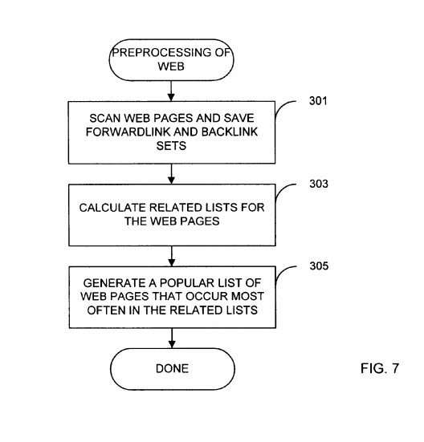

If you perform a search that appears to be for a specific site, you might see a list of other pages at the bottom of the search results, with a heading (that’s also a link) that heads “Pages similar to www.example.com”. If you click upon it, you’ll see search results for [related:www.example.com], The method that determined which pages were related was based upon links pointing at those pages using a link-based analysis.

A paper about this type of link analysis method, written by a couple of researchers who would end up becoming Google Employees is [Finding related pages in the World Wide Web](https://faculty.iiit.ac.in/~pkreddy/wdm03/wdm/FRP.pdf)

Could Google have found a better way f finding related pages? It’s possible, but the pages showing don’t seem to have changed. – [Techniques for finding related hyperlinked documents using link-based analysis](http://patft.uspto.gov/netacgi/nph-Parser?Sect1=PTO2&Sect2=HITOFF&p=1&u=%2Fnetahtml%2FPTO%2Fsearch-adv.htm&r=1&f=G&l=50&d=PALL&S1=06754873&OS=PN/06754873&RS=PN/06754873)

## 3. Link Analysis Using Adaptive Page Rank

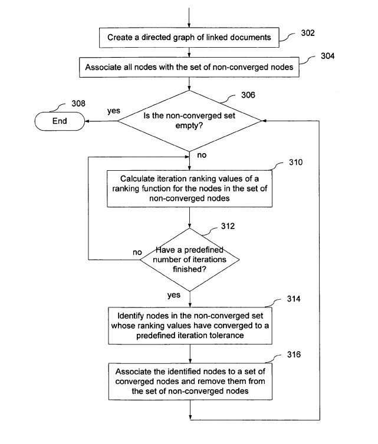

This patent describes a faster approach to calculating PageRank, taking some shortcuts. It can take a while to calculate PageRank, and a method like the one described here could speed that up.

Google has a lot more pages indexed now than they did when the patent behind this approach was filed, and they may still need this shortcut. They’ve also advanced technologically, and may not.

– [Adaptive computation of ranking](http://patft.uspto.gov/netacgi/nph-Parser?Sect1=PTO2&Sect2=HITOFF&p=1&u=%2Fnetahtml%2FPTO%2Fsearch-adv.htm&r=1&f=G&l=50&d=PALL&S1=07028029&OS=PN/07028029&RS=PN/07028029)

There is a whitepaper that was written by the inventors of this link analysis approach, intended to speed up how PageRank worked and make ranking at Google faster. The paper is [Adaptive Methods for the Computation of PageRank](http://infolab.stanford.edu/~taherh/papers/adaptive.pdf), by Sepandar Kamvar, Taher Haveliwala, and Gene Golub

*Added 26, 2019* – We were told recently that a [Former Google Engineer: Google Hasn’t Used PageRank Since 2006](https://www.seroundtable.com/google-hasnt-used-pagerank-since-2006-27891.html). He said that Google Stopped using the original PageRank in 2006, and replaced it with something that had a very similar name, but which worked quicker and more efficiently. I guess that Adaptive PageRank, which is supposedly 30% quicker to calculate PageRank scores for pages, is the most likely link analysis replacement for PageRank based upon this news. (We don’t know if PageRank was the link analysis method that was being referred to by Amit Singhal in the post I mentioned at the start of this post, but it could have been.)

## 4. Link Analysis for Cross Language Information Retrieval

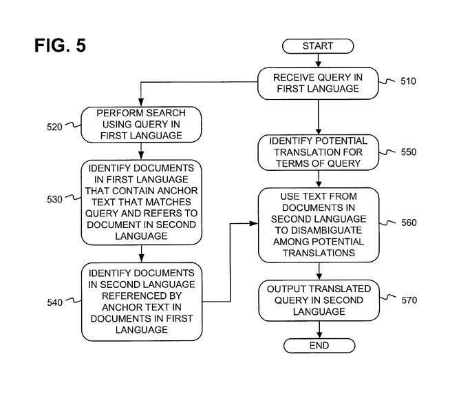

It might be possible to use anchor text from a link on a page in one language to understand what webpage that link is pointing to in another language, to understand what the targeted page is about.

Google has done a lot of work in building [statistical machine translation models](https://ai.googleblog.com/2006/04/statistical-machine-translation-live.html) over the past 5-7 years and that technology might serve them better than an approach like this one. – [Systems and methods for using anchor text as parallel corpora for cross-language information retrieval](http://patft.uspto.gov/netacgi/nph-Parser?Sect1=PTO2&Sect2=HITOFF&p=1&u=%2Fnetahtml%2FPTO%2Fsearch-adv.htm&r=1&f=G&l=50&d=PALL&S1=07146358&OS=PN/07146358&RS=PN/07146358)

## 5. Link Analysis Using Link Based Clustering

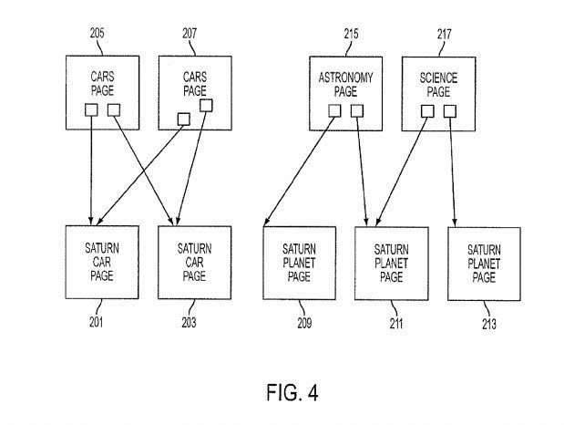

Google has probably clustered similar web pages by looking at other pages that link to pages appearing in search results, and seeing what other pages they link to.

I wrote about this link analysis method in the post [How Link Based Clustering Could Allow Google to Group Search Results](https://www.seobythesea.com/2007/05/how-linking-between-documents-could-have-allowed-google-to-group-search-results/)

Google might have replaced this clustering approach with one that focuses instead more upon the content and/or the concepts contained on those pages. – [Link based clustering of hyperlinked documents](http://patft.uspto.gov/netacgi/nph-Parser?Sect1=PTO2&Sect2=HITOFF&p=1&u=%2Fnetahtml%2FPTO%2Fsearch-adv.htm&r=1&f=G&l=50&d=PALL&S1=07213198&OS=PN/07213198&RS=PN/07213198)

## 6. Link Analysis with Personalized PageRank Scoring

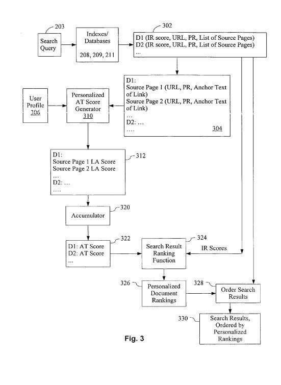

Determining personalized page scores for web pages based upon links pointing to pages that appear for specific queries in search results and whether the anchor text in those links is related to those query terms.

Google might use a different approach, such as one that may look at large amounts of data about searchers, pages, and queries to calculate a personalized page score for pages. – [Personalizing anchor text scores in a search engine](http://patft.uspto.gov/netacgi/nph-Parser?Sect1=PTO2&Sect2=HITOFF&p=1&u=%2Fnetahtml%2FPTO%2Fsearch-adv.htm&r=1&f=G&l=50&d=PALL&S1=07260573&OS=PN/07260573&RS=PN/07260573)

I dug deeper into this patent in my post [On Personalized PageRank and Personalized Anchor Text Scores](https://www.seobythesea.com/2007/08/on-personalized-pagerank-and-personalized-anchor-text-scores/)

## 7. Link Analysis Based on Anchor Text Indexing

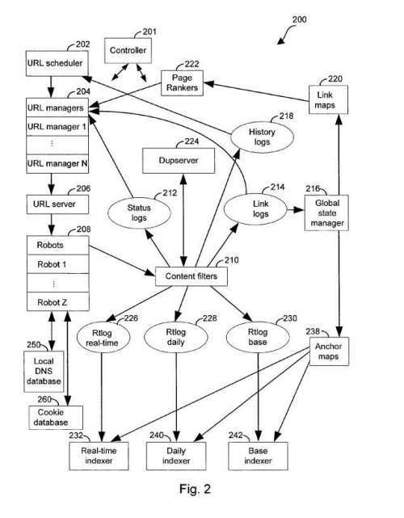

Using anchor text for links to determine the relevance of the pages they point towards. It’s quite likely that Google continues to use an approach like this, but in a modified manner that might be influenced by things like [phrase-based indexing](https://www.seobythesea.com/2011/12/10-most-important-seo-patents-part-5-phrase-based-indexing/) – [Anchor tag indexing in a web crawler system](http://patft.uspto.gov/netacgi/nph-Parser?Sect1=PTO2&Sect2=HITOFF&p=1&u=%2Fnetahtml%2FPTO%2Fsearch-adv.htm&r=1&f=G&l=50&d=PALL&S1=07308643&OS=PN/07308643&RS=PN/07308643)

For more details about how this link analysis approach works, I wrote a post about this patent: [Google Patent on Anchor Text Indexing and Crawl Rates](https://www.seobythesea.com/2007/08/on-personalized-pagerank-and-personalized-anchor-text-scores/).

## 8. Link Analysis using Historical Data

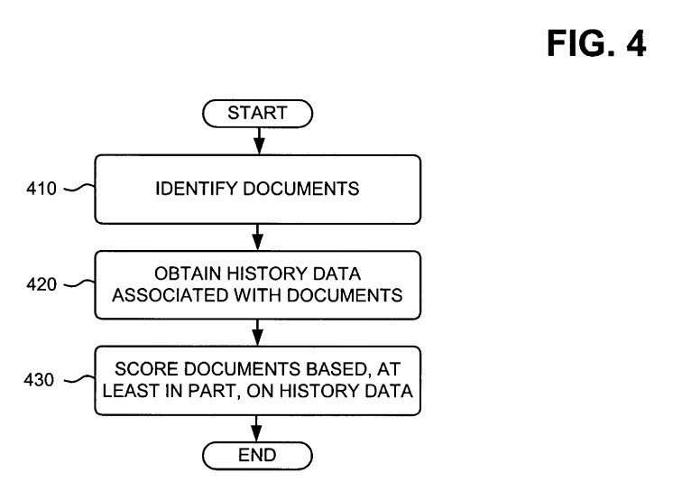

In 2005, Google published a patent application that describes a wide range of temporal-based factors related to links, such as the appearance and disappearance of links, the increase, and decrease of backlinks to documents, weights to links based upon freshness, weights to links based upon authoritativeness of the documents linked from, age of links, spikes in link growth, the relatedness of anchor text to page being pointed to overtime.

Google may have used some of the factors described in this patent and continue to use them or replaced them with something else, and it might have ignored others, – [Information retrieval based on historical data](http://patft.uspto.gov/netacgi/nph-Parser?Sect1=PTO2&Sect2=HITOFF&p=1&u=%2Fnetahtml%2FPTO%2Fsearch-adv.htm&r=1&f=G&l=50&d=PALL&S1=07346839&OS=PN/07346839&RS=PN/07346839)

I’ve written a few posts about this patent, and the many continuation patents that updated aspects of the link analysis methods that it covers. I also found an earlier version of the patent (a provisional version) and wrote about it, and a continuation patent that focused upon just some of the claims in the original. If this patent has caught your attention, you might find my post about those interesting. It is at: [Revisiting Google’s Information Retrieval Based Upon Historical Data](https://www.seobythesea.com/2011/10/revisiting-googles-information-retrieval-based-upon-historical-data/)

## 9. Link Analysis Looking at Link Weights based upon Page Segmentation

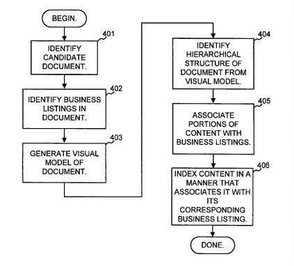

We’ve known for a few years that Google will give different weights for links based upon segments of a page where a link is located. It’s quite likely that something like this might continue to be used today, but it might have been modified in some manner, such as limiting in some way the amount of value a link might pass along if, for instance, it appears in the footers on multiple pages of a site.

Then again, Google probably has already been doing that. – [Document segmentation based on visual gaps](http://patft.uspto.gov/netacgi/nph-Parser?Sect1=PTO2&Sect2=HITOFF&p=1&u=%2Fnetahtml%2FPTO%2Fsearch-adv.htm&r=1&f=G&l=50&d=PALL&S1=07421651&OS=PN/07421651&RS=PN/07421651)

Google filed a much more detailed patent focused more upon segmentation of any pages, and not just local pages. This patent can be found at: [Determining semantically distinct regions of a document](http://patft.uspto.gov/netacgi/nph-Parser?Sect1=PTO2&Sect2=HITOFF&u=%2Fnetahtml%2FPTO%2Fsearch-adv.htm&r=1&p=1&f=G&l=50&d=PTXT&S1=7,913,163.PN.&OS=pn/7,913,163&RS=PN/7,913,163)

While both of these patents go beyond link analysis, the location of a link on a page can make a difference regarding how much weight a link might carry. I wrote a more detailed post about the second patent at: [Googles Page Segmentation Patent Granted](https://www.seobythesea.com/2011/03/googles-page-segmentation-patent-granted/)

## 10. Link Analysis Based on Reasonable Surfer Model Link Features

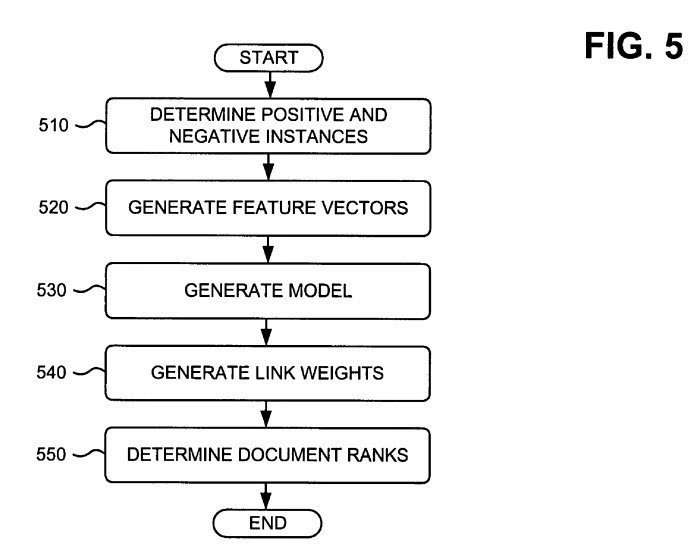

Google’s [Reasonable Surfer](https://www.seobythesea.com/2010/05/googles-reasonable-surfer-how-the-value-of-a-link-may-differ-based-upon-link-and-document-features-and-user-data/) model describes a good number of features that might be taken together to determine how much value a link might pass along from a page about other links on that page, and one or more of those values may be no longer considered in a way that they might have been in the past. – [Ranking documents based on user behavior and/or feature data](http://patft.uspto.gov/netacgi/nph-Parser?Sect1=PTO2&Sect2=HITOFF&p=1&u=%2Fnetahtml%2FPTO%2Fsearch-adv.htm&r=1&f=G&l=50&d=PALL&S1=07716225&OS=PN/07716225&RS=PN/07716225)

I’ve written a couple of posts about the reasonable surfer model link analysis approach, because it is an interesting one, and because it was updated at least once. Those posts are:

- [Google’s Reasonable Surfer: How the Value of a Link May Differ Based upon Link and Document Features and User Data](https://www.seobythesea.com/2010/05/googles-reasonable-surfer-how-the-value-of-a-link-may-differ-based-upon-link-and-document-features-and-user-data/)
- [Google’s Reasonable Surfer Model Updated](https://www.seobythesea.com/2016/04/googles-reasonable-surfer-patent-updated/)

## 11. Link Analysis Looking at Links between Affiliated Sites

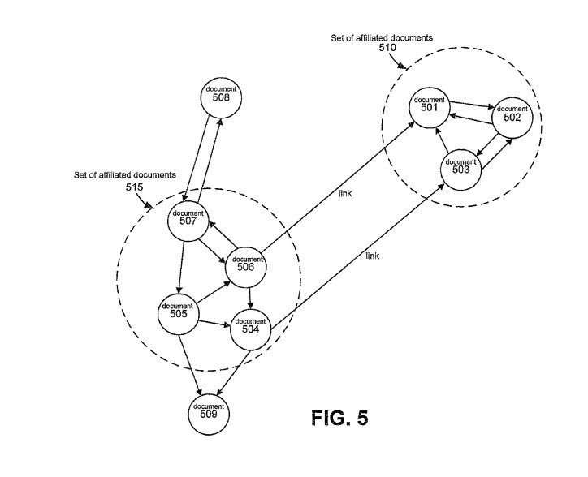

Some sites may be deemed to be related or affiliated, to others in some manner, such as being owned by the same person or people. The value of those links might be diminished because of that relationship, in comparison to other “editorially determined links.”

How that affiliation is calculated might have changed. – [Determining quality of linked documents](http://patft.uspto.gov/netacgi/nph-Parser?Sect1=PTO2&Sect2=HITOFF&p=1&u=%2Fnetahtml%2FPTO%2Fsearch-adv.htm&r=1&f=G&l=50&d=PALL&S1=07783639&OS=PN/07783639&RS=PN/07783639)

I wrote about this patent in much more detail in the post: [Google’s Affiliated Page Link Patent](https://www.seobythesea.com/2010/08/googles-affiliated-page-link-patent/)

## 12. Link Analysis with Propagation of Relevance between Linked Pages

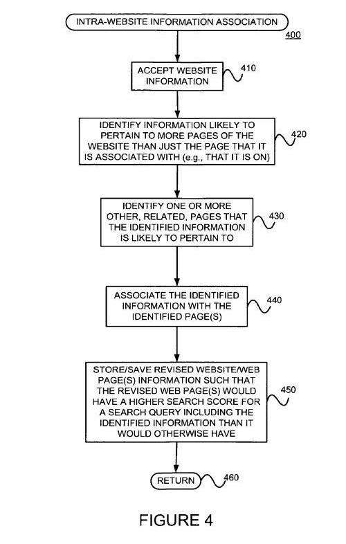

Assigning relevance of one web page to other web pages could be based upon the distance of clicks between the pages and/or certain features in the content of anchor text or URLs. For example, if one-page links to another with the word “contact” or the word “about”, and the page being linked to include an address, that address location might be considered relevant to the page doing that linking.

There are a few different parts to this method of having the relevance of one page on a site propagated to other pages on the same site, and one or more of those could have changed if it is in use. – [Propagating useful information among related web pages, such as web pages of a website](http://patft.uspto.gov/netacgi/nph-Parser?Sect1=PTO2&Sect2=HITOFF&p=1&u=%2Fnetahtml%2FPTO%2Fsearch-adv.htm&r=1&f=G&l=50&d=PALL&S1=07933890&OS=PN/07933890&RS=PN/07933890)

I wrote a post about this patent at [Google Determining Search Authority Pages and Propagating Authority to Related Pages](https://www.seobythesea.com/2007/10/google-determining-search-authority-pages-and-propagating-authority-to-related-pages/)

What “method of link analysis” do you think Google turned off?

Updated August 3, 2019
