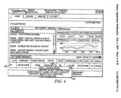

There are a lot of new features over at Yahoo Search Marketing, and they are explaining them on the Yahoo Search Marketing Blog, in posts like Improving Ad Quality, Part I and in Yahoo’s Search Marketing [Help](https://help.yahoo.com/kb/account).

As I was searching through patent applications this morning, I noticed a number of newly published applications from Yahoo on paid search marketing that describe things that also seem to appear in the new system, such as the ability to to A/B testing.

As with any patent applications, what is described in these may be different from what is actually implemented in a number of ways, but if you are interested in paid search you may want to take a look at them. Since there are so many, I decided that I would link to them here, and post the abstracts from them rather than take weeks to read through them and write about them individually.

I suspect the time doing that might be better served by spending time on Yahoo Search Marketing’s help sections and tutorials, but I did skim through sections of these documents, and they do offer a different perspective that you may find interesting.

[System and method for advertisement management](http://appft1.uspto.gov/netacgi/nph-Parser?Sect1=PTO1&Sect2=HITOFF&d=PG01&p=1&u=%2Fnetahtml%2FPTO%2Fsrchnum.html&r=1&f=G&l=50&s1=%2220070027754%22.PGNR.&OS=DN/20070027754&RS=DN/20070027754)

> The present invention relates to systems and methods for optimizing and managing advertising campaigns. The method of the present invention comprises storing one or more advertisement data structures associated with an ad group data structure in the ad group data structure.
>
> One or more ad group data structures associated with a campaign data structure are stored in an ad campaign data structure. Additionally, one or more ad campaign data structures associated with an advertised property are stored in an account data structure.

[Application program interface for optimizing advertiser defined groups of advertisement campaign information](https://patents.google.com/patent/US20070027756A1/en)

> An application program interface (“API”) for optimizing advertiser$ defined groups of advertisement campaign information is disclosed.
>
> Generally, advertisement campaign information is organized into one more ad groups. An ad group typically includes advertisements and parameters for advertisements that are to be handled by an advertisement campaign management system in a similar manner.
>
> Forecasting information is obtained relating to at least a portion of one of the one or more ad groups. Instructions are received via an API for modifying at least a portion of the advertisement campaign information based at least in part on the forecasting information to optimize performance of at least one of the one or more ad groups and at least a portion of the advertisement campaign information is modified based on the received instructions.

[Application program interface for managing advertiser defined groups of advertisement campaign information](http://appft1.uspto.gov/netacgi/nph-Parser?Sect1=PTO1&Sect2=HITOFF&d=PG01&p=1&u=%2Fnetahtml%2FPTO%2Fsrchnum.html&r=1&f=G&l=50&s1=%2220070027759%22.PGNR.&OS=DN/20070027759&RS=DN/20070027759)

> An application program interface (“API”) for managing advertiser defined groups of advertisement campaign information is disclosed.
>
> Generally, advertisement campaign information is organized into one more ad groups. An ad group typically includes advertisements and parameters for advertisements that are to be handled by an advertisement campaign management system in a similar manner.
>
> Instructions are received via an API for modifying at least a portion of the advertisement campaign information based on at least one of the one or more ad groups and at least a portion of the advertisement campaign information is modified based on the received instructions.

[Application program interface for customizing reports on advertiser defined groups of advertisement campaign information](http://appft1.uspto.gov/netacgi/nph-Parser?Sect1=PTO1&Sect2=HITOFF&d=PG01&p=1&u=%2Fnetahtml%2FPTO%2Fsrchnum.html&r=1&f=G&l=50&s1=%2220070027761%22.PGNR.&OS=DN/20070027761&RS=DN/20070027761)

> An application program interface (“API”) for customizing reports on advertiser defined groups of advertisement campaign information is disclosed.
>
> Generally, advertisement campaign information is collected from an advertisement campaign management system and at least one analytics feed.
>
> The advertisement campaign information is then organized into one or more ad groups. An ad group typically includes advertisements and parameters for advertisements that are to be handled by an advertisement campaign management system in a similar manner. Information is received via an API of an advertisement campaign management system regarding customization of a report based at least in part on at least one of the one or more ad groups, and the customized report is send via the API to a user device.

[System and method for creating and providing a user interface for customizing reports on advertiser defined groups of advertisement campaign information](http://appft1.uspto.gov/netacgi/nph-Parser?Sect1=PTO1&Sect2=HITOFF&d=PG01&p=1&u=%2Fnetahtml%2FPTO%2Fsrchnum.html&r=1&f=G&l=50&s1=%2220070027757%22.PGNR.&OS=DN/20070027757&RS=DN/20070027757)

> A system and method for creating and providing a user interface for customizing reports on advertiser defined groups of advertisement campaign information is disclosed.
>
> Generally, advertisement campaign information is collected from an advertisement campaign management system and at least one analytics feed. The advertisement campaign information is then organized into one or more ad groups.
>
> An ad group typically includes advertisements and parameters for advertisements that are to be handled by an advertisement campaign management system in a similar manner.
>
> Information is received regarding customization of a report based at least in part on at least one of the one or more ad groups, and the customized report is displayed based at least in part on at least one of the one or more ad groups.

[System and method for creating and providing a user interface for managing advertiser defined groups of advertisement campaign information](http://appft1.uspto.gov/netacgi/nph-Parser?Sect1=PTO1&Sect2=HITOFF&d=PG01&p=1&u=%2Fnetahtml%2FPTO%2Fsrchnum.html&r=1&f=G&l=50&s1=%2220070027758%22.PGNR.&OS=DN/20070027758&RS=DN/20070027758)

> A system and method for creating and providing a user interface for managing advertiser defined groups of advertisement campaign information is disclosed.
>
> Generally, advertisement campaign information is organized into one more ad groups. An ad group typically includes advertisements and parameters for advertisements that are to be handled by an advertisement campaign management system in a similar manner.
>
> At least a portion of the advertisement campaign information is then modified based at least in part on at least one of the one or more ad groups. In one embodiment, the portion of the advertisement campaign information is modified through the use of a graphical user interface running on an internet browser. In another embodiment, the portion of the advertisement campaign information is modified through the use of a stand-alone application running on a user device

[System and method for creating and providing a user interface for displaying advertiser defined groups of advertisement campaign information](http://appft1.uspto.gov/netacgi/nph-Parser?Sect1=PTO1&Sect2=HITOFF&d=PG01&p=1&u=%2Fnetahtml%2FPTO%2Fsrchnum.html&r=1&f=G&l=50&s1=%2220070027760%22.PGNR.&OS=DN/20070027760&RS=DN/20070027760)

> A system and method for creating and providing a user interface for displaying advertiser defined groups of advertisement campaign information is disclosed.
>
> Generally, advertisement campaign information is organized into one more ad groups. An ad group typically includes advertisements and parameters for advertisements that are to be handled by an advertisement campaign management system in a similar manner.
>
> At least a portion of the advertisement campaign information is then displayed based at least in part on at least one of the one or more ad groups. In one embodiment, the portion of the advertisement campaign information is displayed in a graphical user interface running on an internet browser. In another embodiment, the portion of the advertisement campaign information is displayed in a stand-alone application running on a user device.

[System and method for creating and providing a user interface for optimizing advertiser defined groups of advertisement campaign information](http://appft1.uspto.gov/netacgi/nph-Parser?Sect1=PTO1&Sect2=HITOFF&d=PG01&p=1&u=%2Fnetahtml%2FPTO%2Fsrchnum.html&r=1&f=G&l=50&s1=%2220070027762%22.PGNR.&OS=DN/20070027762&RS=DN/20070027762)

> A system and method for creating and providing a user interface for optimizing advertiser defined groups of advertisement campaign information is disclosed.
>
> Generally, advertisement campaign information is organized into one more ad groups. An ad group typically includes advertisements and parameters for advertisements that are to be handled by an advertisement campaign management system in a similar manner.
>
> Forecasting information is obtained relating to at least a portion of one of the one or more ad groups. At least a portion of the advertisement campaign information is then modified based at least in part on the forecasting information to optimize performance of at least one of the one or more ad groups.

[API for maintenance and delivery of advertising content](http://appft1.uspto.gov/netacgi/nph-Parser?Sect1=PTO1&Sect2=HITOFF&d=PG01&p=1&u=%2Fnetahtml%2FPTO%2Fsrchnum.html&r=1&f=G&l=50&s1=%2220070027771%22.PGNR.&OS=DN/20070027771&RS=DN/20070027771)

> A system comprises multiple pods coupled to a network, each pod including a data store for storing advertisement campaigns for users, each advertisement campaign containing user information, advertisement information and bid information for requesting presentation of an advertisement upon the occurrence of a predetermined event; and
>
> an application program interface capable of accessing the data store; at least one pod including a forecasting component for enabling user selection of the predetermined event; and an optimization component for assisting with selection of the bid information.

[System and method for providing scalability in an advertising delivery system](http://appft1.uspto.gov/netacgi/nph-Parser?Sect1=PTO1&Sect2=HITOFF&d=PG01&p=1&u=%2Fnetahtml%2FPTO%2Fsrchnum.html&r=1&f=G&l=50&s1=%2220070027770%22.PGNR.&OS=DN/20070027770&RS=DN/20070027770)

> A method comprises providing a first set of geographically distributed pods for storing account information on a first set of advertisements associated with web properties associated with a first set of geographically distributed users;
>
> enabling the first set of users to update the account information on the first set of pods, each user being associated with at least one advertisement and a particular pod that is not the most distant pod from the user;
>
> recognizing that the first set of pods cannot satisfy a user demand threshold;
>
> coupling an additional pod for storing additional account information on a second set of advertisements for a second set of users;
>
> enabling the second set of users to update the additional account information, the additional pod being not the most distant pod from the second set of users;
>
> receiving a content request; and
>
> identifying a particular advertisement based on the content request.

[System and method for collection of advertising usage information](http://appft1.uspto.gov/netacgi/nph-Parser?Sect1=PTO1&Sect2=HITOFF&d=PG01&p=1&u=%2Fnetahtml%2FPTO%2Fsrchnum.html&r=1&f=G&l=50&s1=%2220070027768%22.PGNR.&OS=DN/20070027768&RS=DN/20070027768)

> A system comprises users disposed in various locations within a region, each user associated with an advertisement of an associated web property, each advertisement for enabling visitors to navigate to the associated web property;
>
> pods distributed within the region, each user being associated with at least one pod located more proximate to the user than another pod and that stores account information on the advertisement associated with the user;
>
> an advertisement channel for receiving a content request from a visitor, for obtaining an advertisement of a web property based on the content request, and for presenting the advertisement to the visitor in response to the content request; and
>
> a tag-based tracking mechanism for collecting visitor events if the visitor navigates to the web property and for forwarding visitor data based on the visitor events to the pod associated with the user that is associated with the advertisement.

[Architecture for high speed delivery of advertising content](http://appft1.uspto.gov/netacgi/nph-Parser?Sect1=PTO1&Sect2=HITOFF&d=PG01&p=1&u=%2Fnetahtml%2FPTO%2Fsrchnum.html&r=1&f=G&l=50&s1=%2220070027766%22.PGNR.&OS=DN/20070027766&RS=DN/20070027766)

> A system comprises advertisement channels coupled to a network and disposed in various locations within a region, each channel configured to receive a content request from a visitor of the channel;
>
> and advertisement servers coupled to the network and distributed within the region such that each channel has at least one server more proximate than another server, the servers for storing advertisements for web properties, each advertisement associated with criteria indicating when presentation of the advertisement is desired;
>
> a given channel for providing request information regarding a content request to a given server;
>
> at least one of the servers for determining whether the request information meets any of the criteria;
>
> a relatively more proximate server configured to forward an advertisement to the given channel in response to the request information when the criteria have been met, and the given channel for presenting the advertisement in response to the content request.

[Architecture for an advertisement delivery system](http://appft1.uspto.gov/netacgi/nph-Parser?Sect1=PTO1&Sect2=HITOFF&d=PG01&p=1&u=%2Fnetahtml%2FPTO%2Fsrchnum.html&r=1&f=G&l=50&s1=%2220070027765%22.PGNR.&OS=DN/20070027765&RS=DN/20070027765)

> A system comprises an advertiser coupled to a network and having a web property to advertise;
>
> an advertisement campaign management system coupled to the network, the advertising campaign management system having a geographically distributed set of servers for storing an advertisement for the web property, criteria indicating when presentation of the advertisement is desired by the advertiser, and a bid for the presentation of the advertisement when the criteria are met; and
>
> an advertising channel coupled to the network for requesting ad content from the advertisement campaign management system and for receiving the advertisement from the advertisement campaign management system in response to the request for ad content.
