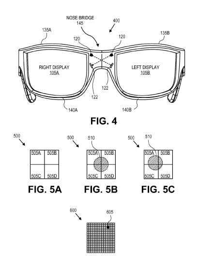
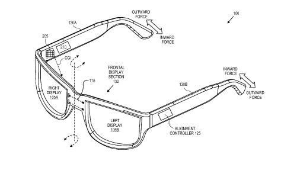
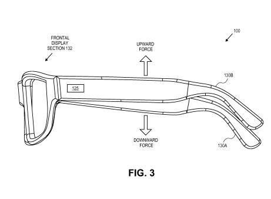
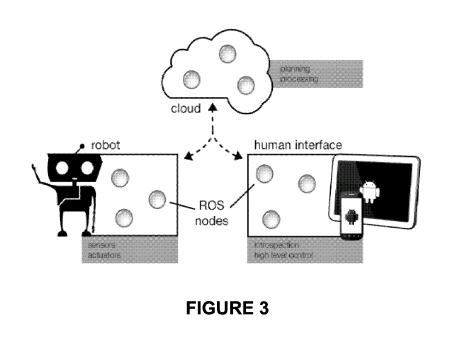
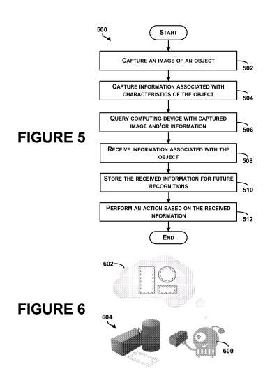
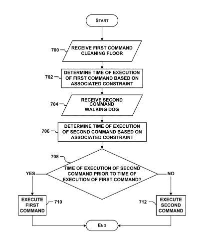
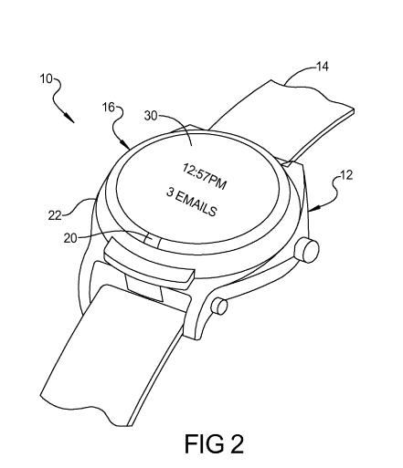
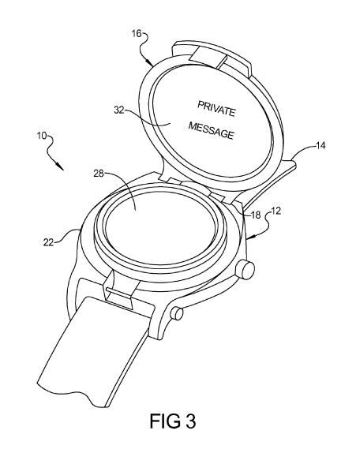
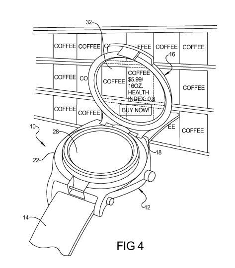

There are rumors that Google will be opening retail stores sometime in the near future (some rumors point to next year). The question rises though, what will Google feature in those storefronts? Will Chromebooks be a kiosk filler item? Will we see Android-based phones? Are Google Glass wearable eyeglasses still somewhat far off? Might self-driving cars still face changes in state legislation? Google TV might be a possibility. Home entertainment systems running on Android Hardware could also be shelf stuffers. Or will Google pull out some surprises for us?

Some recent patent filings from Google provide some possible hints at what we might see in Googleshops (or whatever they might be called) at some point if Google does indeed open retail shops.

**Binocular Head Mounted Display**

The very first of them is likely still some time off, but interesting in that it details a version of Google Glass with two lenses instead of one. It’s the first patent filing I can recall from Google that actually has Sergey Brin’s name stamped on it as a co-inventor. Keep in mind that the Google Founder has been seen multiple times in public wearing a single lens (monocular) pair of Google Glass, including a recent trip on a subway in New York City.

The patent itself describes how a pair of glasses with a display for each eye might be calibrated, with lenses rotated, changes to sidebars behind each ear, sidebars moved up or down, and more. This type of augmented reality glasses is often referred to as a binocular head-mounted display. Misalignment of a pair of glasses like this can cause problems, which this patent addresses:

> [0015] One technological hurdle to overcome to further encourage marketplace adoption of HMD technology is identifying and compensating for binocular HMD deformation. Deformation of a binocular HMD can lead to deleterious misalignment between the left and right image displays of the binocular HMD.
>
> These misalignments can result in a blurred or otherwise compromised image as perceived by the user, which ultimately leads to poor user experience (disorientation, dizziness, etc.). Deformation can occur due to a variety of reasons including misuse, poor user fit, nonsymmetrical facial features, harsh environmental factors (e.g., thermal warping), or otherwise.

I don’t believe that a pair of binocular augmented reality glasses from Google have been seen out in the wild, but some of the patent filings from Google have shown 2 lens glasses. The issue of figuring out how to prevent alignment problems might have been keeping us from seeing binocular glasses from Google in public. Will we see them in Googleshop window displays?

[Laser Alignment of Binocular Head Mounted Display](http://appft.uspto.gov/netacgi/nph-Parser?Sect1=PTO1&Sect2=HITOFF&d=PG01&p=1&u=%2Fnetahtml%2FPTO%2Fsrchnum.html&r=1&f=G&l=50&s1=%2220130038510%22.PGNR.&OS=DN/20130038510&RS=DN/20130038510)
Invented by Sergey Brin and Babak Amirparviz
Assigned to Google
US Patent Application 20130038510
Published February 14, 2013
Filed: August 9, 2011

Abstract

> A binocular head mounted display includes a frame, right and left displays, an alignment sensor, and a control system. The right and left displays display right and left images to a user and are mounted to the frame. The alignment sensor includes a first laser source mounted proximate to one of the right or left displays and a first photo-detector array mounted opposite the first laser source and proximate to an opposite one of the right or left displays.
>
> The first alignment sensor is mounted to measure misalignment between the right and left displays due to deformation of the frame about one or more rotational axes and to generate a signal that is indicative of the misalignment. The control system is coupled to the alignment sensor to receive the signal and to calculate the misalignment based at least in part upon the signal.

**Google’s Rules of Robotics**

If you’re a science fiction geek, you might have come across Isaac Asimov’s [Three Rules of Robotics](http://webhome.auburn.edu/~vestmon/robotics.html) while you were growing up. The Will Smith movie, [I, Robot](https://en.wikipedia.org/wiki/I,_Robot_%28film%29), is loosely based upon Asimov’s stories, and the robots within the film are programmed with Asimov’s Three Laws of Robotics . I think I first learned about them as a 12 or 13 year old (guess I’m a science fiction geek).

Google was granted two patents today that hint at rules for robots.

The following screenshot from one of the patents shows an android device as a human interface for controlling a robot:

Last October, I wrote about a Google patent that described how Google’s visual search project, Google Goggles might be used by robots to learn about objects that they might have to interact with, in the post [Robots Search Google Goggles to Pick New Things Up](https://www.seobythesea.com/2012/10/robots-search-google-goggles-to-pick-new-things-up/). Google’s new patents involving robots also describe how cloud computing might play a role in how robots might learn about the objects around them as they work.

[Methods and systems for providing instructions to a robotic device](http://patft.uspto.gov/netacgi/nph-Parser?Sect1=PTO2&Sect2=HITOFF&p=1&u=%2Fnetahtml%2FPTO%2Fsearch-adv.htm&r=1&f=G&l=50&d=PALL&S1=08380349&OS=PN/08380349&RS=PN/08380349)
Invented by Ryan Hickman and Damon Kohler
Assigned to Google Inc.
US Patent 8,380,349
Granted February 19, 2013
Filed: October 27, 2011

Abstract

> Embodiments disclose methods and systems for providing instructions to a robot device. The method may be executable to receive information from a robotic device and determine data responsive to the information. The method may also be executable to determine an order to send the data to the robotic device, where data associated with robot functionality to be performed at a first time is given a first priority and data associated with robot functionality to be performed at a subsequent time is given a second priority.
>
> The method is further executable to receive information indicating an amount of available memory on the robotic device and to provide the robotic device an amount of the data responsive to the information that is storable in the amount of available memory on the robotic device and in an order such that data that pertains to the first priority is sent first.

Another issue that might come up with robots is when they are issued two different commands that might conflict with each other. For instance, a robot might be told to clean the floor, but might be interupted by a command to be quiet when guests arrive, and may then stop making noise by cleaning.

The person who issued the command and the guests might move off to another room, and the robot has to decide whether or not it should return to cleaning, even though that might make some noise. The next patent covers those types of situations.

[Methods and systems for autonomous robotic decision making](http://patft.uspto.gov/netacgi/nph-Parser?Sect1=PTO2&Sect2=HITOFF&p=1&u=%2Fnetahtml%2FPTO%2Fsearch-adv.htm&r=1&f=G&l=50&d=PALL&S1=08380652&OS=PN/08380652&RS=PN/08380652)
Invented by Anthony G. Francis, Jr.
Assigned to Google Inc.
US Patent 8,380,652
Granted February 19, 2013
Filed: May 4, 2012

Abstract

> Methods and systems for robotic determination of a response to conflicting commands are provided. The robot may evaluate scenarios using variables related to the contextual/situational data for event outcomes from which the robot can determine which of two or more actions to take, as by prioritizing the actions in order of importance.

**Google Smart Watch**

This past fall saw some tech blogs reporting about a Google smartwatch and this particular patent, not too long after the patent was filed. I’m not sure if it was disclosed publicly (it could have been), or if the information was shared other ways. On its surface, this watch looks somewhat like a regular watch instead of something out of a Dick Tracey cartoon:

Flip up the cover however, and you see emails, Google Maps, and possibly other information:

Look through the lens of the watch itself at objects in the world around you, and it might provide details about those that you might not expect:

Is that “buy now” in the image above an advertisement?

This smartwatch could potentially also act as a navigational device:

[Smart-watch including flip up display](https://patents.google.com/patent/US8279716)
Invented by Richard Carl Gossweiler, III and James Brooks Miller
Assignee: Google Inc. (Mountain View, CA)
US Patent 8,379,488
Granted February 19, 2013
Filed: August 21, 2012

Abstract

> A smart-watch can include a wristband, a base, and a flip up portion. The base can be coupled to the wristband and include a housing, a processor, a wireless transceiver, and a tactile user interface. The wireless transceiver can be configured to connect to a wireless network. The tactile user interface can be configured to provide interaction between a user and the smart-watch.
>
> The flip up portion can be displaceable between an open position exposing the base and a closed position concealing the base. Further, the flip up portion can include: a top display exposed when the flip up portion is in the closed position, and an inside display opposite the top display. The inside display can be concealed when the flip up portion is in the closed position and be exposed when the flip up portion is in the open position.

We don’t know what the inventory of Googleshops (again, my term) might include, but we just might see one and two lens smart glasses, robots that can make decisions on their own, and smartwatches. It should be an interesting place to shop.
