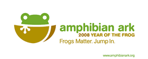

Ok, so why is a blog that usually focuses upon internet marketing and search-related patents publishing a post about saving amphibians?

The short answer is that I was asked very nicely, by Jeff Davis of [Frog Matters](https://frogmatters.wordpress.com/2007/12/30/frogs-matter-jump-in-hoppy-new-year/) and Amphibian Ark.

The longer answer is addressed by some other folks who are also posting about the Year of the Frog:

Darren Naish, vertebrate palaeontologist, and blogger at Tetrapod Zoology – [Get Ready for 2008: Year of the Frog](https://scienceblogs.com/tetrapodzoology/2007/12/29/2008-year-of-the-frog)

> 2008 is, you see, the YEAR OF THE FROG: it’s nothing to do with the Chinese calendar, rather, it’s a concerted global effort to raise awareness of, and do something about, the Global Amphibian Crisis (GAC). What is the GAC, and what can we do about it?

Prolific Blogger Dear Kitty – [The New Year will be the Year of the Frog](http://web.archive.org/web/20081106203116/http://dearkitty.blogsome.com:80/2007/12/31/the-new-year-will-be-the-year-of-the-frog/)

AJCs Virtual Frogroom – 2008 – the Year of the Frog

> The main goal of this campaign is to generate public awareness and understanding of the amphibian extinction crisis which represents the greatest species conservation challenge in the history of humanity.

David Mixner is a writer and political Activist, who blogs at DavidMixner.com – [Brian Gratwicke: 2008 Is the Year of the Frog](https://web.archive.org/web/20101222233937/http://www.davidmixner.com/2007/12/brian-gratwicke.html)

> One in three amphibians (32%) are now threatened with extinction, a rate that is higher than any other known vertebrate group. For the sake of comparison, 12% of birds and 23% of mammals are threatened globally.

Rhett A. Butler is a tropical biologist who blogs at mongabay.com – As amphibians leap toward extinction, alliance pushes “The Year of the Frog”

> With amphibians experiencing dramatic die-offs in pristine habitats worldwide, an alliance of zoos, botanical gardens, and aquariums have launched a desperate public appeal to raise funds for emergency conservation measures. Scientists say that without quick action, one-third to one-half the world’s frogs, toads, salamanders, newts, and caecilians could disappear.

A look at the wordpress.com tags associated with Amphibian Ark shows involvement by a good number of other folks, such as Sir David Attenborough and Ellen DeGeneres.

**Marketing for Nonprofits**

One of the ideas behind the meme was to come up with an idea that nonprofits might be able to use, and one came to me pretty quickly. Around the same time, I received a request from Jeff, to write about the Year of the Frog on the last day of the year.

Jeff has not only gotten many other bloggers to write about the plight of amphibians, but Amphibian Ark has also the support of Zoos around the world to hold “leap Frog” events, like one at the St. Louis Zoo.

**My Tip for Nonprofits**

Compared to Jeff’s efforts to spread the word about harm to amphibians, my tip may seem small. But I think it might have an impact for many nonprofits where their location is important, where they rely upon volunteers, or deliveries, or provide educational opportunities on-site.

To those nonprofits, please take advantage of the opportunity to verify your address at [Google Maps](https://www.google.com/maps), and submit a listing at Yahoo Local.

While there may be a possibility that Google or Yahoo has picked up information about your organization from telecom or directory listings, it’s also possible that they haven’t. And even if they have, you can include more information in your listing than it might presently include.

A few months back, I tried to create a listing of local nonprofits from the Web for a local community-based site and had an incredibly difficult time doing so. Make it easy for us to find you.

Tagging some others on this meme:

Pierre Far at [Things of Sorts](https://pierrefar.com/blogposts/)

David Dalka at David Dalka – Creating Revenue and Retention – Chicago GSB MBA

Steven Bradley at [Online Business Blog](https://vanseodesign.com/blog/)

Have a Happy New Year, Everyone!
