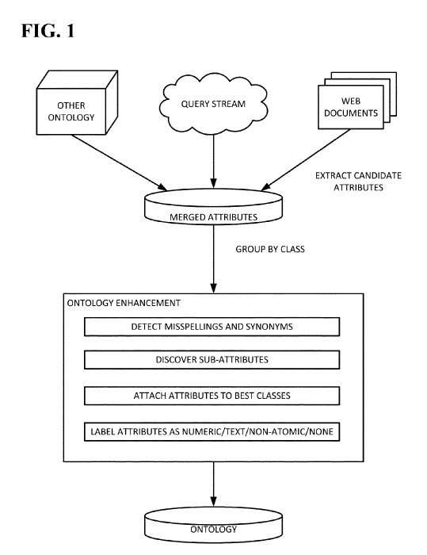
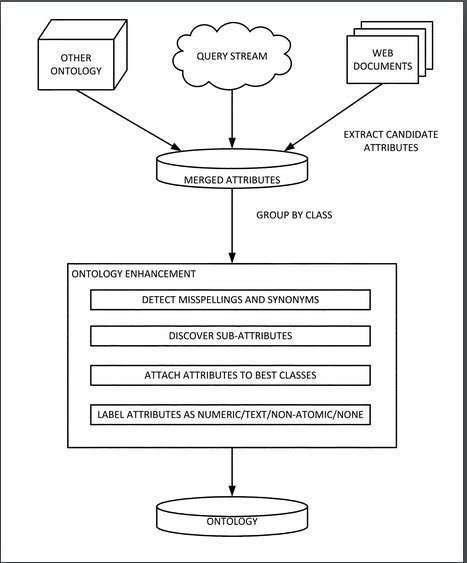

## How Search Engine Queries to Identify Entity Attributes

*What are query stream ontologies, and how might they change search?*

Search engines trained us to use keywords when we searched – to guess what words or phrases might be the best ones to try to find something we are interested in. That we might have a situational or informational need to find out more about. Keywords were an important and essential part of SEO – trying to get pages to rank highly in search results for certain keywords found in search engine queries that people would search for. SEOs still optimize pages for keywords, hoping to use a combination of information retrieval relevance scores and link-based PageRank scores to get pages to rank highly in search results.

With Google moving towards a knowledge-based attempt to find “things” rather than “strings,” we see patents that focus upon returning results that provide answers to questions in response to search engine queries. For example, one of those from January describes how query stream ontologies might be created from search engine queries that can be used to identify entity attributes used to respond to fact-based questions using information about those entities.

There is a white paper from Google co-authored by the same people who are the inventors of this patent published around the time this patent was filed in 2014, and it is worth spending time reading through. The paper is titled, [Biperpedia: An Ontology for Search Applications](https://research.google/pubs/pub41894/)

The entity attributes patent (and paper) both focus on the importance of structured data. The summary for the patent tells us this:

> Search engines often are designed to recognize queries that structured data can answer. As such, they may invest heavily in creating and maintaining high-precision databases. While conventional databases in this context typically have relatively wide coverage of entities, the number of attributes they model (e.g., GDP, CAPITAL, ANTHEM) is relatively small.

The patent is:

[Identifying entity attributes](http://patft.uspto.gov/netacgi/nph-Parser?Sect1=PTO1&Sect2=HITOFF&d=PALL&p=1&u=%2Fnetahtml%2FPTO%2Fsrchnum.htm&r=1&f=G&l=50&s1=9,864,795.PN.&OS=PN/9,864,795&RS=PN/9,864,795)
Inventors: Alon Yitzchak Halevy, Fei Wu, Steven Euijong Whang, and Rahul Gupta
Assignee: Google Inc.
US Patent: 9,864,795
Granted: January 9, 2018
Filed: October 28, 2014

Abstract

> Methods, systems, and apparatus, including computer programs encoded on computer storage media, generate an ontology of entity attributes. One of the methods includes extracting a plurality of attributes based upon a plurality of queries and constructing an ontology based upon the plurality of attributes and a plurality of entity classes.

The paper echoes sentiments in the patent, with statements such as this one:

> For the first time in the history of the Web, structured data is a first-class citizen among search results. The main search engines make significant efforts to recognize when a user’s query can be answered using structured data.

To cut right to the heart of what this patent covers, it’s worth pulling out the first claim from the patent that expresses how much of an impact this patent may have on uncovering entity attributes from a knowledge-based approach to collecting data and indexing information on the Web. Like most patent language, it’s a long passage that tends to run on, but it is very detailed about the process that this patent covers:

> 1. A method comprising: generating an ontology of class-attribute pairs, wherein each class that occurs in the class-attribute pairs of the ontology is a class of entities and each attribute occurring in the class-attribute pairs of the ontology is an attribute of the respective entities in the class of the class-attribute pair in which the attribute occurs, wherein each attribute in the class-attribute pairs has one or more domains of instances to which the attribute applies and a range that is either a class of entities or a type of data, and wherein generating the ontology comprises: obtaining class-entity data representing a set of classes and, for each class, entities belonging to the class as instances of the class; obtaining a plurality of entity-attribute pairs, wherein each entity-attribute pair identifies an entity that is represented in the class-entity data and a candidate attribute for the entity; determining a plurality of attribute extraction patterns from occurrences of the entities identified by the entity-attribute pairs with the candidate attributes identified by the entity-attribute pairs in text of documents in a collection of documents, wherein determining the plurality of attribute extraction patterns comprises: identifying an occurrence of the entity and the candidate attribute identified by a first entity-attribute pair in a first sentence from a first document in the collection of documents; generating a candidate lexical attribute extraction pattern from the first sentence; generating a candidate parse attribute extraction pattern from the first sentence; and selecting the candidate lexical attribute extraction pattern and the candidate parse attribute extraction pattern as attribute extraction patterns if the candidate lexical attribute pattern and the candidate parse attribute extraction patterns were generated using at least a predetermined number of unique entity-attribute pairs; and applying the plurality of attribute extraction patterns to the documents in the collection of documents to determine entity-attribute pairs, and from the entity-attribute pairs and the class-entity data, for each of one or more entity classes represented in the class-entity data, attributes possessed by entities belonging to the entity class.

Rather than making this post just the claims of this patent (which are worth going through if you can tolerate the legalese), I’m going to pull out some information from the description, which describes some of the implications of the process behind the patent. This first one tells us of the benefit of crowdsourcing an ontology, by building it from search engine queries from many searchers, and how that may mean that focusing upon matching keywords in queries with keywords in documents becomes less important than responding to queries with answers to questions:

> Extending the number of attributes known to a search engine may enable the search engine to answer more precisely queries that lie outside a “long tail” of statistical query arrangements, extract a broader range of facts from the Web, and/or retrieve information related to semantic information of tables present on the Web.

This patent provides a lot of information about how such an ontology-based on search engine queries might be used to assist search:

> The present disclosure provides systems and techniques for creating an ontology of, for example, millions of (class, attribute) pairs, including 100,000 or more distinct attribute names, which is up to several orders of magnitude larger than available conventional ontologies. Extending the number of attributes “known” to a search engine may provide several benefits. First, additional attributes may enable the search engine to answer “long-tail” queries more precisely, e.g., Brazil coffee production. Second, additional attributes may allow for the extraction of facts from Web text using open information extraction techniques. As another example, a broad repository of attributes may enable recovery of the semantics of tables on the Web because it may be easier to recognize attribute names in column headers and the surrounding text.

## Answering Search Queries with Entity Attributes

I wrote about the topic of [How Knowledge Base Entities could be Used in Searches](https://www.seobythesea.com/2014/07/knowledge-base-entities-used-in-searches/) to describe how Google might search a data store of entity attributes such as movies to return search results by asking about facts related to a movie, such as “What is the movie where Robert Duvall loves the smell of Napalm in the morning?” Building up a detailed ontology that includes many facts can mean a search engine can answer many questions quickly. This may be how featured snippets may be responded to in the future, but the patent that describes this approach is returning SERPs filled with links to web documents rather than answers to questions.

## Open Information Extraction

That mention of open information extraction methods from the patent reminded me of an acquistion that Google made a few years ago when Google acquired Wavii in April of 2013. Wavii did research about open extraction as described in these papers:

- [Open Information Extraction](https://openie.allenai.org/)
- [Open Information Extraction: the Second Generation](http://turing.cs.washington.edu/papers/etzioni-ijcai2011.pdf) (pdf) by Oren Etzioni, Anthony Fader, Janara Christensen, Stephen Soderland, and Mausam Ollie
- [Open Information Extraction Software](http://knowitall.github.io/ollie/)
- [Open Language Learning for Information Extraction](https://homes.cs.washington.edu/~mausam/papers/emnlp12a.pdf) (pdf), by Mausam, Michael Schmitz, Robert Bart, Stephen Soderland, and Oren Etzioni

A video that might be helpful to learn about how Open Information Extraction works is this one:

[Open Information Extraction at Web Scale](http://videolectures.net/ijcai2011_etzioni_webscale/)

An Ontology created from a query stream of search engine queries can lead to this kind of open information extraction.

## Semantics from Tables on the Web

Google has been running a Webtables project for a few years and has released a follow-up that describes how the project has been going. Semantics from Tables is mentioned in this patent, so it’s worth including some papers about the Webtables project to give you more information about them if you hadn’t come across them before:

- [WebTables: Exploring the Power of Tables on the Web](https://homes.cs.washington.edu/~alon/files/vldb08webtables.pdf)
- [Recovering Semantics of Tables on the Web](https://pdfs.semanticscholar.org/c44c/ef69334cb62e6f6c7d0d245e1934f599815f.pdf)
- [Ten Years of Webtables](https://pdfs.semanticscholar.org/e49e/6dbdfdb813b42fff716a8b11951de2d5cbf3.pdf?_ga=2.25435896.431747658.1558202992-1602487201.1554478726)
- [Applying WebTables in Practice](https://static.googleusercontent.com/media/research.google.com/en//pubs/archive/43806.pdf)

## Ontologies based on Search Engine Queries

The process in the patent involves extracting information from search engine queries to identify entity attributes and build an ontology. I enjoyed the statements in this patent about what an ontology was and how one works to help search. I recommend clicking through and reading the description in the patent along with the Biperpedia paper. This transformation of search brings it beyond keywords and understanding entities better and how search works. This appears to be an authentic future of Search:

> Systems and techniques disclosed herein may extract attributes from a query stream and then use extractions to seed attribute extraction from other text. For every attribute, a set of synonyms and text patterns in which it appears is saved, thereby enabling the ontology to recognize the attribute in more contexts. An attribute in an ontology as disclosed herein includes a relationship between a pair of entities (e.g., CAPITAL of countries), between an entity and a value (e.g., COFFEE PRODUCTION), or between an entity and a narrative (e.g., CULTURE). An ontology as disclosed herein may be described as a “best-effort” ontology in the sense that not all the attributes it contains are equally meaningful. Such an ontology may capture attributes that people consider relevant to classes of entities. For example, people may primarily express interest in attributes by querying a search engine for the attribute of a particular entity or using the attribute in the written text on the Web. In contrast to a conventional ontology or database schema, a best-effort ontology may not attach a precise definition to each attribute. However, it has been found that such an ontology still may have relatively high precision (e.g., 0.91 for the top 100 attributes and 0.52 for the top 5000 attributes).

The ontologies that are created from search engine queries expressly to assist search applications are different from more conventional manually generated ontologies in several ways:

> Ontologies as disclosed herein may be particularly well-suited for use in search applications. In particular, tasks such as parsing a user query, recovering the semantics of columns of Web tables, and recognizing when sentences in the text refer to entities’ attributes may be performed efficiently. In contrast, conventional ontologies tend to be relatively inflexible or brittle because they rely on a single way of modeling the world, including a single name for any class, entity, or attribute. Hence, supporting search applications with a conventional ontology may be difficult because mapping a query or a text snippet to the ontology can be arbitrarily hard. An ontology as disclosed herein may include one or more constructs that facilitate query and text understanding, such as attaching to every attribute a set of common misspellings of the attribute, exact and/or approximate synonyms, other related attributes (even if the specific relationship is not known), and common text phrases that mention the attribute.

The patent does include more about ontologies and schema and data sources and query patterns.

This is a direction that search is traveling towards, and if you want to know or do SEO, it’s worth learning about. SEO is changing, just as it has many times in the past.

I’ve also written a follow-up to this post on the Go Fish Digital blog at: [SEO Moves From Keywords to Ontologies and Query Patterns](https://gofishdigital.com/seo-moves-keywords-to-ontologies-query-patterns/)

A Related older post on this topic is [Google Adds Entity Attributes to its Knowledge Base from Queries](https://www.seobythesea.com/2014/09/google-may-add-knowledge-base-entities-attributes-search-queries/)

Last Updated July 11, 2019
