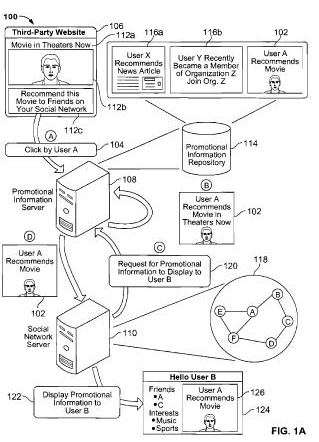
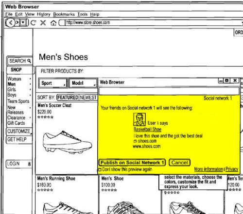
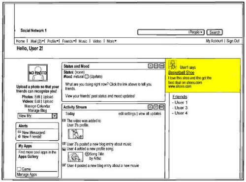

A Google patent application published last week describes how Google might enable visitors to websites to share information that they’ve found with others on social networking sites such as Twitter, Facebook, YouTube, and other sites. In some ways, it seems like a response to the [Facebook Like Button](https://developers.facebook.com/docs/plugins/like-button).

The patent filing is fairly long and detailed, but many of the ideas it presents can be gleaned from the images accompanying the patent itself, like this overview flowchart:

The patent application is:

[Propagating Promotional Information on a Social Network](http://appft.uspto.gov/netacgi/nph-Parser?Sect1=PTO2&Sect2=HITOFF&u=%2Fnetahtml%2FPTO%2Fsearch-adv.html&r=1&p=1&f=G&l=50&d=PG01&S1=20100332330.PGNR.&OS=dn/20100332330&RS=DN/20100332330)
Invented by Vinay Goel, Rahul Kulkarni, Subramanya Srikanth Belwadi, Siddartha Naidu, and Ramanathan V. Guha
Assigned to Google Inc.
US Patent Application 20100332330
Published December 30, 2010
Filed: June 30, 2009

Abstract

> In one implementation, a method for providing information to computer users includes receiving at a server system an indicator of an action performed on a third-party website by a first user of a social network of users. The method can also include creating by the server system first promotional information based upon the received indicator and information associated with the first user of the social network.
>
> The method can further include persistently storing by the server system the created first promotional information in a repository of promotional information. The repository stores promotional information associated with a plurality of third-party websites to display to users of a plurality of social networks.
>
> The method can additionally include receiving at the server system a request for promotional information to display to a second user of the social network, the second user having an acquaintance relationship with the first user.

A website, such as a shoe store, would be able to include “share” buttons on their site with pages or products that they would like to share, and set up a template as to how the information might be shown on the social network that it is shared with. The person who decides to share the information would be able to log into a social network from that third party site, and get a preview of what would be posted on their network, as seen in the following image:

Once they hit publish, their addition would be seen on the social network that they selected:

The shared information might include things such as:

- A description and image of the shoes,
- A name and web address for the third-party website,
- Details regarding a purchase, if made, such as price, current offers, duration of sale, etc.,
- The name (e.g., screen name, real name, etc.) of the user that purchased the shoes,
- A personalized message from the user regarding the purchase (e.g., “I just got a great deal on these shoes. Click here to find out more.”),
- etc.

This created promotional information can be stored and displayed to the user’s friends on the social network. For example, a user’s friend on the social network may be presented with promotional information regarding the user’s shoe purchase when the friend views a page (erg., the friend’s landing page) on the social network.

The patent filing allows for a range of content types that could be shared, including:

- Text,
- Images,
- Video,
- Interactive applications such as games

While the patent application’s description focuses primarily upon these shared items as if they were advertisements, there is also a range of materials that could be shared, including:

- Product advertisements,
- Public service announcements,
- News,
- Event announcements,
- Website recommendations,
- Etc.

So, while an eCommerce site might share information about products that they have for sale, a news or media site might show news instead.

One of the areas where Google’s implementation of this feature may differ from what Facebook appears to be doing at this point, is an advertising aspect. Google points to the “word of mouth” benefit of this type of sharing, to potential users of the system:

> By propagating promotional information based, at least in part, on acquaintance relationships, the promotional information server can create “word of mouth” advertising among users of a social network.
>
> Since “word of mouth” advertising is among the most effective forms of advertising, third-party websites may value promotional information created by the promotional information server greater than other forms of advertising.
>
> As such, third-party websites may bid greater amounts to display promotional information created by the promotional information server than bids for other forms of advertising.

We’re also told that there may be an incentive offered to people who might share in their social networks, with a sharing of a portion of the revenue generated by their shares to the people sharing, and possibly to the social networks where the information is shared:

> Users of a social network may be provided with incentives to share their activities on third-party websites to create promotional information. For instance, a user may receive a portion of the revenue generated by displaying promotional information associated with the user (e.g., an advertisement regarding a recent purchase made by the user) on a social network.
>
> Additionally, a social network can receive revenue for displaying promotional information to its users.

**Conclusion**

Is this a step that Google might take in the future?

Should a shared link that was paid for by an advertiser, with the revenue split with someone who shared it on a social network, be considered a paid link and/or an endorsement, with a requirement that it be labeled an ad – something I don’t see in the example screenshot above, showing a recommendation for shoes on a social network.

How might Facebook or Twitter respond to such shared links? The patent notes that it might share revenue for those advertisements with the social network sites as well.
