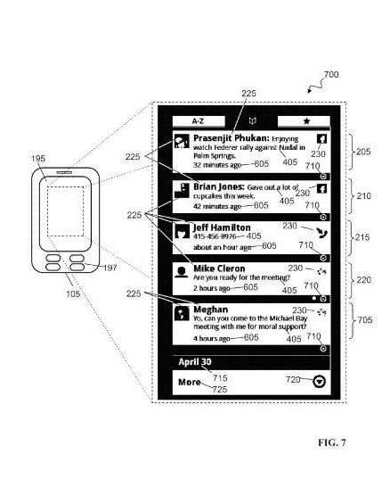
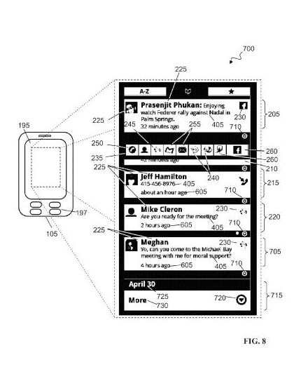

Google is becoming more social on several levels but doesn’t have a central hub where those social interactions can all be seen at once. That may change in the future, and a new patent application from Google shows an example interface that such a system might use. I couldn’t help but be reminded of Twitter seeing this screenshot from the patent filing:

Another look shows icons that indicate a wider range of status updates and snippets and notifications that might be available:

Google already has worked social features into many of their offerings. Some of the pieces of Google’s somewhat distributed social network include:

- [Google latitude](https://accounts.google.com/ServiceLogin?service=friendview&passive=1209600&continue=http://www.google.com/latitude&followup=http://www.google.com/latitude) – Allows you to find your friends on a map and share your location with the friends you choose
- [Google Buzz](https://support.google.com/mail/answer/1698228?hl=en&topic=1669052) – Sharing real time status updates, messages, and multimedia
- Google Reader RSS Newsfeed Reader that allows you to share items with others
- [Google Places](https://www.google.com/business/?gmbsrc=us-en-et-gs-z-gmb-l-z-h~pl%7Credirect%7Cu&ppsrc=GMBLR&utm_campaign=us-en-et-gs-z-gmb-l-z-h~pl%7Credirect%7Cu&utm_source=gmb&utm_medium=et&dialog=places-transition) – The sharing of recommendations and reviews for places that Google tested under the name “Google Hotpot” has been merged into Google Places
- Blogger – Enables you to start and maintain a blog quickly and easily, comment on other blogs, and “track” favorite blogs
- Orkut – A social networking and discussion site
- [Gmail](https://mail.google.com/mail/u/0/?shva=1#inbox) – Email program
- Picasa Web Albums – photo sharing site
- [Google My Maps](http://web.archive.org/web/20110712234657/http://maps.google.com/help/maps/mymaps/create.html) – Enables you to create your own personalized maps and share them and collaborate upon them with others
- [Google Talk](https://hangouts.google.com/?hl=en) chat via text, voice, and video
- [YouTube](https://www.youtube.com/) Upload videos, comment, favorite, like, befriend, create playlists and interact with others
- [Google My Library](http://books.google.com/googlebooks/mylibrary/) – Build a library, annotate it, and share it with friends
- [Google Docs](https://docs.google.com/document/u/0/?pli=1&showDriveBanner=true&tgif=d#) – An online office productivity suite that allows people to share and collaborate on word processing documents, presentations, and spreadsheets
- Google Friend Connect – Enables people to add social widgets and features to their websites
- [Google Knol](http://web.archive.org/web/20170412064752/http://knol.google.com/) – wikis that can be published by individuals or as collaborative efforts
- [Google Panoramio](http://www.panoramio.com/) – Photo sharing involving posting images of specific places where pictures can be incorporated into Google Earth
- Google Profiles – A page to share more information about yourself with others
- Google Sidewiki – Enables people to annotate and comment on any page on the Web and share those annotations with others who can rate and respond to them
- Google Sites – Enables you to create public or private web sites that can be collaborative efforts
- [Google +1 Button](https://plus.google.com/about) – Allows you to “like” a result that you see in Google Search Results pages, and let others who are connected to you to see your vote. These buttons may become available for placement on web sites in the future.

The Google patent filing describes a hub and corresponding user interface for social interaction and possibly may include an availability indicator that would show whether other parties are available for interaction. The patent filing is:

[Social Messaging User Interface](http://appft.uspto.gov/netacgi/nph-Parser?Sect1=PTO2&Sect2=HITOFF&u=%2Fnetahtml%2FPTO%2Fsearch-adv.html&r=1&p=1&f=G&l=50&d=PG01&S1=20110099486.PGNR.&OS=dn/20110099486&RS=DN/20110099486)
Invented by Christopher D. Nesladek, Jeffrey W. Hamilton, Jeffrey A. Sharkey. Prasenjit Phukan
Assigned to Google
US Patent Application 20110099486
Published April 28, 2011
Filed: October 28, 2010

Abstract

> Hubs for social interaction via electronic devices are described.
>
> In one aspect, a data processing device includes a display screen displaying a social interaction hub, the social interaction hub including a collection of records. Each record includes a counterparty identifier identifying a counterparty of a past social interaction event, a mode indicium identifying a mode by which the past social interaction event with the counterparty occurred, and a collection of mode indicia each identifying a mode by which a future, outgoing social interaction event with the counterparty can occur.
>
> The counterparty identifier, the mode indicium, and the collection of mode indicia are associated with one another in the records of the social interaction hub.

There’s been a lot of talk from Google in the past few months about becoming more social, though as can be seen from my list above, Google does have a lot of social elements already available.

Chances are that we may see some kind of social hub come from the search engine in the future that may help centralize many of their social features.

It may take on an appearance like the one shown in this patent filing, but we won’t know for certain until Google’s ready to bring their social pieces together in one place as one Google social network.

The patent filing’s description and screenshots don’t seem to integrate as many of Google’s present social features as I might like to see, based upon what Google already offers, including things like personalized My Maps.

What do you think might end up in a Google social hub?
