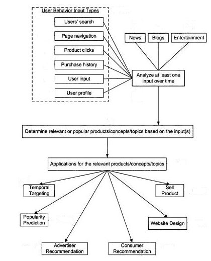

With more than 3 billion search queries a month, a search engine like Yahoo might be tempted to take a close look at, and analyze the data it receives in its search logs. That data might tell it what people tend to search for at different times of the day, and different days of the year. The search engine may also be able to tell sometimes whether those searches were performed by men or women, by people in different locations, and may look at other information they might have about those searchers.

That analysis, that collection of data, may help show searches in advertisements, and in other content displayed to people looking for information.

A patent granted to Yahoo last week describes how the search engine might collect data over time, looking back possibly more than 10 years, to decide what to show people who view its advertisements, and possibly other content upon its pages, and the pages of publishers who display its ads. The patent is:

[Temporal targeting of advertisements](http://patft.uspto.gov/netacgi/nph-Parser?Sect1=PTO2&Sect2=HITOFF&u=%2Fnetahtml%2FPTO%2Fsearch-adv.htm&r=1&p=1&f=G&l=50&d=PTXT&S1=7,672,937.PN.&OS=pn/7,672,937&RS=PN/7,672,937)
Invented by Anand Madhavan and Shyam Kapur
Assigned to Yahoo
US Patent 7,672,937
Granted March 2, 2010
Filed: April 11, 2007

Abstract

> A system and method utilize temporal targeting of content, such as advertisements. The targeting may be based on time of day, day of the year, season, or upcoming holidays.
>
> Also, the prior search history may be utilized to determine current popularity and/or predict future popularity for a particular concept that may be used for targeting.

Yahoo shows sponsored ads along with search results when someone performs a search at the search engine, and it also offers advertising on publishers’ websites through its Publisher Network. The ads shown tend to be based upon the queries used to perform a search, or upon the content of a publisher’s page. But what if there isn’t an advertisement available that matches up with those queries or content?

Might information about what people may interest at different times of the day and different days of the year help provide ads on those pages?

If Yahoo were to spend time analyzing the query terms that people search with to find patterns within those searches, it might tell them that people tend to look for products or articles related to sleep problems at night, or information related to the stock market in the morning. The search engine might identify when people begin performing queries about costumes and candies in the days before Halloween.

If Yahoo were to analyze queries in real-time, or near real-time, it might be able to notice when certain query terms started to spike in popularity in a short number of hours. The search engine might also look back through the years, even up to 10 years ago according to the patent, to make note of trends related to holidays and seasons.

Targeting of ads or other content based upon time, date, or season, as well as an analysis of prior browsing or searching history over a certain period could suggest topics and items that are likely to be the most popular and/or relevant for targeting.

## Historical User Data Used to Determine the Temporal Popularity of Topics

The patent tells us that the search engine might look at a wide range of information collected in a search log database relating to user behavior to determine what concepts or topics might be useful in deciding which advertising and other topics to show. The description of the patent tells us that the search engine might use the process described for more than targeting advertising, though the claims listed in the patent seem to focus primarily upon targeting ads.

Here are some of the types of user data that might be analyzed for this targeting method:

***Searches*** – Search queries may illustrate patterns to suggest topics that may become popular.

***Page Browsing*** – The pages and items on a page that a browser may view or scroll over.

***Product clicks*** – The ads that someone clicks through and product pages someone views.

***Purchase history*** – Actual purchase histories of goods and services.

***User inputs*** – The kinds of information that someone might enter into a website.

***User profiles*** – Information entered by someone to create an online profile, such as sex, birthdate, location, and/or interests.

We are told that other sources of information gathered about online activities might also be considered as well:

> Any additional information may be used as an input type for determining the popularity of topics or content. For example, news, blogs, and/or entertainment may provide data for predicting the popularity of certain concepts.
>
> For example, if historical data suggested that whenever a hurricane was discussed in the news, then users viewed content on insurance, it would suggest that insurance is a popular concept whenever a hurricane is in the news.
>
> Likewise, blogs or entertainment, such as movies, television shows, or sports may provide additional data for determining concepts that may be popular. News about entertainment and the blogs may be monitored to determine which topics are the most talked about.

## Conclusion

I started this post noting that Yahoo receives more than 3 billion queries a month, and I took that number from the home page of [Tapas Kanungo](http://www.kanungo.com/), who notes on his page that the snippet generation process he worked on while at Yahoo was responsible for showing snippets for approximately that number of queries a month.

Analyzing that many searches can provide a great amount of information about what people are interested in at any point in time. It’s common sense to assume that people are more likely to be interested in snow shovels in the late fall and winter, and swimsuits and sunscreen in late spring and summer.

But, having a large amount of data that can unveil patterns involving other topics and interests that might span hours or a decade could provide some insightful views of what might interest searchers. Using that information to target advertising might make it more likely that people will click on advertising when there aren’t ads to show that is appropriate for the content of a page, or the queries used in a search.

I suspect that information could be used in other ways as well, though the patent discussed in this post doesn’t explore those other possibilities in much detail.
