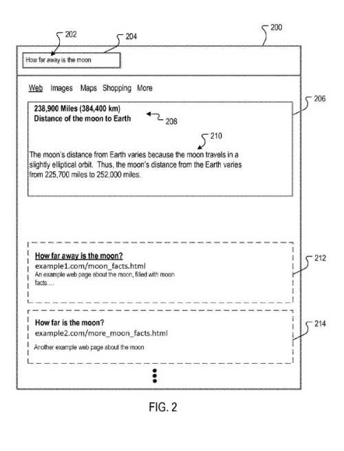
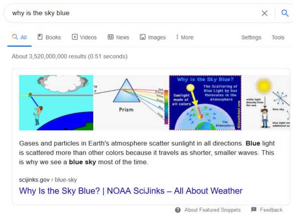
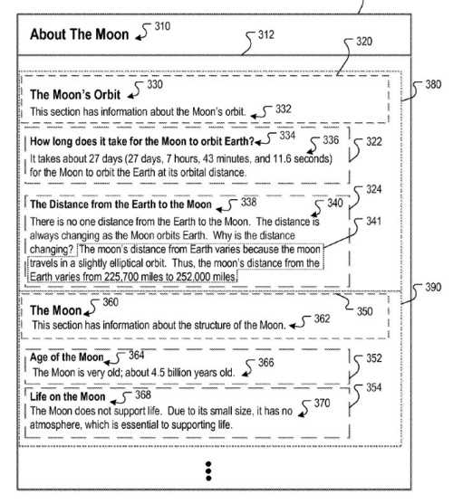
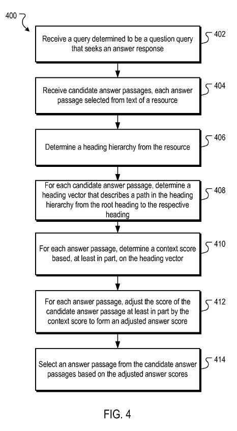
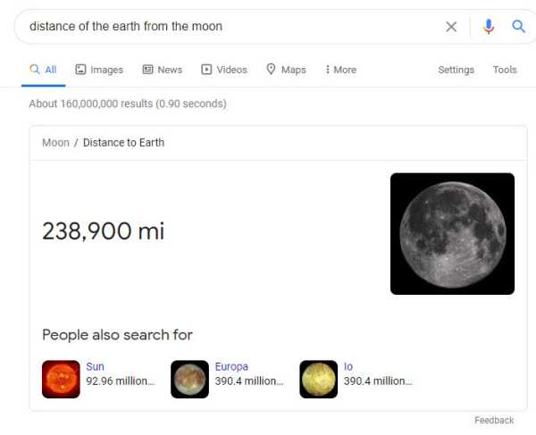

## How Are Featured Snippet Answers Decided Upon?

I recently wrote about [Featured Snippet Answer Scores Ranking Signals](https://www.seobythesea.com/2020/09/featured-snippet-answer-scores/). I described how Google was likely using query-dependent and query-independent ranking signals to create answer scores for queries looking like they wanted answers.

One of the inventors of that patent from that post was Steven Baker. I looked at other patents that he had written. I noticed that one was about context as part of query-independent ranking signals for answers.

Remembering that patent about question-answering and context, I felt it was worth reviewing that patent and writing about it.

This patent is about processing question queries that want textual answers and how those answers may be decided on.

It is a complicated patent, and at one point, the description behind it seems to get a bit murky. I write about when that happens in the patent. I think the other details provide a lot of insight into how Google is scoring featured snippet answers. In addition, there is a related patent that I will be following up with after this post, and I will link to it from here as well.

This patent starts by telling us that a search system can identify resources in response to queries submitted by searchers. It can also provide information about the resources that are useful to the searchers.

## How Context Scoring Adjustments for Featured Snippet Answers Works

Users of search systems often search for answers to specific questions. This is rather than a listing of resources, like in this drawing from the patent, showing featured snippet answers:

For example, searchers may want to know what the weather is in a particular location, a current quote for a stock, the capital of a state, etc.

When queries in the form of a question are received. Some search engines may perform specialized search operations in response to the question format of the query.

For example, some search engines may provide information responsive to such queries in the form of an “answer.” This would be information provided in the form of a “one box” to a question, often a featured snippet answer.

## Finding Featured Snippet Answers or Answer Passages

Some question queries are best served by explanatory answers. Those may be referred to as “long answers” or “answer passages.”

For example, for the question query [why is the sky blue], explaining light as waves is helpful.

Such answer passages can be selected from resources that include text, such as paragraphs relevant to the question and the answer.

## Scoring Featured Snippet Answers

Sections of the text are scored, and the section with the best score is selected as an answer.

In general, the patent tells us about one aspect of what it covers in the following process:

- Receiving a query that is a question query seeking an answer response
- Receiving candidate answer passages, each passage made of text selected from a text section subordinate to a heading on a resource, with a corresponding answer score
- Determining a hierarchy of headings on a page, with two or more heading levels hierarchically arranged in parent-child relationships, where each heading level has one or more headings, a subheading of a respective heading is a child heading in a parent-child relationship, and the respective heading is a parent heading in that relationship, and the heading hierarchy includes a root level corresponding to a root heading (for each candidate answer passage)
- Determining a heading vector describing a path in the hierarchy of headings from the root heading to the respective heading to which the candidate answer passage is subordinate, determining a context score based, at least in part, on the heading vector, adjusting the answer score of the candidate answer passage at least in part by the context score to form an adjusted answer score
- Selecting an answer passage from the candidate answer passages based on the adjusted answer scores

## Advantages of Following the process in the patent:

1. Long query answers can be selected, based partially on context signals indicating answers relevant to a question
2. The context signals may be, in part, query-independent (i.e., scored independently of their relatedness to terms of the query
3. This part of the scoring process considers the context of the document (“resource”) in which the answer text is located, accounting for relevancy signals that may not otherwise be accounted for during query-dependent scoring
4. Long answers that are more likely to satisfy a searcher’s informational need are more likely to appear as answers

This patent can be found at:

[Context scoring adjustments for answer passages](http://patft.uspto.gov/netacgi/nph-Parser?Sect1=PTO1&Sect2=HITOFF&d=PALL&p=1&u=%2Fnetahtml%2FPTO%2Fsrchnum.htm&r=1&f=G&l=50&s1=9,959,315.PN.&OS=PN/9,959,315&RS=PN/9,959,315)
Inventors: Nitin Gupta, Srinivasan Venkatachary , Lingkun Chu, and Steven D. Baker
US Patent: 9,959,315
Granted: May 1, 2018
Appl. No.: 14/169,960
Filed: January 31, 2014

Abstract

> Methods, systems, and apparatus, including computer programs encoded on a computer storage medium, for context scoring adjustments for candidate answer passages.
>
> In one aspect, a method includes scoring candidate answer passages. For each candidate answer passage, the system determines a heading vector that describes a path in the heading hierarchy from the root heading to the respective heading to which the candidate answer passage is subordinate; determines a context score based, at least in part, on the heading vector; and adjusts answer score of the candidate answer passage at least in part by the context score to form an adjusted answer score.
>
> The system then selects an answer passage from the candidate answer passages based on the adjusted answer scores.

## Using Context Scores to Adjust Featured Snippet Answers Scores

A drawing from the patent shows different hierarchical headings that may be used to determine the context of answer passages. Those may be used to adjust answer scores for featured snippets:

I discuss these headings and their hierarchy below. Note that the headings include the Page title as a heading (About the Moon) and the headings within heading elements on the page. And those headings give those answers context.

This context scoring process starts with receiving candidate answer passages and a score for each of the passages.

Those candidate answer passages and their respective scores are provided to a search engine that receives a query determined to be a question.

Each of those candidate answer passages is text selected from a text section under a particular heading from a specific resource (page) with a certain answer score.

A context scoring process determines a heading hierarchy in the resource for each resource where a candidate answer passage has been selected. A context scoring process determines a heading hierarchy in the resource.

A heading is a text or other data corresponding to a particular passage in the resource.

For example, a heading can be text summarizing a section of text that immediately follows the heading. The heading describes what the text is about that follows it or is contained within it.

Headings may be indicated, for example, by specific formatting data, such as heading elements using HTML.

This next section from the patent reminded me of an observation that Cindy Krum of Mobile Moxie has about named anchors on a page and how Google might index those to answer a question, to lead to an answer, or a featured one snippet. She wrote about those in [What the Heck are Fraggles?](https://mobilemoxie.com/blog/what-the-heck-are-fraggles/)

**A heading could also be the anchor text for an internal link (within the same page) that links to an anchor and corresponding text at some other position on the page.**

A heading hierarchy could have two or more heading levels that are hierarchically arranged in parent-child relationships.

**The first level, or the root heading, could be the resource title.**

Each of the heading levels may have one or more headings, and a subheading of a respective heading is a child heading, and the respective heading is a parent heading in the parent-child relationship.

## The Context Scoring Adjustment Process

For each candidate passage, a context scoring process may determine a context score based, at least in part, on the relationship between the root heading and the respective heading to which the candidate answer passage is subordinate.

The context scoring process could determine the context score and determine a heading vector that describes a path in the heading hierarchy from the root heading to the respective heading.

The context score could be based, at least in part, on the heading vector.

The context scoring process can then adjust the answer score of the candidate answer passage at least in part by the context score to form an adjusted answer score.

The context scoring process can then select an answer passage from the candidate answer passages based on adjusted answer scores.

This flowchart from the patent shows the context scoring adjustment process:

## Identifying Question Queries And Answer Passages

I’ve written about understanding the context of answer passages. The patent tells us more about question queries and answer passages worth going over in more detail.

Some queries are in the form of a question or an implicit question.

For example, the query [distance of the earth from the moon] is in the form of an implicit question, “What is the distance of the earth from the moon?”

Likewise, a question may be specific, as in the query [How far away is the moon].

The search engine includes a query question processor that uses processes that determine if a query is a query question (implicit or specific). Suppose it is whether there are answers that are responsive to the question.

The query question processor can use several different algorithms to determine whether a query is a question and whether particular answers are responsive to the question.

For example, it may use to determine question queries and answers:

- Language models
- Machine learned processes
- Knowledge graphs
- Grammars
- Combinations of those

The query question processor may choose candidate answer passages in addition to or instead of answer facts. For example, for the query [how far away is the moon], an answer is 238,900 miles. And the search engine may show that factual information since that is the average distance of the Earth from the moon.

But, the query question processor may choose to identify passages that are to be very relevant to the question query.

These passages are called candidate answer passages.

The answer passages are scored, and one passage is selected based on these scores and provided in response to the query.

An answer passage may be scored, and that score may be adjusted based on a context, which is the point behind this patent.

Often Google will identify several candidate answer passages that could be used as featured snippet answers.

Google may look at the information on the pages where those answers come from to understand better the context of the answers, such as the title of the page and the headings about the content that the answer was found within.

## Contextual Scoring Adjustments for Featured Snippet Answers

The query question processor sends to a context scoring processor some candidate answer passages, information about the resources from which each answer passages was from, and a score for each of the featured snippet answers.

The scores of the candidate answer passages could be based on the following considerations:

- Matching a query term to the text of the candidate answer passage
- Matching answer terms to the text of the candidate answer passages
- The quality of the underlying resource from which the candidate answer passage was selected

I recently wrote about [featured snippet answer scores](https://www.seobythesea.com/2020/09/featured-snippet-answer-scores/), and how a combination of query dependent and query independent scoring signals might be used to generate answer scores for answer passages.

The patent tells us that the query question processor may also consider other factors when scoring candidate answer passages.

You can select candidate answer passages from the text of a particular section of the resource. And the query question processor could choose more than one candidate answer passage from a text section.

## Different Answer Passages From The Same Page

**We are given the following examples of different answer passages from the same page**

(These example answer passages are referred to in a few places in the remainder of the post.)

- (1) It takes about 27 days (27 days, 7 hours, 43 minutes, and 11.6 seconds) for the Moon to orbit the Earth at its orbital distance
- (2) Why is the distance changing? The moon’s distance from Earth varies because the moon travels in a slightly elliptical orbit. Thus, the moon’s distance from the Earth varies from 225,700 miles to 252,000 miles
- (3) The moon’s distance from Earth varies because the moon travels in a slightly elliptical orbit. Thus, the moon’s distance from the Earth varies from 225,700 miles to 252,000 miles

Each of those answers could be good ones for Google to use. We are told that:

> More than three candidate answers can be selected from the resource, and more than one resource can be processed for candidate answers.

How would Google choose between those three possible answers?

Google might decide based on the number of sentences and select up to a maximum number of characters.

The patent tells us this about choosing between those answers:

> Each candidate answer has a corresponding score. For this example, assume that candidate answer passage (2) has the highest score, followed by candidate answer passage (3), and then by candidate answer passage (1). Thus, without the context scoring processor, candidate answer passage (2) would have been provided in the answer box of FIG. 2. However, the context scoring processor considers the context of the answer passages and adjusts the scores provided by the query question processor.

So, we see that what might be chosen based on featured snippet answer scores could be adjusted based on the context of that answer from the page that it appears on.

## Contextually Scoring Featured Snippet Answers

This process starts which begins with a query determined to be a question query seeking an answer response.

This process next receives candidate answer passages. Each candidate answer passage is chosen from the text of a resource.

Each of the candidate answer passages is text chosen from a text section subordinate to a heading (under a heading) in the resource and has a corresponding answer score.

For example, the query question processor provides the candidate answer passages, and their corresponding scores, to the context scoring processor.

## A Heading Hierarchy to Determine Context

This process then determines a heading hierarchy from the resource.

The heading hierarchy would have two or more heading levels hierarchically arranged in parent-child relationships. Such as a page title and an HTML heading element.

Each heading level has one or more headings.

A subheading of a respective heading is a child heading (an (h2) heading might be a subheading of a (title)) in the parent-child relationship. The respective heading is a parent heading in the relationship.

The heading hierarchy includes a root level corresponding to a root heading.

The context scoring processor can process heading tags in a DOM tree to determine a heading hierarchy.

For example, concerning the drawing about the distance to the moon just above, the heading hierarchy for the resource may be:

The ROOT Heading (title) is: About The Moon (310)

The main heading (H1) on the page

H1: The Moon’s Orbit (330)

A secondary heading (h2) on the page:

H2: How long does it take for the Moon to orbit Earth? (334)

Another secondary heading (h2) on the page is:

H2: The distance from the Earth to the Moon (338)

Another Main heading (h1) on the page

H1: The Moon (360)

Another secondary Heading (h2) on the page:

H2: Age of the Moon (364)

Another secondary heading (h2) on the page:

H2: Life on the Moon (368)

Here is how the patent describes this heading hierarchy:

> In this heading hierarchy, The title is the root heading at the root level. The headings are child headings of the heading and are at a first level below the root level. Those headings are child headings of the heading and are at a second level that is one level below the first level, and two levels below the root level. Headings are child headings of the heading and are at a second level that is one level below the first level, and two levels below the root level.

The process from the patent determines a context score based, at least in part, on the relationship between the root heading and the respective heading to which the candidate answer passage is subordinate.

This score may be based on a heading vector.

The patent says that the process for each candidate’s answer determines a heading vector that describes a path in the heading hierarchy from the root heading to the respective heading.

The heading vector would include the text of the headings for the candidate answer passage.

For the example candidate answer passages (1)-(3) above about how long it takes the moon to orbit the earch, the respectively corresponding heading vectors V1, V2 and V3 are:

- V1=<[Root: About The Moon], [H1: The Moon's Orbit], [H2: How long does it take for the Moon to orbit the Earth?]>
- V2=<[Root: About The Moon], [H1: The Moon's Orbit], [H2: The distance from the Earth to the Moon]>
- V3=<[Root: About The Moon], [H1: The Moon's Orbit], [H2: The distance from the Earth to the Moon]>

We are also told that because candidate answer passages (2) and (3) are selected from the same text section, their respective heading vectors V2 and V3 are the same (they are both in the content under the same (H2) heading.)

The process of adjusting a score for each answer passage uses a context score based, at least in part, on the heading vector.

That context score can be a single score used to scale the candidate answer passage score or a series of discrete scores/boosts that can be used to adjust the score of the candidate answer passage.

## Where things Get Murky in This featured snippet answers Patent

There seem to be several related patents involving featured snippet answers. This one which targets learning more about answers from their context based on where they fit in a heading hierarchy, makes sense.

But, I’m confused by how the patent tells us that one answer based on the context would be adjusted over another one.

The first issue I have is that the answers they compare in the same contextual area overlap. Here those two are:

- (2) Why is the distance changing? The moon’s distance from Earth varies because the moon travels in a slightly elliptical orbit. Thus, the moon’s distance from the Earth varies from 225,700 miles to 252,000 miles
- (3) The moon’s distance from Earth varies because the moon travels in a slightly elliptical orbit. Thus, the moon’s distance from the Earth varies from 225,700 miles to 252,000 miles

Note that the second answer and the third answer include the same line: “Thus, the moon’s distance from the Earth varies from 225,700 miles to 252,000 miles.” I find myself a little surprised that the second answer includes a couple of sentences that aren’t in the third answer, skips a couple of lines from the third answer, and then includes the last sentence, answering the question.

Since they both appear in the same heading and subheading section of the page, they are from. It isn’t easy to imagine a different adjustment based on context. But, the patent tells us differently:

> The candidate answer score with the highest adjusted answer score (based on context from the headings) is selected, and the answer passage.
>
> Recall that in the example above, the candidate answer passage (2) had the highest score, followed by candidate answer passage (3), and then by candidate answer passage (1).
>
> However, after adjustments, candidate answer passage (3) has the highest score, followed by candidate answer passage (2) and then-candidate answer passage (1).
>
> Accordingly, candidate answer passage (3) is selected and provided as the answer passage of FIG. 2.

## Boosting Scores Based on Passage Coverage Ratio

A query question processor may limit the candidate’s answers to a maximum length.

The context scoring processor determines a coverage ratio that indicates the coverage of the candidate answer passage from the text from which it was selected.

The patent describes alternative question answers:

> Alternatively, the text block may include text sections subordinate to respective headings that include the first heading. The text section from which the candidate answer passage was selected is subordinate, and sibling headings have an immediate parent heading in common with the first heading. For example, for the candidate answer passage, the text block may include all the text in portion 380 of the hierarchy; or may include only the text of the sections of some other portion of text within the portion of the hierarchy. A similar block may be used for the portion of the hierarchy for candidate answer passages selected from that portion.

A small coverage ratio may indicate a candidate answer passage is incomplete. A high coverage ratio may indicate the candidate answer passage captures more of the content of the text passage from which it was selected. A candidate answer passage may receive a context adjustment, depending on this coverage ratio.

**A passage coverage ratio is a ratio of the total number of characters in the candidate answer passage to the ratio of the total number of characters in the passage from which the candidate answer passage was selected.**

The passage cover ratio could also be a ratio of the total number of sentences (or words) in the candidate answer passage to the ratio of the total number of sentences (or words) in the passage from which the candidate answer passage was selected.

We are told that other ratios can also be used.

From the three example candidate answer passages about the distance to the moon above (1)-(3) above, passage (1) has the highest ratio, passage (2) has the second-highest, and passage (3) has the lowest.

This process determines whether the coverage ratio is less than a threshold value. That threshold value can be, for example, 0.3, 0.35, or 0.4, or some other fraction. For example, in our “distance to the moon” example, each coverage passage ratio meets or exceeds the threshold value.

If the coverage ratio is less than a threshold value, the process will select a first answer boost factor. For example, the first answer boost factor might be proportional to the coverage ratio according to a first relation, or maybe a fixed value, or maybe a non-boosting value (e.g., 1.0.)

But if the coverage ratio is not less than the threshold value, the process may select a second answer boost factor. The second answer boost factor may be proportional to the coverage ratio according to a second relation, or maybe fixed value, or maybe a value greater than the non-boosting value (e.g., 1.1.)

## Scoring Based on Other Features

The context scoring process can also check for the presence of features in addition to those described above.

Three example features for contextually scoring an answer passage can be based on the additional features of the distinctive text, a preceding question, and a list format.

**Distinctive text**

Distinctive text may stand out because it is formatted differently from other text, like using bolding.

**A Preceeding Question**

A preceding question is a question in the text that precedes the candidate answer question.

The search engine may process various amounts of text to detect the question.

Only the passage from which the candidate answer passage is extracted is detected.

A text window that can include header text and other text from other sections may be checked.

A boost score inversely proportional to the text distance from a question to the candidate answer passage is calculated. The check is terminated at the occurrence of a first question.

That text distance may be measured in characters, words, or sentences, or by some other metric.

If the question is the anchor text for a section of text and there is intervening text, such as in the case of a navigation list, then the question is determined only to precede the text passage to which it links, not precede intervening text.

In the drawing above about the moon, there are two questions in the resource: “How long does it take for the Moon to orbit Earth?” and “Why is the distance changing?”

The first question–“How long does it take for the Moon to orbit Earth?”– precedes the first candidate answer passage by a text distance of zero sentences. It precedes the second candidate answer passage by a text distance of five sentences.

And the second question–“Why is the distance changing?”– precedes the third candidate’s answer by zero sentences.

If a preceding question is detected, then the process selects a question boost factor.

This boost factor may be proportional to the text distance. That is, whether the text is in a text passage subordinate to a header or whether the question is a header if the question is in a header, whether the candidate answer passage is subordinate to the header.

Considering these factors, the third candidate answer passage receives the highest boost factor. The first candidate’s answer receives the second-highest boost factor. The second candidate’s answer receives the smallest boost factor.

Conversely, if the preceding text is not detected or after the question boost factor is detected, the process detects a list.

**The Presence of a List**

A list is an indication of several steps, usually instructive or informative. Thus, the detection of a list may be subject to the query question being a step modal query.

A step modal query is a query where a list-based answer is likely to a good answer. Examples of step model queries are queries like:

- [How to . . . ]
- [How do I . . . ]
- [How to install a door knob]
- [How do I change a tire]

The context scoring process may detect lists formed with:

- HTML tags
- Micro formats
- Semantic meaning
- Consecutive headings at the same level with the same or similar phrases (e.g., Step 1, Step 2; or First; Second; Third; etc.)

The context scoring process may also score a list for quality.

It would look at things such as:

- A list in the center of a page, which does not include multiple links to other pages. This would be indicative of reference lists
- HREF link text that does not occupy a large portion of the text of the list will be of higher quality than a list at the side of a page and which does include multiple links to other pages. Again, indicative of reference lists. They would have HREF link text that occupies a large portion of the text of the list

If a list is detected, then the process selects a list boost factor.

That list boost factor may be fixed or may be proportional to the quality score of the list.

If a list is not detected or after the list boost factor is selected, the process ends.

In some implementations, the list boost factor may also be dependent on other feature scores.

If other features, such as coverage ratio, distinctive text, etc., have relatively high scores, then the list boot factor may be increased.

The patent tells us that this is because “the combination of these scores in the presence of a list is a strong signal of a high-quality answer passage.”

## Adjustment of Featured Snippet Answers Scores

Answer scores for candidate answer passages are adjusted by scoring components based on heading vectors, passage coverage ratio, and other features.

The scoring process can select the largest boost value from those determined above or select a boost value combination.

Once answer scores are adjusted, the candidate answer passage with the highest adjusted answer score is selected as the featured snippet answer. It is then displayed to a searcher.

## More to Come

I will be reviewing the first patent in this series of patents about candidate answer scores because it has some additional elements that haven’t been covered in this post. The post about query-dependent/independent ranking signals for answer scores. If you have been paying attention to how Google has been answering queries that appear to be seeking answers, you have likely seen those improving in many cases. Some answers have been terrible, though. It will be nice to have a complete idea of how Google decides what might be good featured snippet answers to queries based on information available to them on the Web.

Added October 14, 2020 – I have written about another Google patent on Answer Scores. It’s worth reading about all of the patents on this topic. The new post is at [Weighted Answer Terms for Scoring Answer Passages](https://gofishdigital.com/weighted-answer-terms-for-scoring-answer-passages/), and is about the patent [Weighted answer terms for scoring answer passages](http://patft.uspto.gov/netacgi/nph-Parser?Sect1=PTO1&Sect2=HITOFF&d=PALL&p=1&u=%2Fnetahtml%2FPTO%2Fsrchnum.htm&r=1&f=G&l=50&s1=10,019,513.PN.&OS=PN/10,019,513&RS=PN/10,019,513).

It is about identifying questions in resources and answers for those questions. Finally, it describes using term weights to score answer passages (along with the scoring approaches identified in the other related patents, including this one.)

Added October 15, 2020 – I have written a few other posts about answer passages worth reading if you are interested in how Google finds questions on pages and answers to those. Scores answer passages to determine which ones to show as featured snippets. I’ve linked to some of those in the body of this post, but here are another one of those posts:

- January 24, 2019 – [Does Google Use Schema to Write Answer Passages for Featured Snippets?](https://gofishdigital.com/schema-answer-passages-featured-snippets/)

Added October 22, 2020, I wrote a description of how structured and unstructured data has been selected for answer passages. Those were based on specific criteria in the patent on Scoring Answer passages in the post [Selecting Candidate Answer Passages](https://gofishdigital.com/selecting-candidate-answer-passages/).
