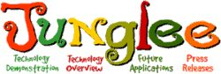
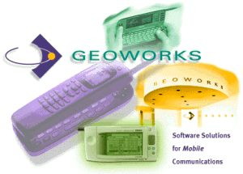
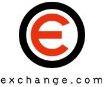
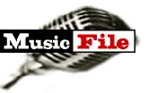
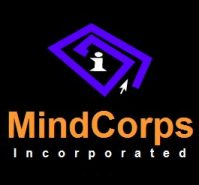
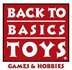
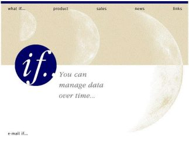
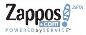

## Amazon Acquisitions

I tried to find a list of companies that Amazon.com had acquired or had invested in, and couldn’t find any lists that looked close to complete. So I decided to create my own. I hunted down a number of their investments and acquisitions, which I’ve included below. Chances are that I’ve missed some, and if you know of any that you would like to share, please let me know.

Amazon has made some large purchases over the years, but they seem to favor making investments in companies, and marketing agreements with the companies they invest in. While some of their transactions were fairly public, a few were very private, and there aren’t many details on the web about those – for instance, it’s very difficult to find a date for the transaction involving Leep Technologies, which I’ve listed at the end of the 1999 Amazon acquisitions.

I’ve included links to many patents which were, or are held by these companies.

## 1998 Amazon Acquisitions

**Bookpages**
(announced April 27, 1998) – one of the largest online bookstores in the United Kingdom – www.bookpages.co.uk – became Amazon’s online UK store.

**Telebook**
(announced April 27, 1998) – operating through its ABC Bücherdienst subsidiary, was Germany’s number one online bookstore – www.telebuch.de – became Amazon’s German online store.

**Internet Movie Database**
(announced April 27, 1998) – launched in 1990, [terrific repository](https://www.laweekly.com/do-you-imdb/) for information about movies and television – [www.imdb.com](https://www.imdb.com/)

**Sage Enterprises (PlanetAll)**
(announced Aug. 4, 1998) – Sage Enterprises, running PlanetAll.com, from Cambridge, Mass., offered a Web-based address book, calendar, and reminder service. According to a June 2000 CNet article, [Amazon to shut PlanetAll, absorb features](https://www.cnet.com/news/amazon-to-shut-planetall-absorb-features/), many features from PlanetAll were to be integrated into Amazon’s “Friends and Favorites” section. If you have an Amazon account, you’ll see some of these on your profile page, such as a reminder service.

- 6714916
   [Crossing Paths Notification Service](http://patft.uspto.gov/netacgi/nph-Parser?Sect1=PTO1&Sect2=HITOFF&d=PALL&p=1&u=%2Fnetahtml%2FPTO%2Fsrchnum.htm&r=1&f=G&l=50&s1=6714916.PN.&OS=PN/6714916&RS=PN/6714916)
   PlanetAll.com, Inc.

- 6269369
   [Networked Personal Contact Manager](https://patents.google.com/patent/US6269369B1/en)
   Sage Enterprise, Inc., DBA PlanetAll.com

**Junglee Corporation**
(announced Aug. 4, 1998) – Junglee Corp. was based in Sunnyvale, California, and provided Web-based virtual database technology to help [shoppers find products](https://web.archive.org/web/20060427020035/http://www.softwareview.com/thesof29.htm) on the web. The deal was for 100 percent of outstanding shares in exchange for equity having a value of about $280 million. Before Google’s head of Research, [Peter Norvig](http://www.norvig.com/bio.html), became a Googler and before he worked on NASA’s Mars Exploration Rovers software, he was employee number 8 at Junglee. His name is on one of the patents below.

- 6882981
   [Method and System for Integrating Transaction Mechanisms Over Multiple Internet Sites](https://patents.google.com/patent/US6882981B2/en)
   Junglee Corporation

- 6643624
   [Method and System for Integrating Transaction Mechanisms Over Multiple Internet Sites](https://patents.google.com/patent/US6643624B2/en)
   Junglee Corporation

- 6199079
   [Method and system for automatically filling forms in an integrated network based transaction environment](http://web.archive.org/web/20161227194808/http://patft.uspto.gov/netacgi/nph-Parser?Sect1=PTO1&Sect2=HITOFF&d=PALL&p=1&u=%2Fnetahtml%2FPTO%2Fsrchnum.htm&r=1&f=G&l=50&s1=6199079.PN.&OS=PN/6199079&RS=PN/6199079)
   Junglee Corporation

- 5826258
   [Method and Apparatus for Structuring the Querying and Interpretation of Semistructured Information](http://patft.uspto.gov/netacgi/nph-Parser?Sect1=PTO1&Sect2=HITOFF&d=PALL&p=1&u=%2Fnetahtml%2FPTO%2Fsrchnum.htm&r=1&f=G&l=50&s1=5826258.PN.&OS=PN/5826258&RS=PN/5826258)
   Junglee Corporation

- 5963949
   [Method for Data Gathering Around Forms and Search Barriers](http://patft.uspto.gov/netacgi/nph-Parser?Sect1=PTO1&Sect2=HITOFF&d=PALL&p=1&u=%2Fnetahtml%2FPTO%2Fsrchnum.htm&r=1&f=G&l=50&s1=5963949.PN.&OS=PN/5963949&RS=PN/5963949)
   Junglee Corporation

## 1999 Amazon Acquisitions

**Drugstore.com**
(February 1999) – Amazon.com buys a stake in Drugstore.com. I’m seeing conflicting reports of the percentage that Amazon purchased.

- 6510430
   [Diagnosis and Interprestation Methods and Apparatus for a Personal Nutrition Program](https://patents.google.com/patent/US6510430B1/en)
   Drugstore.com

- 6778980
   [Techniques for Improved Searching of Electronically Stored Information](https://patents.google.com/patent/US6778980B1/en)
   Drugstore.com

- 6947900
   [Method and Apparatus for Automatic Product Listing](https://patents.google.com/patent/US6947900B2/en)
   Drugstore.com

- 7062482
   [Techniques for Phonetic Searching](https://patents.google.com/patent/US7062482B1/en)
   Drugstore.com

- 7099925
   [Electronic Commerce Session Management](http://web.archive.org/web/20161228013114/http://patft.uspto.gov/netacgi/nph-Parser?Sect1=PTO1&Sect2=HITOFF&d=PALL&p=1&u=%2Fnetahtml%2FPTO%2Fsrchnum.htm&r=1&f=G&l=50&s1=7099925.PN.&OS=PN/7099925&RS=PN/7099925)
   Drugstore.com

- 20020198784
   [Method and Apparatus for Improving On-line Purchasing](http://appft1.uspto.gov/netacgi/nph-Parser?Sect1=PTO1&Sect2=HITOFF&d=PG01&p=1&u=%2Fnetahtml%2FPTO%2Fsrchnum.html&r=1&f=G&l=50&s1=%2220020198784%22.PGNR.&OS=DN/20020198784&RS=DN/20020198784)
   Drugstore.com

**Geoworks**
(February 1999) – acquisition of a minority interest in Geoworks, which works in wireless communications – Owner of a number of patents related to wireless phones.

**Pets.com**
(Announced on March 29, 1999) – purchased a 54 percent stake, paid for in cash and stock.

**LiveBid.com**
(April 1999 ) – live-event internet auctions

- 6449601
   [Distributed Live Auction](http://web.archive.org/web/20161228015909/http://patft.uspto.gov/netacgi/nph-Parser?Sect1=PTO1&Sect2=HITOFF&d=PALL&p=1&u=%2Fnetahtml%2FPTO%2Fsrchnum.htm&r=1&f=G&l=50&s1=6449601.PN.&OS=PN/6449601&RS=PN/6449601)
   LiveBid.com

**e-Niche Incorporated – Exchange.com, Bibliofind.com, and Musicfile.com**
(The [Merger Agreement and Plan](https://corporate.findlaw.com/contracts/planning/agreement-and-plan-of-merger-amazon-com-inc-and-e-niche-inc.html) shows a date of April 24, 1999) – for $200 million in mostly stock, the company developed Internet marketplaces at exchange.com, and operated a rare and collectibles online bookstore at Bibiliofind, and a music site at Musicfile.com.

**Alexa Internet**
(Announced April 26, 1999) – The press release from Amazon announcing this acquisition focused primarily upon the acquisition of Exchange.com. In the press release, we are told that the acquisitions of Alexa.com, Accept.com, and Exchange.com should be closed by June 30, 1999 and that they were “three separate substantially all-stock transactions totaling approximately $645 million.”

In [Amazon makes Net triple play](https://www.cnet.com/news/amazon-makes-net-triple-play/), the Internet Archive is mentioned as one of the attractive aspects of what Alexa had to offer. The article provides the following quote:

> “Alexa has a pretty interesting database with really good information about what people are doing on the Web and also relationships with close to a million users and potential relationships with a larger number,” said Barry Parr, an analyst with IDC. “The immediate application by Amazon isn’t obvious, but it’s an interesting group of folks in an interesting position in the marketplace.”

There are a number of patent filings associated with Alexa Internet. Some of these were filed before the acquisition date, while others were developed afterward.

- 20020198882
   [Content personalization based on actions performed during a current browsing session](http://appft.uspto.gov/netacgi/nph-Parser?Sect1=PTO2&Sect2=HITOFF&u=%2Fnetahtml%2FPTO%2Fsearch-adv.html&r=1&p=1&f=G&l=50&d=PG01&S1=20020198882.PGNR.&OS=dn/20020198882&RS=DN/20020198882)

- 6282548
   [Automatically generate and displaying metadata as supplemental information concurrently with the web page, there being no link between web page and metadata](http://web.archive.org/web/20161228014602/http://patft.uspto.gov/netacgi/nph-Parser?Sect1=PTO2&Sect2=HITOFF&u=%2Fnetahtml%2FPTO%2Fsearch-adv.htm&r=1&p=1&f=G&l=50&d=PTXT&S1=6282548.PN.&OS=pn/6282548&RS=PN/6282548)

- 6549941
   [Software system and methods for resubmitting form data to related web sites](http://web.archive.org/web/20161227194428/http://patft.uspto.gov/netacgi/nph-Parser?Sect1=PTO2&Sect2=HITOFF&u=%2Fnetahtml%2FPTO%2Fsearch-adv.htm&r=1&p=1&f=G&l=50&d=PTXT&S1=6549941.PN.&OS=pn/6549941&RS=PN/6549941)

- 6691163
   [Use of web usage trail data to identify related links](http://web.archive.org/web/20161228015227/http://patft.uspto.gov/netacgi/nph-Parser?Sect1=PTO2&Sect2=HITOFF&u=%2Fnetahtml%2FPTO%2Fsearch-adv.htm&r=1&p=1&f=G&l=50&d=PTXT&S1=6691163.PN.&OS=pn/6691163&RS=PN/6691163)

- 7085736
   [Rules-based identification of items represented on web pages](http://patft.uspto.gov/netacgi/nph-Parser?Sect1=PTO2&Sect2=HITOFF&u=%2Fnetahtml%2FPTO%2Fsearch-adv.htm&r=1&p=1&f=G&l=50&d=PTXT&S1=7085736.PN.&OS=pn/7085736&RS=PN/7085736)

- 7165069
   [Analysis of search activities of users to identify related network sites](https://patents.google.com/patent/US7165069B1/en)

- 7373313
   [Service for enabling users to share information regarding products represented on web pages](http://web.archive.org/web/20161228020120/http://patft.uspto.gov/netacgi/nph-Parser?Sect1=PTO2&Sect2=HITOFF&u=%2Fnetahtml%2FPTO%2Fsearch-adv.htm&r=1&p=1&f=G&l=50&d=PTXT&S1=7373313.PN.&OS=pn/7373313&RS=PN/7373313)

**Accept.com Financial Services Corporation**
(The [Merger Agreement and Plan](https://corporate.findlaw.com/contracts/planning/agreement-and-plan-of-merger-amazon-com-inc-and-accept-com.html) shows a date of April 25, 1999) – Accept.com, which specializes in person-to-person and consumer-to-business transactions.

**HomeGrocer.com**
(Announced on May 18, 1999) – www.homegrocer.com – Amazon.com’s $42.5 million in cash and stock bought a 35 percent stake in the online grocer, which served customers in Seattle, Washington, and Portland, Oregon. For an idea of what the site and its service was like, see: Buying Peaches, E-Commerce Style

**Gear.com**
(Announced July 14, 1999) – Offered 100-percent closeout merchandise in all sports categories, which meant that their prices on brand-name sporting goods were at prices from 20 to 90 percent off retail. The deal was for approximately 49 percent of Gear.com’s outstanding shares as of July 1, 1999. The company was purchased by Overstock.com in 2000.

**Tool Crib of the North**
(Acquired in October 1999) – Purchased the online and catalog sales division of [the company](http://web.archive.org/web/20110304011050/http://www.acmetools.com/webapp/wcs/stores/servlet/Home_-1_10052_10101), selling a very wide variety of tools and home improvement items.

**Convergence Corporation**
(Announced on Oct. 4, 1999) – Makes software to connect wireless devices to the Internet, for about $23 million in stock.

- 6675196
   [Universal Protocol for Enabling a Device to Discover and Untilize the Services of Another Device](http://web.archive.org/web/20161228015538/http://patft.uspto.gov/netacgi/nph-Parser?Sect1=PTO1&Sect2=HITOFF&d=PALL&p=1&u=%2Fnetahtml%2FPTO%2Fsrchnum.htm&r=1&f=G&l=50&s1=6675196.PN.&OS=PN/6675196&RS=PN/6675196)
   Convergence Corporation

- 6941374
   [Hidden Agent Transfer Protocol](http://web.archive.org/web/20161228020320/http://patft.uspto.gov/netacgi/nph-Parser?Sect1=PTO1&Sect2=HITOFF&d=PALL&p=1&u=%2Fnetahtml%2FPTO%2Fsrchnum.htm&r=1&f=G&l=50&s1=6941374.PN.&OS=PN/6941374&RS=PN/6941374)
   Convergence Corporation

**MindCorps Incorporated**
(Founded in 1996, sold to Amazon in 1999) – the company created applications for web sites from online chats to web-based databases. Nice [interview](http://web.archive.org/web/20070711090247/http://www.mercent.com/NewsArticles/2004-09-20%20-%20eCommerceIQ%20-%20Champions%20of%20e-Commerce.htm) with one of the founders, Eric Best.

**Della.com**
(Amazon.com has a minority interest ([20 percent](https://archive.nytimes.com/www.nytimes.com/library/tech/99/11/cyber/commerce/15commerce.html) as of November 1999) in Della.com, which offers gift registry, expert advice, and personalized gift suggestions. Other investors in Della.com include Tiffany & Co., Crate and Barrel, Williams-Sonoma, and other retailers. In April, 2000, the company [merged](http://web.archive.org/web/20120714041842/http://wedding.weddingchannel.com:80/press_release/weddellPress.asp) with WeddingChannel.com, which is an online wedding planning and bridal registry resource, under the name WeddingChannel.com.

**Back to Basics Toys**
([November 1999](https://money.cnn.com/1999/12/01/deals/amazon/)) – Privately held catalog toy store based in Herndon, Virginia. [Sold to Scholastic](https://multichannelmerchant.com/marketing/scholastic-buys-back-to-basics-toys-from-amazon-com/) in 2003

**Ashford.com**
(December 1999) – Web retailer of luxury products. Amazon invested $10 million for a 16.6 percent ownership in Ashford.com outstanding common stock, with the contract covering the holiday seasons in 1999 and 2000, for Ashford to offer Amazon’s customers selections from its product line.

**Leep Technology Inc.**
(Founded in 1995, Acquired by Amazon in 1999) – The developer of on-line database query tools and Customer Relationship Management software. Sold to Amazon.com. It’s difficult to pinpoint an exact date.

- 5999924
   [Method and Apparatus for Producing Sequenced Queries](http://web.archive.org/web/20161228020417/http://patft.uspto.gov/netacgi/nph-Parser?Sect1=PTO1&Sect2=HITOFF&d=PALL&p=1&u=%2Fnetahtml%2FPTO%2Fsrchnum.htm&r=1&f=G&l=50&s1=5999924.PN.&OS=PN/5999924&RS=PN/5999924)
   Leep Technology, Inc.

- 6003024
   [System and method for selecting rows from dimensional databases](http://patft.uspto.gov/netacgi/nph-Parser?Sect1=PTO1&Sect2=HITOFF&d=PALL&p=1&u=%2Fnetahtml%2FPTO%2Fsrchnum.htm&r=1&f=G&l=50&s1=6003024.PN.&OS=PN/6003024&RS=PN/6003024)
   Leep Technology, Inc.

- 6185556
   [Method and Apparatus for Changing Temporal Database](http://web.archive.org/web/20161228020247/http://patft.uspto.gov/netacgi/nph-Parser?Sect1=PTO1&Sect2=HITOFF&d=PALL&p=1&u=%2Fnetahtml%2FPTO%2Fsrchnum.htm&r=1&f=G&l=50&s1=6185556.PN.&OS=PN/6185556&RS=PN/6185556)
   Leep Technology, Inc.

## 2000 Amazon Acquisitions

**Greenlight.com**
([Announced](https://www.cnet.com/news/amazon-invests-in-car-retailer-greenlight/) on January 21, 2000) – A 5 percent stake in online car retailer Greenlight.com. The exact terms weren’t disclosed, but a promotional agreement within the investment has Greenlight paying Amazon $82.5 million over five years for marketing efforts and promotions, and Amazon could option to increase their stake in Greenlight to 30 percent within the five years after the agreement.

**Greg Manning Auctions, Inc.**
(Announced Feb. 3, 2000) – A minority investment in GMAI, for $5 million of GMAI’s stock. The company focus was on a wide range of collectibles and became known as the Escala Group (link no longer available). Active in the US, Europe, and China at the time of the investment.

**Basis Technology**
(Announced on Feb. 18, 2000) – A minority investment in this provider of internationalization technology for Internet companies and Web software developers.

**kozmo.com**
(Announced on March 20, 2000) – Amazon invested $60 million for a minority stake in this company which offered free delivery, within an hour, of things like rental DVDs and Starbucks coffee. Great overview at [Anatomy of a Dot-Com](http://web.archive.org/web/20170606193715/http://www.scmr.com/article/CA184173.html) from an employee of the company. Also interesting is Kozmo Kills the Messenger. Great [Google Answer](http://answers.google.com/answers/threadview?id=431068) about Kozmo, what they delivered, and what their most popular delivery items were.

**WineShopper.com**
(Announced on April 18, 2000) – A minority investment of $ 30 Million, in this San Francisco and Napa-based company, which had set up a system involving more than 550 wineries, importers and suppliers, and 250 wholesalers in 45 states (representing about 85 percent of the U.S. population).

**Audible.com**
(Announced on Jan. 31, 2000) – An investment in the range of millions of dollars, for 5 percent of this spoken audio service, which featured content from newspapers and magazines, and books on audio. For promoting audio.com, Amazon would receive $ 30 million over three years.

## 2001 Amazon Acquisitions

**CatalogCity.com**
(Announced Nov 9, 2001) – A $ 5 Million investment, and a commercial agreement with this group of catalog merchants.

**Egghead.com**
(Announced in December 2001) – Bankrupt electronics online retailer was purchased for $ 6.1 Million.

**OurHouse.com**
(December 2001) – OurHouse.com was intended to be the online partner for Ace Hardware. Employee number 17, Tom Tresser, was the marketing director for the business, and has (had) a page about OurHouse and some of the promotions and efforts that made it a successful site.

## 2002 Amazon Acquisitions

**CDNow**
(December 2002) – CD Now was acquired by Bertelsmann in 2000, and their operation was merged with the now-defunct BMG Direct Record Club. Amazon and Bertelsmann agreed to [a long term deal](https://www.cnet.com/news/amazon-cdnow-make-it-official/) which would have Amazon handle things such as “fulfillment, inventory, content and customer service” for CDNow’s site in early December of 2002. The CD Now website reflected the change by the [end of 2002](http://web.archive.org/web/20030201101942/www.amazon.com/exec/obidos/tg/browse/-/3023481).

## 2004 Amazon Acquisitions

**Joyo.com Limited**
(Announced on Aug. 19, 2004) – Web retailer in China, from the British Virgin Islands, purchased for $75 Million ($72 million in cash and the assumption of employee stock options). The largest online retailers of books, music, and videos in China at the time.

## 2005 Amazon Acquisitions

**BookSurge LLC**
(Announced on April 4, 2005) – Inventory-free on-demand book printing and fulfillment from Charleston, South Carolina.

**Mobipocket.com**
([April 2005](http://fonerbooks.blogspot.com/2005/08/ebook-server-software-amazon.html)) – A French company that specialized in ebooks for mobile devices, with both reader and server software.

**CustomFlix**
([June 2005](https://www.theregister.co.uk/2006/03/16/amazon_enters_film_downloads/)) – Enables films to be downloaded and burned on DVDs.

## 2006 Amazon Acquisitions

**Shopbop.com**
(Announced on Feb 27, 2006) – Retailer of apparel, shoes, and accessories for women. The site has nothing on it to indicate that it is now owned by Amazon, but there is a link from Amazon’s Apparel & Accessories Store (www.amazon.com/apparel) to the site.

**wikia, Inc.**
(invested in [December 2006](http://web.archive.org/web/20130429235028/http://community.wikia.com/wiki/Community_Central:Press:_Amazon_invests_in_Wikia)) – Wikia supports the development of open-source software which is used to Wikipedia and Wikia and many thousands of other wiki sites.

## 2007 Amazon Acquisitions

**Digital Photography Review**
(May 14, 2007) – Amazon [acquired](https://www.dpreview.com/articles/1690663587/amazonacquiresdpreview) Digital Photography Review ([dpreview.com](https://www.dpreview.com/)), which has continued to operate as a standalone business since the acquisition.

**Brilliance Audio, Inc.**
(Acquired May 23, 2007) – If you visit the web site of [Brilliance Audio](http://web.archive.org/web/20130324014307/http://www.brillianceaudioinc.com:80/), you would be hardpressed to uncover their relationship with Amazon.com. The company was the largest independent publisher of audiobooks in the United States at the time of the acquisition.

**Amie Street**
(Investment announced on [August 6, 2007](http://web.archive.org/web/20090422181604/http://amiestreet.com/blog/Series-A)) – The terms of this Series A financing deal aren’t disclosed in the press release from Amie Street, but this social networking digital music store has been growing quickly, and an October 2008 [Press release](http://web.archive.org/web/20090802082125/http://amiestreet.com/blog/amie2_release) describes significant growth of catalog and customers and employees. It also tells us that the site is “raising its Series B round of financing with strong participation from existing investors.”

## 2008 Amazon Acquisitions

**Audible GmbH**
(Announced January 31, 2008 ) – The press release tells us that [Audible](https://www.audible.com/) is the “leading online provider of premium digital spoken-word audio content, specializing in digital audio editions of books, newspapers and magazines, television and radio programs and original programming.”

**Without A Box, Inc.**
(Acquired January 17, 2008) – The acquisition was by the Internet Movie Database, as a subsidiary of Amazon.com. [Without A Box](https://www.withoutabox.com/) is a media company that promotes independent films to audiences, and to film festivals.

**Lovefilm International**
(Investment announced [April 2, 2008](https://www.amazon.co.uk/gp/help/customer/display.html?nodeId=202167400&node=3054240031)) – Amazon.com became the largest shareholder of stock for [Lovefilm.com](https://www.amazon.co.uk/gp/help/customer/display.html?nodeId=202167400&node=3054240031) in exchange for Amazon Europe’s DVD rental business in the United Kingdom and Germany, as well as a cash investment. The agreement also included a multi-year deal for Amazon Europe to promote Lovefilm.com’s services to customers in the UK and Germany.

**Animoto**
(Investment in [May, 2008](https://xconomy.com/seattle/2009/06/18/madrona-amazon-bet-44m-on-animoto-a-startup-with-roots-at-bellevue-high-school/)) – Amazon.com CEO Jeff Bezos gave a presentation in April of 2008 at Y Combinator’s Startup School, which featured [Animoto](https://animoto.com/) video creation technology, run on Amazon’s cloud computing platform. A month later, Amazon is one of a number of investors in the company.

**Fabric.com**
(Acquired June 25, 2008) – An online fabric store, offering custom measured and cut fabrics. [Fabric.com](https://www.fabric.com/) has continued to be run as an independent business.

**Box Office Mojo**
(Acquired [July 2008](https://www.boxofficemojo.com/)) – The strength of [Box Office Mojo](https://www.boxofficemojo.com/) has been the box office tracking data that it has been able to collect and share online. The acquisition was made by the Internet Movie Database (IMDB), rather than directly by Amazon.com. The site also includes analysis, reviews, and interviews, and continues to operate independently of IMDB and Amazon.com, though it is likely that the data collected by Box Office Mojo about box office numbers, and film and TV credits are being shared.

**Engine Yard Inc.**
(Invested in [July, 2008](https://www.cnet.com/news/amazon-invests-in-engine-yards-cloud-computing/)) – [Engine Yard](https://www.engineyard.com/) enables Ruby on Rails developers to deploy their applications on the Web, using cloud computing.

**Elastra Corp**
(Invested in [August 2008](https://www.bizjournals.com/seattle/stories/2008/08/04/daily9.html)) – This company makes software to move some of its computing infrastructures onto the internet, accessible via “cloud computing.”

**Shelfari**
(Shelfari acquired [August 25, 2008](https://www.goodreads.com/?shelfari_flash=true/my_weblog/2008/08/shelfari-joins-the-amazoncom-family.html)) – Amazon originally was an [investor in Shelfari](https://www.goodreads.com/?shelfari_flash=true/Shelfari/Press/02-28-07.aspx) in February, 2007. At the time of the acquisition, the Shelfari blog told us that:

> As many of you may already know, Amazon has been a long supporter of Shelfari. They’ve worked closely with us as we introduced readers, like you, to our global community of book lovers. They’ve been there each step of the way as we brought forth new features, like the cool Facebook application and our virtual bookshelf. And now Shelfari and Amazon will work for hand in hand to continue to grow our dynamic community and create innovative new tools around the books you love.

**Reflexive Entertainment Inc.**
(Acquired [October 20, 2008](https://www.amazongames.com/en-gb)) – The acquisition added significantly to the games that Amazon offers, and the [Reflexive website](https://www.amazongames.com/en-gb) appears to run as a standalone business with no sign that it is owned by Amazon except for CEO Lars Brubaker’s announcement of the acquisition.

**AbeBooks Justbooks IberLibro.com Bookfinder.com Gojaba.com FillZ LibraryThing (40 %) Chrislands**
(Acquisition completed December 1, 2008) – [Abe Books](https://www.abebooks.com/) is an online marketplace for millions of mostly used, out of print, and rare books, which are listed by thousands of independent booksellers from around the world. Again, this is another acquired company that continues to be a stand-alone operation after being purchased.

AbeBooks made a number of acquisitions on its own before being purchased by Amazon.com, including [Justbooks.de](https://www.justbooks.de/) in October of 2001, and [IberLibro.com](https://www.iberlibro.com/) in October 2004 AbeBooks acquired [BookFinder.com](https://www.bookfinder.com/) in November of 2005, a book inventory and order management company named [FillZ](https://fillz.com/) in February of 2006, a 40 percent stake in [LibraryThing](https://www.librarything.com/) in May of 2006, created a site named [Gojaba.com](https://www.abebooks.com/) in February of 2008, and acquired [Chrislands](https://www.chrislands.com/) in April of 2008.

## 2009 Amazon Acquisitions

**Yieldex**
(Investment in company on [February 17, 2009](https://gigaom.com/2009/02/17/419-amazon-invests-in-online-ad-optimization-firm-yieldex/)) – [Yieldex](https://www.xandr.com/platform/monetize/) is an online ad targeting optimization firm.

**Lexcycle Inc.**
(Acquired [April 27, 2009](https://web.archive.org/web/20111018113427/http://www.lexcycle.com/lexcycle_acquired_by_amazon)) – This is the company behind Stanza, an electronic book reading application for the iPhone and iPod.

**Booktour**
(Seed capital investment in [April, 2009](https://gigaom.com/2009/04/13/419-booktour-raises-350000-in-seed-capital-from-amazon/)) – The Chairman of [Booktour](http://web.archive.org/web/20080328125736/http://booktour.com/) is author and journalist Chris Anderson, who is the editor in chief of Wired Magazine, and the writer of the book *The Long Tail*. The company lets authors create profile pages where they can communicate with fans, and provide a schedule of events they may be participating in.

**Foodista**
(Investment in [May, 2009](http://web.archive.org/web/20100116090033/http://www.marketwire.com/press-release/Foodistacom-Completes-Series-A-Funding-NASDAQ-AMZN-984709.htm)) – [Foodista](https://www.foodista.com/) is an online cooking encyclopedia and wiki which launched in December of 2008, and is being built with user contributions.

**Talk Market Inc**
(Investment on [June 9, 2009](https://gigaom.com/2008/06/09/419-amazon-takes-equity-stake-in-diy-shopping-site-the-talk-market/)) – A minority stake in [Talk Market](https://videolicious.com/), which allows sellers of unique products to upload videos about what they offer, and add graphics and soundtracks to those videos. In essence, this is an online shopping network.

**SnapTell Inc.**
(Acquisition on [June 16, 2009](https://snaptell.typepad.com/snaptell_blog/2009/06/snaptell-has-been-acquired-by-a9com-a-subsidiary-of-amazoncom.html)) – Snaptell was acquired by Amazon.com subsidiary [A9](https://a9.com/). The company makes mobile image recognition marketing applications and technology, and has been one of the most popular applciations for iPhones and Android phones.

**Zappos**
(Acquired July 22, 2009) – The [email](https://www.zappos.com/about/) that [Zappos](https://www.zappos.com/toad-co-zeta-dress-black) CEO Tony Hsieh sent out to his employees to inform them of the acquisition of Zappos by Amazon.com provides a lot of insight into why Amazon purchased this popular e-commerce company. He tells them:

> We plan to continue to run Zappos the way we have always run Zappos — continuing to do what we believe is best for our brand, our culture, and our business. From a practical point of view, it will be as if we are switching out our current shareholders and board of directors for a new one, even though the technical legal structure may be different.
>
> We think that now is the right time to join forces with Amazon because there is a huge opportunity to leverage each other’s strengths and move even faster towards our long-term vision. For Zappos, our vision remains the same: delivering happiness to customers, employees, and vendors. We just want to get there faster.
