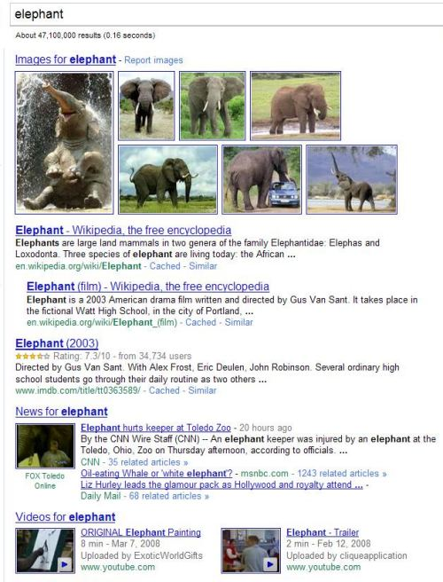
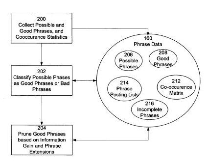
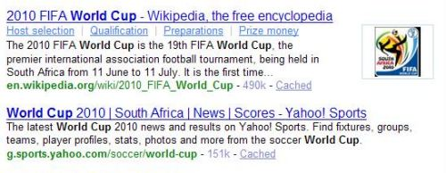
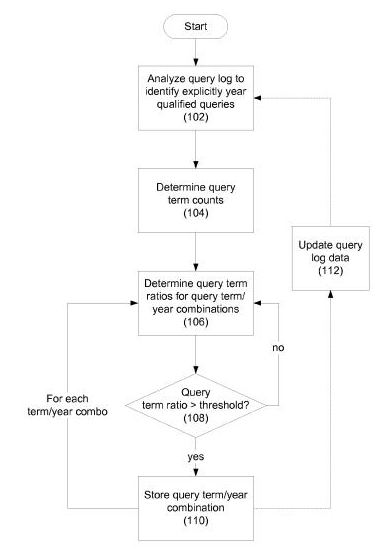
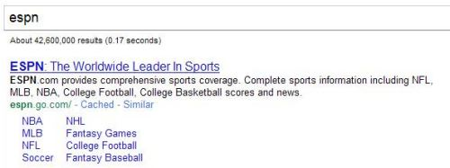
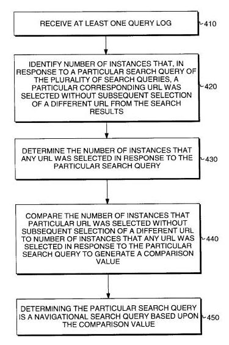
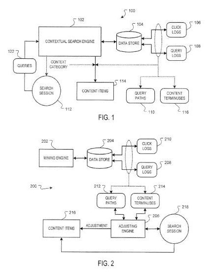
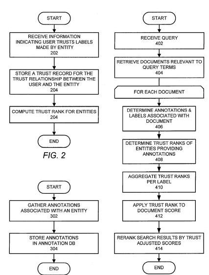
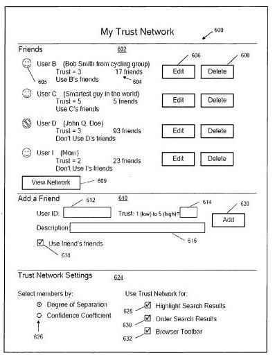
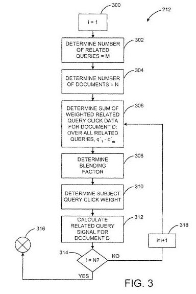

When a search engine shows you results for a search, the pages displayed are likely in order based upon a mix of relevance and importance.

But a search engine doesn’t usually stop there, and T may look at other things to filter and reorder search results.

In 2006, I wrote [20 Ways Search Engines May Rerank Search Results](https://www.seobythesea.com/2006/10/20-ways-search-engines-may-rerank-search-results/), which described several ways that search engines may rerank pages. I followed that up in 2007 with [20 More Ways that Search Engines May Rerank Search Results](https://www.seobythesea.com/2007/09/20-more-ways-that-search-engines-may-rerank-search-results/).

I decided it was time for a sequel or two in this series. I came up with another 25 ways to rerank search results but decided to stop at 10 in this post.

Many of the following are described in patents, and some of those patents were initially filed years ago – prehistoric times in Web years. T search engines may have incorporated ideas from those patents into what they are doing now, adopted those methods and since moved on to something new, or put them in a filing cabinet somewhere and forgot about them (I’d like the key to that filing cabinet).

More important than knowing whether or not Google, Yahoo, or Bing might be using something from within a patent is understanding reasons search engines might have considered one approach or another to rerank search results.

Understanding that can help give you an idea of why a search engine might rerank search results, provide you with a starting point for researching what the writers of the patents and whitepapers included, and give you insight into some of the assumptions behind how search engines perceive search, searchers, and the Web.

Here are ten more ways that search engines may rerank search results:

**1. Blended and Universal Search**

For many years, most search results at the major search engines were limited to lists of links to web pages. So times, you would see news results or images, but the most common sets of search results pages tended to be a list of “ten blue links.” Now, you’ll often see maps, pictures, tweets, blog posts from social network connections, recent news, and sometimes even actual links to web pages.

When Google [launched Universal Search](http://googlepress.blogspot.com/2007/05/google-begins-move-to-universal-search_16.html) in 2007, one central idea behind it was to present a wider choice of results from Google’s other search repositories involving maps, pictures, news, books, videos, and others to provide a “truly comprehensive search experience.” Or, to put it another way, Google was getting plenty of Web searches, but nobody was clicking on the tabs above the search box to visit pictures or news or other specialized searches.

Before the Universal Search announcement, Google experimented with providing some non-webpages at the tops of its web search results. This was sometimes called “vertical creep” into organic or “blended” results. A Go le patent on the Universal Search [interface](https://www.seobythesea.com/2008/11/google-universal-search-patent-granted/) was filed back in 2003, and an Official Google blogpost by Marissa Mayer places the start of Universal Search back to a 2001 [brainstorming](https://googleblog.blogspot.com/2007/05/universal-search-best-answer-is-still.html) session.

There’s a lot more than ten blue links in Google’s search results these days, as the following results on a search for “elephant” show:

Another Google patent filing published in 2008 described how these vertical results were [interleavened](https://www.seobythesea.com/2008/06/how-google-universal-search-and-blended-results-may-work/) (Google’s word, not mine) into the main web results. Google was more likely to include non-web results if it could place those in places on a page other than just at the top of the page, as described in the Official Google Blog post [Behind the scenes with universal search](https://googleblog.blogspot.com/2007/05/behind-scenes-with-universal-search.html).

While this process of interleaving non-web page results into search results doesn’t reorder the web pages in those results, it can push web results down on a page or onto the next page. Yahoo and Microsoft also blend non-web results into what you see on their web search.

**2. Phrase Based Indexing**

Imagine a search engine looking at the content on one of your pages and identifying which strings of words there fit together into meaningful “good” or meaningless “bad” phrases. It might create an index of good terms appearing upon pages on the Web, and when someone performs a search, it might look to see which phrases appear upon a certain number of top results for your query. It might hen rerank the results by considering how many common “good” words co-occur within that set of search results and give more weight to pages with more of those phrases.

That’s one aspect of a phrase-based indexing system that could change the order of search results, as described in many Google patent filings. Some previous posts on other aspects of a phrase-based indexing system from Google:

- [Google Aiming at 100 Billion Pages?](https://www.seobythesea.com/2006/05/google-aiming-at-100-billion-pages/)
- [Phrase Based Information Retrieval and Spam Detection](https://www.seobythesea.com/2006/12/phrase-based-information-retrieval-and-spam-detection/)
- [Google Phrase Based Indexing Patent Granted](https://www.seobythesea.com/2008/09/google-phrase-based-indexing-patent-granted/)
- [What are the Top Phrases for Your Website?](https://www.seobythesea.com/2009/03/what-are-the-top-phrases-for-your-website/)
- [Phrasification and Revisiting Google’s Phrase Based Indexing](https://www.seobythesea.com/2010/04/phrasification-and-revisiting-googles-phrase-based-indexing/)

Google isn’t the only search engine looking at how to rerank search results using phrase-based indexing. Here’s a post about a Yahoo patent filing on the process:

- [Yahoo Phrase Based Indexing in a Nutshell](https://www.seobythesea.com/2008/02/yahoo-phrase-based-indexing-in-a-nutshell/)

**3. Time-Based Data and Query Log Statistics**

When we search, the search engines collect information about our searches to glean the intent behind them. A recent Y oo patent filing tells us how the search engine may look through query logs to see if there might be a [time-based aspect](https://www.seobythesea.com/2010/05/how-a-search-engine-might-rerank-search-results-based-upon-time-based-data-in-query-logs/) to our searches. Suppose there are many previous queries related to ours where there might be a time, such as a year, associated with the question. For example, someone searching for the “world cup” this year might see many search results showing information about “world cup 2010” at the top of the results.

A flow chart from the patent filing gives a quick glimpse at the reranking algorithm:

This process could attempt to see if a query has a time-based aspect to it by visiting if a good percentage of queries in its log files indicate a year or some other period, or by looking at query sessions of searchers to see if they refined their queries to include a time-based term or both.

If that analysis indicates a time-based element such as a year, it might rerank search results to boost results to include a temporal term, such as results for “world cup 2010” ranking higher in a search for “world cup.”

**4. Navigational Queries**

Some searches tend to be “navigational” in nature, and the query is just a shortcut to get to a specific page. For example, I type “ESPN” into my toolbar search box (Google toolbar, Yahoo Search bar, Bing bar) so that I can visit the pages of ESPN quickly (I always forget that “go” between the ESPN and the .com in the URL).

The search engines have identified several perfect matches for these types of navigational queries, and those pages tend to be listed at the top of searches for those terms.

Which pages tend to be the best results for a navigational query? Here are a few posts I’ve written on how a search engine may decide:

- [Microsoft on Navigational Queries and Best Match](https://www.seobythesea.com/2009/12/microsoft-on-navigational-queries-and-best-match/) (Microsoft)
- [Search Trails: Destinations, Interactive Hubs, and Way Stations](https://www.seobythesea.com/2008/12/search-trails-destinations-interactive-hubs-and-way-stations/) (Microsoft)
- [Redefining Navigational Queries to Find Perfect Sites](https://www.seobythesea.com/2008/03/redefining-navigational-queries-to-find-perfect-sites/) (Yahoo)

In a white paper written by researchers from both Yahoo and Google (not sure why the tag-team), [Expected Reciprocal Rank for Graded Relevance](http://olivier.chapelle.cc/pub/err.pdf) (pdf), describing how to evaluate pages listed within search results, we’re told that “a perfect grade is typically only given to the destination page of a navigational query.”

So, search results may be reordered to place a specific page at the top of search results when there is an ideal destination page (or perfect page) for one particular query when that query is perceived as a navigational, like my ESPN shortcut.

**5. Patterns in Click and Query Logs**

A search engine looking through its query logs might find [patterns related to the query terms](https://www.seobythesea.com/2009/10/how-a-search-engine-might-adjust-rankings-based-upon-patterns-in-query-and-click-logs/) used in query sessions and in choices of links people click upon. The abstract to the Google patent [Rank-adjusted content items](https://patents.google.com/patent/US7426507B1/en) tells us that:

> Click logs and query logs are processed to identify statistical search patterns. A search session is compared to the statistical search patterns. Content items responsive to a query of the search session are identified, and a ranking of the content items is adjusted based on the comparison.

Imagine many people search for “Chevrolet carburetor,” then for “Chevrolet Carborator Rebuild Kit,” and follow up with a search for “classic Chevy carburetor kits.” They then frequently choose “http://www.example.com/classic-chevrolet-carborators.html.” Someone else c ing along with searches for the same or very similar queries during a query session. The page at “ht p://www.example.com/classic-chevrolet-carborators.html” may be boosted and rank higher in search results for that searcher.

**6. Google TrustRank and Yahoo Dual Trustrank**

In 2004, a Yahoo whitepaper described how the search engine might identify webspam by looking at links between pages. That paper was mistakenly credited to Google by many people, most likely because Google was trying to trademark the term “TrustRank” around the same time, but for different reasons.

Surprisingly, Google was [granted a patent](https://www.seobythesea.com/2009/10/google-trust-rank-patent-granted/) on something it referred to as Trust Rank in 2009, though it’s a Trust Rank that is very different from Yahoos. Instead of looking at the ways sites linked to each other, Google’s Trust Rank looks at how well they trust people who have labeled web pages in annotations of those pages, somewhat like the label scrawled on the old photo above.

Google allows people who create custom search engines to apply “labels” to pages, as well as annotations in other places, such as Google’s Sidewiki. Not surprisingly good ideas seem to follow a reuse/recycle practice in search engine circles), Yahoo added a social aspect to their TrustRank as well, mixing “trust” in annotations and user-behavior signals associated with pages and TrustRank scores to come up with something they called [Dual Trustrank](https://www.seobythesea.com/2007/01/social-trustrank-and-user-annotations-as-anchor-text/) (double the trust, double the fun?).

Both Google’s TrustRank and Yahoo’s Dual Trustrank could be used to rerank search results.

Do we see hints of an approach like this in Google’s [Social Search](https://googleblog.blogspot.com/2010/01/search-is-getting-more-social.html)?

**7. Customization based upon previous related queries**

The term you just searched for may influence what you see in your next search if they are determined to be related. At least, according to the Google patent [Methods and systems for improving a search ranking using related queries](https://patents.google.com/patent/US7505964B2/en)

Google sometimes shows an announcement at the top of search results telling you that Google has customized them based upon your location or because of your previous queries. I wrote about this tent in [How Searchers’ Queries Might Influence Customized Google Search Results](https://www.seobythesea.com/2009/03/how-searchers-queries-might-influence-customized-google-search-results/).

Why might Google might consider some queries to be related to others? Some possibilities:

- Others having used the same sequence of query terms previously (whether once or multiple times),
- Queries input by a user within a defined time range (e.g., 30 minutes),
- A misspelling relationship,
- A numerical relationship,
- A mathematical relationship,
- A translation relationship,
- A synonym, antonym, or acronym relationship, or other human-conceived or human-designated association, and;
- Any computer or algorithm determined relationship.

**8. Being Linked to by B gs**

Microsoft’s [Ranking Method using Hyperlinks in Blogs](http://appft1.uspto.gov/netacgi/nph-Parser?Sect1=PTO2&Sect2=HITOFF&u=%2Fnetahtml%2FPTO%2Fsearch-adv.html&r=1&p=1&f=G&l=50&d=PG01&S1=20080243812.PGNR.&OS=dn/20080243812&RS=DN/20080243812) describes how more “PageRank” might be distributed to pages that are linked to by blogs. The patent focuses on explaining how they might distinguish blogs and non-blogs.

Did I write about their approach in Do Search Engines Love Blogs? Microsoft Explores an algorithm to Increase PageRank for Pages Linked to my Blogs. Why blogs? The patent inventors tell us that blogs tend to be:

> …frequently updated, more informational than personal, and free of spam.

The approach was tested with many pages, but they tell us that it might lose some value as more “spam blogs” become prevalent on the Web.

This particular method may have lost some value over the past couple of years with the proliferation of splogs. It may be an excellent example of reranking search results that might change over time.

**9. By Ages of Linking Domains**

While the age of “maturity” of a domain might be something that helps a web page rank higher in search results, a Microsoft patent filing, [Ranking Domains Using Domain Maturity](http://appft1.uspto.gov/netacgi/nph-Parser?Sect1=PTO2&Sect2=HITOFF&u=%2Fnetahtml%2FPTO%2Fsearch-adv.html&r=1&p=1&f=G&l=50&d=PG01&S1=20080086467.PGNR.&OS=dn/20080086467&RS=DN/20080086467), looks instead at the ages of domains [linking](https://www.seobythesea.com/2008/04/do-domain-ages-affect-search-rankings/) to another part.

A page might rank higher if it is linked to sites that have some age and have been around the block a few times instead of ones newly on the Web. The patent filing does t l us that the “maturity” of a domain may be reset if the domain expires or changes hands.

**10. Diversification of Search Results**

The New York Times surprised us in 2007 with [Google Keeps Tweaking Its Search Engine](https://www.nytimes.com/2007/06/03/business/yourmoney/03google.html?_r=4&ref=yourmoney&pagewanted=all). The article introduced the concept of “Query Deserves Freshness” (QDF), which attempts to decide when searchers might want search results with fresher pages or with older pages. It’s a concept worth incl ing in this set of reranking approaches. Still, it leads to the question, “Do the search engines also try to follow a “Query Deserves Diversity” algorithm to provide searchers with diverse results when queries might have more than one meaning?”

The chances are that they do. When someone searches for a term like “java,” the intent might be to learn more about Java programming, the island Java, or the beverage Java. A search engine could just ow the most relevant and essential pages that come up in a search for “java” (probably the programming language everywhere in the world but the island of Java). But some searchers might be interested in the coffee or the island, and some diversity in search results may be a good idea.

A Microsoft patent, [Diversifying Search Results for Improved Search and Personalization](http://appft1.uspto.gov/netacgi/nph-Parser?Sect1=PTO2&Sect2=HITOFF&u=%2Fnetahtml%2FPTO%2Fsearch-adv.html&r=1&p=1&f=G&l=50&d=PG01&S1=20070294225.PGNR.&OS=dn/20070294225&RS=DN/20070294225), tells us what they might look at when deciding to diversify query results.

I covered those in [Reranking Search Results Based Upon Personalization and Diversification](https://www.seobythesea.com/2007/12/reranking-search-results-based-upon-personalization-and-diversification/), and Google and Yahoo both may look at similar factors in deciding when to diversify the search results that they show.
