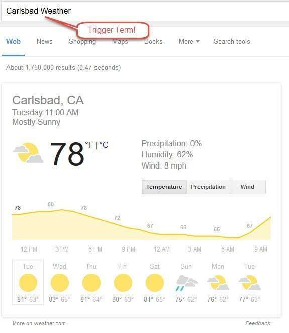

A few years ago, I wrote the following about post about [Google’s OneBox Patent Application](https://searchengineland.com/googles-onebox-patent-application-10325) I was brought back to it, with a new Google patent that looks at answering questions within similar answer boxes, and showing rich content, like in the example below:

_This weather enriched result used the word ‘weather’ as a trigger term in the query._

A patent filed by Google a couple of years ago and granted today takes another look at Oneboxes, and includes this statement early on:

> A search engine provider, Google Inc. of Mountain View, Calif., has developed an “answer box” technology, known as OneBox, that has been available for several years. Using this technology, a set of web search features are offered that provide a quick and easy way for a search engine to provide users with information that is relevant to, or that answers, their search query. For example, a search engine may respond to a search query regarding everyday essential information, reference tools, trip planning information, or other information by returning, as the first search result, information responsive to the search query, instead of providing a link and a snippet for each of many relevant web pages that may contain information.

A recent article about the Wolfram Alpha Search Engine, [Do-It-Yourself AI: How Wolfram Alpha Is Bringing Artificial Intelligence to the Masses](https://www.outerplaces.com/science/item/9977-do-it-yourself-ai-how-wolfram-alpha-is-bringing-artificial-intelligence-to-the-masses), tells us that Question Answering of that type is one of the things that sets it apart from search engines like Google, and it differs from those searches in how it approaches answering questions:

> As Wolfram stated in his panel, if you ask Wolfram Alpha for the population of New York City, it will utilize both internal algorithmic work and real-world knowledge to compute it, rather than just searching for an accredited answer somewhere on the internet.

## Just what are Trigger Terms?

To generate an answer box, Google might rely upon a certain word or phrase to initiate the showing of that answer box, something the patent refers to as trigger terms. These trigger terms may appear as text on pages that contain the content that they return.

Trigger terms may be category trigger terms associated with a type or category of answer box, such as

- “movie,”
- “weather,”
- “convert,”
- “how . . . is,”
- “stock price,”

or trigger terms may be parameter trigger terms, such as

- a particular person name (to obtain a social network status update),
- a particular movie name (to obtain show times),
- a particular location (to obtain weather or time or map information), or
- a particular business name (to obtain stock information).

## Enriched Web Resources

When Google identifies trigger terms in queries and response with an answer box result, it may provide a specialized display that is referred to in this patent as “enriched content.”

This enriched content could be an icon that triggers into action an audio or video application, a popup window that might include trigger terms as text, or show a clickable icon next to that trigger term or a “mouse-on” event on trigger terms.

These enriched results could also show an answer box gadget filled with snippets that are based upon “the parametric values of trigger terms.

This enriched results could be returned to show weather-related to a location, or time, or a map of a business at that location.

Google has been answering questions asked of it, and Google’s approach to showing answer boxes, in response to queries with trigger terms in them, and displaying enriched results, is a move towards the question answering described by Wolfram. The patent is:

[Enriching web resources](http://patft.uspto.gov/netacgi/nph-Parser?Sect1=PTO1&Sect2=HITOFF&d=PALL&p=1&u=%2Fnetahtml%2FPTO%2Fsrchnum.htm&r=1&f=G&l=50&s1=9,146,992.PN.&OS=PN/9,146,992&RS=PN/9,146,992)
Invented by: Xin Zhou
Assigned to: Google
US Patent 9,146,992
Granted September 29, 2015
Filed: January 13, 2012

Abstract

> Methods, systems, and apparatus, including computer programs encoded on computer storage media, for enriching web resources In one aspect, a method includes: sending a request for a web resource to a web server, receiving the requested document from the web server, sending an identifier of the received web resource to a search engine server, retrieving from cached storage of the search engine server one or more trigger terms associated with the web resource, extracting the parametric values of each trigger term associated with the web resource, modifying the web resource by embedding an answer box gadget for each trigger term in the web resource using the parametric values of each trigger term, and rendering the modified web resource in the requesting client device.

## Take Aways

The patent presents these answer box results as the kinds of things that a searcher may need, in many cases, to have a player for installed on their browsers as a browser plugin that could display the content to be shown in that answer box, such as an audio or video player or some other kind of content that a browser couldn’t display. Not sure why it does that; it likely wasn’t necessary in most cases when this patent was filed in 2012.

Trigger terms may also identify albums or reviews when the trigger term is a musical artist or a band, may identify reviews or showtimes when trigger terms are movies or show names, may return news articles about those trigger terms or travels conditions when a trigger is a travel-related (airport name or flight number).

We are told that when trigger terms appear within snippets in search results, they may cause search results to be presented as enriched result content within those search results.

Some of the answer box content that shows up in search results in this answer box answer may be placed in cached storage, like weather, time, stock category trigger terms, or parameter trigger terms (e.g., business, people, or place names).

When you see a direct answer result at Google, it is aiming at answering questions like a Wolfram Alpha. I’ll be discussing this topic in more depth next week in Las Vegas at Pubcon, in a presentation titled [Evolution of Search](https://www.pubcon.com/session-details?action=view&conference=pubcon60&record=938)
