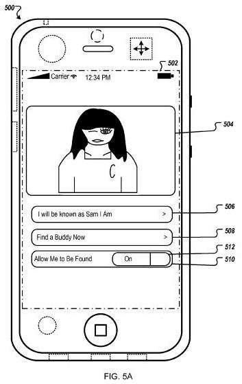
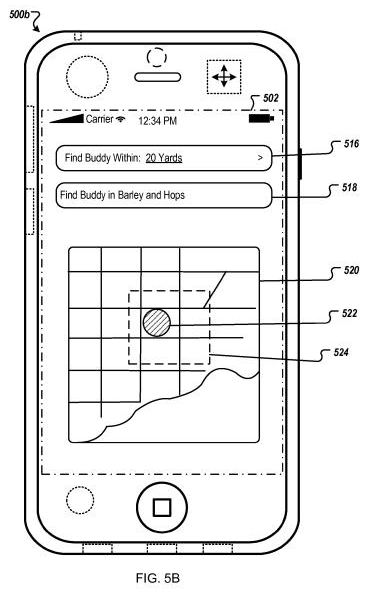
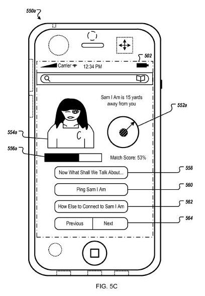
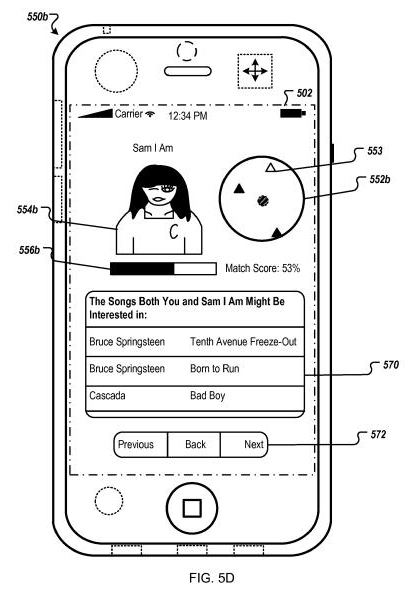

A patent application was published at the USPTO this morning that describes an interesting new application from Apple, enabling people to find others with common interests or common experiences or both, based upon location. The patent is fairly detailed, and I’ve somewhat brushed the surface with my description below. If you’re interested in location based services and social networking, it’s definitely worth a read.

It also has some of the more interesting images that I’ve seen so far in a patent filing this year (The person shown in them looks a little like a comic book villian), and they do a very good job of displaying an example of how this system could be used.

A “buddy finder” feature is depicted above, and described in the patent as an illustration of one of the possible ways this ad hoc social networking technology might be used. This feature would allow you to create a personal profile or a personal preference list to specify what kind of people you would like to meet, but those don’t need to be filled out to use the feature.

When the “buddy finder” is turned on on your phone, it enters a passive “ready” mode to enable it to received inquiries of matches from other mobile devices, participating in ad hoc networking based on content and location.

In addition, a “Find Friend Now” function of the “Buddy Finder” feature could be used to actively send out inquiries about matches to nearby phones and a server. The system can identify matches of things like “common music tastes, common activities, common experiences, or common content” between individuals. The next image shows someone setting the find friend feature for a distance of 20 yards within a particular place:

The request to find friends can them be seen by others who have the buddy finder turned on, as illustrated in the next image from the patent filing:

Some of this information might come from the profile or personal preference list I mentioned above, and some might come from usage history of the phone from its users, including information about downloaded songs, movies, and other content, such as the names of artists and performers, composers and directors. Other user data that could be used in the system might involve a contact list, including information from caller ID and numbers dialed from the phone.

When the “Find Friend Now” function is used, it might broadcast some or all of the usage data from the phone to other nearby devices, to find matches. The patent filing provides some examples of matches:

- A shared phone number in a contact list
- A particular city added to a weather forecast city list
- A certain radio station as one of the “favorite radio stations
- A common website in a browser bookmark
- The same game has been played on both phones
- Common locations that both phones have been to, such as trips to Paris and Hawaii
- Shared music tastes as evidenced by a number of songs downloaded being identical
- Pictures of the same person contained on both phones, after performing facial recognition analysis

The buddy finder would let the person searching know that there is someone with common interests or experiences nearby, and let them know what they have in common with the people located by the friend finder function, and can include geographical coordinates of the matching device or devices.

The image below shows some of the matching user data that might be shared, to let people know if they want to meet. This information can also act like, as the patent filing refers to it, an icebreaker to encourage conversation.

The patent filing does address some privacy issues, telling us that usage data can only be created by explicit consent from a phone owner, either during signup with the ad hoc network, or during other activities. The user can also choose what kind of information might be excluded, such as financial transactions, email content, browsing activity, use of specific applications, exact location data, and more. Transmission of the usage data can be encrypted as well.

The patent filing is:

[Ad Hoc Networking Based on Content and Location](http://appft.uspto.gov/netacgi/nph-Parser?Sect1=PTO2&Sect2=HITOFF&u=%2Fnetahtml%2FPTO%2Fsearch-adv.html&r=1&p=1&f=G&l=50&d=PG01&S1=20110142016.PGNR.&OS=dn/20110142016&RS=DN/20110142016)
Invented by Shuvo Chatterjee
Assigned to Apple
US Patent Application 20110142016
Published June 16, 2011
Filed: December 15, 2009

Abstract

> Methods, program products, and systems for ad hoc networking based on content and location are described. A user of a mobile device can identify another user using another mobile device who is close by, if both users have requested to participate in networking. Common interests and experiences of two or more users located close to each other can be identified from content, including automatically created usage data of the mobile devices.
>
> Usage data of a mobile device can be created based on activities performed on the mobile device (e.g., songs downloaded), a trajectory of the mobile device (e.g., places traveled), or other public data available from the mobile device (e.g., pictures shared). Each of the users can be notified that another user having the common interests and experiences is close by. A means of initiating communication can be provided to the users to facilitate communication between the users.

**Conclusion**

Google does have a somewhat similar product called [Google Latitude](https://accounts.google.com/ServiceLogin?service=friendview&passive=1209600&continue=http://www.google.com/latitude&followup=http://www.google.com/latitude), which enables you to see the location of your friends. But, unlike the Apple Buddy Finder feature above, it doesn’t work as an ad hoc social network, introducing you to new people who might share common interests and experiences.

The information that Apple collects regarding the locations of its users is under considerable scrutiny by members of Congress, who are introduced legislation yesterday to [protect consumer privacy](https://gigaom.com/2011/06/15/franken-offers-bill-to-protect-consumer-mobile-privacy/). In addition to requiring that service providers like Apple and Google make it explicitly clear that they are collecting location based data for some services, it also requires that those disclosures also make users aware that the information could potentially be shared with developers and others who might use the information for marketing and other purposes.

I probably wouldn’t use a system like this, regardless of its potential to help me find people who may share some common interests, but I could see how it might potentially interest many others.

Then again, imagine going to a club or conference or meeting or baseball game, and instead of people interacting or watching the game, everyone is staring into their phone. Will a system like this make it easier for people to interact socially, or will it have a little of the opposite effect?
