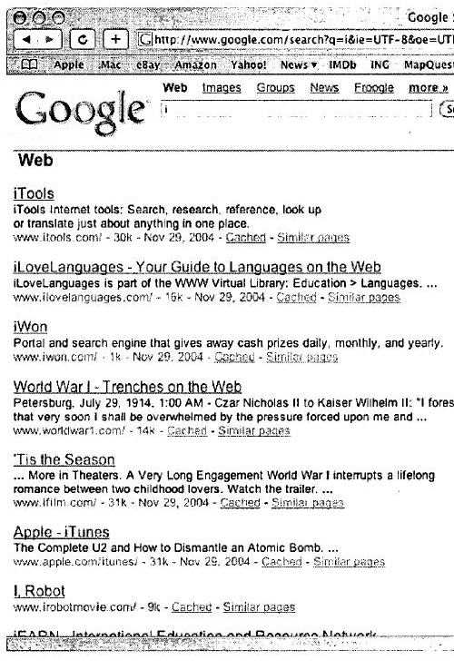
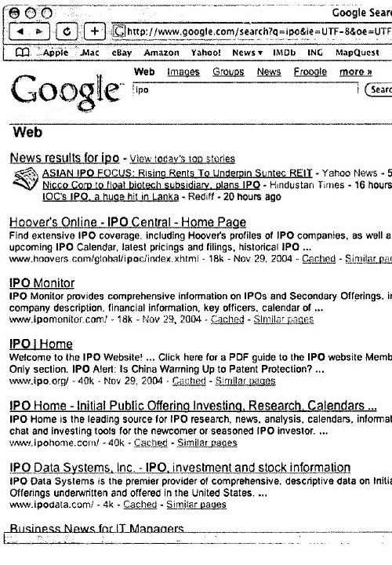
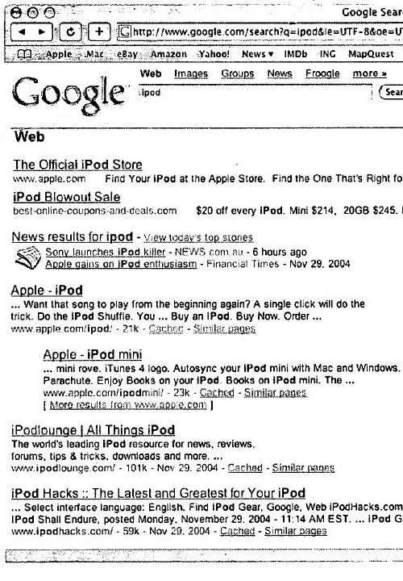
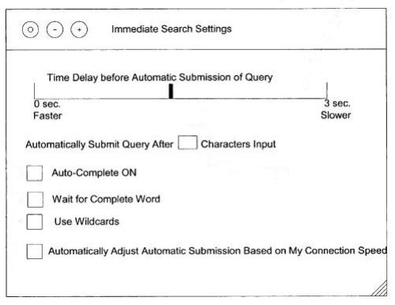

About ten days ago, Rob Ousbey posted a video on his blog showing Google streaming updates to search results as he typed letters into a search box. As he typed out his query, not only did he see a dropdown of suggested queries, but the search results themselves actually changed as he added letters.

According to the comments in his post, Live Updating Google Search Results, these kind of streaming live results have been available through Google’s Ajax Search API for a while, but Rob’s post was the first documentation of Google testing the approach live on their own site. The first mention I’ve seen of Google immediately updating search results as someone typed their query was in a Google patent filing that I wrote about back in 2005, [Can Google Read Your Mind? Processing Predictive Queries](https://www.seobythesea.com/2005/12/can-google-read-your-mind-processing-predictive-queries/).

But Google isn’t the only one to file a patent on automatically updating search results.

Apple was granted a patent this week on a very similar process:

[Immediate search feedback](http://patft.uspto.gov/netacgi/nph-Parser?Sect1=PTO2&Sect2=HITOFF&u=%2Fnetahtml%2FPTO%2Fsearch-adv.htm&r=1&p=1&f=G&l=50&d=PTXT&S1=7,788,248.PN.&OS=pn/7,788,248&RS=PN/7,788,248)
Invented by Scott James Forstall, Donald D. Melton, John William Sullivan, and Darin Benjamin Adler
Assigned to Apple Inc.
US Patent 7,788,248
Granted August 31, 2010
Filed: March 8, 2005

Abstract

> Providing immediate search feedback is disclosed. Search input is received within a search field of a web browser application. Based on characteristics of the search input, a determination is made whether to automatically submit a query to a search engine. In one aspect, the query is automatically submitted to the search engine.
>
> The query is based on the received first search input. Results are displayed within the web browser application, the results web page returned from the query submitted to the search engine.

This search-as-you-type approach may best be illustrated by screen shots from the patent, which show that the process can be turned on or off in a browser, and results can be found through a search engine such as Google.

Apple’s screen shots show search results automatically changing when letters are entered into a search box use the term “ipod” as an example, starting with the letter “i”.

One thing these screenshots don’t show are the query suggestions that Google now shows to searchers which attempt to predict query terms based upon what might have been typed so far, to suggest possible queries. Since the patent was originally filed back in 2005, around the time when Google was first experimenting with their [Google Suggest](https://support.google.com/websearch/answer/106230?hl=en) feature, that’s not a surprise. Note that the results change after a “p” is entered into the search box.

Google’s pending patent which I mentioned I wrote about in a link above focuses more upon Google showing query suggestions as someone types into a search box, but it also stresses that it may also update search results as a searcher types. It’s not quite clear from the claims and description of Google’s patent application whether it would show results based upon what might have been typed, or if those results might be based upon what is suggested in their query suggestions.

It’s interesting that Apple might build into a browser a method of updating search results as someone types. I don’t think I would take it as a sign that Apple is considering building a search engine, but the idea that they might incorporate a feature that works with a search interface in such a manner shows that they aren’t ignoring ways to improve search on the Web.

The patent also shows a possible browser control box that users can change settings on to either turn the feature on or off, and to control other ways that the feature might work.

**Conclusion**

It’s possible that what Rob Ousbey saw and saved as a video was a live experiment from Google which might determine whether or not everyone someday starts seeing immediately updating search results as they type. I checked on the status of Google’s patent application involving predictive search queries, and it looks like it might possibly be granted sometime soon.

It’s also possible that if Google doesn’t offer the feature, we might see Apple offer it to Safari users.

And Apple might offer the feature on search engines other than just Google.

Are streaming updated query results something that you might want?

Are they something that makes a search experience better?

Might they influence searchers to select search results other than the ones they originally intended to find?
