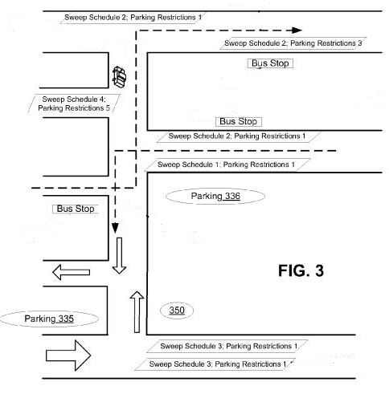

I usually help site owners with increasing traffic to their web sites and keep an eye on patent filings from companies that are involved in delivering information to people on the Web. But there seems to be another kind of traffic on the minds of companies like Apple, Yahoo, and Google.

The intersection between internet-connected phones and local search is increasing including such services as providing maps, driving directions, public transit information, and location-aware applications. Apple has a serious interest in providing applications for the iPhone that take advantage of location-aware services as well, and a new patent filing from them describes a couple of interesting new services they may offer that involve parking and public transit services.

As I noted, they aren’t alone in focusing upon providing real-time information involving maps and transportation.

Google launched a service earlier this year that allows you to find stores and restaurants and even ATMs with their [Near me now](http://googlemobile.blogspot.com/2010/01/finding-places-near-me-now-is-easier.html) feature. Back in 2006, Google published a patent filing that could help you track the locations of taxi cabs, UPS delivery trucks, and other [fleet services](https://www.seobythesea.com/2006/10/google-a-cab-intelligent-fleet-services-management/). A Google patent filing from 2007 on [image based advertising and branded barcodes](https://www.seobythesea.com/2007/07/14-ways-to-use-a-google-visual-mobile-search-system/) mentioned the possibility of taking a picture with your phone of a bus stop sign and being given real-time information about the next bus arrival.

Yahoo recently published a patent application that would add information to their Maps and driving directions service that would add real-time information about the locations and availability of parking, which I wrote about in [Forget Search, Yahoo May Start Helping You Find Parking Spaces](https://www.seobythesea.com/2010/01/forget-search-yahoo-may-start-helping-you-find-parking-spaces/).

There are apps for the iPhone such as [Aroundme](http://www.aroundmeapp.com/) that are similar to Google’s *Near me now*, and Apple has been working upon incorporating what they describe as [geographic location technology](https://www.theregister.co.uk/2009/02/05/snow_leopard_location_rumors/) into their operating systems as well.

The Apple patent application is:

[Parking & Location Management Processes & Alerts](http://appft.uspto.gov/netacgi/nph-Parser?Sect1=PTO2&Sect2=HITOFF&u=%2Fnetahtml%2FPTO%2Fsearch-adv.html&r=1&p=1&f=G&l=50&d=PG01&S1=20100017118.PGNR.&OS=dn/20100017118&RS=DN/20100017118)
Invented by Casey Maureen Dougherty
Assigned to Apple Inc.
US Patent Application 20100017118
Published January 21, 2010
Filed: July 16, 2008

Abstract

> Aspects include using present location information for a mobile device and real-time access to sources of data about future constraints about the present location to establish the occurrence of a future event.
>
> Examples include:
>
> - Using a present location of the mobile device to infer a vehicle location,
> - Accessing a source of data relating to parking regulations at the present location and setting a reminder for avoiding violation thereof.
>
> The mobile device can track a present position and adjust an absolute reminder time to account for travel times. The travel times can be arrived at by obtaining data concerning public transportation schedules and present locations of elements of such public transportation. Another example aspect includes correlating a user profile concerning parking requirements with the desired destination area and parking regulations pertinent to the area for guiding a user to potential parking locations.

In addition to providing information about parking locations and costs and real-time information about parking regulations for those locations, the service described in the patent filing also can help you time how long you’ve parked at a spot and give you an alert to keep you from getting a parking ticket.

More than that, this system can be used as part of a larger travel planning process, including helping you determine how long it might take you to walk from your parking location or to take public transportation from that location.

This system could include tracking and locating “buses, light rails, and trolleys, cable cars, or any other type of conveyance available for public use.” If taxi companies wanted to include present positions for unoccupied cabs on duty, those could be included as well. Why track and include transit locations? Here’s what the patent filing tells us:

> Likewise, for planning purposes a transit schedule can be useful, but more pragmatically, more current information is often required to allow comfortable transitions between different modes of transportation. For example, if a person has to wait 15 minutes for a late bus for a 45-minute trip, then waiting consumed 1/3 of the entire trip time.
>
> Also, such transit vehicles increasingly have GPS position equipment to sense their positions, which can be sent to a database for tracking, provided that the transit vehicles also have network transmission capabilities, such as a provisioned wireless network, which can include a wireless local area network, or another suitable technology.

A few days ago, Businessweek ran an interesting article, [Apple vs. Google](https://www.bloomberg.com/news/articles/2010-01-14/apple-vs-dot-google), with the subtitle “How the battle between Silicon Valley’s superstars will shape the future of mobile computing.”

When it comes to providing location awareness type information to people using mobile devices, it may shape up to be a hard-hitting battle, with even Yahoo getting into the fray if they add features to their Yahoo Maps service, like the real-time parking process described in their recent patent filing.
