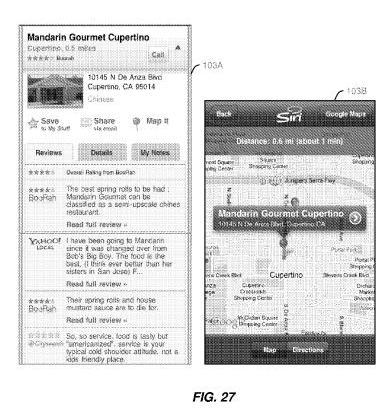
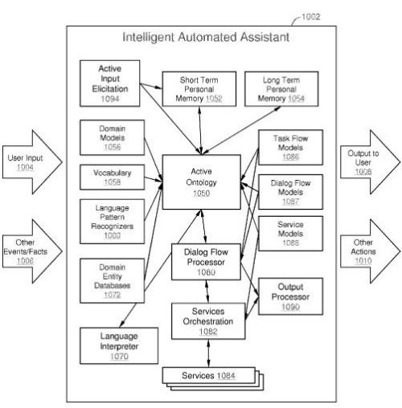

A patent application was published today which describes the kind of intelligent automated assistant that we see in use on Apple’s iPhone 4S, known as Siri. But the Siri patent isn’t necessarily limited to the iPhone application itself, and the describes how such a system could be used in a number of ways, including with mobile phones, PDAs, tablets, game consoles, embedded computer systems in cars, and possibly others. This assistant might provide information and services on a single client device or multiple devices, and possibly in combination with applications and information on servers as well.

It could also act as an active participant in messaging platforms such as email, instant messaging, discussion forums, group chat sessions, and customer support sessions.

The intelligent assistant in the Siri Patent could go on the internet to discover, find, choose among, purchase, reserve, or order products and services, using multiple sources of data if needed to check reviews, find prices from different places and their locations and operating hours, locate information about events, performances and attractions, places to go, places to stay, places to eat and drink, and times to meet others.

It could also combine natural language dialog with a graphical user interface that can:

- Search, including location-based search
- Navigate, providing maps and directions
- Lookup information on databases (such as finding businesses or people by name or other properties)
- Provide weather conditions and forecasts
- Check prices of market items or status of financial transactions
- Monitor traffic or the status of flights
- Access and update calendars and schedules
- Manage reminders, alerts, tasks and projects
- Communicate over email or other messaging platforms
- Operate devices locally or remotely (e.g., dialing telephones, controlling light and temperature and home security devices, playing music or video)
- Initiate, operate, and control many functions and apps available on the device
- Offer personal recommendations for activities, products, services, source of entertainment, time management, etc.

What does this intelligent assistant mean to search? The Siri patent filing tells us:

> Unlike search engines which only return links and content, some embodiments of automated assistants described herein may automate research and problem-solving activities.

We’re also told that the personal information that the assistant learns about while interacting with its user enables it to provide better-personalized search results than we might get from search engines, and also improve how someone interacts with the Web by automating things such as filling out forms or signing up for services.

In addition to speech recognition and input, the intelligent assistant in the Siri Patent also will offer graphical options to do things like calling a business, saving information about the business to remember for later, share the location with someone else by email, show the location on a map, save personal notes about the business.

The Siri patent also describes how “Active Ontologies” serve as the underlying infrastructure behind how the intelligent assistant builds models about data and knowledge. For example, a “dining out domain model” might be linked to a “restaurant concept” as well as a “meal event concept.”

The Siri patent application is very long and provides a wide range of examples and information about how the assistant works, interacts with others, understands paraphrases, interprets language and vocabulary, and recognizes language patterns, and other features as well.

[Intelligent Automated Assistant](http://appft.uspto.gov/netacgi/nph-Parser?Sect1=PTO2&Sect2=HITOFF&u=%2Fnetahtml%2FPTO%2Fsearch-adv.html&r=1&p=1&f=G&l=50&d=PG01&S1=20120016678.PGNR.&OS=dn/20120016678&RS=DN/20120016678)
Invented by Thomas Robert Gruber, Adam John Cheyer, Dag Kittlaus, Didier Rene Guzzoni, Christopher Dean Brigham, Richard Donald Giuli, Marcello Bastea-Forte, Harry Joseph Saddler
Assigned to Apple Inc.
US Patent Application 20120016678
Published January 19, 2012
Filed: January 10, 2011

Abstract

> An intelligent automated assistant system engages with the user in an integrated, conversational manner using natural language dialog, and invokes external services when appropriate to obtain information or perform various actions. The system can be implemented using any of a number of different platforms, such as the web, email, smartphone, and the like, or any combination thereof. In one embodiment, the system is based on sets of interrelated domains and tasks and employs additional functionally powered by external services with which the system can interact.

**Siri Patent Conclusion**

Will Apple’s intelligent assistant Siri improve search by automating search activities and problem-solving as the Siri patent notes?

Will Siri learn from both interactions with its user and information that it saves in both its short term and long term memories (yes, according to the Siri patent filing it has both) to offer an improved personalized search?

Those are interesting questions, and Apple doesn’t seem to have the search infrastructure in place to improve upon search services on its own. But that doesn’t mean that they aren’t working on their own versions of things like how to [rank local search results](https://www.seobythesea.com/2011/09/crowdsourcing-new-apple-local-search-patent/).
