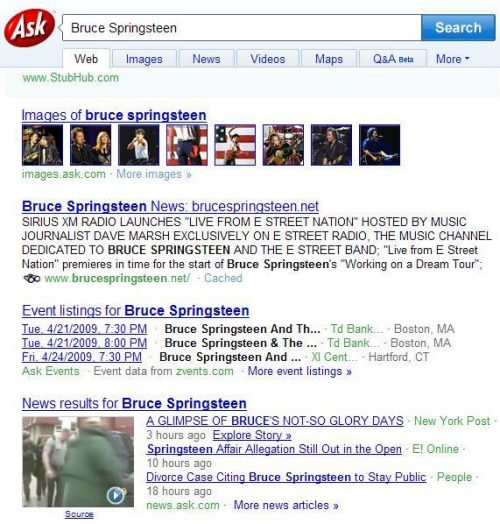

The search engine at Ask.com has been around for a long time in internet years, more than a decade according to its [initial public offering](https://www.sec.gov/Archives/edgar/data/1054298/0000950149-99-001225.txt) of stock.

That SEC filing describes the unique approach that the search engine, then known as Ask Jeeves, Inc., took to its search results as “a provider of natural-language question answering services on the Internet for consumers and companies, establishing a new way to interact with the World Wide Web.”

They also told us in that document that:

> Our mission is to humanize the Internet by making it easier and more intuitive for consumers to find the information, products, and services they need and for companies to acquire better, retain, and maximize the value of their online customers. Our branding strategy centers on the Jeeves character, a friendly and trusted assistant who provides help and guidance on the Web. The Ask Jeeves question answering services allow users to ask a question in plain English and receive a response pointing the user to relevant Internet destinations that provide the answers. We believe that our question answering services make interaction with the Internet more intuitive, less frustrating, and significantly more productive.

In 2006, the search engine [retired Jeeves](http://web.archive.org/web/20110429193247/http://blog.ask.com/2006/02/thanks_jeeves.html), with a stated focus of making search more usable and more innovative. I was personally sad to see Jeeve’s leave the search engine, and I suspect that the rebranding of Ask.com was a difficult choice to make.

Since then, Ask.com has been working hard at making itself a more useful resource for timely news information and has started incorporating multimedia into that mix. The questions and answers that were so well known as an askjeeves.com feature are still there, but the search engine hasn’t stood still.

For example, a search for [Bruce Springsteen](https://www.ask.com/web?qsrc=2417&o=312&l=dir&q=Bruce+Springsteen) is presently showing a rich mix of images, scheduled events, web pages, and news results for the performer. If you hover your mouse over the image next to the news results for Bruce Springsteen at Ask.com, the news video starts playing.

I’ve written in the past about some of the search results features that Ask.com is working upon in a post titled [Ask.com on Trends, Freshness, Personalization, and Better Search Results](https://www.seobythesea.com/2007/06/askcom-on-trends-freshness-personalization-and-better-search-results/)

The additions to Ask.com’s search results since Jeeve’s departure have evolved with many methods and techniques described in patent filings over the past couple of years from the search engine. If you want to delve deeper into some of the ideas behind them, the following patent applications are good places to begin:

[Systems and methods for visually selecting information](http://appft1.uspto.gov/netacgi/nph-Parser?Sect1=PTO2&Sect2=HITOFF&u=%2Fnetahtml%2FPTO%2Fsearch-adv.html&r=1&p=1&f=G&l=50&d=PG01&S1=20090100357.PGNR.&OS=dn/20090100357&RS=DN/20090100357) (20090100357) Published April 16, 2009

> Systems and methods for presenting information are disclosed. Users are presented with a selectable representation of the information on a webpage. Users can access additional information and/or another web page by mousing over the selectable representation. The mouse over includes pointing the mouse pointer over the selectable representation for a predetermined amount of time.

[Systems and methods for clustering information](http://appft1.uspto.gov/netacgi/nph-Parser?Sect1=PTO2&Sect2=HITOFF&u=%2Fnetahtml%2FPTO%2Fsearch-adv.html&r=1&p=1&f=G&l=50&d=PG01&S1=20090070346.PGNR.&OS=dn/20090070346&RS=DN/20090070346) (20090070346) Published March 12, 2009

> Systems and methods for clustering news information are disclosed. The news information is clustered to form clusters to include articles, blogs, images, videos, and the like. The news information is organized according to the topic and/or temporal information. The clustered news information can be presented to a user who can browse or search the clustered news information.

[Systems and methods for personalizing a newspaper](http://appft1.uspto.gov/netacgi/nph-Parser?Sect1=PTO2&Sect2=HITOFF&u=%2Fnetahtml%2FPTO%2Fsearch-adv.html&r=1&p=1&f=G&l=50&d=PG01&S1=20080262998.PGNR.&OS=dn/20080262998&RS=DN/20080262998) (20080262998) Published October 23, 2008

> Systems and methods for presenting news information and personalizing the presentation of news information are disclosed. Users are presented with a selectable, visual representation of the news information. Users can access additional news information and/or a personalized newspaper by selecting a visual representation of the news. Systems and methods for monitoring user selection and modifying the personalized newspaper are also disclosed.

[Systems and methods for selecting and organizing information using temporal clustering](http://appft1.uspto.gov/netacgi/nph-Parser?Sect1=PTO2&Sect2=HITOFF&u=%2Fnetahtml%2FPTO%2Fsearch-adv.html&r=1&p=1&f=G&l=50&d=PG01&S1=20070260586.PGNR.&OS=dn/20070260586&RS=DN/20070260586) (20070260586) Published November 8, 2007

> Systems and methods for organizing related news information is disclosed herein. The systems and methods include clustering a stream of news information according to the topic of each news information and according to temporal information of the news information. Systems and methods for presenting information to users are also disclosed herein. The systems and methods include receiving a search for news information from a user and presenting the news information according to the news information and the temporal information.

[System and method for monitoring evolution over time of temporal content](http://appft1.uspto.gov/netacgi/nph-Parser?Sect1=PTO2&Sect2=HITOFF&u=%2Fnetahtml%2FPTO%2Fsearch-adv.html&r=1&f=G&l=50&d=PG01&p=1&S1=20070143300.PGNR.&OS=dn/20070143300&RS=DN/20070143300) (20070143300) Published June 21, 2007

> A method and a system to receive temporal content from many sources over a transmission line, store the temporal content in at least one storage device, extract entity content from the temporal content, analyze entity occurrences to determine temporal content trends, receive a search query from a user, and render personalized temporal content to the user based on the temporal content trends.

[Method and system to present a preview of video content](http://appft1.uspto.gov/netacgi/nph-Parser?Sect1=PTO2&Sect2=HITOFF&u=%2Fnetahtml%2FPTO%2Fsearch-adv.html&r=1&f=G&l=50&d=PG01&p=1&S1=20070130602.PGNR.&OS=dn/20070130602&RS=DN/20070130602) (20070130602) Published June 7, 2007

> A method and system to preview video content. The system includes a loader to present one or more objects associated with video content, responsive to a search request, a trigger to detect a pointer positioned over a first object from one or more objects, and a mode selector to provide the first object in a preview mode.

[Method and system to provide targeted advertising with search results](http://appft1.uspto.gov/netacgi/nph-Parser?Sect1=PTO2&Sect2=HITOFF&u=%2Fnetahtml%2FPTO%2Fsearch-adv.html&r=1&f=G&l=50&d=PG01&p=1&S1=20070130203.PGNR.&OS=dn/20070130203&RS=DN/20070130203) (20070130203) Published June 7, 2007

> A method and system to provide targeted advertisements with video search results are provided. The system comprises a query component to detect a request for a search and an advertisement selector to present one or more video advertisements to a user according to characteristics associated with the search.

[Method and system to present video content](http://appft1.uspto.gov/netacgi/nph-Parser?Sect1=PTO2&Sect2=HITOFF&u=%2Fnetahtml%2FPTO%2Fsearch-adv.html&r=1&f=G&l=50&d=PG01&p=1&S1=20070130159.PGNR.&OS=dn/20070130159&RS=DN/20070130159) (20070130159) Published June 7, 2007

> A method and system to preview video content. The system comprises an access component to receive a search request and a loader to simultaneously stream a plurality of videos associated with the search request. The system may further comprise a trigger to detect a pointer positioned over a first video and a mode selector to provide the first video preview mode.

[Similarity detection and clustering of images](http://appft1.uspto.gov/netacgi/nph-Parser?Sect1=PTO2&Sect2=HITOFF&u=%2Fnetahtml%2FPTO%2Fsearch-adv.html&r=1&f=G&l=50&d=PG01&p=1&S1=20070078846.PGNR.&OS=dn/20070078846&RS=DN/20070078846) (20070078846) Published April 5, 2007

> A method for determining if a set of images in a large collection of images are near duplicates is described. The method includes processing the set of images, generating an image signature for each image in the set of images, and comparing the generated image signatures. The method can be used in the clustering and ranking of images.
