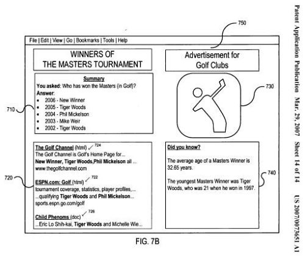
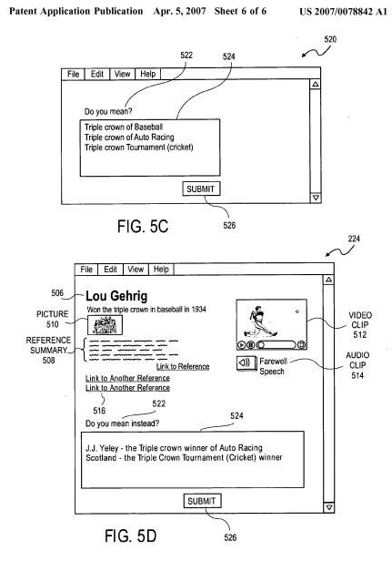

Barry Schwartz posted today at Search Engine Roundtable that he discussed a new social search ranking algorithm, code-named Edison, with Apostolos Gerasoulis, Co-founder of Teoma Technologies, which is owned by the company that runs ask.com.

The algorithm was disclosed at a Search Engine Strategies Conference on Social Search earlier today. Barry has more details in his post – [Ask.com To Launch New Search Algorithm Code Named Edison](https://www.seroundtable.com/archives/013086.html).

The choice of name in interesting. Ask.com has had three different patent applications published in the last three weeks. Barry also covered this news at Search Engine Land in – [Goodbye Teoma Algorithm, Hello Edison, Says Ask.com](https://searchengineland.com/goodbye-teoma-algorithm-hello-edison-says-askcom-10962) – which includes an interesting update from Rahul Lahiri, Vice President of Product Management and Search Technology at Ask.com. He references modernized versions of Teoma and DirectHit technologies that they have been using plus additional technology that adds social search influences to search results.

I’ve written about one of these patent applications a couple of weeks ago in [Ask.com Patent Application Discusses Responding to User Queries](https://www.seobythesea.com/2007/04/system-and-method-for-responding-to-a-user-query/). Barry started a post at Cre8asite Forums on Edison, Ask.com’s New Algorithm, and I’ve written more about a newer ask.com patent application there – [System and method for responding to a user reference query](http://appft1.uspto.gov/netacgi/nph-Parser?Sect1=PTO2&Sect2=HITOFF&u=%2Fnetahtml%2FPTO%2Fsearch-adv.html&r=1&p=1&f=G&l=50&d=PG01&S1=20070078842.PGNR.&OS=dn/20070078842&RS=DN/20070078842).

I’ve been referring to this latest patent application as “Edison” because two of the listed inventors are from Edison, New Jersey. The earlier patent application only lists one inventor, who is from Princeton, New Jersey. Chances are that if these patent applications are part of this new algorithm, they could play a role in what we see at ask.com when we perform a search.

Here are a couple of screenshots from the images in the patent applications. The first is from the older patent application that I wrote about a few weeks ago (which I’ve labeled “Princeton”). The second is from the “Edison” patent application being discussed at Cre8asite Forums.

Princeton?

Edison?

There are a lot of similar ideas in the two patent applications, and the user interfaces presented above aren’t all that different.

There may be additional patent applications from ask.com that haven’t been published yet, which may describe completely different approaches than what is covered in these.

I mentioned a third ask.com patent application. Its focus is upon detection duplications in images, and it is pretty interesting – [Similarity detection and clustering of images](http://appft1.uspto.gov/netacgi/nph-Parser?Sect1=PTO2&Sect2=HITOFF&u=%2Fnetahtml%2FPTO%2Fsearch-adv.html&r=1&p=1&f=G&l=50&d=PG01&S1=20070078846.PGNR.&OS=dn/20070078846&RS=DN/20070078846)
