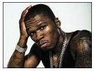

Does a search engine work better if it can figure out whether or not a search query is a name?

The folks at Ask.com appear to think so, and even want to know if the name is that of someone famous. I’m not sure how they measure fame, but they have a method for flagging names of the famous, as well as names that look like names, and names that aren’t names (Brandy Alexander, anyone?)

The process is described in a patent application from Ask, and details how they might go about figuring out whether “[Usher](https://www.ask.com/web?q=usher&qsrc=1)” or “[50 Cent](https://www.ask.com/web?qsrc=167&o=0&l=dir&q=50+Cent)” or “[Attila the Hun](https://www.ask.com/web?q=atilla+the+hun&qsrc=19&o=0&l=dir)” refer to people, or to something else completely.

[Systems and methods for predicting if a query is a name](http://appft1.uspto.gov/netacgi/nph-Parser?Sect1=PTO2&Sect2=HITOFF&u=%2Fnetahtml%2FPTO%2Fsearch-adv.html&r=1&p=1&f=G&l=50&d=PG01&S1=20070239735.PGNR.&OS=dn/20070239735&RS=DN/20070239735)
Invented by Eric J. Glover, Apostolos Gerasoulis and Vadim Bich
US Patent Application 20070239735
Published October 11, 2007
Filed: April 5, 2006

Abstract

> A system and method for predicting if a query is a name are provided. The method begins by providing an input query. A name database, having a list of names, famous names, and queries that are known to not be a name is searched to determine if the input query is a name, a famous name or not a name.
>
> If the query is not located in the name database, the query is processed through a “looks like a name” function to determine if the query is a name. Systems and methods for classifying word strings as names, not names, and famous names are also provided. Systems and methods for creating name databases are also provided.

The patent application goes into a lot of detail on how famous names and nonfamous names, as well as phrases that might appear to be names but aren’t, are flagged by the system.

It can do this by looking at a database of names, or seeing if the words in the phrase appear to be names independently (Brandy Alexander, for instance), or by looking at search results for the phrase to see if results including words like “Biography” or “fan club” or other terms show up, indicating that the term is a name. For example, a search for “Brandy Alexander” might turn up drink recipe sites instead of biography pages.

The patent application doesn’t go into detail on what it might do with famous names when they are searched for, but you can see by looking at results for [Robert Johnson](https://www.ask.com/web?qsrc=167&o=0&l=dir&q=robert+johnson) or [Tupac](https://www.ask.com/web?qsrc=167&o=0&l=dir&q=tupac) that they intend to show a pretty rich set of search results for queries involving famous people.

I feel a little sorry for famous Musicologist [Alfred Einstein](https://www.ask.com/web?qsrc=167&o=0&l=dir&q=alfred+einstein&search=), who finds himself showing in Ask.com search results with pictures of the more famous [Albert Einstein](https://www.ask.com/web?qsrc=167&o=0&l=dir&q=albert+einstein).
