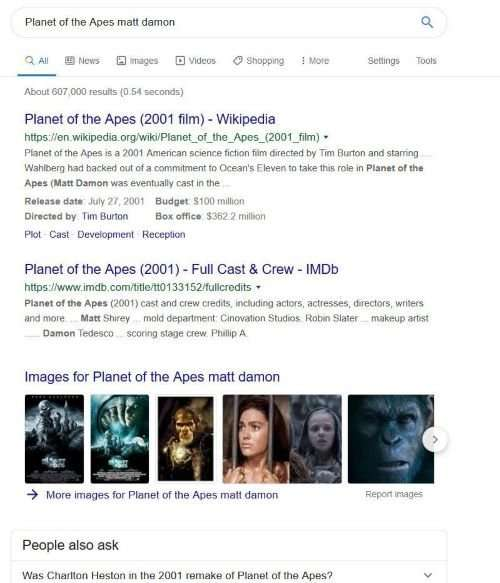
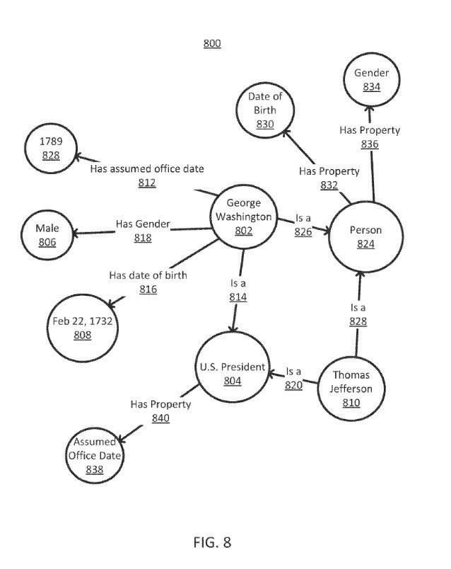
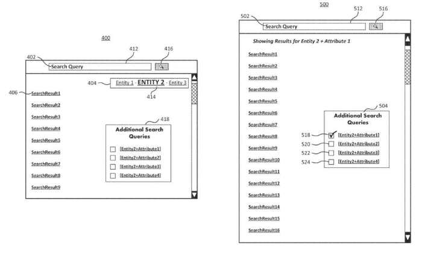
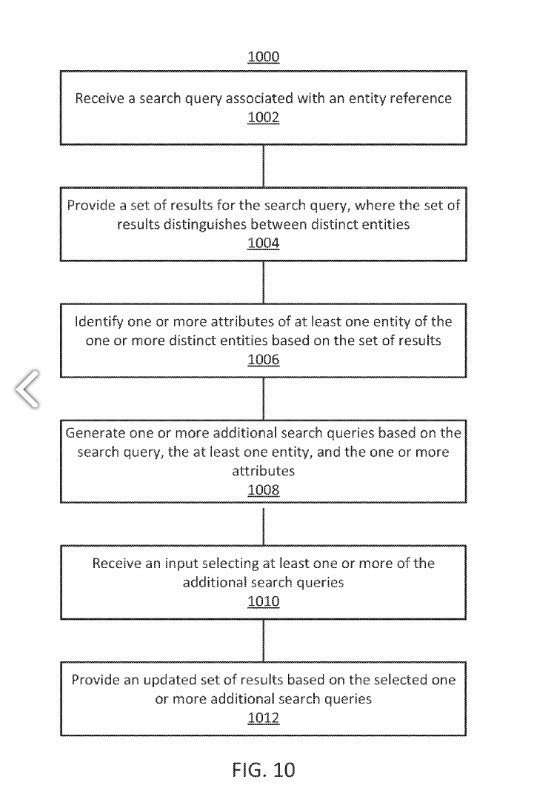

## Augmented Search Queries?

Last year, I wrote a post called [Quality Scores for Queries: Structured Data, Synthetic Queries, and Augmentation Queries](https://www.seobythesea.com/2018/07/quality-scores-for-queries/). It told us Google might look at query logs and structured data (table data and schema data) related to a site to create augmentation queries and test information about searches for those queries by comparing them to original queries for pages from that site. If search results from the augmentation queries do well in evaluations compared to search results from original query results. Searchers may see search results combine results from the original queries and the augmentation queries.

Around the time that the patent was assigned to Google, another patent that talks about augmented search queries was also granted to Google and is worth talking about simultaneously as the patent I wrote about last year. It takes the concept of adding results from augmented search queries together with original search results. Still, it has a different way of coming up with augmented search queries, This newer patent that I am writing about starts by telling us what the patent is about:

> This disclosure generally relates to providing search results in response to a search query containing an entity reference. Search engines receive search queries containing a reference to a person, such as a person’s name. Results to these queries are oftentimes not sufficiently organized, not comprehensive enough, or otherwise not presented in a useful way.

Augmentation from the first patent means providing more information in search results based upon query information from a site’s query logs or structured data from a site. Under this new patent, augmentation comes from recognizing that an entity exists in a query and providing some information in search results based upon that entity.

This patent is interesting because it takes an older type of search – where a query returns pages in response to the keywords typed into a search box, with a newer type of search, where an entity is in a query. Then, knowledge information about that entity can create possible augmentation queries combined with the original query results.

The process behind this patent works in this way:

> In some implementations, a system receives a search query containing an entity reference, such as a person’s name, corresponding to one or more distinct entities. The system provides a set of results, where each result relies on at least one of the distinct entities. The system uses the set of results to identify attributes of the entity and uses the identified attributes to generate additional, augmented search queries associated with the entity. The system updates the set of results based on one or more of these augmented search queries.

A summary of that process is:

1. Receiving a search query associated with an entity reference, wherein the entity reference corresponds to one or more distinct entities.
2. Providing results for the search query where the set of results distinguishes between distinct entities.
3. Identifying one or more attributes of at least one entity of the one or more distinct entities based at least in part on the set of results.
4. Generating search queries based on the search query, at least one entity, and one or more attributes.
5. Receiving an input selecting at least one or more search queries and providing an updated set of results based on the selected one or more search queries, where the updated set of results comprises at least one result, not in the set of results.

The step of generating one or more search queries means ranking the identified one or more attributes and generating one or more search queries based on the search query, the at least one entity, the one or more attributes, and the ranking.

That ranking can be on the frequency of occurrence.
The ranking can also be on the location of each of the one or more attributes about at least one entity in the set of results.

This process can identify two different entities in a query. For instance, there were two versions of the Movie, the Planet of the Apes. One was from 1968, and the other was from 2001. They had different actors in them, and the second was a reboot of the first.

When results for instances when more than one entity is involved, the search queries provided may distinguish between the distinct entities. They may identify one or more attributes of at least one entity of the one or more distinct entities based at least in part on the set of results. Augmented search queries may be generated for “one or more search queries based on the search query, the at least one entity, and the one or more attributes.”

This patent is at:

[Providing search results using augmented search queries](https://patentscope.wipo.int/search/en/detail.jsf?docId=US107424060)
Inventors: Emily Moxley and Sean Liu
Assignee: Google LLC
US Patent: 10,055,462
Granted: August 21, 2018
Filed: March 15, 2013

Abstract

> Methods and systems can update a set of results. In some implementations, a search query can be associated with an entity reference. The entity reference corresponds to one or more distinct entities. A set of results for the search query is provided, and the set of results distinguishes between distinct entities. One or more attributes for at least one entity of the one or more distinct entities are identified based at least in part on the set of results. More search queries are based on the search query, at least one entity, and one or more attributes. An input selecting at least one of the extra search queries is received. An updated set of results is based on the selected more search queries. The updated set of results comprises at least one result, not in the set of results.

## Some More Information About Augmented Search Queries

A couple of quick definitions from the patent:

***Entity Reference*** – refers to an identifier that corresponds to one or more distinct entities.

***Entity*** – refers to a thing or concept that is singular, unique, well defined, and distinguishable.

This patent is all about augmenting a set of query results by providing more information about entities that may appear in a query:

> An entity reference may correspond to more than one distinct entity. An entity reference may be a person’s name, and corresponding entities may include distinct people who share the referenced name.

This process is broader than queries involving people. We have a list in the patent that it includes, and it covers, “a person, place, item, idea, topic, abstract concept, concrete element, another suitable thing, or any combination thereof.”

And when an entity reference appears in a query, it may cover many entities, for example, a query that refers to John Adams could be referring to:

- John Adams the Second President
- John Quincy Adams the Sixth President
- John Adams the artist

Besides having an entity in an entity reference in a query, we may see a mention of an attribute for that entity, which is “any feature or characteristic associated with an entity that the system may identify based on the set of results.” For the John Adams entity reference, we may also see attributes included in search results, such as [second president], [Abigail Adams], and [Alien and Sedition Acts].

It sounds like an entity selection box could allow a searcher to identify which entity they might like to see results about, so when there is an entity in a query such as John Adams, and there are at least three different John Adams in augmented search results, there may be clickable hyperlinks for entities for a searcher to select or deselect to choose which entity they might want to see more about.

## Augmented Search Queries with Entities Process Takeaways

When an original query includes an entity reference in it, Google may allow searchers to identify which entity they are interested in. This brings the knowledge graph to search, using it to augment queries in such a manner. A flowchart from the patent illustrates this process in a way that was worth including in this post:

The patent provides a detailed example of how a search that includes entity information about a royal wedding in England using this augmented search query approach. That may not be a query that I might perform, but I could imagine some that I would like to try out. For example, I could envision some queries involving sports and movies, and business. Unfortunately, if you own a business, and it is not in Google’s knowledge graph, you may miss out on interest results from augmented search queries.
