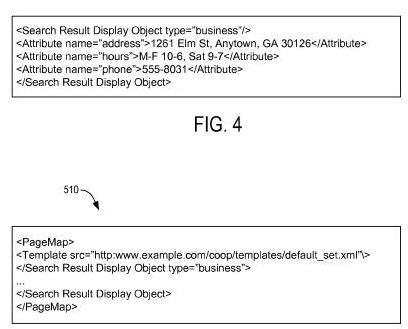
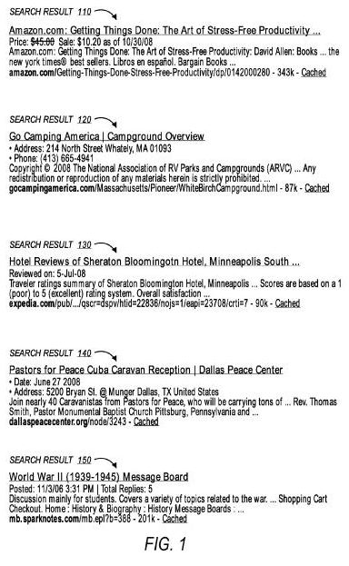

Google, Yahoo, and Bing have joined forces to enable web publishers to include additional HTML that adds more structure to their pages and possibly makes those pages easier to index and may provide them with a little more control over what may show up in search results for pages. However, there’s some controversy over the approach, some questions about the impact of related patents that all three search engines have been granted, and web publishers should be paying attention to the possible impacts of this initiative from the search giants.

**Google’s Author Markup**

Yesterday, Google announced that they were introducing a way to add HTML code to a page to indicate who the page’s author might be. This code would appear as part of a link pointing to an author’s page on the same site so that a search engine might associate the content of that page with the author who wrote it. The announcement was made in the Google Inside Search blog, in the post [Authorship markup and web search](https://search.googleblog.com/2011/06/authorship-markup-and-web-search.html), which told us how Google would use rel=” author” and rel=”me” to learn about who may have authored what on the Web.

In some ways, this announcement reminded me of a possible approach to understanding who wrote what in Google patent filing I wrote a few years back at Search Engine Land on [Agent Rank](https://searchengineland.com/googles-agent-rank-patent-application-10487) (< a href=”http://searchengineland.com/googles-agent-rank-patent-application-10487″ **rel=”me”**> Agent Rank</a>), which combines digital signatures for authors with metadata that would allow them to indicate that they were the authors of specific content on a page, whether the main content area blog post or article, or a blog comment, or even an advertisement.

To indicate that someone is the author of an article on a page, they would use a rel=”author” in a link to an author’s page on the same site. This is presently part of HTML5, and there’s a little more about how it can be implemented on the [Web Hypertext Application Technology](https://whatwg.org/) group’s pages. The group’s spokesperson is [Ian Hickson](http://ian.hixie.ch/), who works at Google on Web Standards development.

Here’s one example of how you might use rel=”author” to indicate who the author of an article might be. At the bottom of an article on “example.com”, you might include a link like this:

> Written by <a href=”http://www.example.com/profiles/author-name” rel=”author”>Author Name</a>

It’s also possible to provide information through HTML markup to Google across sites about the author of a page, or that an author’s profile page on one site is associated with another site, through the [XFN rel=”me”](http://gmpg.org/xfn/and/) attribute and value. For instance, I wrote several posts in the past at Search Engine land, and I might link to a page on that site that collects links to all of those posts in one place using a rel=”me” attribute and value, like this:

> My posts at <a href=”http://searchengineland.com/author/bill-slawski” rel=”me”>Search Engine Land</a>

I might also point from that Search Engine Land profile page to my site using a link like this:

> Read more about <a href=”https://www.seobythesea.com/” rel=”me”>Bill Slawski on SEO by the Sea</a>

One of the things that I liked about the Agent Rank approach that I referred to above was that it associated the ownership and authorship of content with digital signatures to make it more likely that a person claiming ownership of specific content was the owner of that content. This digital signature could also be used in places like blog comments so that a search engine could understand the owner of a comment on someone else’s blog to be the author of that content. The Agent Rank approach also provided a way to indicate using metadata that content syndicated elsewhere was done so with the knowledge and permission of the original author.

Google provides more information and examples on their [Authorship support page](https://productforums.google.com/forum/#!forum/webmasters).

**Microdata and Schema.org**

It’s big news when the major search engines join together to provide site owners with ways to make it easier for the content on their sites to be indexed easier. We saw that happen in 2005 with [rel=”nofollow](https://googleblog.blogspot.com/2005/01/preventing-comment-spam.html), and in 2006 with a joint initiative on XML Sitemaps in [Sitemaps.org](https://www.sitemaps.org/index.html).

In the Google blog post on authorship markup, by Google Software Engineer Other Hansson (keep that name in mind for the section on patents below), we are pointed to a Google Blog post from June 2, 2011, about another joint initiative from Google, Yahoo! and Microsoft on other markups that can be included on Web pages to help the search engines understand the content on your web pages better. This markup uses [Microdata](http://www.w3.org/TR/microdata/) to help search engines learn more about the content of your pages, including templates that can be used for different types of information. That can be found on the site, [Schema.org](https://schema.org/)

Google’s announcement about the initiative is at: [Introducing schema.org: Search engines come together for a richer web](https://webmasters.googleblog.com/2011/06/introducing-schemaorg-search-engines.html). Yahoo introduces the topic on the Yahoo Developer Network at Introducing schema.org: A Collaboration on Structured Data. Bing’s writeup can be found at Introducing Schema.org: Bing, Google, and Yahoo Unite to Build the Web of Objects.

Several different standards in development enable web publishers to include metadata about their page content other than Microdata, including the [Resource Description Framework (RDF)](https://www.w3.org/RDF/), and microformats, each of which has their own strengths. It’s not completely clear why schema.org chose to focus upon the use of microdata rather than the others. However, the FAQ page for schema.org explains why they decided to start with Microformats in answering the question, “[Q: Why microdata? Why not RDFa or microformats](https://schema.org/docs/faq.html)“?

I’ve seen more than a couple of blog posts about the choice to focus upon Microformats rather than the other developing standards. A number of those provide some interesting criticisms of choice. The Schema.org answer includes this point:

> Microdata is the most recent well-known standard, created along with HTML5. It strikes a balance between extensibility and simplicity and is most suitable for building the schema.org.

We’re also told that Google and Yahoo! will continue the support that they’ve had in the past for microformats and RDFa for certain applications and that the search engines will be keeping an eye on the usage of the other standards and may look into supporting them as well if they become more popular.

I have a few questions when it comes to Schema.org:

- Will the adoption of the Microdata format by the major search engines harm the development of the competing formats, and is the Web a little less rich because of it?
- Will a resource like schema.org make it easier for site owners to adopt and use a standard that they might not have otherwise used?
- Will search become better because site owners make it easier for search engines to index content?
- Will this metadata approach benefits people who are more technically proficient and might not have any trouble implementing it, at the cost of indexing content that might be more relevant and meaningful but which doesn’t use microdata?

I’m not sure of the answers to these questions, but I have seen several opinions expressed about them on the Web.

**Patents, Oh My!**

On the [Terms of Service](https://schema.org/docs/terms.html) page at Schema.org, there’s a statement about patents that Google, Yahoo, and Microsoft might have regarding “markup of structured data.” Not quite sure what this means to people who might want to use the templates and formats at schema.org or build applications or tools to make it easier for others to do so. Here’s the statement from the page:

> Also, if the Sponsors have patent claims that are necessarily infringed by including markup of structured data in a webpage, where the markup is based on and strictly complies with the Schema, they grant an option to receive a license under reasonable and non-discriminatory terms without royalty, solely to include markup of structured data in a webpage, where the markup is based on and strictly complies with the Schema.

Does that make it sound like there might be a problem if someone comes out with a tool to make it easier for people to use the “schemas” at schema.org? Honestly, I’m not sure.

Do Google, Yahoo!, or Microsoft have any relevant patents? A quick search through the USPTO database tells us that they each have at least one, if not more. Unfortunately, I didn’t do a comprehensive search, and each of the search engines may have pending patent applications that aren’t published yet.

**Google**

Google’s patent, co-authored by Othar Hansson, provides a pretty detailed description of how markup language can be used to display search results, using templates to structure content found on the pages of a site. In addition, it provides some examples of how templates can be used, including the possibility that more than one template type (local vs. review) might be used on a single page:

> The same web page content (e.g., the same search result display objects) can be rendered differently as search results based on the template used to render the search results. For instance, a local business listings site might use a template specifically for restaurants, which could include a “summary” field from the restaurant itself (“best sushi in Long Beach”). In contrast, a restaurant review site might use the template specific for restaurant reviews, including a “summary” field providing content from a reviewer.
>
> Thus, although much of the content on the web pages is the same (e.g., address, telephone number, hours, etc., of the restaurant), the templates used to render the search results cause the results to appear different to the user that submitted the search query.

Here’s a screenshot from the Google patent that shows a specific template in use, along with a link to a specific template type:

That patent is:

[Providing Search Results](http://appft.uspto.gov/netacgi/nph-Parser?Sect1=PTO2&Sect2=HITOFF&u=%2Fnetahtml%2FPTO%2Fsearch-adv.html&r=1&p=1&f=G&l=50&d=PG01&S1=20100114874.PGNR.&OS=dn/20100114874&RS=DN/20100114874)
Invented by Othar Hansson, Ramananthan V. Guha, Walton W. Lin, Nicholas B. Weininger, Paul Haahr, and Kavi J. Goel
Assigned to Google
US Patent Application 20100114874
Published May 6, 2010
Filed: October 20, 2008

Abstract

> Methods, systems, and apparatus, including computer program products, respond to a search query received from a user. For example, from a web page, a search result display object and template are identified.
>
> The search result display object specifies content available for display in a search result, and the template renders at least some of the content in the search result.
>
> The search result is presented as responsive to a search query received from a user. The search result is associated with the web page containing the search result display object and template.

**Yahoo**

Yahoo! was granted a patent yesterday (June 7, 2011) that describes different templates used to display results based upon different intents behind searches. Examples included in the description section of the patent include a range of template types.

- A “Product” template may include values for the original price, sale price, and date of a sale. A “Book” search result template could include the author and whether the book was on a bestsellers list.
- A “Local” template can include values for address and phone number.
- A “Reviews” template may include the date the review was published as well as a description of the review system.
- An “Events” template may provide the event’s date, address, and description of the event.
- A “Discussion” template may tell us when a message was posted, how many replies were made, and a description of the message.

The Yahoo patent images include examples of how pages using these different types of templates might be displayed in search results:

Different types of shopping templates might be created for different businesses, such as one for consumer electronics stores, another for hotels, and a different one for airline travel.

Interestingly, the Yahoo patent focuses on the use of RDF rather than Microdata.

[Intent driven search result rich abstracts](http://patft.uspto.gov/netacgi/nph-Parser?Sect1=PTO2&Sect2=HITOFF&u=%2Fnetahtml%2FPTO%2Fsearch-adv.htm&r=1&p=1&f=G&l=50&d=PTXT&S1=7,958,109.PN.&OS=pn/7,958,109&RS=PN/7,958,109)
Invented by Yi-An Lin, Youssef Billawala, Kevin Haas, Jan Pfeifer
Assigned to Yahoo!
US Patent 7,958,109
Granted June 7, 2011
Filed: February 6, 2009

Abstract

> Techniques for providing useful information to a user in response to a search query are provided. One or more potential user intents are identified based on the search query, and a plurality of matching resources is identified. A particular abstract template is selected based on one or more potential intents for at least one matching resource.
>
> Each abstract (a) corresponds to a different intent than any other intent to which any other abstract template of the plurality of abstract templates corresponds, and (b) dictates a different manner of displaying information about a matching resource than any other manner of displaying dictated by any other abstract template of the plurality of abstract templates.
>
> A search results page is generated and sent to the user. The search results page includes an abstract for at least one matching resource. The abstract is displayed based on the particular abstract template.

**Microsoft**

Microsoft’s patent doesn’t provide detailed examples that both the Google and Yahoo patents do. Still, it does give us a fairly broad explanation behind why they would patent a way for developers to be able to be involved in how search results might be formatted:

> Accordingly, a system and method are needed to customize web search result descriptions by consumers, including users and developers. A solution can be created by leveraging existing technologies such as XML, HTML, metatags, and indexing. By creating such a solution, a search platform can be created capable of expansion and modification. Such a system would improve the search experience for consumers of search results, including users and developers.

[System and method for customization of search results](http://patft.uspto.gov/netacgi/nph-Parser?Sect1=PTO2&Sect2=HITOFF&u=%2Fnetahtml%2FPTO%2Fsearch-adv.htm&r=1&p=1&f=G&l=50&d=PTXT&S1=7,725,449.PN.&OS=pn/7,725,449&RS=PN/7,725,449)
Invented by Ramez Naam
Assigned to Microsoft
US Patent 7,725,449
Granted May 25, 2010
Filed: December 2, 2004

Abstract

> A system and method are provided for customizing search result descriptions for results returned by a search engine. The search result descriptions may be obtained through a search over a computer network. The system includes a search result description request component for enabling the selection of particular data for retrieval by the search engine.
>
> The system additionally includes a search result description generator for retrieving and returning the requested data. The system also includes a search result description renderer for displaying search result descriptions in a selected manner.

**Conclusion**

It’s possible to create still and publish web pages that don’t use microdata formats and have your pages rank well in search engines. Still, formats like the ones offered at Schema.org might help you have a little more control over how your search results appear and may make it easier for the search engines to understand and index the content that you would like them to index.

I raised a few questions about the choice of the Microdata format by the search engines, and it’s a little surprising that Yahoo agreed to Microdata rather than RDF, given that their patent focuses upon the use of RDF where Google and Microsoft patents don’t pinpoint a specific format. Perhaps this may provide Yahoo with some incentive to have RDF templates added to Schema.org sooner rather than later?

There are a [number of templates](https://schema.org/docs/full.html) available for types of people, products, events, businesses, and things already at Schema.org, but I’m sure that more could and probably should be added. There’s a description of an [Extension Mechanism](https://schema.org/docs/extension.html) that could be followed to add to schemas, but there might be some issues with whether or not the search engines will use those. We’re told on that extension page:

> Of course, you can always create new schemas that are not at all tied to those on schema.org, and you should do this if any of the schema.org types does not cover the content of your domain. As soon as your schemas gain sufficient adoption, search engines will start using their data.
