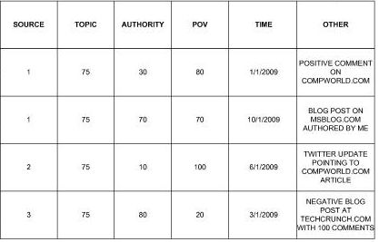

## Search Engine Authority vs. Search Engine Popularity

When search engines return web pages in search results in response to a query, most people assume that the pages showing are the ones that a search engine has decided are the “best” pages in response to their search terms. But what does the word “best” mean in that context? The search engines attempt to show pages that are both relevant to the query (and the intent of a searcher) and are popular. But is it better to show pages that are ranked highly based upon a search engine authority metric or a metric based upon search engine popularity?

Google’s PageRank algorithm can be considered a popularity algorithm based upon a citation analysis approach to finding pages, or as Google Founder Larry Page noted in [Improved Text Searching in Hypertext Systems](https://www.seobythesea.com/improved-text-searching-in-hypertext-systems.pdf) (pdf):

> The intuition is that if your query matches tens of thousands of documents, you would be happier looking at documents that many people thought to mention in their web pages, or that people who had important pages mentioned at least a few times.

There are other ways of measuring popularity that the search engines may be used as well, such as the number of times that a document has been read, or the number of times that it might have been linked to or mentioned or shared on a social network, or selected when shown in a set of search results. A couple of Microsoft patent applications filed this month question the wisdom of using popularity as a way of ranking pages, and tell us that:

> The popularity of a particular document, however, does not necessarily indicate that the document is relevant to the search query, or that the document is associated with sources that are considered reliable concerning the subject matter of the document.

The most popular page isn’t necessarily the most authoritative page.

For example, let’s say that you’re looking for the best information that you can find about how gravity works around a black hole. The best information you could find might be found in a scientific journal that specializes in the behavior of black holes. The articles at that journal may even be written by some of the world’s foremost experts on Astronomy for a very scientifically literate audience. Chances are if you performed a search at Google or Yahoo or Bing for that topic that, even if that particular journal was open to the public and freely accessible via search engines, that instead of the journal showing up near the top of search results, instead, you would see much more mainstream pages written for a much wider audience.

Those mainstream articles likely have many more links pointing to them than the journal written for scientists. They likely have highly popular pages linking to them from news sources, from government agencies like NASA, and from other more mainstream sites that report about science. While popular pages can often be useful and informative pages, they may not be the most authoritative pages that could be shown in response to a query.

**Author Authority Ranking**

So how would Microsoft use a search engine authority metric to show pages that are the most authoritative?

The Microsoft patents describe a system for scoring pages based upon an author’s authority ranking, and for reranking search results based upon those search engine authority scores.

We’re told in the patents that the term “authority” refers to the following characteristics about an author or source of information as might be associated with that author or source in response to a particular topic:

- Trustworthiness
- Reliability
- Knowledgeability
- Respect

In a few ways, this search engine authority ranking approach reminded me of a recent Microsoft about determining the credibility of resources on the Web that I wrote about in [How a Search Engine Might Visualize and Rerank Web Pages Based Upon Credibility](https://www.seobythesea.com/2011/03/how-a-search-engine-might-visualize-and-rerank-web-pages-based-upon-credibility/). The focus of that paper was upon assessing the credibility of websites rather than particular authors, however.

Determining whether an author might be authoritative on a topic could be determined by looking at data associated with the author, such as:

- Educational degrees held by the source
- Where those degrees were obtained
- Citations of the source in scholarly or technical works
- Number of publications associated with a source
- Number of social network connections and/or followers
- Whether or not the source is employed by and/or graduated from a well respected and/or highly cited institution
- Social networking information such as a number of posts relating to the source and/or a particular topic addressed by the source
- Number of patents held by the source
- Number of links to content associated with the source
- Number of articles citing work associated with the source
- Ratings and Reviews associated with the source

Content and specific sites from specific sources might be determined to be authoritative about specific topics, and if a query that someone searches for may also be associated with that topic, then pages from that source might be boosted in search results based upon that perceived authority.

Here’s a screenshot of a table from the second patent filing that shows authority scores and some potential influences on those scores:

The patent applications are:

[Authority Ranking](http://appft.uspto.gov/netacgi/nph-Parser?Sect1=PTO1&Sect2=HITOFF&d=PG01&p=1&u=%2Fnetahtml%2FPTO%2Fsrchnum.html&r=1&f=G&l=50&s1=%2220110246484%22.PGNR.&OS=DN/20110246484&RS=DN/20110246484)
Invented by Susan T. Dumais, Stefan David Weitz, Alexander George Gounares, David James Gemmell and Paul Yiu
Assigned to Microsoft Corporation
US Patent Application 20110246484
Published October 6, 2011
Filed: April 1, 2010

Abstract

> Concepts and technologies are described herein for authority ranking for real-time and social search. An authority index configured to store data relating to sources is generated. Data relating to the sources, including an authority value, are generated and stored at the authority index. The authority value may be defined as a function of source, topic, and point of view (“POV”), as well as other data, if desired, and may be determined based upon one or more ranking functions.
>
> The ranking functions are determined, and data corresponding to the ranking functions is obtained. Each of the ranking functions may be weighted according to a weighting function, a confidence value or interval, one or more time functions, and/or other methods. The obtained authority value may be used for affecting the ranking of search results or for other purposes.

[Dynamic Reranking of Search Results Based upon Source Authority](http://appft.uspto.gov/netacgi/nph-Parser?Sect1=PTO1&Sect2=HITOFF&d=PG01&p=1&u=%2Fnetahtml%2FPTO%2Fsrchnum.html&r=1&f=G&l=50&s1=%2220110246456%22.PGNR.&OS=DN/20110246456&RS=DN/20110246456)
Invented by Stefan David Weitz, Alexander George Gounares, and Patrick A. Kinsel
Assigned to Microsoft
US Patent Application 20110246456
Published October 6, 2011
Filed: April 1, 2010

Abstract

> Concepts and technologies are described herein for dynamically reranking search results based upon source authority. A search query is received and analyzed. One or more topics are identified in the search query. An authority index is searched to identify authoritative sources for content relating to the identified topic(s). Promoted results corresponding to content generated by the authoritative sources relating to the identified topics are obtained.
>
> The promoted results can be presented to an entity requesting the search or injected into search results. Contribution dimensions associated with the promoted results can be determined, and filters based upon the contribution dimensions can be generated and used by an entity to dynamically manipulate the search results.

The patents describe in more detail how they would look at contributions by and interactions between a source (a person, an organization, a business, etc.) and others at places like Facebook and Twitter, at ratings and reviews for that source. They discuss learning about relationships between individuals and websites, businesses, educational institutions, and more.

Data about a “source” might be identified explicitly through author bylines (sound a little like Google’s authorship markup approach?), through places they might be explicitly tied to in some way such as institutions or publications or domain names.

The patent filings point to other types of data that might be collected and associated with a source as well, such as:

- Gender of a source
- Country of origin associated with the source
- Language associated with the source, entities and/or other sources related to the source
- Type of content associated with the source
- Ranking or rating data
- Descriptions of content associated with the source
- Number of words in the content
- Version number associated with the content
- Copyright date of the content

Pages that are promoted within search results might be presented separately from more conventional search results, or they may be injected within those results.

**Conclusion**

In many ways, Microsoft’s approach towards providing a search engine authority score for authors or sources sound like what Google is trying to do with their authorship markup, though we haven’t been given much in the way of details by Google about how and why some authors’ pages or microblog posts might be ranked in search results. We have been given some hints though, that I’ve written about in places like the following posts:

- [After Authorship Markup, Will Google Give Us Author Badges Too?](https://www.seobythesea.com/2011/08/after-authorship-markup-will-google-give-us-author-badges-too/)
- [Early Google Circles and the Google Social Site You Might Not Know About](https://www.seobythesea.com/2011/07/early-google-circles-and-the-google-social-site-you-might-not-know-about/)
- [How Google Might Rank User Generated Web Content in Google + and Other Social Networks](https://www.seobythesea.com/2011/07/how-google-might-rank-user-generated-web-content-in-google-and-other-social-networks/)

Will we see a similar approach from Microsoft that might involve authorship markup, or that may take more advantage of the relationship between Bing and Facebook, or both?

One question that I have is whether the approach to authority ranking described in the Microsoft patent applications is useful. Are degrees and numbers of patents granted or papers published useful signs of authority? Are there sometimes more authoritative sources who have degrees from less well known educational institutions? Numbers of links on other pages, and numbers of followers in social networks still seem to be important under this approach.

But the patent also looks at the kinds of interactions that authors might have with others, and other information that isn’t tied to popularity as well.

Google’s use of authorship markup also seems aimed at increasing “authority” as a ranking signal as well, though it’s interesting that next to authorship profile images shown in search results, Google is showing “how many circles” someone is in, which seems to be more popularity based that authority-based.
