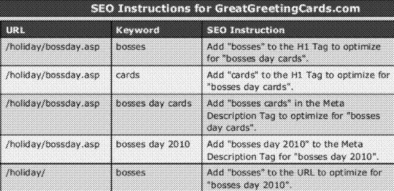

When I write about patent filings, they are usually from search engines or social networking sites, or have been acquired by someone like Google or Facebook. I ran across one patent application published this week that instead comes a person offering search engine optimization services. I don’t think it’s possible to do SEO with just automated tools, because there are so many issues on a site that need to be considered and reviewed and often adjusted for a site to be competitive in search results.

Some of those are technical, like handling canonical issues so that you ideally only have one URL per page. Some of those issues involve making marketing decisions, like understanding the audience of a site and the language that they might expect to see on a page about a particular topic. Some may involve things like deciding how the information architecture of a site might be set up, so that it’s easy for visitors to understand where they are on a site, where they can go, and how their situational and informational needs might be addressed on the pages of that site.

Tools that can help you do some of the manual tasks and research involved in an SEO campaign can be very helpful though, especially if they can enable you to work more efficiently, and spend more time on making the decisions that a human being might make that a computer program can’t. But are such tools patentable? If you find a way to automate a process that many people have been doing manually, is it really something that is new, useful, and nonobvious? Those are the kinds of questions that a patent examiner might ask when reviewing a patent application while prosecuting it. If a person is granted a patent that describes such processes, will that enable them to stop others from using such processes themselves, even if they’ve been using those for years?

The patent application is:

[Automatic Generation of Tasks For Search Engine Optimization](http://appft.uspto.gov/netacgi/nph-Parser?Sect1=PTO1&Sect2=HITOFF&d=PG01&p=1&u=%2Fnetahtml%2FPTO%2Fsrchnum.html&r=1&f=G&l=50&s1=%2220120166413%22.PGNR.&OS=DN/20120166413&RS=DN/20120166413)
Invented by Matt LeBaron
US Patent Application 20120166413
Published June 28, 2012
Filed: December 24, 2010

Abstract

> A method and a device for search engine optimization, that receives an identifier that identifies a domain, one or more keywords for analysis relative to a search engine, and search engine usage data, for each received keyword, gathering search engine results data, for at least one received keyword, mapping the at least one keyword to at least one web page within the identified domain, said mapping based on at least one of said search engine usage data and said search engine results data, and for at least one of the received keywords, generating at least one instruction to modify a web page element in a web page to which the at least one received keyword is mapped.

The focus of this patent is on finding and researching keywords to use on specific pages of a site, mapping those keywords to those pages, and offering a list of changes to each page to incorporate those keywords to those pages. A person who may want to use this service might identify pages to be optimized by visting them with their browser. The pages might be sent to an SEO server to start analyzing.

A webmaster may upload information to that SEO server that includes keywords and traffic volume data. The SEO server might also gather information about keywords using APIs from services like Google Adwords, Google Analytics, Google Webmaster Tools, and non search engine keyword research services like those offered by Wordtracker.

This system will try to identify keywords to use that might result in greater traffic or greater revenue while offering them as options for specific pages.

The patent filing provides more details on the process described within it might be used to help identify keywords for pages, and offer specific recommendations for the use of those keywords on those pages.

But, if you’ve been doing SEO for a while, you may recognize many of those steps as things that you’ve been likely doing for a while.

And, as an SEO you’ve likely been doing other things as well, like looking at the pages of potential competitors that rank for specific keywords, and trying to gauge how easy or difficult it might be to compete with those pages for rankings. You might look past putting keywords onto pages to determine an actual need for the content that you’re creating, and the likelihood that visitors might appreciate that content, and want to share it with others, link to it, and more.

You might go beyond including specific keywords in things like page titles and meta descriptions, to how engaging and interesting those titles and meta descriptions might be to people viewing them in search results, or a shared in places like Facebook and Google Plus.

The patent application describes an approach that might be helpful to someone who has experience with SEO, and knows to take a lot of other steps while doing SEO. But it seems to present itself within the patent filing as a way for webmasters who might not have much experience with SEO to achieve great rankings for keywords by following a set of instructions on incorporating those keywords on pages, in URLs, as anchor text on pages, and in a few other ways.

There’s more to SEO than that.
