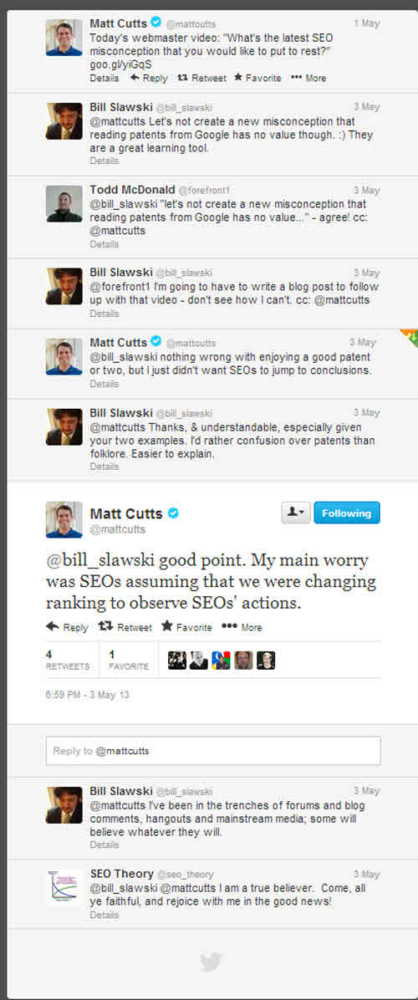
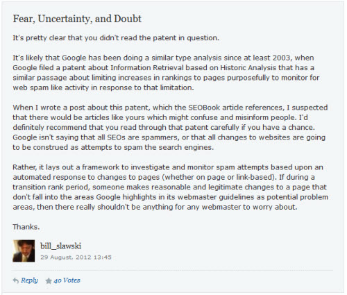

On May 1st, Google’s Head of Webspam Matt Cutts published a video in his series of Google Webmaster Help videos, answering the question, “What’s the latest SEO misconception that you would like to put to rest?”

For some reason, Matt decided to focus upon patents, with a video about people possibly placing too much faith in what is uncovered in patents related to search engines. To a degree, I agree with his response, but I was reached out to by a number of people who saw the video as something aimed specifically at me, since I write about search related patents so often. I felt that I had no choice but to respond. Here’s the video from Matt:

Jennifer Slegg gave me a chance to respond to Matt’s video, in her post, [Matt Cutts Tells SEOs to Stop Worrying About Google Search Patents](https://www.searchenginewatch.com/2013/05/03/matt-cutts-tells-seos-to-stop-worrying-about-google-search-patents/), and I appreciate her letting me say a few words there, but I wondered if it was enough. I reached out to Matt on Twitter, and he provided some of his thoughts about the video there:

## The Google Patents Mentioned in the Video

As for writing about patents, including the two that Matt specifically mentions in the video, I’m guilty as charged. Here’s what I wrote about one of the patents, [Ranking Documents](http://patft.uspto.gov/netacgi/nph-Parser?Sect1=PTO2&Sect2=HITOFF&p=1&u=%2Fnetahtml%2FPTO%2Fsearch-adv.htm&r=1&f=G&l=50&d=PALL&S1=08244722&OS=PN/08244722&RS=PN/08244722), last year:

[The Google Rank-Modifying Spammers Patent](https://www.seobythesea.com/2012/08/google-rank-modifying-spammers-patent/)

What I didn’t write was something along the lines of – [Any SEO could damage your site as a spam site](https://www.zdnet.com/article/any-seo-could-damage-your-site-as-a-spam-site/), and I responded to that post with this comment:

One thing that is very important to note here is that while the version of the patent I wrote about was filed in 2010, the original version of the patent was filed in 2005. Even if Google might have considered implementing what is described within the patent filing, it’s very much possible that it’s something they may have never decided to use or tried and quite possibly replaced with a different approach.

The other patent mentioned by Matt was “[Information Retrieval based upon Historical Data](http://patft.uspto.gov/netacgi/nph-Parser?Sect1=PTO2&Sect2=HITOFF&p=1&u=%2Fnetahtml%2FPTO%2Fsearch-adv.htm&r=1&f=G&l=50&d=PALL&S1=07346839&OS=PN/07346839&RS=PN/07346839).” This patent was discussed in many places, and I wrote about it in detail in forums and comments on other blogs. I recently called the patent one of the most important to be issued relating to Search Engine Optimization in the post, [Revisiting Google’s Information Retrieval Based Upon Historical Data](https://www.seobythesea.com/2011/10/revisiting-googles-information-retrieval-based-upon-historical-data/), where I wrote this:

> One thing that caught many eyes at the time was that one of the named inventors on the patent was Google’s Head of Webspam, Matt Cutts, who was well known in the community for his interactions with forum members on behalf of Google, and his participation in conferences and with the press. (Actually, the whole roster of inventors listed on the patent is like an all-star team of search engineers.)
>
> Another was that it said things like the amount of time a domain name was registered might be an indication of whether or not it was intended to be a spam site – with spammers usually only registering a site for a year, and people more “serious” about their businesses registering their sites for longer.
>
> Matt went on to rebuff that assertion more than once since the patent was published, but hosting businesses such as GoDaddy caught wind of it. It used the FUD (fear, uncertainty, and doubt) behind the patent as a selling point to try to get people to register their domains for longer than a year. Regardless of whether it was true or not, they saw the possibility of using the information within the patent as a path to more profits.

## Learning From Patents

One of the main reasons why there are patents is to enable people to learn from them. As the [USPTO](https://www.uspto.gov/patent) notes about patents:

> A patent is an intellectual property right granted by the Government of the United States of America to an inventor “to exclude others from making, using, offering for sale, or selling the invention throughout the United States or importing the invention into the United States” for a limited time **in exchange for public disclosure of the invention*** when the patent is granted.

(*My emphasis)

A presentation from the World Intellectual Property Organization, [Using patent information for policy and business analysis](https://www.wipo.int/edocs/mdocs/pct/en/wipo_pct_nbo_09/wipo_pct_nbo_09_www_121096.pdf) (pdf), is even more clear on the topic:

> Patents give the owners a right to prevent others from carrying out the invention (manufacturing or marketing) but not from learning from the invention.

The granting of a patent to Google can allow the company to exclude others from following processes described in a patent, but one of the tradeoffs of that protection is that the patents must be published for the world to see and learn from.

Google might not currently be using a process described in a patent, but they may have in the past or might in the future. Regardless, don’t take the existence of a patent as gospel, but also don’t automatically tune patents out. They provide a chance to learn about assumptions from search engineers about search, searchers, search engines, and the Web. We can learn from them about research directions from Google and Microsoft and Bing and others, and what they found valuable to protect as intellectual property.

One of the first steps that I often take when learning about an acquisition made by Google or Microsoft or Yahoo or even Facebook or Twitter is to look at the USPTO assignment database and see what patent filings might have been held by the company acquired. Those assignments might not tell the whole story behind an acquisition, but there are often hints there. For example, see my recent post, [With Wavii, Did Google Acquire the Future of Web Search?](https://www.seobythesea.com/2013/05/wavii-google-acquire-future-search/)

## Does Google Ever Implement Things Described in Patent Filings?

The short answer is yes, but it’s more complicated than that.

When Google first started showing Instant Results, I wrote the following in a post from 2005 titled, [Can Google Read Your Mind? Processing Predictive Queries](https://www.seobythesea.com/2005/12/can-google-read-your-mind-processing-predictive-queries/):

> Predicted results may even be presented before a searcher finishes typing and before they possibly select one of the predicted queries. As the patent application notes, that would make the search engine seem very responsive.

We didn’t start actually seeing instant results like that until five years later.

Google has also discontinued products before the patent behind that product was granted, such as the Google Directory.

I’ve seen patent filings for things such as Google personalized results and Google Universal results before those were implemented, though usually not descriptive enough to let others know how to build those for themselves. The same with patents that provide changes to the way that Google displays something. For example, how Google may sometimes assume that a [query might be a request for a site search](https://www.seobythesea.com/2009/05/boosting-brands-businesses-and-other-entities-how-a-search-engine-might-assume-a-query-implies-a-site-search/) when the query includes an entity that Google has associated with a particular site – search for [spaceneedle hours]. You may see the first 8 results come from spaceneedle.com.

Sometimes, it can be almost impossible to tell if a process described in a patent filing was or is implemented, especially if the process described in the patent might impact rankings or results but doesn’t leave much of a visible footprint it was involved in those results.

Many of Google’s patent filings involving Local Search seem to be very descriptive of how Google’s local search has developed over time as well.

Matt is right – don’t take the existence of a patent as present-day proof that Google is actively doing what is described within the patent. But don’t ignore what you can learn from the patent, especially if it raises many questions that you can explore and experiment with and use to help understand the search engine better.

That patent that Matt mentioned that included a piece about the length of domain name registration discussed a large number of issues that Google might pay attention to, including how fresh pages in search results might be, what the implications might be if the anchor text to certain pages starts changing over time, and other signals involving identifying web spam and stale content online. So it’s still worth exploring those topics, regardless of whether Google has implemented them.

As Matt noted, don’t take it as “a golden truth” that just because Google has a patent for something, they are doing that in that particular period of time.

But don’t discount the value of patents to provide insights into what the search engine might be doing, or had possibly been doing in the past, or provide questions and ideas to explore. 

It’s not such a subtle hint when Google starts filing lots of continuation and related patents on certain topics either. For instance, The Agent Rank patent has had 2 continuation patents filed on it already, which tells us that it may just have some continuing value.

The Google “information retrieval through historical data” patent has had more than a dozen continuation patents filed in its wake, and while “length of domain registration” was one of many items it originally covered, that one isn’t listed in the claims of any of the continuation patents. Still, other things are, and some of them more than once.

Google’s Phrase-Based indexing patent has spawned three generations of continuation patents and related patents. It might not be implemented, but many people have worked on patents that show a significant amount of detail in how they would implement different aspects of it. 

It’s probably worth including the names of and some links to some of the patent filings that Matt Cutts has been involved in at Google.

## Matt Cutts Granted and Pending Patents

- [Permitting users to remove documents](http://patft.uspto.gov/netacgi/nph-Parser?Sect1=PTO2&Sect2=HITOFF&p=1&u=%2Fnetahtml%2FPTO%2Fsearch-adv.htm&r=1&f=G&l=50&d=PALL&S1=08417697&OS=PN/08417697&RS=PN/08417697) (US Patent 8,417,697)
- [Document scoring based on link-based criteria](http://patft.uspto.gov/netacgi/nph-Parser?Sect1=PTO2&Sect2=HITOFF&p=1&u=%2Fnetahtml%2FPTO%2Fsearch-adv.htm&r=1&f=G&l=50&d=PALL&S1=08407231&OS=PN/08407231&RS=PN/08407231) (US Patent 8,407,231)
- [Systems and methods for detecting hidden text and hidden links](http://patft.uspto.gov/netacgi/nph-Parser?Sect1=PTO2&Sect2=HITOFF&p=1&u=%2Fnetahtml%2FPTO%2Fsearch-adv.htm&r=1&f=G&l=50&d=PALL&S1=08392823&OS=PN/08392823&RS=PN/08392823) (US Patent 8,392,823)
- [Systems and methods for detecting potential communications fraud](http://patft.uspto.gov/netacgi/nph-Parser?Sect1=PTO2&Sect2=HITOFF&p=1&u=%2Fnetahtml%2FPTO%2Fsearch-adv.htm&r=1&f=G&l=50&d=PALL&S1=08056128&OS=PN/08056128&RS=PN/08056128) (US Patent 8,056,128)
- [Systems and methods for detecting commercial queries](http://patft.uspto.gov/netacgi/nph-Parser?Sect1=PTO2&Sect2=HITOFF&p=1&u=%2Fnetahtml%2FPTO%2Fsearch-adv.htm&r=1&f=G&l=50&d=PALL&S1=08046350&OS=PN/08046350&RS=PN/08046350) (US Patent 8,046,350)
- [Identifying inadequate search content](http://patft.uspto.gov/netacgi/nph-Parser?Sect1=PTO2&Sect2=HITOFF&p=1&u=%2Fnetahtml%2FPTO%2Fsearch-adv.htm&r=1&f=G&l=50&d=PALL&S1=08037063&OS=PN/08037063&RS=PN/08037063) (US Patent 8,037,063)
- [Document scoring based on document inception date](http://patft.uspto.gov/netacgi/nph-Parser?Sect1=PTO2&Sect2=HITOFF&p=1&u=%2Fnetahtml%2FPTO%2Fsearch-adv.htm&r=1&f=G&l=50&d=PALL&S1=07840572&OS=PN/07840572&RS=PN/07840572) (US Patent 7,840,572)
- [Identifying inadequate search content](http://patft.uspto.gov/netacgi/nph-Parser?Sect1=PTO2&Sect2=HITOFF&p=1&u=%2Fnetahtml%2FPTO%2Fsearch-adv.htm&r=1&f=G&l=50&d=PALL&S1=07668823&OS=PN/07668823&RS=PN/07668823) (US Patent 7,668,823)
- [Information retrieval based on historical data](http://patft.uspto.gov/netacgi/nph-Parser?Sect1=PTO2&Sect2=HITOFF&p=1&u=%2Fnetahtml%2FPTO%2Fsearch-adv.htm&r=1&f=G&l=50&d=PALL&S1=07346839&OS=PN/07346839&RS=PN/07346839) (US Patent 7,346,839)

Some of these might be the same documents that have been granted, or continuations of them, or completely different documents.

20120016887 – Identifying Inadequate Search Content
20120016871 – Document Scoring based on Query Analysis
20110264671 – Document Scoring Based on Document Content Update
20110029542 – Document Scoring based on Document Inception Date
20110022605 – Document Scoring based on Link-Based Criteria
20100138421 – Identifying Inadequate Search Content
20080249786 – Identifying Inadequate Search Content
20070094255 – Document Scoring Based on Link-Based Criteria
20070094254 – Document Scoring Based on Document Inception Date
20070043721 – Removing documents
20050071741 – Information retrieval based on historical data

## Learning More from Search Related Patents

I used the following as an introduction to a series of posts I wrote about what I thought were some patents that people doing SEO should be aware of – [10 Most Important SEO Patents: Part 1 – The Original PageRank Patent Application](https://www.seobythesea.com/2011/12/10-most-important-seo-patents-part-1-the-original-pagerank-patent-application/)

> I like looking at patents and whitepapers and other primary sources from search engines to help me practice SEO. I’ve been writing about them for more than 5 years now and am putting together this series of the 10 Most important SEO patents to share some of what I’ve learned during that time. These aren’t patents about SEO, but rather ones that I would recommend to anyone interested in learning more about SEO by looking at patents from sources like Google or Microsoft or Yahoo.

Others write a fair amount about search-related patents and white papers, and I wanted to include them in this post as well.

- David Harry, who runs the SEO Training Dojo, blogs at [Search News Central](https://searchnewscentral.com/), and tweets at [@thegypsy](https://twitter.com/thegypsy/).

- Ted Ulle – Who is the [first recipient of a life-time achievement award](https://www.pubcon.com/longtime-webmasterworld-standout-ted-ulle-receives-award-at-pubcon) from Webmaster World Forum, tweets at [@tedulle](https://twitter.com/tedulle), and is [very highly respected](http://www.seobook.com/tedster-interview) in the SEO field.

Thanks, and keep learning.
