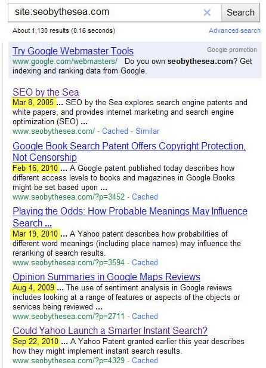
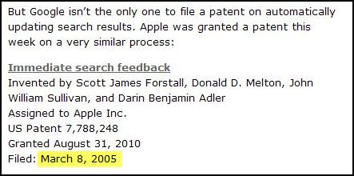
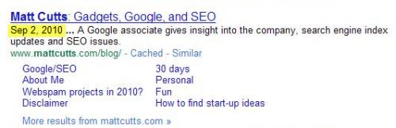
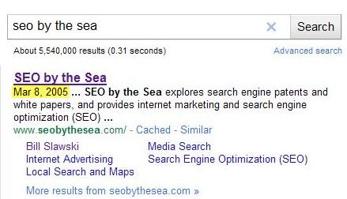
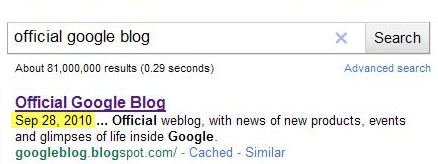

In my RSS feed reader, I have a section that I labeled “Vanity.” The feeds that occupy it are things like web search, and Twitter search feeds for my name, my sites’ names, my business name, and some other searches that interest me on the Web. I don’t really consider tracking these things to be a matter of vanity, but instead of necessity – a way to find conversations that might involve me, my site, and my business, and a chance to possibly get involved in those discussions.

As a site owner, I’ve also developed a habit that many site owners likely also share, of performing searches for queries such as my name, my sites’ names, my business name, and some other queries that I’m interested in. The exercise isn’t based on an obsession with ranking as much as it is about being concerned about those conversations that I mentioned above, and concerned about how the search engines might be portraying my sites. For instance, when I search for my site name (SEO by the sea), and Google shows a snippet that starts off with the date “Mar 8, 2005,” I find myself concerned about what that might mean to people who see that date.

Will people seeing that 2005 date assume that the information they will find on the site is old, stale, and not worth visiting? Will they assume that the last time the site has been updated was in March of 2005? Google, you don’t seem to be treating my site right by showing that date. This site started in June of 2005, and there have been close to 1,000 blog posts since then. Why would you include that date at the start of a snippet for my home page?

I know why.

When someone performs a search, and looks through search results, the titles and descriptions that appear in those search results for web pages can influence which pages a searcher decides to visit. A Microsoft study that I wrote about a while back in [The Influence of Search Result Listings (Captions) on Clickthroughs](https://www.seobythesea.com/2007/07/the-influence-of-search-result-listings-captions-on-clickthroughs/), describes how those features can influence whether or not a searcher clicks through a page.

The search engines will sometimes use text from a page’s meta description as a snippet, especially if that meta description contains the keywords used in a query to find that page. But, it’s also possible that Google or Yahoo or Bing might show something else, like from the content on a page where that content includes the search query terms. Google’s Matt Cutt’s mentioned this in one of his webmaster help videos:

Interestingly, the original question posed in that video not only asks why Google sometimes shows something other than a meta description as a snippet in search results and mentions that sometimes dates appear within a snippet for some unknown reason. While the answer does explain why Google will show a snippet that includes something other than a meta description, it doesn’t address why dates might sometimes be included.

I do know why Google sometimes includes dates in snippets, but that reason doesn’t account for the Mar 8, 2005 date presently displayed for the home page of SEO by the Sea in Google’s search results.

I’ve written a few posts in the past inspired by patent filings from Google and Yahoo which describe some aspects of how those search engines might decide what to include in a search snippet. If you want to explore that topic more fully, here are some links to those posts:

- [How does Google Pick Snippets for Your Pages to Show in Search Results?](https://www.seobythesea.com/2007/12/how-does-google-pick-snippets-for-your-pages-to-show-in-search-results/)
- [Search Engines Evaluating Snippets in SERPS](https://www.seobythesea.com/2009/07/search-engines-evaluating-snippets-in-serps/)
- [How a Search Engine May Choose Search Snippets](https://www.seobythesea.com/2009/12/how-a-search-engine-may-choose-search-snippets/)

But none of those address why Google might sometimes show dates in snippets in search results, which is something that Google has been doing for at least a couple of years – especially in snippets for blog posts and forum threads.

When I perform a “site” search for my site in Google (“site:www.seobythesea.com/”), I see dates at the start of snippets for most blog posts listed for my site:

_A Google search result for seo by the sea, showing a date of Mar 8, 2005 at the start of the description for the site._

I checked a number of those listings, and except for the date in the snippet for my home page, the dates displayed to match the publication dates of my posts.

Google published a patent filing that describes when and why they might include dates in snippets for forum posts, and even blog posts. I wrote about it in the post [Google’s Specialized Forum and Discussion Thread Search Results](https://www.seobythesea.com/2010/02/googles-specialized-forum-and-discussion-thread-search-results/). While the patent application’s title, [Providing Posts to Discussion Threads in Response to a Search Query](http://appft.uspto.gov/netacgi/nph-Parser?Sect1=PTO2&Sect2=HITOFF&u=%2Fnetahtml%2FPTO%2Fsearch-adv.html&r=1&p=1&f=G&l=50&d=PG01&S1=20100030753.PGNR.&OS=dn/20100030753&RS=DN/20100030753) sounds like it might only apply to forum threads, the patent filing makes it clear that the search engine might include dates (and other information, such as authors, number of posts, etc.) within snippets displayed for blog posts and blog comments and micro-blogging posts, as well as for forum posts.

The premise behind doing so would be to give searchers additional information about what they might find on a page to make a more informed decision about whether or not to visit.

But that doesn’t explain the March 2005 date shown within the snippet for the front page of my site. The home page doesn’t have a specific publication date associated with it because blog posts on the site do.

So, where did Google get that date from?

It appears that Google’s snippet generation algorithm found a random date that appears on the home page of the site, and decided to use it within that snippet. It appears to have been taken from an excerpt from a blog post on [Apple’s approach to Instant Search](https://www.seobythesea.com/2010/09/apple-to-take-on-google-in-showing-immediate-search-results/) which includes the date of the filing of an Apple patent application – March 8, 2005.

Randomly including that date within the snippet for the home page of my site doesn’t make much sense. But it seems Google has decided that since this site is a blog, it should include a date in the snippet.

**Conclusion**

I’m not sure how likely it is that someone at Google will read this blog post, see the error of their ways (or at least the errors of their snippet algorithm), and fix this problem.

But there are a couple of ways I can take matters into my own hands.

When a page appears in search results for a certain query, a search engine might not include the best snippet that it can for that page. For instance, the snippet that it shows may be taken from somewhere within the page’s content rather than from a meta description.

One approach to pursue might be to rewrite the meta description to include the terms of that query. But if the query terms aren’t the main ones that you are focusing upon for the page, then you may not want to change your meta description. And there’s no guarantee that Google would choose to use your modified meta description anyway.

Another tact to follow would be to modify the section of the page where that query term appears so that if the snippet continues to be shown from that piece of content, it is engaging, persuasive, and more likely to get people to click through to your page.

In my example from my page, Google is showing my chosen meta description from my page on a search for the site’s name, but it is also showing a random date from the front page.

I can choose to do nothing, except for publishing more blog posts so that the excerpt where the “Mar 8, 2005” date comes from no longer appears on the site’s home page.

I can remove that date from the excerpt so that Google hopefully will no longer include it in the snippet.

In the future, I’ll be more careful when I post information about a patent’s filing, publication, and granted date so that those don’t appear within an excerpt published on the home page.

There’s no need for Google to include a date within the snippet for the home page of this site, and no sense in Google showing a date within that snippet that is three months earlier than the first blog post published on the site.

The takeaway from this blog post?

Would you mind paying attention to what search engines are showing as snippets for your pages when they appear for different queries in search results? What they show may not be very helpful or wise, or correct.

Make changes to the meta descriptions or page content that does show up in those snippets, so that people searching for what your pages have to offer will be more likely to visit.

*Added 9/27/2010*

**Remediation and Another Example**

A few minutes ago, I pushed down the patent filing information on the post where the Mar 8, 2005 date came from so that it no longer appears in the excerpt showing up on the home page. Will Google stop showing that date (Mar 8, 2005) in the snippet for my home page, and if it does, will a new random date from the page be chosen to display?

I wanted to find at least one other example of a misleading data being inserted into the snippet for the home page of someone’s blog, and fortunately found a good example on my second search.

Matt’s [blog](https://www.mattcutts.com/blog/) displays his latest five posts, with the oldest dated September 2, 2010. If you looked at the date in the snippet, you might believe that the last time Matt’s blog was updated was Sept 2nd, and miss that he had blogged something new on September 20th, 19th, 17th, and 8th. While the date is misleading, at least it’s from sometime this month and year.

*Added 9/27/2010 at 3:17 pm (edt)*

I’ve had a few suggestions to post a message about this on the Google Webmaster Central Help forum. Maybe it will help influence a change in the selection of dates to show as a snippet in search results for the home pages of blogs and on other kinds of pages.

> I have read the FAQs and checked for similar issues: YES
>
> My site’s URL (web address) is: https://www.seobythesea.com/.
>
> Description (including the timeline of any changes made):
>  I’ve had a few people suggest to me that I should post a question about this issue here in Google’s webmaster help forum.
>  I noticed this weekend that Google was displaying a date of “Mar 8, 2005” at the front of the snippet for my home page, on a search for my business name “SEO by the Sea” (without the quotation marks). The date appears to have been randomly selected from a blog post excerpt that was appearing on the home page. That date wasn’t the date that the excerpted blog post was filed, but rather was the “filing” date of an Apple patent on Apple’s approach to Instant Search that I blogged about.
>
> I am concerned that someone searching for my business, and seeing the 2005 date in the snippet for my home page might consider my site to be filled with old and outdated content – if Google is showing a date in a snippet as additional information about a page listed, shouldn’t that date be somehow relevant to the page itself? Here it isn’t.
>
> A few hours ago, I modified the post about the Apple patent so that the filing date for the patent no longer shows up in the excerpt that gets published on the front page of my blog. The 2005 date is still appearing in the snippet, and I expect that it will either disappear or be replaced at some point shortly; it will either disappear or be replaced. However, I’m concerned that Google may randomly select another date to display, from my home page.
>
> Moving forward, I will now no longer include dates in the excerpts that appear on my blog’s home page until Google’s snippet generation algorithm improves. However, I am concerned that the next snippet might randomly include a date from the posting dates on my blog, which shows when blog posts are published.
>
> I noticed on a search for Matt Cutts blog, using the query “Matt Cutts” (without the quotation marks), that a date in the snippet displayed for his site is the publication date of his oldest post shown on his home page – September 2, 2010. Seeing that date in the snippet for his blog home page, I would assume that it might be the last time his blog was updated, but he has five “newer” blog posts on his blog home page, with the newest having been published on September 20th.
>
> I’ve looked at a fair number of snippets of blog posts that show the publication dates of those posts in snippets for those pages, and the ones that I’ve viewed have appeared to be pretty accurate. Still, the home page of most blogs doesn’t usually have a specific publication date associated with them.
>
> I’m not sure why Google would include a date, seemingly randomly selected, from the home page of a blog to display in the snippet shown on a search for that blog. If the snippet showed a “last updated” date or the date of the latest publication of a blog post, that might make a little more sense.
>
> Is it helpful to include a date for the home page of a blog?
>
> If it is, does the random selection of a date to use really add to the value of search results?
>
> From my perspective, I’m concerned that I might lose potential visitors when they see an old date like that in search results.
>
> While I’ve taken steps to make that date change, and blogged about some remedial actions that others who are similarly situated might follow, I wanted to post this here in the hopes that someone from Google who works on snippets might see it, and consider the possible harm that a random date in a snippet might have.
>
> Thanks.
>
> Bill

Hopefully it will receive some responses there. The thread is located at:

[Why is a random date shown in my home page snippet?](http://productforums.google.com/forum/#!category-topic/webmasters/crawling-indexing--ranking/YgIgGvCd8b0)

*Added 9/28/2010*

The March 28, 2005 date is no longer showing in a snippet on a Google search for the name of this site:

I don’t know if I can attribute the disappearance of the date in the snippet to my removal of the March 8, 2005 date from the front page of SEO by the Sea, or if the change happened because Google did something to keep the date from appearing. The most likely explanation is that it’s gone because of my removal, but I was assured in the Google Webmaster Central Help forum that the issue was reported to the Google Team that oversees those dates.

Google’s John Mueller also responded with the following in his response to me at the forum:

> We’re constantly working on improving our algorithms, and from what I’ve heard, there are also improvements planned for better finding the best dates within the content.

That’s encouraging news, and hopefully, their work in this area will keep misleading dates from showing up in snippets in the future.

In the meantime, make sure you check the snippets that show up for your pages every so often, just in case something odd shows up. :)

*Added 9/2/2010*

The March 8, 2005 date has returned to the snippet that shows for my blog home page, after disappearing for about a day. Not completely sure why it would return, but it has:

An ideal reason for showing a date in a snippet for a blog home page is to let viewers of those search results have a chance to see when the last time that blog was updated, like Google does with the snippet it shows for the Official Google Blog, with the newest post on that blog dated September 28, 2010.

