Would Twitter have the success it has now if it wasn’t at Twitter.com? What about Digg, or Facebook, or MySpace, or Yelp? Before social networks appeared at those domains, there were other pages at those locations.

I took a time trip to the Wayback Machine at the [Internet Archive](https://archive.org/) to see what those domains were like, before they were social.

## Digg.com

Home to Digg Records

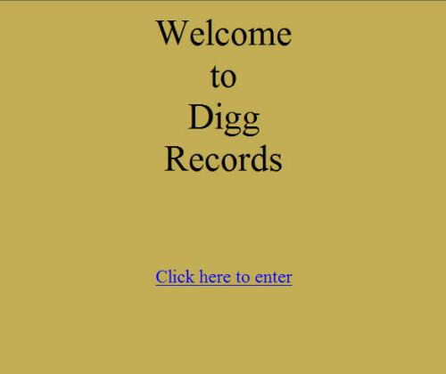

[Digg.com – November 11, 1998](http://web.archive.org/web/19981111184324/http://www.digg.com/)

Digg.com today

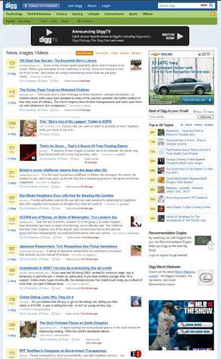

## Facebook.com

The About Face Corporation appears to have originally made their home at Facebook.com

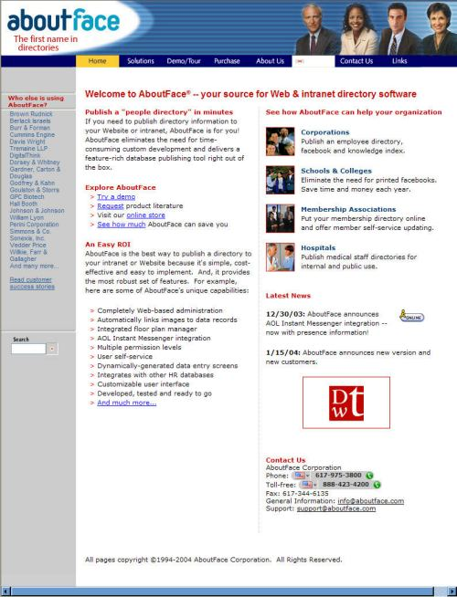

[Facebook.com – February 22, 2005](http://web.archive.org/web/20050222032717/http://www.facebook.com/)

Facebook.com today

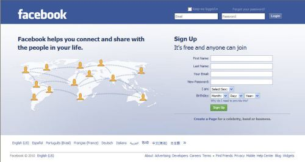

## Myspace.com

MySpace.com as a home to a Web Design company

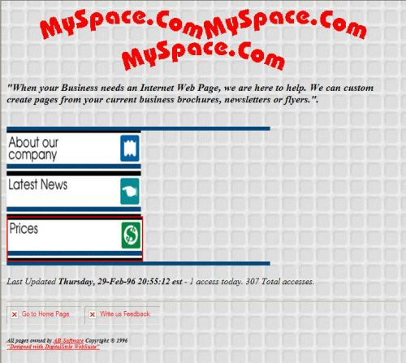

[MySpace.com – January 17, 1997](http://web.archive.org/web/19970117054427/http://www.myspace.com/)

MySpace.com offering free hosting and business services

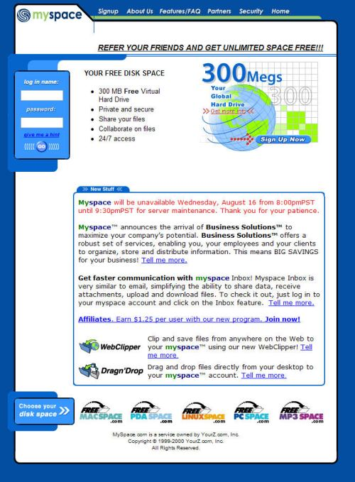

[Myspace.com – August 16, 2000](http://web.archive.org/web/20000816052509/myspace.com/Index.asp)

MySpace.com today

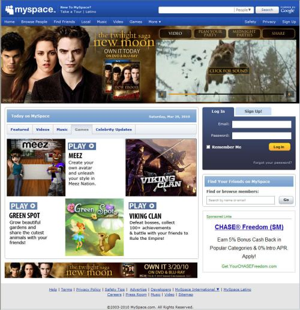

## Yelp.com

Yelp as a directory

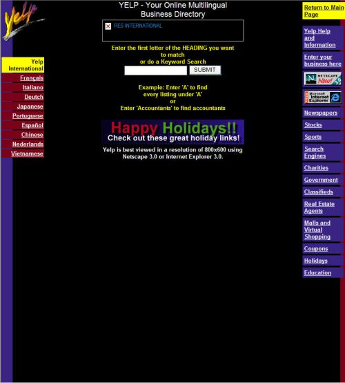

[Yelp.com – December 22, 1996](http://web.archive.org/web/19961222224614/http://yelp.com/)

Yelp.com today

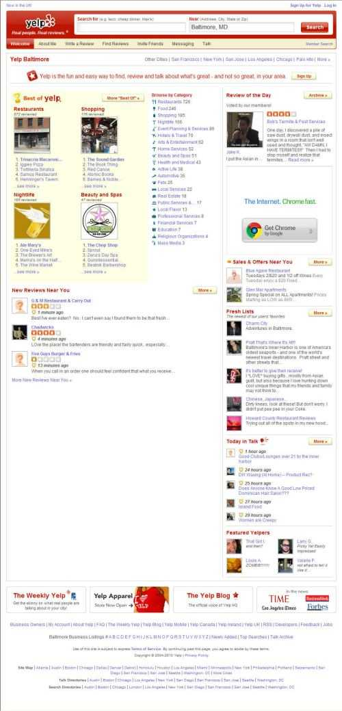

## Twitter.com

Not sure what might have been intended to be on this site originally, but it looks like it was no longer part of the owner’s plans. It’s probably worth a little more now then the asking price that appeared on the page

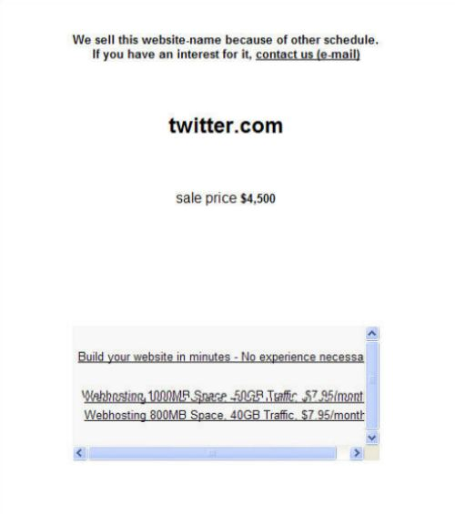

Twitter.com – May 18, 2004

Twitter.com today
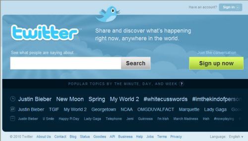
