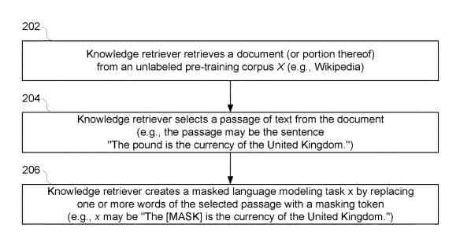
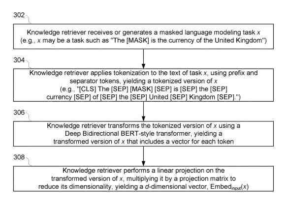
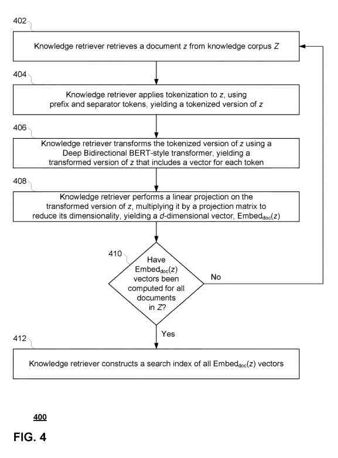
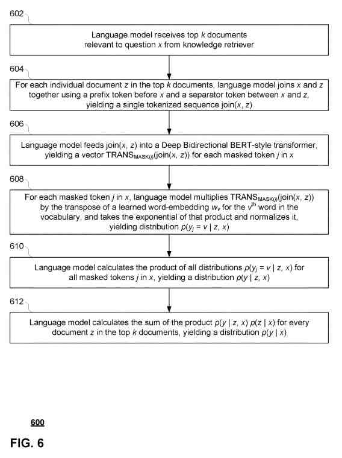

## BERT Question-Answering

A Google Patent from May 11, 2021, is about Natural language processing (“NLP”) tasks such as question answering. It relies on a language model pre-trained using world knowledge.

Advances in language-model pre-training have led to the use of language models. This one uses Bidirectional Encoder Representations from Transformers (“BERT”). Google has worked on this language model. The patent also tells us that using a Text-to-Text Transfer Transformer (“T5”) can capture a large amount of world knowledge. That would become a massive text corpus on the training of that language model.

An issue exists in using a language model that accrues more and more knowledge. The inventors noted that storing knowledge in the parameters of a neural network can cause the network to increase in size. This increase could hurt system operation.

The patent begins with that information and then moves into a summary. The summary tells us how the process described in the patent might work.

## Pre-Training and Fine-Tuning Neural-Network-Based Language Models

The patent tells us that it provides a way of pre-training and fine-tuning neural-network-based language models.

It relates to augmenting language model pre-training and fine-tuning by using a neural-network-based textual knowledge retriever trained along with the language model. It states:

> During the process of pre-training, the knowledge retriever obtains documents (or portions thereof) from an unlabeled pre-training corpus (e.g., one or more online encyclopedias). The knowledge retriever generates a training example by sampling a passage of text from one of the retrieved documents and masking one or more tokens in the sampled piece of text (e.g., “The [MASK] is the currency of the United Kingdom.”).

## The Language Model Includes a Masking Feature

The Pre-Training set uses this masking feature:

> The knowledge retriever also retrieves more documents from a knowledge corpus used by the language model in predicting the word that should go in each masked token. The language model then models the probabilities of each retrieved document in predicting the masked tokens and uses those probabilities to rank and re-rank the documents (or some subset thereof) of their relevance.

## How BERT Handles Question-Answering

A language model such as BERT can work for many functions. The patent points those out as well. It tells us about BERT question-answering:

> The knowledge retriever and language model are next fine-tuned using a set of different tasks. For example, the knowledge retriever may get fine-tuned using open-domain question and answering (“open-QA”) tasks, in which the language model must try to predict answers to a set of direct questions (e.g., What is the capital of California?). During this fine-tuning stage, the knowledge retriever uses its learned relevance rankings to retrieve helpful documents for the language model to answer each question. The framework of the present technology provides models that can retrieve helpful information from a large unlabeled corpus, rather than requiring all relevant information in the parameters of the neural network. This framework may thus reduce the storage space and complexity of the neural network and also enable the model to more handle new tasks that may be different than those on which it was pre-trained.

## How the Patent Defines Training a Language Model

The patent describes training a language in a few ways.

- Using one or more processors of a processing system, a masked language modeling task using text from a first document
- Creating an input vector by applying a first learned embedding function to the masked language modeling task
- Picking a document vector for each document of a knowledge corpus by applying a second learned embedding function to each document of the knowledge corpus. The knowledge corpus comprising a first plurality of documents
- Developing a relevance score for each given document of the knowledge corpus based on the input vector and the document vector for the given document
- Choosing a first distribution based on the relevance score of each document in the second number of documents. The second plurality of documents being from the knowledge corpus
- Deciding on a second distribution based on the masked language modeling task and text of each document in the second plurality of documents
- Selecting a third distribution based on the first distribution and the second distribution
- Modifying parameters of at least the first learned embedding function or the second learned embedding function to generate an updated first distribution and an updated third distribution.

## Pre-Training and Fine-Tuning with BERT

When BERT came out, it was to help with around 11 NLP tasks. That included question answering. I provided a look at the summary of the patent and some of the images that go with that summary. The final process is much more detailed. This statement from the patent reminded me of a 2013 acquisition by Google of Wavii. I wrote about that acquisition in [With Wavii, Did Google Get the Future of Web Search?](https://www.seobythesea.com/2013/05/wavii-google-acquire-future-search/):

> In some aspects, the system’s one or more processors are further configured to receive a query task, the query task comprising an open-domain question and answering task; generate a query input vector by applying the first learned embedding function to the query task, the first learned embedding function including one or more parameters modified as a result of the modifying; generate a query relevance score for each given document of the knowledge corpus based on the query input vector, and the document vector for the given document; and retrieve the third plurality of documents from the knowledge corpus based on the query relevance score of each document in the third plurality of documents.

## This Patent is at

You can find the patent at:

[Retrieval-augmented language model pre-training and fine-tuning](https://patft.uspto.gov/netacgi/nph-Parser?Sect1=PTO1&Sect2=HITOFF&d=PALL&p=1&u=%2Fnetahtml%2FPTO%2Fsrchnum.htm&r=1&f=G&l=50&s1=11,003,865.PN.&OS=PN/11,003,865&RS=PN/11,003,865)
Inventors: Kenton Chiu Tsun Lee, Kelvin Gu, Zora Tung, Panupong Pasupat, and Ming-Wei Chang
Assignee: Google LLC
US Patent: 11,003,865
Granted: May 11, 2021
Filed: May 20, 2020

Abstract

> Systems and methods for pre-training and fine-tuning of neural-network-based language models display.
>
> A neural network-based textual knowledge retriever goes along with the language model.
>
> In some examples, the knowledge retriever obtains documents from an unlabeled pre-training corpus, generates its own training tasks, and learns to retrieve documents relevant to those tasks.
>
> In some examples, the knowledge retriever is further refined using supervised open-QA questions.
>
> The framework of the present technology provides models that can retrieve helpful information from a large unlabeled corpus, rather than requiring all relevant information in the parameters of the neural network.
>
> This framework may thus reduce the storage space and complexity of the neural network and also enable the model to more handle new tasks that may be different than those on which it was pre-trained.

## More Resources on BERT and on BERT question-answering

There is a paper about BERT which is worth reading to see how it is being used. The paper is [BERT: Pre-training of Deep Bidirectional Transformers for Language Understanding](https://arxiv.org/abs/1810.04805)

One of the authors of the BERT paper was also one of the inventors of this patent. There looks like some interesting reading on his homepage as well. You can see it at: [Ming-Wei Chang’s Homepage](https://mingweichang.org/)

This patent is also worth reading. I have presented a summary of how Google may use BERT question-answering. But, the patent provides a much more detailed look at how the search engine uses the BERT technology.

Some aspects behind this BERT question Answering approach includes:

## A Language Model is Pre-Trained Using Masked Language Modeling Tasks

> According to aspects of the technology, a neural-network-based language model resident on processing system is pre-trained using masked language modeling tasks. Each masked language modeling task may come from a neural-network-based knowledge retriever (also resident on processing system), allowing pre-training to proceed unsupervised.

## The Pre-Training Corpus May Be an Online Encyclopedia Such as Wikipedia

> For example, the pre-training corpus may be an online encyclopedia such as Wikipedia, and the retrieved document may be a complete HTML page for a given entry, a selected section, or sections of the page (e.g., title, body, tables), a single paragraph or sentence, etc. In step 204, the knowledge retriever selects a passage of text from the document to get masked.
>
> For example, the knowledge retriever may select a single sentence from the document, such as “The pound is the United Kingdom currency.” Finally, the knowledge retriever creates a masked language modeling task x by replacing one or more words of the selected passage with a masking token (e.g., “[MASK]” or any other suitable token).
>
> The knowledge retriever may mask “pound” within the selected passage, such that masked language modeling task x becomes “The [MASK] is the currency of the United Kingdom.”

## The Knowledge Corpus

> For example, knowledge corpus Z may become an unlabeled corpus such as Wikipedia or some other website. The knowledge corpus Z may be the same as pre-training corpus X, with only some overlap with pre-training corpus X, or maybe completely different from pre-training corpus X.
>
> In implementations where knowledge corpus Z is the same as pre-training corpus X, the particular document selected for generating masked language modeling task x may get taken from knowledge corpus Z before pre-training begins to avoid training the language model, becoming too accustomed to finding answers through exact string matches.

## This is a Brief Summary of How BERT Question-Answering Works and What The Patent Offers

This is a brief glimpse into how BERT question-answering works and what the patent offers. You should read the rest of the patent and the paper to learn more about how BERT question-answering can pre-train a large corpus to provide answers for question answering.
