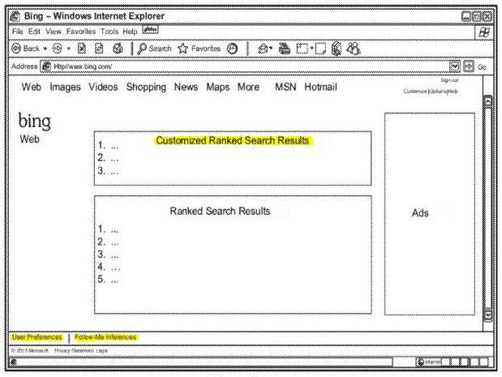

*While Google’s social search activities have been fairly well publicized and discussed, and in some areas criticized, Bing appears to be fairly busy working on their own social search approach a little more quietly…*

When Google [introduced](https://googleblog.blogspot.com/2012/01/search-plus-your-world.html) their Search Plus Your World social search results this past January, they were to a degree following in the footsteps of Bing, who announced last May that they would deliver Facebook based social search results when you’re logged into Facebook and searching at Bing, in their blog post Facebook Friends Now Fueling Faster Decisions on Bing.

People often share a fair amount of information about themselves on social networking sites such as Twitter and Facebook including what they are presently doing, how they feel and more. An interview by Eric Enge of Stone Temple Consulting, Paul Yiu, who runs Bing Social Search, uncovers some aspects of how Bing’s personalized social search works.

The post, titled [Author Authority and Social Media with Bing’s Paul Yiu](https://blogs.perficient.com/2012/03/12/author-authority-and-social-media-with-bings-paul-yiu/) uncovers some aspects of Bing’s approach to social search that you might not have been aware of if you haven’t been paying attention. The post provides a convenient overview before the start of the interview on how Bing might be calculating things like authorship authority from Twitter (and likely Facebook as well).

A patent application filed by Microsoft published this past week describes how they might look at social activity, including indications of your mood and the topics you and your connections write about, to help deliver personalized results to searchers at Bing.

The pending patent tells us that it might customize search results based upon “inferring a mood and/or interests of the user at least in part from an analysis of the user’s posts on one or more social media sites.” In part, this would be done by incorporating a user-following engine that would follow a person’s activities on social networking sites. The kinds of inferences that it might make could include:

- Emotional state
- Current trending interests
- Future plans
- Likes/Dislikes
- Aspirations

Those inferences might then be used to customize search results.

The patent filing is:

[Following Online Social Behavior to Enhance Search Experience](http://appft.uspto.gov/netacgi/nph-Parser?Sect1=PTO2&Sect2=HITOFF&u=%2Fnetahtml%2FPTO%2Fsearch-adv.html&r=1&p=1&f=G&l=50&d=PG01&S1=20120095976.PGNR.&OS=dn/20120095976&RS=DN/20120095976)
Invented by Douglas C. Hebenthal; Douglas C., Cesare J. Saretto, Kathleen P. Mulcahy, and James E. Allard
Assigned to Microsoft
US Patent Application 20120095976
Published April 19, 2012
Filed: October 13, 2010

Abstract

> Systems and methods are disclosed for customizing a user’s experience with an application such as a search engine. The user’s experience is customized based on inferring a mood and/or interests of the user at least in part from an analysis of the user’s posts on one or more social media sites.
>
> The search engine is configured to include a user-following engine which follows a user’s activities on social media websites. By tracking a user’s posts and other activity on social media websites, and possibly those of his or her friends, the user-following engine is able to draw inferences about a user, including for example the user’s emotional state, current trending interests, future plans, likes/dislikes and aspirations.
>
> The user-following engine may then customize the user’s search experience based on these drawn inferences.

## Customizing a User’s Experience

The user-following engine might follow a person to social media sites and copy their posts and other activities to a data store at the search engine though an alternative approach might not include copying of that information. Whether copied or not, that activity might be analyzed to infer both a mood and interests of the user based upon posts made. In addition to looking at that person’s activities, the activities of their connections might also be tracked and analyzed.

Customization might be done in a couple of ways. One would be to personalize the search interface, by doing things like showing you which of your connections might have “liked” a particular results. The other would be to personalize the results you see by including documents that you might otherwise not have seen based upon your social activities, and those of your friends.

The information monitored by the user-following engine might also derive inferences on mood and interests for a group as a whole to use to “gauge public opinion on one or more topics,” and to identify users who might be “prolific and/or influential in their postings with respect to one or more topics.”

In addition to tracking activities on social networking sites like Facebook or Twitter, it’s possible that activities on blogs might also be included as well. The patent filing includes an example list of social networking sites that might be included in a system like this, including: Facebook, MySpace, Twitter, Linkedin, Ning, Tagged, Classmates, Hi5, MyYearbook, Meetup, Bebo, Mylife, Friendster, MyHeritage, Multiply, Orkut, Foursquare, Digg, Match, and the Xbox Live gaming service.

Some specific blogs are also mentioned as examples as well, such as TMZ, Huffington Post, Engadget, Gizmodo, Mashable, TechCrunch, Gawker, and FanHouse. Facebook comments aren’t mentioned specifically within the patent filing, but that would be something that would make it easier for Bing to track activities on blogs that use them.

The patent filing also notes that while some social activity might be public, other social interactions might only be available to people whom have been granted permission to see that information. Presumably, since you only see personalized and customized results if you’re logged into Facebook, you may be able to see both public and private social information from those social services.

## Setting Up Bing To “Listen” to Your Social Activities (and those of your connections)

For a system like this to work for you, you would need to give Bing explicit permission to access information from different social networking sites. The patent filing describes a couple of possible ways that might be done.

The first method of delegating authority to Bing to access social media sites and act on behalf of the user would be through authentication and authorization protocols, such as OAuth WRAP or OAuth 2.0, allowing a user “to set up the user-following engine to act on behalf of the user on the social media sites.” If you’ve signed into a service like Klout, or a site like [inbound.org](https://growth.org/top), or signed on to leave a comment through your Twitter or Facebook log-in, you’ve used an authentication service like that.

The user-following engine described in the patent application might work with an application programming interfaces (APIs) of those social media sites to gain access to the sites as the user, in accordance with permissions set by that user:

> Once on the site, the user-following engine may track posts of the user, and may have access to posts of the user’s friends. In particular, where a friend posts and sets privileges for the user (and for example none others) to view that post, the user-following engine would have access to that confidential friend post when connected via delegated authority.

Alternatively, a user of this system could set up the user-following engine with permissions so it becomes a connection, and have access to what they post, and possibly also to the posts of the user’s connections.

All users of under this approach might have a user profile service which would store information relating to that user.

There could also be a setup and user preferences module within the search engine that would allow someone to opt into this service, and indicate which social media sites the system would track for that user. The user might provide their name and/or ID on the different social media sites. Upon doing that, a friend request might be sent out from Bing’s system to social media sites that have private user profiles, so that the user can allow access to those profiles if they choose to do so. As I noted above, instead of this friend approach, a user might use a delegation approach to allow access to that kind of information.

Bing might receive a notification when a user of one of the social media site makes a post, or it might monitor the stream of all data from a site.

In addition to tracking the kinds of content presented on these social media sites, this system might also gather collateral data, or meta data, about those activities, such as the time and date of the activity, the type of device used to connect to the social media site, and the location of the user when the connection was made via GPS or some other means for indicating location.

Information about activities conducted by friends or connections on different social media sites, where available, may also be tracked.

The information collected could then be used to draw different inferences about the user, and the user’s connections, based upon their activities. A person using this system might have the option to look at all of the inferences made about their actitives, and could modify or delete them. They could also possibly set up preference rules to prevent the re-occurrence of inferences that they’ve removed.

Other user settings might include rules like “what social media sites, posts or topics the gathering engine is to ignore.” A person could also set preferences regarding friends, so that posts from certain friends might be weighted higher or lower, or posts from some connections might be ignored completely.

## How Bing Might Tell if You’re Happy or Sad or Bored or Mad :)

One approach that might be followed is to look at the words used in posts. Different words might indicate different emotions being experienced by someone. The patent filing cites the technical report Affective Norms for English Words (ANEW): Instruction Manual and Affective Ratings, which contains emotional ratings for a number of words. Those types of rankings might be used to get a sense of a mood behind social activities.

Another approach could be to look for posts that contain emoticons.

A third step could be to look for changes in status indicators, and changes in status, such as “whether the user is in a relationship or single, employed or unemployed, etc.” and if there is a change in that status.

We are also told that a number of other rules, or heuristic tests, might be used to determine emotional states.

The moods of others might be looked at as well, from people who are connected to the a searcher, to people who might be unrelated. For instance, if an event of some type has happened that a large percentage of people using a social network might post about, such as “the death of a popular figure, or the winning of a big game by a team,” that might be considered as well.

This system might find little to support influencing search results based upon moods, or it might find some information that would cause it to look at more posts from the searcher or from others to get a sense of how strongly that emotional state might be. A certain confidence level might need to be reached before search results would be influenced.

The patent application also notes that moods tend to be time dependent, and often transitory, so the influence of different emotional signals might be limited.

Reading through the patent filing, I’m not sure at this point how search results might be modified based upon mood. How would they differ if you seemed to be happy or sad or bored?

## The Influence of Trends on Search Results

In addition to looking at social activity to try to gauge moods, they might also be analyzed to try to detect trending interests of searchers. These could include things like new songs or albums or artists or current events, or many other topics.

A keyword search of the searcher’s posts, with information about frequencies about terms appearing within their posts might indicate trending topics. If the searcher has performed queries at sites, such as a Facebook or Twitter search, those queries might also be analyzed as well to see if they are part of a trend.

Other similar heuristics, or rules, might be looked at to identify trends from an individual and possibly from their connections as well.

## Identifying Geographic Places of Interest

Someone might be planning a trip, or returning from somewhere, and their social activities might indicate some interest in that location. Search queries at the search engines and at social media sites may also evidence an interest in that location as well. Like the identification of moods and trends above, activity from connections on social media sites might also be looked at:

> The posts from the user’s friends may also be analyzed in the same manner in an attempt to discern or confirm a geographic place of interest of the user. It may happen that a user asks for help in finding a vacation spot or other place of interest. The replies from the user’s friends may then help in determining if the user has found a particular place of interest.

## Other Items That Might be Monitored

In addition to moods, trends, and locations of interest, this system could look for other things to personalize search results based upon social activities, looking at their social activities and searches at social media sites.

These could include “**events of interest**” to a user, such as the celebration of a birthday, or attendance at a concert, or an upcoming test at school.

This system could also look for specific **likes and dislikes** of a searcher, such as “an affinity or aversion to certain topics, people, brands, stores, organizations, places and/or things.” In addition to looking at specific topics, this approach could also look at terms included within a post that might distinguish whether there’s a positive or negative feeling associated with those topics. Other signals, such as becoming a “fan” of something on a social network could also indicate a positive feeling about it.

Another aspect of social activities to be tracked might be **goals or aspirations** of a user. Signals that might be looked for could include statements like “‘I want . . . ‘ or ‘I wish . . . ‘ or ‘I hope . . . ‘ or ‘It would be great if . . . ‘”.

## Identifying Interests of Groups

The patent filing also describes a number of ways that the interests of groups of users might be monitored, and some additional ways that information could be used.

These could be used to learn about public opinions on different topics or entities, and could be broken down into different geographic regions.

Another application could be a “prolific fan identification application.” Here’s a description from the patent filing as to how that might work:

> As one example of the prolific fan identification application, a music recording artist may release a new album. The artist wants to tap into his most prolific fans, though he does not know who they are, and reward them for promoting his album. The user-following engine would identify the users who repeatedly post about the artist, which information would be stored in the all users index of the service. An intelligent processing module may be provided which scores the selected users’ posts for positive opinions of the artist.
>
> The number of readers who see, and possibly repeat, the users’ posts may also be factored into the score. The highest scoring users could be given the opportunity to participate in a promotion. The artist would buy a promotion campaign, through the search processing environment or elsewhere, giving each prolific fan a unique purchase URL for his album. The artist asks the fans to include their unique URL in their postings about the new album. The fan with the highest performing URL (measured via sales) would get a cash prize and the opportunity to meet the artist. It is understood that the prolific fan identification application may have a wide variety of other uses in further embodiments.

Another application described might be enabling people to perform “people like you”-type searches.

## Takeaways

One thing made very clear by this patent filing is how much information Bing might be collecting from the social activities of people who enable the search engine to gather that information.

What isn’t as clear is how they might customize search results based upon things like identified moods, or how they might use trend information or some of the other types of information they describe as creating from their different kinds of analysis.

We do have a screenshot that shows a couple of interesting additions. In addition to showing custom results at the top of search results (no guarantee that Bing will separate results that way), there’s also two links at the bottom left of the browser window. One enables you to access your individual preferences, and the other allows you to search for “like inferences,” presumably for “people like you” results.

The patent does provide some indications of commercial uses for this kind of information, such as helping advertisers identify people who might be influential and interested in specific topics.

What impact will the approach described in the patent have on individuals or businesses using social media sites? That’s hard to gauge at this stage in the development of Bing’s social and personalized search. The same could be said of Google’s Search Plus Your World.
