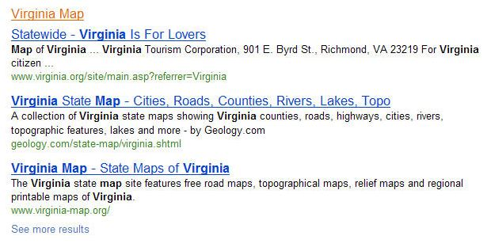

When you search on Bing, sometimes instead of seeing an ordered list of search results, you might see search results broken up into categories. For example, if you search for “Virginia,” your search results start off with an image and link to the state web site, as well as a map. You then see a couple of search results that look pretty relevant for the term.

What comes next is a little interesting. Instead of showing you just more links to web pages like you might see at Google or Yahoo, Bing starts showing you groupings of additional web pages organized by category. There’s a Virginia map category, then Virginia Tourism followed by Virginia Facts, then Virginia Jobs, and finally, Virginia History.

This diversification and grouping of search results is a departure from a paradigm commonly followed by many search engines. When a query term might have more than one meaning, or different categories of results might be equally useful to searchers, Bing may decide to present those search results in different categories, like it does on a search for Virginia. Here’s the first category shown in the Bing results on a search for Virginia:

Bing’s method of diversifying search results raises a few questions, such as:

- What queries should receive categorized search results?
- How are the categories decided upon?
- Why are the categories in the order they are in?
- How are specific pages selected for those categories?

The intent behind a query may differ from one searcher to another. As the patent’s authors tell us, someone searching for “Flash” might be interested in Grandmaster Flash, Flash Gordon, the Adobe Flash Player, a camera flash, or a town named Flash (a village with the highest elevation in England). Because there may be a number of different intents behind some queries, Bing takes a different approach in returning results for some searches than Google or Yahoo.

Before showing search results, Bing may attempt to identify categories that a query may belong to, rank those categories in an order, decide how many categories to show, and how many results to show for each category.

The Microsoft patent application is:

[Methods and Apparatus for Result Diversification](http://appft.uspto.gov/netacgi/nph-Parser?Sect1=PTO2&Sect2=HITOFF&u=%2Fnetahtml%2FPTO%2Fsearch-adv.html&r=1&p=1&f=G&l=50&d=PG01&S1=20100153388.PGNR.&OS=dn/20100153388&RS=DN/20100153388)
Invented by Sreenivas Gollapudi, Rakesh Agrawal, and Samuel Ieong
Assigned to Microsoft
US Patent Application 20100153388
Published June 17, 2010
Filed: December 12, 2008

Abstract

> Methods, apparatus, and systems directed to receiving search queries, retrieving documents, computing the number of categories to present for a given query, computing the number of results to show in each category, computing an ordering of categories, and for all the result pages beyond the first page employing user interface elements that optionally allow the user to quickly zoom in on a specific category and get more results belonging to that category.

Under the patent filing, this process has a number of steps. The first couple may be to create a taxonomy for categorizing documents and queries, and an authority score for documents in its index. The creation of a taxonomy and authority scores can happen independently of any searches from a searcher.

What happens next is in response to a search.

A query is received by Bing from a searcher, and it is assigned probabilities that it is in one or more categories within the created taxonomy. If the probability that a category is a good match for a query is above a certain threshold, than that category may be included within the search results.

Pages are then retrieved for each of those categories based upon their authority scores. The number of categories that are decided upon for a query may determine how many pages are shown in each category – if more categories, Bing might show less pages for each category. If there aren’t many categories for the query, Bing may show more pages for each of those categories.

A combination of looking at the probability scores for categories and authority scores for pages within those categories will determine the order that categories are shown in search results. The patent application describes a few different approaches to using those scores to determine ordering, and some examples to illustrate how they might work.

What it doesn’t provide, which I would be interested in finding out more about, is how authority scores might be calculated for pages that might appear in each of the categories. That approach may may be similar to the ranking scores used in response to a query when Bing doesn’t break search results up into categories.

**Conclusion**

I’ve been seeing these kinds of categorized search results from Bing for a while, but couldn’t find anything from Microsoft on how they might select categories to display in response to those queries.

While I’ve found the categories useful, I’ve been wondering how most people react to Bing showing results in categories like this. I imagine most searchers have gotten used to seeing what might be considered the best results at the tops of search results pages.

It’s possible that Google and Yahoo might also attempt to diversify search results they show by associating categories with queries, and ranking some pages higher in order to show a diverse set of pages to meet different intents behind some queries that may have more than one meaning. But those search engines don’t explicitly display categories the way that Bing is for some queries.

How do you feel about Bing’s categorized search results?
