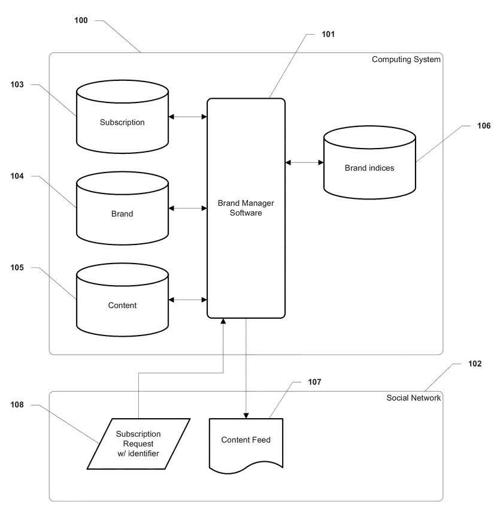
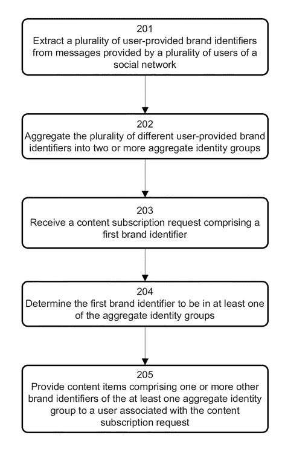
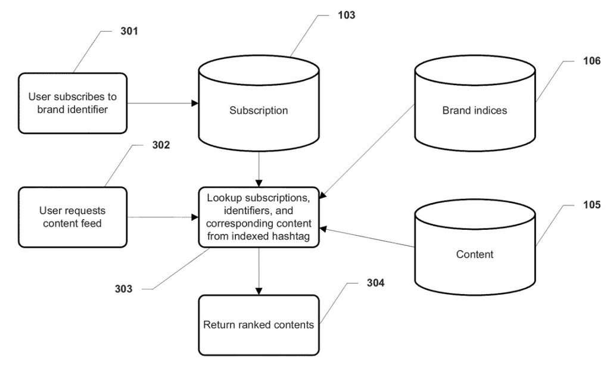
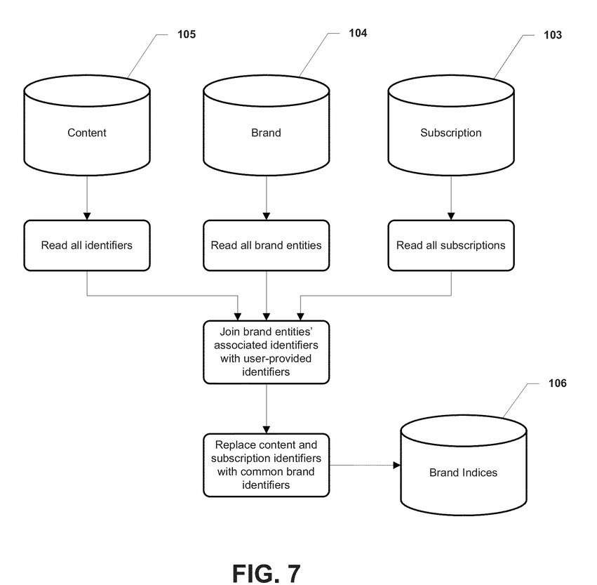

The “Buy” Button is coming to Google shopping Results.

Recode reported that [Google Confirms “Buy Button” Is Coming](https://www.theverge.com/2015/7/15/8969943/google-search-buy-buttons-announced). The Moz White Board Friday this week had Rand Fishkin asking, and answering the question, [Is Brand a Google Ranking Factor?](https://moz.com/blog/is-brand-a-google-ranking-factor-whiteboard-friday)

_My Secret Identity, [Thomas R. Stegelmann](http://web.archive.org/web/20121208023542/http://www.flickr.com:80/photos/thomasrstegelmann/), [Some rights reserved](https://creativecommons.org/licenses/by/2.0/)_

I left a comment at Moz, part of which, after some research, I’d like to retract some of. I wrote:

> Brands likely are not the subject of too many discussions between search engineers at Google, but if brand builders are doing their job well, and people who work with them help to create a mindset that permeates their company, and surrounds how people think of them and write/talk about them, that can have a positive impact.
>
> We likely do see how Google treats specific entities in queries and search results as being special, and since a brand is an entity, that does happen to them. Build a brand, and Google may treat your business as a unique entity and provide you with a knowledge panel, and other indications that they recognize the uniqueness of your brand.

It was important to mention that Google may link together entities and treat brands in positive ways. However, search engineers at Google do appear to have discussions about brands. There are patents at Google that mention brands and how those might be used. A Google patent about brands that stood out to me is a pending application involving a process that we may see happen at Google+ and discusses mentions of brands in a social network.

## Brands Can Help with the Empty Room Problem

There have been many tech blogs referring to Google+ as a Ghost Town, and this patent seems to see brands as one way to help solve that problem. Its inventors tell us:

> Consumer community products such as online social networks and online forums often face a challenge in onboarding known entities such as celebrities, retailers and manufacturers. These brand entities are often great sources of content and great proxies for new member’s lifestyle choices because of their popularity, making them critical for adoption and expansion of the community product. For many community products, failure to attract well-established brand entities early results in the “empty room” problem because new members do not know or trust other members enough to subscribe to their content and are unwilling to do the work to get to know others. This is triggered by low content consumption, low subscription rates, and results in low creation from de-motivated content creators.

_[Sinister Seymour at the Haunted Shack, Knott’s Berry Farm, circa 1973](https://www.flickr.com/photos/ocarchives/4724924332/in/photolist-8cwtoC-7XJWY2-8MTNaC-pZPMcC-7XK6sV-qEmuCa-aqafz-6BCuGq-fe8SKe-p17rgX-6C9fZR-jCCiR-bQKWQR-97Cgrg-76Djtm-6BCsSf-8ZpR4R-76zpo8-kK7oXq-539FJC-76DisC-ja7u8M-535om2-535oXF-97Ch92-bEawbz-qVo5Jh-pzsvhC-geNe5d-5kj4fr-aoxE8W-6CdnDL-535nUK-6BymCv-6BCrgj-6BCp4Y-6Bygnr-aouUGP-oFBFDg-oYK9Hk-9hs19U-qUPTxs-dNL2Di-GqNxX-GqJLQ-GqGFN-oHTp11-qFqwiF-4knhnr-68HvdD), [Orange County Archives](https://www.flickr.com/photos/ocarchives/), [Some Rights Reserved](https://creativecommons.org/licenses/by/2.0/)_

Direct interaction with brands may be helpful to a social network, but content about brands, but not by the brands themselves, may also hold value. The patent also tells us that consumer community members share content about brand entities, even brand entities that have not yet joined the community (I like that the patent refers to these as “brand entities” rather than just “brands”, especially after Google told us this week at Google I/O that they have over 1 Billion entities indexed). But to get value from content about brands, there’s a need for content creators. What the patent’s inventors then tell us is that:

> Without a clear mechanism for organizing relevant content regardless of prior relation to the content creator, consumer communities invariably suffer from the chicken-and-egg problem between content creation and discoverability.

We are also told that Brand entities may be hesitant about investing in a new marketing channel until they can be convinced of some return on investment (ROI). That’s likely true.

## Crowdsourcing the Identity of Brands

That is the problem this patent attempts to address. We are told that it “provides a system and method for crowdsourcing user-provided brand identifiers and distributing content based on crowd-sourced identifiers.” What this may mean for Google to be:

Taking a number of different user-provided brand identifiers from messages written by the users of a social network, and aggregating those into two or more identity groups, and enabling people to subscribe to content based upon those brand identifiers.

Features of this approach can involve:

- The user-provided brand identifiers may be **hashtags.**
- The content items may be social media messages.
- Members of the social network can indicate a desire to receive brand-related content by subscribing to a brand identifier of the respective aggregate identity group.

This approach may aggregate a number of different but closely related hashtags, or brand identifiers together, score those based upon a popularity rating, and make them available in an activity stream, in connection with “the associative brand identifiers.” That seems to be one of the main focuses of this patent, and a section of it where they identify this as a problem to be addressed tells us:

> Brand identifiers in the form of hashtags and other user-provided identifiers may be used to aggregate data on popular social networking services. However, there may be many disparate hashtags used by different members of an online social community for the same purpose, and no service has been able to tie these disparate tags to one another or, ultimately, to a brand entity (e.g., a celebrity, retailer, or manufacturer). Certain applications have been implemented to identify keywords and their relationships to known entities, but these implementations are not concerned with using disparate keywords to subscribe to content on a community product, where such association is critical for content discoverability and community growth.

By taking these different brand identifiers for subject matter (e.g., hashtags) used by community members, and consolidating them into groups, and associating the groups with established brand identities, this allows for crowdsourcing of content related to a brand. This can enable content managers to also remove or add identifiers to or from a group.

The patent identifies these as the advantages of the approach described within the patent:

- Problems with getting relevant content about a brand is reduced.
- Community owners are given a way to attract new members without well-established brands being members and avoid empty room scenarios.
- Brands are more likely to be seen as a proxy about lifestyle choices, tastes and interests than unknown community members.
- Data about how popular a brand identity has become within the community may be help attract brand entities.
- Data may also be provided about top promoters of those brand entities, to give examples for others on distributing content.

The patent also tells us that it may reward content creators efforts to provide distribution and a possibility of prominence in association with a popular brand, by encouraging them to provide more meta information in connection with their content. This kind of Meta information provided by content managers to their content may have additional rich information (such as prices, locations, styles, and the like) that can automatically be associated with the content allowing the subject technology to make other inferences about the brand identity and community members who interact with the content.

One thing that it doesn’t say is that it might allow for the introduction of “Buy” buttons in their content, which sounds like a very real possibility (if they show up in search Results pages, they why not in a Google+ community about an entity?) But this kind of rich data is of the type that could result in [rich snippets](https://developers.google.com/search/docs/guides/intro-structured-data) showing up for it in search results, like event schema Markup.

Some other things described in the patent include, the ability of new members of a community to quickly subscribe to feeds of content about well-know brands, even before these brands are present on the product and that can help to mitigate the empty room problem as well as “improve distribution of early adaptors content.” Those feeds can also provide relevant data to product owners about which brands are popular and worth pursuing partnerships with. Such an approach by a social network may also “serve as an incentive for drawing brands, voluntarily, to the community product by making it clear that the brand has a ready audience for its content.”

The patent is:

[Crowdsourcing user-provided identifiers and associating them with brand identities](https://patents.google.com/patent/US20140250192)
Publication number: US20140250192 A1
Publication date: Sep 4, 2014
Filing date: Mar 1, 2013
Priority date: Mar 1, 2013
Inventors: Twum Djin, Andrew Chang Huang, Timothy Youngjin Sohn, Jacqueline Amy Tsay, Hiba Wasef Fakhoury
Original Assignee: Google Inc.

Abstract:

> A system and method for crowdsourcing user-provided brand identifiers and distributing content based on crowd-sourced identifiers is provided. Different user-provided brand identifiers are extracted from messages provided by users of a social network. The identifiers are aggregated into two or more aggregate identity groups.
>
> When a brand identifier associated with a user request for content is determined to be in at least one of the aggregate identity groups, content items comprising one or more other brand identifiers of the at least one aggregate identity group are provided to the user.

## Take Aways

The patent does provide even more details about this approach, but the patent application was published in September of 2014. It’s not a granted patent, only a pending application at this point, so if the process described within it isn’t live yet, that’s understandable, we could see it take place still.

Bringing “Buy” Buttons to Google Search Result pages seems like one way to move something like this forward.

Imagine being interested in a product, and being able to subscribe to content about it that might surface at Google+, and the same source that allows you to subscribe to that content also allows you to make purchases from that brand.

This does seem to be a way for a Brand Entity to have more information about it shared on Google+.

That’s definitely another benefit for a company or persons to being perceived as a brand.

#hashtags #Brandentities
