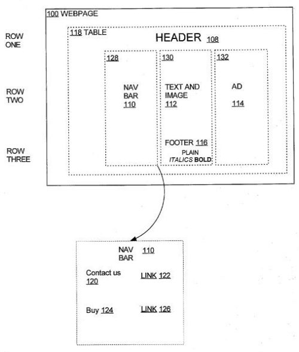

Towards the end of 2003, researchers at Microsoft published a paper on the way to analyze the structure and content of Web pages which they called VIPS, or [Vision-based Page Segmentation Algorithm](https://www.microsoft.com/en-us/research/publication/vips-a-vision-based-page-segmentation-algorithm/). The approach looked at the visual and structural aspects of web pages. It meant that a search engine could identify different parts of pages and possibly understand that some parts could be more important and meaningful than others.

This could have many implications for search and information retrieval and search engine optimization as well.

A newly published patent application from Yahoo provides another look at how web pages could be segmented into parts and provides many heuristics, or rules, that a search engine might follow in segmenting the content of a web page, along with several examples.

**Why Would a Search Engine Use Page Segmentation?**

Analyzing the structure and content of a web page can be very useful to a search engine when finding pages relevant to search queries. Since search engines attempt to return pages in response to searches relevant to query terms that the searcher supplies, those terms should appear in the main content.

The patent starts with a couple of examples of problems that happen when a search engine can’t distinguish between the main content and unrelated content that may appear in other parts of a page.

> Consider, for instance, a webpage containing lyrics of a song X, but with links at the bottom of the page to other pages containing fragments from lyrics of other popular songs Y and Z. A search query for Y and Z will match this page since both Y and Z are mentioned on the page; however, the page does not contain the information the user is looking for.
>
> Similarly, Y and Z may be text in the advertisements appearing on the webpage.
>
> In another instance, a search for “copyright for company X” ought to return the main legal web page for company X, and not every page in that website has a small “copyright” disclaimer at the bottom.

Terms and phrases that appear in navigation pointing to other pages, in advertisements, and in boilerplate that may appear on every page may not be ideal pages that should appear in search results. Likewise, a page that contains those terms may not even be the best choice of pages on a website for those terms:

> As another example, a New York Times webpage may have a headline bar, sports, news items, and a copyright notice. A user may search for keywords such as “New York Times legal information.”
>
> There is probably some webpage on the New York Times website that provides much legal information. But the keywords may also match a news page that does not provide the relevant search results. To provide more meaningful information about a webpage, it is useful to figure out that the webpage is mainly about the news item. The other content available on that webpage is slightly relevant but not the most important in that webpage.
>
> Thus, splitting up a webpage into different sections is useful to provide more relevant search results.

A page may be broken down into multiple blocks, such as main content, heading, footer, advertising, main navigation, and so on. Each block could be considered a separate segment and a separate semantic unit of a page that may be unrelated to the other segments. Some blocks could be joined together into one segment if they may appear to be related. Other blocks may be broken down into smaller blocks. The patent filing describes rules that it might follow to join blocks together or separate blocks into smaller units.

Another patent filing from Yahoo, which I discussed in [The Importance of Page Layout in SEO](https://www.seobythesea.com/2008/03/the-importance-of-page-layout-in-seo/) detailed how the search engine might identify different parts of pages to try to find the most important parts of the page. This segmentation approach takes that a few steps further.

**Some Other Benefits of Using Web Page Segmentation**

In addition to improving search by placing more weight upon the content found in the main content area of a page, there are other reasons why segmentation of a page can be helpful.

For instance:

1) A page may contain segments that focus on different topics, such as on a news page, and segments of that page may be given categories that differ from each other.

2) Web search results usually show the title to a page, a snippet about the page (sometimes taken from the page’s meta description and sometimes from other sources such as the page’s content), and a URL to the page. Segmenting a page into parts may improve how a snippet is created for a page if taken from the page’s content by concentrating upon using content found in an appropriate segment – such as the main content of the page rather than a sidebar or a footer.

3) An entry point into a page (perhaps links shown under the main search result like Google’s site links or Yahoo’s quick links) could be more easily found because the site’s main navigation is more easily identified during the segmentation process. If the site’s main navigation accurately identifies how the site is organized, it could help provide ways into the main parts of a site.

4) Frequently Asked Questions (FAQs) pages can be more accurately segmented.

5) A page with multiple parts, such as a review page covering many products or restaurants, might be segmented into parts that could be used elsewhere. For instance, Google described how they might use a Visual Gap Segmentation process in a patent filed in 2006 for reviews in local search, which I wrote about in [Google and Document Segmentation Indexing for Local Search](https://www.seobythesea.com/2006/07/google-and-document-segmentation-indexing-for-local-search/)

6) Not specifically stated in the patent filing, but links found in different segments may be treated differently. A link from a page’s main content may be considered “higher quality” than a link from an advertisement or a sidebar and may pass along more link equity or something like PageRank.

**Page Segmentation Approaches**

*Document Object Model (DOM)*

The patent also starts with a discussion of some different approaches to segmenting a page into blocks, including looking at a DOM, or Document Object Model, for understanding the different parts of a web page. Just looking at the different elements of a web page to see how they might be organized may not provide enough information for a meaningful method of segmenting content found on a page. The patent provides the following example to tell us about the limitations of just using a document object model to segment a page:

> DOM trees were not meant to describe the semantic structure but to merely describe presentation. Therefore, simply examining the web page’s DOM tree to determine the web page segments will result in some missed segments. For example, assume a table of camera models, camera descriptions, and camera prices, separated into the table’s columns. The column of prices should be a segment because the column contains just numbers. However, nodes in the DOM tree of the webpage that represent the camera prices may not have the same parent in the DOM tree.
>
> The nodes representing different camera prices may have different parents because the children nodes of the table node are row nodes, not column nodes. Under these circumstances, each price node may have a different parent node because each price node is on a different row. Thus, due to the DOM specification, no one node in the web page’s DOM tree represents the camera prices column. Therefore, the camera prices column cannot easily be a segment by looking at the DOM tree. Existing approaches fail on many such web pages.

*Visual Segmentation*

In addition to looking at document object model information to break a page into blocks, it can be useful to look at the visual layout of a page, looking for visual lines between sections of pages or white space.

If a page is analyzed for how it appears visually, broken into little blocks, and then explored to see how the content of those different blocks relate to each other, then some sense of which blocks belong together and which don’t might make sense. Blocks with different background colors, or which are separated by horizontal or vertical lines, use different font sizes or colors or styles or separated by white space, maybe within different segments.

A visual segmentation of a web page may also miss some segments on some web page configurations.

The patent filing provides a set of five heuristics or rules (listed in the abstract below) that it might follow in segmenting pages.

[Automatic Visual Segmentation of Webpages](http://appft.uspto.gov/netacgi/nph-Parser?Sect1=PTO2&Sect2=HITOFF&u=%2Fnetahtml%2FPTO%2Fsearch-adv.html&r=1&p=1&f=G&l=50&d=PG01&S1=20090177959.PGNR.&OS=dn/20090177959&RS=DN/20090177959)
Invented by Deepayan Chakrabarti, Manav Ratan Mital, Swapnil Hajela, and Emre Velipasaoglu
Assigned to Yahoo!
US Patent Application 20090177959
Published July 9, 2009
Filed: January 8, 2008

Abstract

> To provide valuable information regarding a webpage, the webpage must be divided into distinct semantically coherent segments for analysis. A set of heuristics allow a segmentation algorithm to identify an optimal number of segments for a given webpage or any portion thereof more accurately.
>
> A first heuristic estimates the optimal number of segments for any given webpage or portion thereof.
>
> A second heuristic coalesces segments where the number of segments identified far exceeds the optimal number recommended.
>
> A third heuristic coalesces segments corresponding to a portion of a webpage with much-unused whitespace and little content.
>
> A fourth heuristic coalesces nodes with a recommended number of segments below a certain threshold into segments of other nodes.
>
> A fifth heuristic recursively analyzes and splits segments that correspond to webpage portions surpassing a certain threshold portion size.

**Brief Overview of the Process**

1. A document object model (DOM) tree for the web page is created and annotated with information about where the contents for each element appear on a page that has been rendered visually.

2. Second, HTML tags at each node are classified as block separators, text formatters, or text layouts.

*A block separator node* – these create divisions in web pages, such as a line break (br) which would create white space between parts of a page, or a horizontal rule (hr), which could be used to render a line between text.

*A text formatter node* – affects the display properties of text, such as bold (b), paragraph (p), italics (p), font style or size or color (font). These elements can indicate that the test associated with them should not be separated into different blocks.

*A text layout node* – these group things together and can indicate the layout of a page, such as divisions or sections (div), cells in tables (td), and rows in tables (tr).

3. Nodes are then assigned blocks.

4. Blocks may be merged to reduce the overall number of blocks.

5. Different heuristics detailed in the patent filing may reduce or increase the number of blocks as necessary. Whatever blocks remain are determined to be segmented.

**Conclusion – Implications for Site Design and SEO**

A long-standing convention that many holds when thinking about how search engines index content found on the web is that search engines consider all of the content of a single page when indexing that page.

However, the Microsoft paper that I linked to at the start of this post on Vision-based Page Segmentation was published a full six years ago and describes how a search engine might break a page down into parts to index content from those parts of pages instead of the full page itself. Microsoft has followed up that paper with a number of others that explore the segmentation of pages in more detail, and has developed other approaches that go in somewhat different directions such as [object-level indexing](https://www.seobythesea.com/2008/06/how-search-engines-can-index-pages-in-parts/) – also see my post on [Microsoft’s granted VIPS patent](https://www.seobythesea.com/2008/09/microsoft-granted-patent-on-vision-based-document-segmentation-vips/) and on an approach from Microsoft for identifying [the most important block](https://www.seobythesea.com/2008/05/search-engines-web-page-segmentation-and-the-most-important-block/).

The post I linked to about Google’s patent on identifying Visual Gaps in pages, which was granted earlier this year, not only discusses using page segmentation to identify different reviews that appear on the same page but also refers in a short paragraph at the bottom of the patent that they may use visual segmentation to identify different parts of pages. Here’s that section:

> [0047] Although the segmentation process described concerning FIGS. 4-7 was described as segmenting a document based on geographic signals that correspond to business listings. The general hierarchical segmentation technique could more generally be applied to any signal in a document.
>
> For example, instead of using geographic signals that correspond to business listings, images in a document may be used (image signals). The segmentation process may then be applied to help determine what text is relevant to what image.
>
> Alternatively, the segmentation process described regarding acts 403 and 404 may be performed on a document without partitioning the document based on a signal. The identified hierarchical segments may then be used to guide classifiers that identify portions of documents that are more or less relevant to the document (e.g., navigational boilerplate is usually less relevant than the central content).

If you design web pages or perform SEO on a site, getting a sense of how a search engine might segment the content it finds on web pages is something you should investigate if you haven’t started already. It’s a concept that has been around since before 2003.

It can determine which content on a page might be indexed or ignored, how much weight different links may carry, where content for creating search result snippets may be taken from, what the most important image on a page might be—other aspects of how a search engine interacts with the content it finds and segments on web pages.
