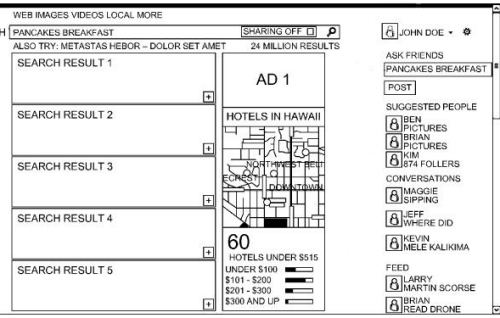

Bing has been showing searchers some social annotations and enhancements for a while now, if you were logged into Facebook when searching at Bing, like a friend who might have liked a particular result in Facebook. They started delivering even more social search results in a social sidebar at the beginning of this month, which they announced in their blog post, Social Meets Search with the Latest Version of Bing, Available to Everyone in US Today.

Those search results might seem like a response to Google’s “Search Plus Your World” social search results, though the Bing social results may be more social and more interactive than Google’s social results. A patent application from Microsoft published last week provides some hints as to when they might show social results to searchers based upon some different relevance signals between a person’s current query and their connections, or buddies queries that might have been related. And yes, Bing refers to social connections or friends using the term “Buddies.”

The Bing post told us this as their justification for providing social search results:

> Most things in life are better with people you trust; in fact, more than 90 percent of people reported they are likely to seek the advice of friends and family as part of their decision-making process around events, purchases, travel, and said they will even delay a decision to first get input from family and friends.
>
> We designed the new social features in Bing to make it easy to exchange ideas, share opinions and take action, giving searchers the same confidence they get from bouncing an idea off a friend. With Bing, it’s easier than ever to get that input and go from searching to doing.

It’s interesting that they described these social results in terms of decision making, especially after a series of TV advertisements announcing Bing as a “Decision Engine,” without really describing what a decision engine might be. I had taken it to mean that Bing would provide results in a way that was a little more interactive, and would allow people to more easily modify their search results to allow them to better control what they might see. In Bing’s social results, that might be true, with the input and help of others.

The patent filing makes a strong point of showing how Bing addresses concerns about privacy and the sharing of what others you have connected with have searched for or seen in search results. It also describes a number of alternative ways that they might display results that buddies have interacted with, such as inline within search results, or in a side panel. Another set of alternatives may involve the decision to only see results from some individuals, or from specific groups of buddies, or all social connections.

Both search results and query refinement suggestions from Buddies are included in social search results from Bing, as well as a way to interact with others, comment on their social posts, and share search results while asking questions.

The patent application is:

[Social Network Powered Search Enhancements](http://appft.uspto.gov/netacgi/nph-Parser?Sect1=PTO1&Sect2=HITOFF&d=PG01&p=1&u=%2Fnetahtml%2FPTO%2Fsrchnum.html&r=1&f=G&l=50&s1=%2220120158720%22.PGNR.&OS=DN/20120158720&RS=DN/20120158720)
Invented by Qing Luan, David S. Korn, Juan Bouvet Mendoza, Kimberly M. Vlcek, Wei Mu, and Sandy Wong
Assigned to Microsoft
US Patent Application 20120158720
Published June 21, 2012
Filed: February 29, 2012

Abstract

> Embodiments of the present invention enhance the search experience of a user by looking at the search history of one or more friends to provide search enhancements to the user. The search enhancements may also be based on information within a user’s online social network.
>  Search enhancements based on the user’s online social network include:
>
> - Identifying people within the user’s social network that may have information relevant to a query,
> - Posts within the social network that are relevant to the query, and
> - Feed items.
>
> Examples of search enhancements include an annotation or graphic adjacent to a search result indicating the search result has been visited by one of the user’s friends. In another aspect, alternative queries from the friends’ search history may be suggested to the user during the search session.

The patent filing includes some related capabilities and features that might be implemented on a “social pane” in Bing. These include the ability to comment upon and annotate posts displayed, the offering of friend suggestions, and an additional feature that might display posts or criticisms about a query from bloggers or writers who have been identified as being authorities on topics relevant to a searcher’s query, even if they aren’t connected to the searcher in a social network.

But the section that really interested me was how Bing might decide that a Buddy’s search activities are related enough to a searcher’s query so that they might display that Buddy in those social results.

## Relevance of Buddy Queries

While Bing appears to have chosen to show Buddies activities in a social panel on the right side of search results, another alternative would have been to show them inline with regular search results. These buddy results might have been show above regular search results, and they might have been ordered in a way so that the more buddies involved with a search result in some manner, the higher the result would have been listed.

Buddy queries (and results) may be determined to be related to a searcher’s current query if:

1. The Buddy query produces at least one search result that is in the same category as the current query and that was visited by at least one Buddy in response to a Buddy query.
2. The search results visited in response to the Buddy’s query are in the same category as the current query.
3. The Buddy query returned one or more search results that are also within the search engine results page for the current query.
4. Both the Buddy query and the current query have resulted in the selection of the same results in their sets of search results (though not necessarily by the person performing the search for the current query).
5. The Buddy query and the current query have a category in common.
6. The current query is related to a Buddy search result if they have a keyword in common.
7. A search result from the Buddy search history information must also be in the set of search results for the current query to be considered related.

Query suggestions based upon Buddy activities might be offered to searchers in addition to search results if they are determined to be related to a current query based upon similar factors to those listed above.

If those query suggestions are shown inline with search results, they might be offered to searchers before the search results, or presented after them.

## Take Aways

Bing describes how you might Ask friends for ideas about a search by posting your questions to social connections, and including links to search results with your question. What actually gets shared between people who are connected, within that social sidebar, may depend on a number of relevance signals, like those that I listed above.

You can also find and ask people who you aren’t connected to in social networks as well:

> In addition to your friends from Facebook, Bing also identifies experts and enthusiasts who probably aren’t in your social network but who might know about the things you’re searching for, based on what they’ve written, blogged, or tweeted about. You’ll find them under PEOPLE WHO KNOW.

These “people who know” who aren’t part of a searcher’s social network might be selected based on expertise in the query’s subject matter. The patent application also tells us that some other signals might be involved, such as when that person is liked by or followed by the searcher’s friends, even if they aren’t followed by the searcher. The total number of followers they have may also be considered.

It’s possible that the expertise of “people who know” about a topic might be identified based upon the process I described when writing about a different Microsoft patent in my post, [Microsoft Weighs in on Ranking Authors in Social Networks](https://www.seobythesea.com/2012/05/microsoft-on-ranking-authors/)
