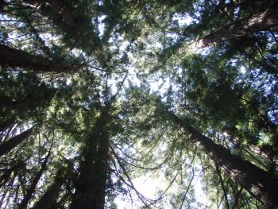

> No sane man in the hands of Nature can doubt the doubleness of his life. Soul and body receive separate nourishment and separate exercise, and speedily reach a stage of development wherein each is easily known apart from the other.
>
> Living artificially we seldom see much of our real selves, our torpid souls are hopelessly entangled with our torpid bodies, and not only in there a confused mingling of our own souls with our own bodies, but we hardly possess a separate existence from our neighbors.
>
> [John Muir](http://archive.org/search.php?query=John%20Muir%20AND%20mediatype%3Atexts), John of the Mountains, p. 77

This week’s green post looks at a way of building that has become a life style for the people who practice it, and points out some green news and blog posts that I thought were worth sharing.

I hadn’t heard of the natural building movement until a few weeks ago, when my girl friend pointed out the 5th annual Natural Building Colloquium, taking place from July 27, 2008, through Saturday, August 2, 2008, at the Thunder Mountain Retreat Center near Bath, New York. The week long event is a hands on learning experience, covering topics like:

- Strawbale
- Cob
- Timber framing
- Earth sheltered buildings
- Straw-clay infill
- Community-supported agriculture
- Living roofs
- Thatching
- Renewable energy (wind, solar, and more)
- Natural plasters & finishes
- Building with hemp
- Alternative fuels
- Log cabin construction

It looks like a fun way to spend a week. The Natural Building Network also has an international calendar of workshops in 2008, focusing upon natural building methods.

I’ve been seeing a lot of images of eco friendly skyscrapers and [homes](https://www.greenhomeguide.com/) lately, which focus upon making buildings that use environmentally friendly building practices and materials, and renewable energy resources like solar panels. But the natural building movement goes beyond that to a way of building that “places the highest value on social and environmental sustainability.”

It focuses upon using local materials that are plentiful, or recycled, producing energy and capturing water locally. It’s a technology that is built by hands instead of machines.

It looks like it would be fun to construct and live in a naturally built home.

The US Green Building Council just releases their [Green Home Guide](https://www.greenhomeguide.com/). It provides a number of ideas and suggestions for renovation and retrofit projects that people can undertake to make their homes more green friendly. These aren’t naturally built homes, but we can’t all live in houses made of strawbale and cob, can we?

**Some other stories that I noticed this week from Green Blogs:**

This Saturday night, lights are going off across the world at 8:00 pm locally in each time zone to make a statement about climate change as part of [Earth Hour](https://www.earthhour.org/). The cities of Atlanta, Chicago, Phoenix, San Francisco, Ottawa, Montreal, Toronto and Vancouver are all participating, and I will be, too.

National Geographic launched a new magazine, called The Green Guide. It’s a quarterly magazine, but the web site looks like it contains a lot of information and blogs that won’t be available on paper.

I’m not a vegetarian, but I like variety in my diet, and this article has some nice suggestions for making dinner time part of a more sustainable life style – Ten Tips for Greening Your Plate with More Meat-free Meals

I remember seeing few chickens running around the streets of Philadelphia a couple of years ago when shopping at the Italian Market, and thinking that farm animals would be the last thing I would see in the City. So, I got a kick out of The City Chicken Project, in New York City.

One of the oldest methods of supplying drinking water to a home is experiencing a revival – [Increasing water security with rainwater catchment](https://www.expertsure.com/2008/03/23/increasing-water-security-with-rainwater-catchment/).

I’ve been seeing a lot of posts about cars that get 200 miles to the gallon, and may someday roll off production lines, maybe. Until then, the Engine Repower Council is touting the environmental benefits of rebuilt/remanufactured engines. Thanks to [Gas 2.0](https://enrg.io/) which weighs in on the practice in Need a New Car? Nope, Just a New Engine!.

I’ve been trying to replace a lot of the lights in my home with those curley-cue compact fluorescent light bulbs – they do last a very long time. I broke one while replacing it. I wish I had known more about the dangers of cleaning up the mess – CFLs do contain enough mercury in them for you to be concerned about cleaning them.

How much of an environmental impact does shoe manufacturing have? Shoe stores?

A two part post answers some of those questions, and ends with a nice natural alternative to shoe polish:

- Green Footing Part 1: Much Ado about the Shoe
- Green Footing Part Deux: Local Shoe Subdue
