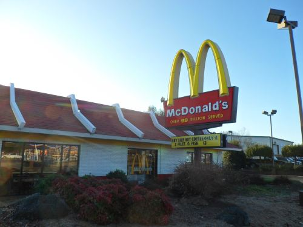

## Length of Local Business Names May Matter in Search Rankings

I love local search. In many ways, it’s similar to Google’s Web Search, but with its unique features. In addition to Googlebot, Local search has street view cars. In addition to looking at links, local search also looks for mentions of businesses that appear with location-based information. Instead of robots.txt files, local search is stopped by signs like “military base,” or “private street.” Local search has differences from Google’s organic search, and understanding the difference can make a difference.

I also appreciate the [local search ranking factors](https://moz.com/local-search-ranking-factors) that a good number of people who are involved in local search have been putting together every year lately, but I’m also a little apprehensive about those, and I’m going to illustrate why with this post. Imagine for instance that Google considers local business names in the way that it ranks those businesses in local search, but that it doesn’t treat all local business names the same. For example, “Frost Diner” might be treated one way by Google Local Search.

And, because it has a somewhat longer local business name, “Red Truck Bakery” might be treated differently by the algorithms that use business names as a ranking signal by Google’s Local Search:

Google has come out pretty clearly and told us that [Local Search rankings](https://support.google.com/business/answer/7091?hl=en) are primarily based upon relevance of local business names, [location prominence](https://www.seobythesea.com/2006/12/google-local-search-patent-application-on-ranking-businesses-at-a-location/), and distance.

So how does the length of the name of a local business name fit into local search rankings?

A Google patent granted last week tells us about how they might use a “webscore” based upon the amount of “estimated” search results that are returned on a search for a local business name. But, if the name of the business is on the shorter side, such as less than a certain number of characters (for example, 10 or less), or less than a certain number of words (such as 3), that web search might not just include the name of the business but also the location name as well.

So Google might take the shorter “Frost Diner” and add “Warrenton Virginia” to it, to create a query of [frost diner Warrenton Virginia], which returns 16,500 (estimated) results

For the longer local business name, Google may just use it in a query, such as [Red Truck Bakery], to see that there are 602,000 (estimated) results for that query.

A search for [frost diner] without the city and state name included in the query ends up with 3,340,000 (estimated) results.

As an aside, this is the first patent I can recall seeing from Google that includes the number of estimated results returned for a query as part of a ranking score.

The patent is:

[Title based local search ranking](http://patft.uspto.gov/netacgi/nph-Parser?Sect1=PTO2&Sect2=HITOFF&p=1&u=%2Fnetahtml%2FPTO%2Fsearch-adv.htm&r=1&f=G&l=50&d=PALL&S1=08122013&OS=PN/08122013&RS=PN/08122013)
Invented by Jiang Qian, Ben Luk, Xinghua An
Assigned to Google
US Patent 8,122,013
Granted February 21, 2012
Filed: January 27, 2006

Abstract

> A method for performing a local search includes receiving a local search request that includes at least a search term and a geographic identification. Business listings matching the received local search request are identified. The business listings are then ranked based on at least a webscore associated with each listing. Each listing’s webscore is based on the listing’s web popularity. In this manner, local search listings are ranked and presented in a more accurate manner.

## Other Potential Ranking Signals for Local Search

This patent also tells us that other features might be added to this local business name web score or a location prominence score for a business:

- Review scores or the sources of reviews associated a business listing might increase or decrease a location prominence score or web score.
- Language within a review for a business may also increase or decrease a location prominence score or web score.
- Financial information for a business, such as annual sales, employment base, longevity, etc. may also influence those scores.

**Redundant Local Business Names**

Because there is only one “Frost Diner” and one “Red Truck Bakery” in the area, they may also get treated differently than “McDonalds” does as well.

So imagine that I do a search to find lunch in the area, and McDonald’s is a possible option.

Since McDonald’s is so short a business name, the query used as part of the web score might be expanded to [mcdonalds Warrenton Virginia], and that web search gives us an estimated result count of 1,690,000. But, there are two McDonalds in the area considered, so that number might be reduced by half. The patent tells us that where there are x business listings in an area that have the same business name, that the web score for each of the businesses in that area might be 1/x. In my local example, that would mean that each McDonalds would have a web score of 1,690,000/2, or 845,000. If there were 10 McDonalds in the area, it would be one-tenth of the raw score, or 169,000.

**Location Prominence**

I linked to a post I wrote about a Google patent on location prominence above, but this patent provides a list of factors that might be considered in determining a location prominence score as well:

A location prominence score might be a combination of factors such as:

- A search ranking value for an authority page associated with the business listing
- A highest search ranking value for any page referencing the listing address
- The number of pages referencing the listing address
- The number of scraped page references (listings at places like Citysearch and Superpages)
- The number of reviews for the listing
- A scaled local business name web score for the listing using a method like that described above.

**Local Business Names Takeaways**

Of course, Google may not be using this particular algorithm, but then again they might be or could be using something similar to it.

This patent seems to be based upon an assumption that the longer a business name is, the more unique it might be, and the more likely that many or most of the web search results returned on a search for the name are going to be about that specific business.

As for business chains, I’m wondering if it’s helpful for them to all share the same name, such as McDonald’s, or to give them somewhat longer and more unique names, such as The Hilton Manhattan East.

After reading this patent, I’m probably going to be paying a lot more attention to the lengths of local business names that I see in search results.

Last Updated May 18, 2019
