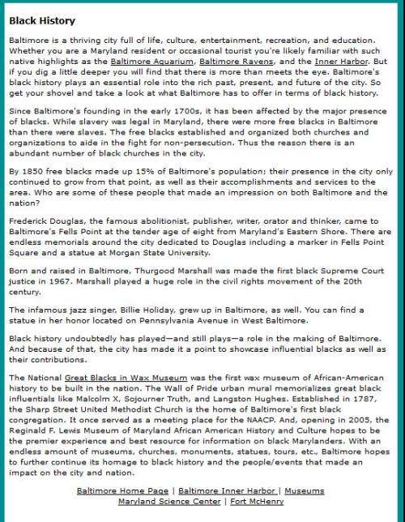
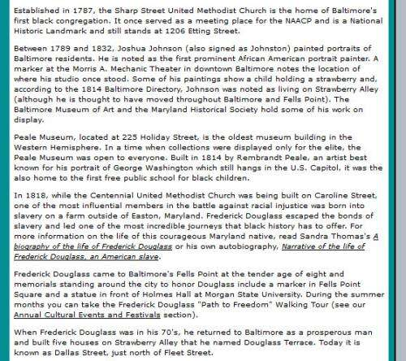

## My Inspiration for Doing Entity Optimization on Sites

One of the sites that inspired me to do entity optimization on sites was Baltimore.org, at the time for the Baltimore Area Convention and Visitors Association, and has since been rebranded to the more memorable, “Visit Baltimore.” In 2005, the Association told us that they wanted a page on Black History and wanted it to rank well for the term “Black History.” (On returning to the site in 2019, it appears that the spirit of this post lives on, with a redesign in progress.)

One of our [early efforts](https://web.archive.org/web/20050207035934/http://www.baltimore.org/baltimore_black_history.htm) wasn’t bad but could not generate a lot of interest and wasn’t shared much by others. We weren’t drawing a lot of traffic to the term black history, and many outstanding pages deserved to rank well for the term. Ours wasn’t competing.

I knew Baltimore had a rich history, filled with historic churches and schools and people that should enable it to do much better.

I woke up one morning with a thought in my head that we were trying to force the term “Black History” into prominence at Google without really giving people a glimpse as to why our page from baltimore.org should rank well for the term. So I went into work that day and asked one of the copywriters I was working with [Lisa Melvin](https://twitter.com/lisamelvin) if she would rewrite the page and ignore any concept of word counts.

Instead, tell visitors about the famous people and places in Baltimore that showed its Black history. Lisa was working remotely, and she couldn’t see how serious I looked at the time, so she had to ask me to repeat myself. I did. And she returned a [lengthy article](https://web.archive.org/web/20051123214439/http://www.baltimore.org/baltimore_black_history.htm) that did just that. The idea was to engage in entity optimization, and she added entities that were important for the topic of the page.

I had told her to put the locations of these historical sites into the article so that people could visit them today. That was part of the goal of a Visitor’s Association website, after all, to get people to visit.

She did.

Here’s a snippet from the page, which shows off history and tells you where to go to see these historical places:

At 3,300 words, this was one of the longer articles we had published on a client’s site.

Within a couple of months, this page on Black History that hadn’t been getting much traffic was the 6th most visited page on the site. Even better, it was bringing actual visitors to the site. Telling people about Frederick Douglas, James Hubert (“Eubie”) Blake, Fanny Coppin, Billie Holiday, and Oprah Winfrey, and their ties to Baltimore were the kinds of things that people wanted to learn about. Entity optimization made this page one that people valued, referred others to, spent time reading, and brought people into Baltimore.

Letting people know where they could see the places where people lived, where events took place, and what kinds of impacts those things had brought them to the website and the City.

We took a page about the words “Black History” and turned it into a real page about Baltimore’s Black History, which made all the difference. It is why I do entity optimization when I have a chance.

I recently wrote a very related post which is worth looking at: [Clustering Entities in Google SERPs Updated](https://gofishdigital.com/blog/clustering-entities-in-google-serps-updated/)

I’ve written a few posts about named entities. These are some that I wanted to share:

- [Do You Have a Named Entity Strategy for Marketing Your Web Site?](https://www.seobythesea.com/2013/12/named-entity-strategy/)
- [How I Came to Love Entities and Start Doing Entity Optimization](https://www.seobythesea.com/2014/10/came-love-entities/)
- [How Google Uses Named Entity Disambiguation for Entities with the Same Names](https://www.seobythesea.com/2015/09/disambiguate-entities-in-queries-and-pages/)
- [How Named Entities Connected to Trending Topics can be used to Address Real Time Search Results](https://www.seobythesea.com/2015/03/how-named-entities-connected-to-trending-topics-can-be-used-to-address-real-time-search-results/)
- [Not Brands but Entities: The Influence of Named Entities on Google and Yahoo Search Results](https://www.seobythesea.com/2010/08/not-brands-but-entities-the-influence-of-named-entities-on-google-and-yahoo-search-results/)
- [How Knowledge Base Entities can be Used in Searches](https://www.seobythesea.com/2014/07/knowledge-base-entities-used-in-searches/)
- [Finding Entity Names in Google’s Knowledge Graph](https://www.seobythesea.com/2014/06/entity-names-in-google/)
- [Google Gets Smarter with Named Entities: Acquires MetaWeb](https://www.seobythesea.com/2010/07/google-gets-smarter-with-named-entities-acquires-metaweb/)
- [Entity Associations with Websites and Related Entities](https://www.seobythesea.com/2014/01/entity-associations-websites-related-entities/)
- [How Google Might Identify Entity Synonyms Using Anchor Text](https://www.seobythesea.com/2014/06/synonyms-for-entities/)
- [Extracting Facts for Entities from Sources such as Wikipedia Titles and Infoboxes](https://www.seobythesea.com/2014/08/extracting-facts-for-entities-from-sources/)
- [Extracting Semantic Classes and Corresponding Instances from Web Pages and Query Logs](https://www.seobythesea.com/2014/09/extracting-semantic-classes-instances-from-web-pages-query-logs/)
- [How Google May Identify Main Entities](https://www.seobythesea.com/2015/04/how-google-may-identify-central-entities-from-resources/)
- [How Google’s Knowledge Graph Updates Itself by Answering Questions](https://www.seobythesea.com/2018/10/how-googles-knowledge-graph-updates-itself-by-answering-questions/)

Last Updated June 26, 2019.
