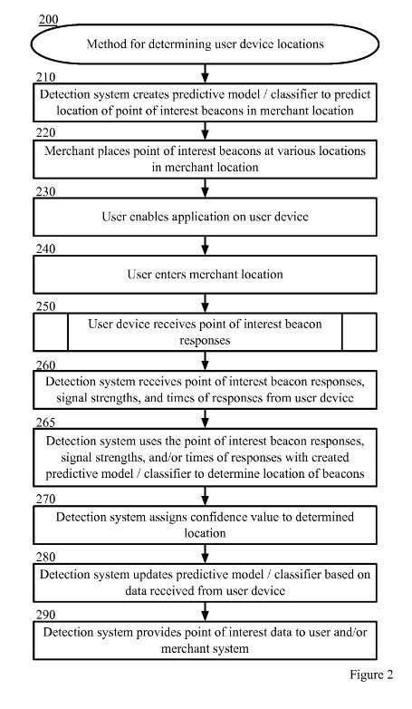

This morning, I ran across the news article [Google reportedly kills plan to let retailers send notifications in Maps](https://www.theverge.com/2015/8/31/9232015/google-here-abandoned-rumor), and I knew exactly what the story was about, without reading past the headline, because I had noticed a patent application that came out on the 20th that described the location-based service in question.

As the story tells us, Larry Page shut the location-based service down after being concerned over how invasive it was. It would offer phone owners notices in Google Maps seconds after they entered a store that had electronic beacons set up in their store. After reading about the cancellation, I thought to share the patent so that you could learn what that was about. The patent is:

[Automated Learning of Store Topography Using In-Store Location Signals](http://appft.uspto.gov/netacgi/nph-Parser?Sect1=PTO1&Sect2=HITOFF&d=PG01&p=1&u=%2Fnetahtml%2FPTO%2Fsrchnum.html&r=1&f=G&l=50&s1=%2220150237463%22.PGNR.&OS=DN/20150237463&RS=DN/20150237463)
Invented by: Matthew Nicholas Stuttle, Salvatore Scellato
US Patent Application 20150237463
Published August 20, 2015
Filed: February 14, 2014

Abstract

> Determining a store topography and/or a user’s location within the topography comprises beacon responses received by a user device. A merchant places beacons at various unknown locations in the store. A user enables an application on the user device that allows the device to transmit probing requests to the beacons and transmit data received in response to the requests to a detection system. The detection system receives the beacon responses from the user device, and using a predictive or trained classifier model, predicts the topography based on the information received. The determined topography may be used to provide information to the user when the user is located in a particular determined location in the topography.

## Location-Based Service Take-Aways

The line from the patent that tells us what the patent is about and tells us that this is aimed at determining “a device located in a merchant store without knowledge of the store’s topography.”

I felt like the patent might go a little too far when I read this line from it:

> Location data from a mobile device can be used for numerous applications. Many applications use the location data for locating friends, playing games, and assisting a user with directions, for example. The location data can also be used to alert a user when the user and the user’s device are in the vicinity of a point of interest.

That seemed like it was in the patent only to try to make people reading it comfortably with a location-based service. It then went on to tell us that the locations of beacons are placed at a “known point of interest” concerning things like new product displays.

As the Verge Story noted, the information could be sent to a person’s phone through Google Maps in response to their device triggering a beacon located in their store. The story seems to make an issue of pointing out that the person receiving a notice from Google Maps hasn’t signed up or installed an app from the particular store they are visiting.

The patent application provides details on the use of beacons within different points in a merchant’s store to transmit data to a device in response to connecting with those beacons.

The location-based search patent itself is aimed at helping Google to understand what the inside of the store might look like, to help map out people’s locations within a store. The patent does tell us that users may be allowed to opt-out of personally identifiable information being collected about them. The system could also be set up so that no personally identifiable information is collected about them, and their geographic location might be generalized when location information is obtained about them.

It does seem pretty invasive, I think it was a good call on Google’s part to terminate the use of this location-based service.
