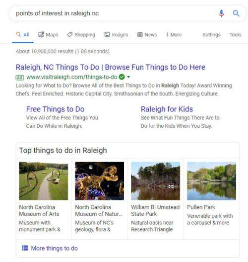
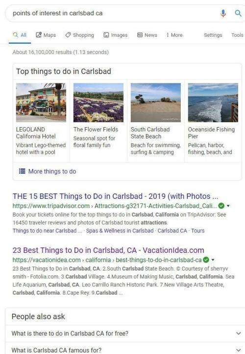
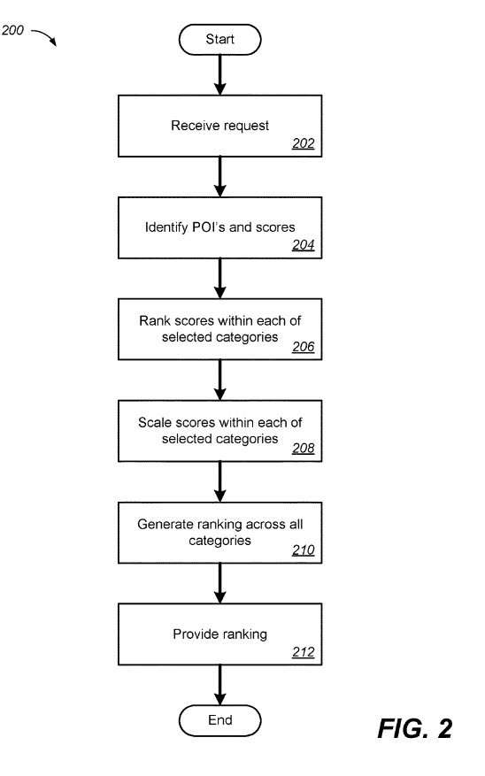

## More Diversity in Search Results

Earlier this year, Google told us that it was making search results more diverse with fewer results from the same domains in response to a query. Search Engine Land wrote about that diversity in the post: [Google search update aims to show more diverse results from different domain names](https://searchengineland.com/google-search-update-aims-to-show-more-diverse-results-from-different-domain-names-317934).

Google earned a related patent in May. It was about more category diversity for different points of interest in geographic organic search results; This post is about Google making localized search results more diverse.

## More Diversity At Google in 2013, in Past Search Results

Back in 2013. Google’s former Head of Web Spam, Matt Cutts, made a video about more diverse search results in response to the question, [Why does Google show many results from the same domain?](https://www.youtube.com/watch?v=sxv-AvNPoh8)

So this isn’t the first time we have heard about efforts from Google in trying to give us more diverse results, and they came out with a patent around that time to provide more diverse results.

I remember a phone call around 6 years ago from a co-worker asking me why a client’s high-ranking organic result might disappear from search results. I asked for the query and the client’s name and ran the search. The top-ranking result was a local result for the client. I told my co-worker what I was seeing, and she told me that our client also had an organic result showing for that query and a local result that wasn’t quite as high. It appeared that the organic result got removed, and the local result became boosted.

By Chance, I had written the following blog post the day before: [How Google May Create Diverse Search Results by Merging Local and Web Search Results](https://www.seobythesea.com/2013/07/how-google-may-diversify-search-results-by-merging-local-and-web-search-results/). I told my co-worker about the patent I had just written and sent her a link to that blog post. We were able to explain what happened to their organic result for that query to our client. It looked like Google wanted more diverse search results, and their page ranking organically was “merged” with the local result.

## Category Diversity in a Patent Granted in 2019

I hadn’t seen anything like that merger between organic results and a local result again after that. It is impossible to tell if Google has been using that merging since then. But that patent was all about providing more diverse search results to searchers. When I see a patent like this new one telling us it exists to provide more diverse search results, I wonder what, if anything, could have gotten removed to make search results more diverse. For example, if someone searches for “things to do in Carlsbad, California,” and they become provided with a list of restaurants to eat at, that would be disappointing because while there are some nice restaurants here, there are plenty of other things to do.

By expanding to a category diversity from diversity-based pages from the same domain, Google gives us more diverse search results.

This new patent tells us about this category diversity in the following way:

> When a searcher asks for points of interest information at a certain location, the local search system may generate a collection of candidate POIs and receives information relating to each candidate POI’s respective category and a score and rank within the category for each, and, for categories a searcher may select, promotes or demotes the score of each ranked candidate POI within its respective category through a scaling process.

It is impossible to tell if Google has already implemented this patent which got granted in May. So I tried some searches at different places to see if they showed diverse results for those places and received the diversity in what I was being shown:

When I search for [points of interest Raleigh, NC], I get results that start out with a carousel of top things to do in Raleigh:

When I search for ][points of interest Carlsbad, Ca], I get results that start with a carousel of top things to do in Carlsbad:

I wasn’t surprised to see carousels for those particular queries, and I tried a few more, worded a little differently, which didn’t trigger carousels. The patent doesn’t mention carousels, though. But those results do show some category diversity.

The patent does provide many details on how Google might demote some listings that are over-represented and promote some under-represented listings.

The summary of the patent gives us the process behind it in a nutshell, telling us that the method behind it includes receiving a request to:

> Identify points of interest (POIs),
>  Obtaining data identifying
>
> 1. Candidate points of interest (POIs) that satisfy the request
> 2. A respective category associated with each candidate POI
> 3. A non-scaled score associated with each candidate POI, ranking, for each of one or more of the categories, the candidate POIs associated with the category, based on the respective non-scaled scores, scaling, for each of the one or more categories, the non-scaled scores of the ranked candidate POIs associated with the category, ranking the candidate POIs using the scaled scores, for the candidate POIs that get associated with the one or more categories, and the non-scaled scores, for the candidate POIs that are not associated with the one or more categories, and providing data that identifies two or more of the candidate POIs, as ranked according to the scaled scores and the non-scaled scores

It goes on to provide much more depth about how category diversity might get achieved. And reading through it, it makes sense that in an area where you may have a variety of 30-50 places that someone might want to visit, five of those are Italian Restaurants. The rest include restaurants, museums, parks, beaches, theatres, stores, playgrounds, stadiums, nightclubs. So you wouldn’t want to tell a potential visitor to that location that there are five Italian Restaurants there and nothing about the diversity of other kinds of places.

Here is a little richer description of how Google may go about enforcing category diversity in response to requests for information about points of interest at different locations:

> 1. Selecting, as categories, categories that are each associated with more than a predetermined number of candidate POIs the predetermined number is two
> 2. The method includes selecting, like the categories, categories that are each associated with one or more candidate POI
> 3. Scaling, for each of categories that get associated with only one candidate POI, the non-scaled score of the ranked candidate POI associated with the category comprises multiplying the non-scaled score of the ranked candidate POI associated with the category by a factor of one
> 4. Scaling the non-scaled scores of the ranked candidate POIs includes increasing the respective non-scaled scores of the top n ranked candidate POIs
> 5. Scaling the non-scaled scores of the ranked candidate POIs includes leaving unchanged the non-scaled scores of one or more of the top n ranked candidate POIs
> 6. Scaling the non-scaled scores of the ranked candidate POIs includes decreasing the non-scaled scores of one or more of the top n ranked candidate POIs
> 7. Dynamically determining a scaling factor to use to scale non-scaled scores of the ranked, candidate POIs of a particular category based on a non-scaled score associated with a top-ranked candidate POI of a different category; and/or the method includes dynamically determining a scaling factor to use to scale non-scaled scores of the ranked, candidate POIs of a particular category based on a quantity of the candidate POIs of the particular category identified in the data.

That is a fairly complex approach to achieve a diversity of results, but it seems to be one that will provide truly diverse results.

The patent on category diversity for local results can get found at:

[Enforcing category diversity](http://patft.uspto.gov/netacgi/nph-Parser?Sect1=PTO1&Sect2=HITOFF&d=PALL&p=1&u=%2Fnetahtml%2FPTO%2Fsrchnum.htm&r=1&f=G&l=50&s1=10,289,648.PN.&OS=PN/10,289,648&RS=PN/10,289,648)
Inventors: Neha Arora, Ke Yang, Zuguang Yang
Assignee: Google LLC
US Patent: 10,289,648
Granted: May 14, 2019
Filed: November 14, 2016

Abstract

> Methods, systems, and apparatus, including computer programs encoded on a computer storage medium, enforce the category diversity or sub-category diversity of POIs that get identified in response to a local search. According to one implementation, a method includes receiving a request to identify points of interest (POIs), obtaining data identifying (i) candidate points of interest (POIs) that satisfy the request, (ii) a respective category associated with each candidate POI, and (iii) a non-scaled score associated with each candidate POI, and ranking, for each of one or more of the categories, the candidate POIs associated with the category, based on the respective non-scaled scores. The method also includes scaling, for each of the one or more categories, the non-scaled scores of the ranked candidate POIs associated with the category, ranking the candidate POIs using the scaled scores, for the candidate POIs that get associated with the one or more categories, and the non-scaled scores, for the candidate POIs that are not associated with the one or more categories, and providing data that identifies two or more of the candidate POIs, as ranked according to the scaled scores and the non-scaled scores.

## Takeaways

If I didn’t mention this patent, you might not have noticed a need for it. But, if it didn’t exist, and every time someone searched for something like [things to do in Carlsbad], and the same 5 Italian Restaurants showed up as things to do in town, you would notice that there isn’t much diversity.
It hasn’t gotten included in These local results enforcing category diversity, but I do like seeing that diversity.

And if I want to see all the local Italian Restaurants in the area, I can try another search for just for [Italian Restaurant].
