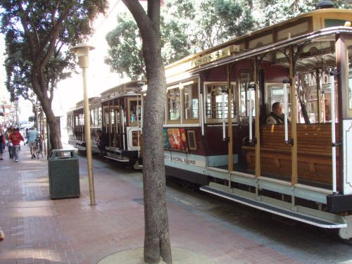

A couple of days ago, Mike Blumenthal of [Understanding Google Places & Local Search](http://blumenthals.com/blog/) asked a pretty timely question with the post [Google Local: Are Mobile Signals Actively used in Ranking Local Results?](http://blumenthals.com/blog/2013/04/05/google-local-are-mobile-signals-actively-used-in-ranking-local-results/) Mike mentioned a post I wrote about Google research on using driving directions as a local search ranking signal.

Mike can add another example of how location may play a role in the rankings of local results.

It’s nice knowing the names of things. For instance, a “Query Stub” is the root (the letters someone types in) of an auto complete search suggestion. At least, we learn that from a Google patent granted a week ago. But that’s not all we learn. Results shown in suggestions responding to query stubs might depend upon your location, at least in searches for business entities.

The patent tells us that someone searching from San Francisco is probably more likely going to search for restaurants or public transportation than someone searching from Yosemite National Park, which has considerably less restaurants or public transportation (No street cars like those shown above).

The category types “restaurants” or “public transporation” are more important in San Francisco that at a national park. Search queries are more likely to be relevant in San Franciso than in Yosemite when they involve one of those categories because there are considerably more entities that might fit into those categories in San Francisco.

There are two different locations that might be important to a searcher. The first of those might be at the actual location of a searcher, as determined by GPS, wifi connections, cell phone triangulation, and microelectronic devices built into something like a smart phone.

The other location might be one indicated by a searcher, such as a location that the searcher has expressed an interest in by specifying it in their Google location settings. (The searcher might be located in San Francisco, but might be searching for results in New York City, for example.)

Imagine that Google has precalculated relevance scores for categories at different locations based upon categories of entities at those locations. Imagine that autocompleted query suggestions for business entity types might tend to favor results that fit best with categories for the location where the searcher is at, or where the searcher express a preference for.

Or advertisements that might be displayed?

Or search results might be reranked based upon how relevant a query might be to how relevant a category is to a location.

**Category relevant search results may vary based upon location.**

I’ve written about how categories might be used in search patents by Google before, but none of those posts involved location to such a large degree.

- [How Google Might Determine Categories for Web Pages](https://www.seobythesea.com/2012/07/google-categories-web-pages/)
- [How Google May Boost Search Rankings for Your Relevant Pages Using Keywords in the Same Category as Your Website](https://www.seobythesea.com/2011/08/google-boost-search-rankings-category/)
- [How Google May Use Categories as a Search Ranking Factor](https://www.seobythesea.com/2010/10/how-google-may-use-categories-as-a-search-ranking-factor/)
- [Improved Web Page Classification from Google for Rankings and Personalized Search](https://www.seobythesea.com/2010/10/improved-web-page-classification-from-google-for-rankings-and-personalized-search/)

I can see how a location relevance category approach could influence each of those.

So, someone searching for “ford cars” in a location where there are lots of Ford Car Dealers might be considered really relevant for a “Ford Car Dealers” category. In a location where there might be a lot of Ford Car repair shops, but little or no Ford Car Dealers, the category that would be the best match for “ford cars” might be repair shops, and not Ford Car Dealers. The patent tells us that this might influence web results, but I’m thinking that it could also influence local search results as well.

The patent is:

[Determining relevance scores for locations](https://patents.google.com/patent/US8738602)
Invented by Matt Lewis
Assigned to Google
US Patent 8,407,211
Granted March 26, 2013
Filed: December 16, 2010

Abstract

> Methods, systems, and apparatus, including computer programs encoded on a computer storage medium, for determining relevance scores for locations. In one aspect, a method includes storing a respective plurality of category-location relevance scores for each location of a plurality of geographic locations. A category-location relevance score is based on a plurality of category-entity-location relevance scores for a plurality of entities associated with the category at the location.
>
> A first category-location relevance score is determined for a first geographic location that is not one of the plurality of geographic locations. Determining the first category-location relevance score includes calculating the first category-location relevance score based on a second category-location relevance score for a second geographic location in the plurality of geographic locations and a physical distance between the first geographic location and the second geographic location.
