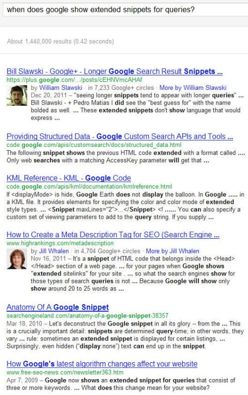

Has an improvement in how Google understands the layout of pages, and understands and classifies different elements found on page had an impact on the titles and snippets that we see in search results? Google may classify queries to decide what to show for those page titles and snippets in search results, but it’s possible that they might also be classifying the contents of “original titles and snippets and URLs” when deciding to show different titles and expanded snippets. Might Google do that in combination with a classification of page elements (a portion of HTML containing some text) found on the pages in search results to try to determine the best representation of a search result in response to a query?

**Google May Chose Titles and Snippets for Pages**

When you search at Google, the search results displayed for web pages include titles, URLs, and snippets for the pages listed in the results. In those, the query terms you used, or sometimes synonyms for them, may be included in the title and snippet, and Google will highlight those. As a site owner, you should have unique and engaging titles and meta descriptions for each page you want indexed by search engines. Not only does that make it more likely that search engines will crawl, index, and display those pages, but if you use the keywords you’re optimizing those pages for within those titles and descriptions, Google may show your choice of title and meta description within search results.

But not always…

Google has sometimes been showing titles that are different from the actual page title listed in an HTML <title> element for pages over the past few years, if the search engine might find a different title to be a better match for the query used than the one a site owner chose. A January 12th blog post on the Official Google Webmaster Central blog, [Better page titles in search results](https://webmasters.googleblog.com/2012/01/better-page-titles-in-search-results.html), told us more about how and why those titles might be chosen:

> We use many signals to decide which title to show to users, primarily the <title> tag if the webmaster specified one. But for some pages, a single title might not be the best one to show for all queries, and so we have algorithms that generate alternative titles to make it easier for our users to recognize relevant pages. Our testing has shown that these alternative titles are generally more relevant to the query and can substantially improve the click-through rate to the result, helping both our searchers and webmasters. About half of the time, this is the reason we show an alternative title.

The post also tells us that Google will sometimes choose to display their choice of titles when a webmaster might have forgotten to include a title, or uses a non-descriptive title like “Home.” A couple of the other issues that the post tells us may be the reason for Google deciding upon a different title is when a site uses the same or very similar titles for a large number of pages, or when a title might be “unnecessarily long or hard-to-read.”

Back in November, the Google Inside Search blog also told us of a change to snippets that Google may display, in a post entitled [Ten recent algorithm changes](https://search.googleblog.com/2011/11/ten-recent-algorithm-changes.html), where one of those changes involved snippets shown for pages in search results.

> **Snippets with more page content and less header/menu content:** This change helps us choose more relevant text to use in snippets. As we improve our understanding of web page structure, we are now more likely to pick text from the actual page content, and less likely to use text that is part of a header or menu.

It’s interesting that the blog post mentions how Google is improving “our understanding of web page structure.” Less than a week ago, Google also announced that they would be paying more attention to, and possibly penalizing pages that had too much advertising content “above the fold” on pages, in the post [Page layout algorithm improvement](https://search.googleblog.com/2012/01/page-layout-algorithm-improvement.html). Might Google’s better understanding of the layouts of pages also be influencing some of the decisions that they make when choosing page titles and snippets( or descriptions)?

Google does provide some best practices in a help page on [writing page titles and meta descriptions](https://support.google.com/webmasters/answer/35624?hl=en), and Google was granted a patent on [expanded snippets](https://www.seobythesea.com/2011/12/expanded-snippets-instant-previews-costs-benefits/) last year.

The help page tells us that Google’s choosing of titles and snippets is an automated process:

> Google’s generation of page titles and descriptions (or “snippets”) is completely automated and takes into account both the content of a page as well as references to it that appear on the web. The goal of the snippet and title is to best represent and describe each result and explain how it relates to the user’s query.

They also tell us that their decision of which titles and snippets to display might be based upon a number of choices, including information from the page, or from publicly available sources off the page such as “anchor text or listings from the Open Directory Project (DMOZ).”

I started a Google Plus post on when Google might transform page titles yesterday, and received a lot of interesting comments and some examples as well, of times when Google has changed titles for pages.

It’s not hard to see when looking at search results that Google is sometimes showing considerably longer snippets within them than they did in the past as well:

**How Does Google Decide What to Show in Titles and Snippets?**

Google was granted a patent earlier this week that describes a way that they might classify queries, and classify search result snippets to come up with new snippets that might use content found on the pages being returned in results for those queries.

A number of the patent’s inventors have been associated with [Google Custom Search Engines](https://programmablesearchengine.google.com/about/). The patent itself is written more broadly than just being about Google Custom Search Engines though, and could be a description of how Google might be identifying at least some titles and snippets for pages shown in search results. There’s also a lot of language about labels in the patent, which is an integral part of the Custom Search Engines. The patent is:

[Classifying search results to determine page elements](http://patft.uspto.gov/netacgi/nph-Parser?Sect1=PTO2&Sect2=HITOFF&p=1&u=%2Fnetahtml%2FPTO%2Fsearch-adv.htm&r=1&f=G&l=50&d=PALL&S1=08103676&OS=PN/08103676&RS=PN/08103676)
Invented by Tania Bedrax-Weiss, Ramanthan Guha, Patrick Riley, and Corin Anderson
Assigned to Google
US Patent 8,103,676
Granted January 24, 2012
Filed: October 11, 2007

Abstract

> This invention relates to determining page elements to display in response to a search. A method embodiment of this invention determines a page element based on a search result. A classification is determined based on a search result. Page elements are generated based on the classification.
>
> By using the search result, as opposed to just the query, page elements are generated that corresponds to a predominant interpretation of a user’s query within the search results. As result, the page elements may, in most cases, accurately reflect the user’s intent.

The patent provides a very detailed look at how Google might go from classifying queries (using a lookup table, or via some other method) to classifying the different elements of a search result such as a title, snippet, and URL in that result. Those classifications might be weighted somewhat by the position that those pages appear at within search results as well.

The original snippet for a page will often have the query terms within it, if available. And part of the decision as to whether or not Google might use a meta description from a page as the snippet for that page is going to depend upon whether or not that meta description contains the keyword terms used to search for the page. If a search engine decides to use content from a page, there may be a number of [considerations](https://www.seobythesea.com/2010/03/why-a-search-engine-might-choose-something-other-than-meta-descriptions-for-page-summaries-in-search-results/) involved as described in a Yahoo patent application from a couple of years ago, such as:

- How readable the phrase is,
- How relevant the phrase is to the query,
- How relevant the phrase is to the page it appears upon,
- How long the phrase is,
- Combinations of the above

If the meta description doesn’t contain the query term or terms used to find the page, or it just doesn’t seem very relevant, then Google might choose to use something else. Google may follow a very similar path to that decision that the Yahoo patent does, at least for an initial snippet.

Google may then follow a classification approach described in the patent to classify the title, the meta description or a description from page text as a snippet, and the URL in the search result

In this newly granted patent, Google might decide to classify different sections of text within the HTML elements on pages to see if it can come up with the best match for the classifications of the query and classification of the different parts of the original search result.

The classifications of query and search result would then be matched up with text on a page within different HTML elements to see if the content on the page might make better choices.

**Example**

The home page from the Acme Manufacturing Company might be very well optimized for the term [roadrunner traps], and the page title and meta description for the page might include that term and Google might show the page title and meta description as written by the site owner on a search for [roadrunner traps].

Chances are that the home page will also rank very well for [Acme Manufacturing Company] as well, but if the title of the home page doesn’t contain the name of the company, and the meta description doesn’t either, Google might generate a description or snippet from the content found on the page.

It might take the HTML <title>, the first snippet Google initially creates, and the URL for the home page, and classify each of them, as well as classifying the query [Acme Manufacturing Company] as well.

It may then also classify different portions of text within HTML elements on the page, and classify them as well.

For instance, the alt text of the logo for the page might contain the text “Acme Manufacturing Company – Maker of fine explosive roadrunner traps”. Some of the other text on that page may also contain text that might be suitable for a description of the company, such as a short description of the company in a sidebar 
 element that says “Acme Manufacturing Company has been making custom traps for cartoon coyotes since 1948 for Looney Tunes Cartoons. Acme Manufacturing’s products have been ruggedly tested through many cartoon episodes viewed by millions.”

Google might take the logo alt text to use as a page title, and the sidebar content to use as part or all of an extended snippet.

I’ve provided a fairly high level look at this patent, and if you want a deeper look, I highly recommend drilling down into the patent.

There’s definitely some value in Google looking closely at classifications of queries and original search results, and trying to match them up with classifications of page elements to provide the best representation in a transformed search result of why a page might be relevant for a searcher’s query.

**Another Approach to Expanded Snippets**

The patent that I mentioned above about [expanded snippets](https://www.seobythesea.com/2011/12/expanded-snippets-instant-previews-costs-benefits/) described how Google might show those longer snippets where it is presently showing Instant Previews, and may have been something that Google might have planned on doing before deciding to show screenshots of pages in those previews. It also describes a couple of ways that it might decide upon which text to show as larger snippets, but doesn’t include the classification processes that this *page elements* patent does. Here’s what it does tell us:

> An expanded snippet may include the text excerpt of the snippet with additional text located in proximity to the text excerpt in the search result document, such as text before and/or after the text excerpt. In one implementation, the additional text may include a predetermined amount of text, such as a predetermined number of terms, before and/or after the text excerpt in the search result document.
>
> In another implementation, the additional text may be more intelligently selected. For example, the additional text may include all (or less than all) of the text preceding the text excerpt to a beginning or end of a structural component (e.g., paragraph, table entry, section, etc.) in which the text excerpt occurs in the search result document. Alternatively, or additionally, the additional text may include a previous and/or following structural component based on the structural component in which the text excerpt occurs in the search result document.

Regardless, of whether Google is using the classification of search results and page elements, or is using the method described in this *expanded snippets* patent, I’m seeing lots of search results with longer snippets in them.

It’s definitely something to keep an eye upon, especially since the display of search results plays such an important role in whether or not searchers visit pages they see within those results.
