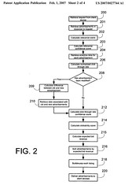

I posted last week about [13 New Yahoo Search Marketing Patent Applications](https://www.seobythesea.com/2007/02/13-new-yahoo-search-marketing-patent-applications/). Add five more from Yahoo Search Marketing that I uncovered as I was combing through the rest of the week’s filings.

The first thirteen mostly focused upon user interface and Application Program Interface (API) issues involving search marketing. These look a little closer at some of the algorithmic approaches, such as the calculation of a clickability score (click on the flowchart to the right to see a larger version – once there, click on “all sizes” and choose the largest for the most legible version).

As I noted in last week’s post, what is described in these patent applications could be different from what is implemented in many ways, but if you are interested in paid search you may want to take a look at them. Again, rather than analyze them in-depth, I’m just going to link to them here, and post the abstracts from them.

[System and method for revenue based advertisement placement](http://appft1.uspto.gov/netacgi/nph-Parser?Sect1=PTO1&Sect2=HITOFF&d=PG01&p=1&u=%2Fnetahtml%2FPTO%2Fsrchnum.html&r=1&f=G&l=50&s1=%2220070027744%22.PGNR.&OS=DN/20070027744&RS=DN/20070027744)

> The present invention is directed towards systems and methods for ranking one or more advertisements. The method of the present invention comprises retrieving a result set comprising one or more advertisements responsive to a request. A clickability score is calculated for the one or more advertisements comprising the result set. An expected revenue value is calculated for the one or more advertisements using the clickability scores of the one or more advertisements as well as an indication of revenue associated with the one or more advertisements. The one or more advertisements are ordered according to the expected revenue of the one or more advertisements.

[System and method for discounting of historical click through data for multiple versions of an advertisement](http://appft1.uspto.gov/netacgi/nph-Parser?Sect1=PTO1&Sect2=HITOFF&d=PG01&p=1&u=%2Fnetahtml%2FPTO%2Fsrchnum.html&r=1&f=G&l=50&s1=%2220070027743%22.PGNR.&OS=DN/20070027743&RS=DN/20070027743)

> The present invention is directed towards systems and methods for determining the performance of a plurality of versions of a given advertisement. The method of the present invention comprises retrieving a first version of an advertisement and associated click through data, and retrieving a second version of the advertisement and associated click through data. A clickability score is calculated for the first version of the advertisement using the click through data associated with the first version, and a clickability score is calculated for the second version of the advertisement using the click through data associated with the second version. A difference in clickability scores is determined between the first and second advertisement. The clickability score associated with the first version of the advertisement is modified based upon the difference in clickability scores.

[System and method for determining semantically related term](http://appft1.uspto.gov/netacgi/nph-Parser?Sect1=PTO1&Sect2=HITOFF&d=PG01&p=1&u=%2Fnetahtml%2FPTO%2Fsrchnum.html&r=1&f=G&l=50&s1=%2220070027865%22.PGNR.&OS=DN/20070027865&RS=DN/20070027865)

> Methods and systems for determining semantically related terms are disclosed. Generally, seed terms are received from a user. One or more potential terms semantically related to the seed terms are determined based on vectors comprising entries regarding a plurality of terms, a plurality of universal resource locators (“URLs”) associated with each term of the plurality of terms, and for each URL in a search log, a number of times that one or more users searched for each of the terms in the search log and clicked on the URL. At least a portion of the potential terms is then suggested to the user.

[System and method for determining semantically related terms](http://appft1.uspto.gov/netacgi/nph-Parser?Sect1=PTO1&Sect2=HITOFF&d=PG01&p=1&u=%2Fnetahtml%2FPTO%2Fsrchnum.html&r=1&f=G&l=50&s1=%2220070027864%22.PGNR.&OS=DN/20070027864&RS=DN/20070027864)

> The present disclosure is directed to systems and methods for determining semantically related terms. Generally, one or more seed terms are received from a user. A system searches a first index comprising a plurality of terms and one or more webpages associated with each term of the plurality of terms to determine a plurality of webpages associated with the seed terms. The system then searches a second index comprising a plurality of webpages and one or more terms associated with each webpage of the plurality of webpages to determine a plurality of potential terms associated with the plurality of webpages associated with the seed terms. At least one term of the plurality of potential terms is suggested to a user.

[System and method for optimizing advertisement campaigns using a limited budget](http://appft1.uspto.gov/netacgi/nph-Parser?Sect1=PTO1&Sect2=HITOFF&d=PG01&p=1&u=%2Fnetahtml%2FPTO%2Fsrchnum.html&r=1&f=G&l=50&s1=%2220070028263%22.PGNR.&OS=DN/20070028263&RS=DN/20070028263)

> The present invention relates to systems and methods for the optimized selection and delivery of one or more advertisements from among one or more advertising campaigns. The method of the present invention comprises generating one or more media plans identifying execution parameters for the optimized selection and delivery of one or more advertisements. One or more advertisements organized according to one or more advertisement campaigns are retrieved. Additionally, advertiser specified constraint and target values associated with the one or more advertisements are retrieved. A forecast for the performance of the one or more advertisements is generated. A media plan is generated for the one or more advertisements according to the constraint and target values, as well as the forecast data. The one or more advertisements are distributed according to the execution parameters identified by the media plan.
