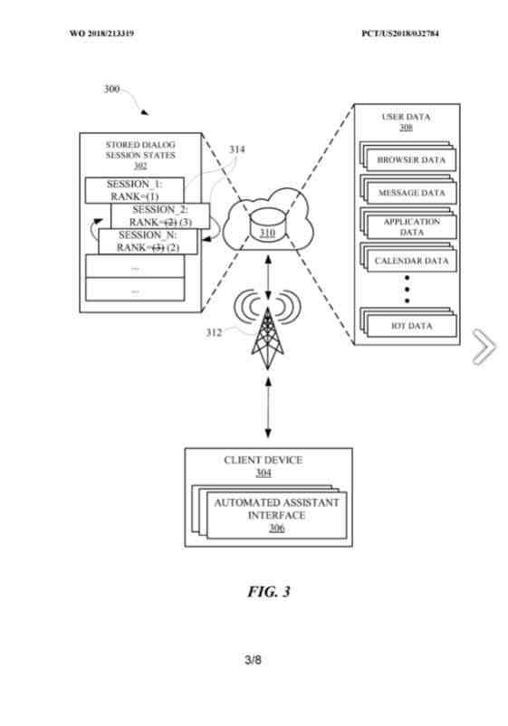
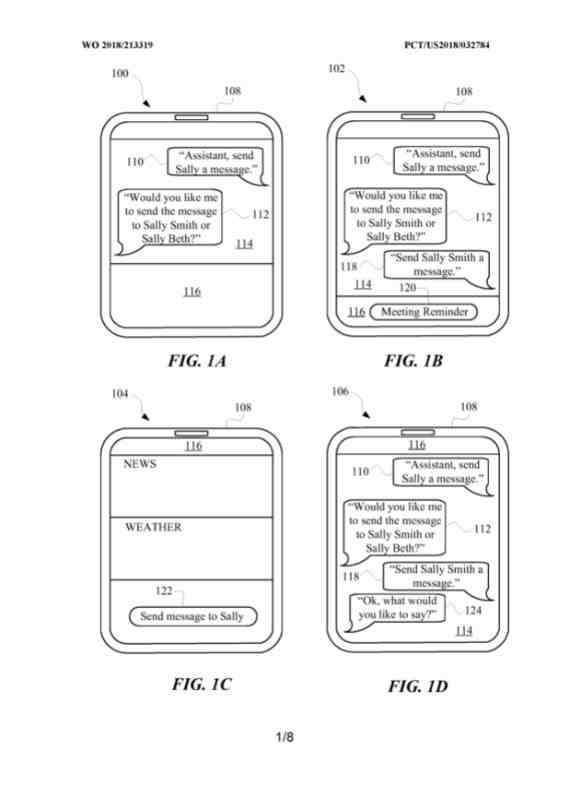

## What is Completing Human to Computer Dialogs?

We often see search engines interact with humans by answering queries that are input via keyboard or vocal input. Google is developing the ability to engage in, and share information by engaging in conversations with human beings. We see this in how Google interacts with humans using speaker devices, and in how they describe the use of MUM and automated assistants, which I wrote about in the post, [Google Mum Update](https://gofishdigital.com/blog/google-mum-update/). This is an evolution of search. There have been a number of granted patents recently which described human to computer dialogs, and this is another. This is the way that search is changing.

Automated assistants may interact with a human using a variety of computers, such as smartphones, tablet computers, wearable devices, automobile systems, standalone personal assistant devices, and so forth.

The automated assistants receive input from the user (e.g., typed and spoken natural language input) and respond with responsive content such as visual and audible natural language output.

Unfortunately, while interacting with an automated assistant, a user may become distracted and not complete the interaction to the point of a task or action getting satisfied by the automated assistant.

As a result, the user may have to repeat inputs to the automated assistant to have the automated assistant complete the task or action.

This repeated effort can be a waste of computational resources and human time, given that the automated assistant would be reprocessing commands from the user, already processed during the previous interaction.

The described implementations track incomplete interactions with an automated assistant without repeating previous commands. Humans may engage in human-to-computer dialogs with interactive software applications referred to herein as “automated assistants.” For example, humans may provide orders and requests using spoken natural language input which may get converted into text and then processed, and by giving textual natural language input.

Automated assistants can get used for tracking incomplete interactions with the automated assistant to get completed without having to repeat previous commands.

## Why Track Incomplete Human to Computer Dialogs?

Tracking incomplete interactions allows the user to complete an exchange by their election should the user get interrupted during an interaction or choose not to continue at some point during the interaction. For example, an automated assistant can get used by a user to place a phone call with contact through spoken commands (e.g., “Assistant, please call Sally”) to an automated assistant interface of a client device.

The automated assistant can respond via the automated assistant interface with options of who exactly the user is referring to (e.g., “Would you like to call Sally Smith, Sally Beth, or Sally O’Malley?”).

The user may become distracted and not respond to the automated assistant, rendering the conversation between the user and the automated assistant incomplete because the automated assistant did not perform an action and complete a task (e.g., calling Sally) talk.

The conversation between the automated assistant and the user can get stored in memory, which can get accessed by the automated assistant at a later time when the user gets determined to get interested in having the automated assistant act.

For example, after the initial incomplete conversation, the user can be participating in an email thread that mentions someone named Sally. The automated assistant can acknowledge the mention of Sally in the email thread and provide a selectable element at an interface of the client device. The selectable element can include the phrase “Call Sally.”

In response to the user selecting the selectable element, the automated assistant can provide an output corresponding to where the previous conversation ended (e.g., “Would you like to call Sally Smith, Sally Beth, or Sally O’Malley?”).

In this way, the user does not have to repeat past commands to the automated assistant, streamlining the path to completing the intended action (e.g., placing a phone call to Sally).

## Storing Complete Or Incomplete Human to Computer Dialogs

The automated assistant can store specific conversations according to whether the talks were complete or incomplete. Discussions between the user and the automated assistant can include many different spoken or typed commands from the user and many different responsive outputs from the automated assistant.

The user may intend for a task or action to get performed at some point in the conversation. The job or step can be placing a call, booking an event, sending a message, controlling a device, accessing information, and any other activity that can get performed by a computing device.

When a task gets completed as a result of the conversation, the conversation can get stored with a field or slot that includes a parameter indicating that the conversation resulted in an action (e.g., STORE_CONVERSATION=(content=” call sally; Would you like to call . . . ;”, action=”call,” complete=”1″).

## Storing A Human to Computer Dialog as Not Completed

When a task does not get completed as a result of the conversation, the conversation can get stored with a field or slot that includes a parameter indicating the conversation did not result in a task getting completed (e.g., STORE_CONVERSATION=(content=” call sally; Would you like to call . . . ;”, action=”call,” complete=”0″). The “complete” parameter can state whether a task got completed by using a “1” to show an action got completed and “0” for one not achieved.

The conversation can get stored as complete even when a performed task does not get completed. For example, the user can engage in a few rounds of discussion with the automated assistant to get the computerized assistant to start a music application for playing music.

But, the automated assistant may determine that a subscription for the music application has expired, and thus the automated assistant is unable to open the music application. After that, the conversation between the user and the automated assistant can get stored as a complete conversation.

In this way, later suggestions for conversations to complete will not include the exchange as the conversation was conclusive about the music application, despite not providing music.

Conversation suggestions can get ranked and presented at a conversational interface to allow the user to complete more relevant conversations that did not complete a task.

Ranking of incomplete conversations can get performed by a device separate from a client device (e.g., computing systems forming a so-called “cloud” computing environment) with which the user is engaging to preserve computational resources of the client device. The suggestions can get presented as selectable elements at a conversational user interface of the client device, along with other selectable factors that can get associated with the conversation suggestion.

For example, a previous incomplete conversation can get associated with a food order that the user was attempting to place but did not complete because the user did not provide an address for the food to get delivered. While viewing a food website, the user can get presented with a conversation suggestion corresponding to the incomplete food order conversation.

## Returning To The Conversation Suggestion

If the user selects the conversation suggestion, a rank associated with the incomplete conversation can increase. But, if the user does not determine the conversation suggestion, then the level related to the conversation suggestion can decrease. The rank decrease can be that the conversation suggestion does not appear the next time the user looks at the food website. In this way, other higher-ranked conversation suggestions can get presented to the user. The user might get presented with conversation suggestions that would be more interested in continuing to the point of completion.

Suggestions for completing conversations can get ranked and weighted according to certain computer-based activities of the user.

For example, a user searching for hotels can present incomplete conversation suggestions about a hotel booking. The user can select a vague conversation suggestion to get taken back to where the user left off in a previous conversation with the automated assistant without repeating past commands or other statements to the automated assistant.

## Completing Human to Computer Dialogs

During the previous conversation, the user may have provided the number of guests and the dates for the hotel booking but may not have paid for the hotel booking; thus, the conversation was not complete since the automated assistant did not book a hotel.

The hotel conversation can get stored as incomplete and provided in association with a selectable element when the user uses a search application to find places to vacation.

The conversation suggestions can be provided on a client device’s home page. The home page can supply many different suggestions related to various applications on the client device.

For example, the home page can provide reminders about events stored in the calendar application of the client device and provide news article summaries from a news application on the client device. As the user is exploring the home page, the user can get presented with conversation suggestion elements that transition the user to a conversational user interface when selected by the user.

## Previous Incomplete Conversations

The conversational user interface can get populated with inputs from the user and responses from the automated assistant during a previous incomplete conversation associated with the conversation suggestion element. In this way, the user does not have to repeat the previous inputs to lead the automated assistant to perform the intended action (e.g., booking a hotel, placing a call, performing an application function). Other suggestion elements that are not conversation suggestions can also get presented on the home page with the conversation suggestion element.

The other suggestion elements can be different from suggestions provided at the conversational interface during the previous interactions between the user and the automated assistant. This change of suggestion elements could get based on the assumption that the user was not interested in the previously provided suggestion elements if the user did not select those before presented suggestion elements.

Conversation suggestions can get presented to the user based on ranking and weights established based on other users’ total interests. For example, a video may be of particular interest to people due to the tape getting presented on a popular website. If the user earlier had a conversation with the automated assistant about finding and playing the video, but the conversation did not get played, the conversation can get stored as incomplete. The held conversation can then get ranked based on other people’s interest in the video.

## Presenting Someone With A Suggestion for Completing A Conversation

For example, the stored conversation can get ranked higher if people have recently been searching for the video than when people have not been searching. For instance, after the incomplete discussion, other people watch the video, and after that, the user searches for the video. The user can get presented with a suggestion for completing the conversation to watch the video.

A method implemented by processors gets set forth. The process can include analyzing the content of a human-to-computer dialog session between the user and an automated assistant application. The user can engage with the computerized assistant application using a first client device of client devices operated by the user.

The method can also include determining, based on the analysis, that the user did not complete a task raised during the human-to-computer dialog session. The process can further include, based on the determining, storing a state of the human-to-computer dialog session in which the task gets primed for completion. Additionally, after providing client devices, the method can include data indicative of a selectable element to enable the user to complete the task.

The data can get generated based on the state. Furthermore, the selectable element can invoke the automated assistant application to resume the human-to-computer dialog session and be selectable to cause the task to get completed. The job can include dialing a telephone number, and the stored state can identify the incomplete task. The method can also include assigning a rank to the stored state and comparing the level to other levels associated with other stored conditions of human-to-computer dialogs. Providing the selectable element can get based on the comparison. Additionally, assigning the rank can include identifying an activity of the user that indicates a level of interest of the user in completing the task. Resuming the human-to-computer dialog can cause the automated assistant application to provide at least one previous response to the client devices.

Other implementations may include a non-transitory computer-readable storage medium storing instructions executable by a processor (e.g., a central processing unit (CPU) or graphics processing unit (GPU)) to perform a method such as the methods described above and elsewhere herein.

## The Completing Human to Computer Dialogs Patent

[Systems, methods, and apparatuses for resuming dialog sessions via automated assistant](https://patft.uspto.gov/netacgi/nph-Parser?Sect1=PTO1&Sect2=HITOFF&d=PALL&p=1&u=%2Fnetahtml%2FPTO%2Fsrchnum.htm&r=1&f=G&l=50&s1=11,232,795.PN.&OS=PN/11,232,795&RS=PN/11,232,795)
Inventors: Vikram Aggarwal, Jung Eun Kim, and Deniz Binay
Assignee: Google LLC
US Patent: 11,232,795
Granted: January 25, 2022
Filed: March 20, 2019

Abstract

> Methods, apparatus, systems, and computer-readable media are provided for storing incomplete dialog sessions between a user and an automated assistant so that the dialog sessions can be completed in furtherance of specific actions.
>
> While interacting with an automated assistant, a user can become distracted and not complete the interaction to perform some action.
>
> The automated assistant can store the interaction as a dialog session in response.
>
> Subsequently, the user may express interest, directly or indirectly, in completing the dialog session, and the automated assistant can provide the user with a selectable element that, when selected, causes the dialog session to get reopened.
>
> The user can then continue the dialog session with the automated assistant so that the initially intended action can get performed by the automated assistant.

## Accessing An Automated Assistant Capable Of Storing Dialog Between A User And An Automated Assistant Interface

This section is about completing a task using the automated assistant. While the client device may be a smartphone or tablet, It can be other things. Client devices may take the forms of standalone interactive speakers, wearable technologies (e.g., smart glasses), vehicle-based client devices, such as navigation systems, media control systems, so-called smart televisions, and so forth.

Various aspects of a dialog session or any human-to-machine dialog can be stored. The interactions between the user and the automated assistant can be resumed later to complete the solicited task.

The user can view a user interface of the client device and request the automated assistant. The user can ask for the automated assistant with a first user input such as, for example, “Assistant, send Sally a message.” The user can speak the first user input to the client device.

The client device can record the audio corresponding to the first user input and send the audio to a separate device, such as a remote server, for processing. The remote server, which can host various online components of the automated assistant (e.g., a natural language processor), can process the audio, convert the audio into text, and determine a suitable response to the first user input.

The automated assistant can determine that the user has many stored contacts with the first name “Sally,” such as “Sally Smith” and “Sally Beth,” and inquire as to which “Sally” the user wants to message. Thus, in response to the first user input, the automated assistant can cause the automated assistant interface to provide a first response that includes the text “Would you like me to send the message to Sally Smith or Sally Beth?” In response, the user can provide second user input for selecting the exact contact to which the user intends to send the message (e.g., “Assistant, send Sally Smith the message.”).

## When Completing Human to Computer Dialogs Result In Incomplete Action

But, while engaging in the conversation with the automated assistant, the user may get distracted and not complete the exchange, at least to the point of the intended action (e.g., sending the message) getting performed. For example, the client device can present a reminder at the user interface while providing the second user input or shortly after that. The reminder can be about a meeting happening soon, and the user may have no time to complete the dialog session. Regardless, the automated assistant can store the dialog session to meet the dialog session to the intended task’s completion.

The automated assistant can determine that the dialog session is incomplete based on the user’s actions and other indicators associated with the user. For example, if the user does not respond to the automated assistant for a threshold period, the automated assistant can store the conversation as an incomplete conversation.

Or, if the automated assistant becomes aware that the user is operating an application that prevents the user from interacting with the automated assistant (e.g., participating in a video conference), the automated assistant can notice that the conversation is incomplete.

The automated assistant can become aware that the user is operating a separate device from the client device and determine that the user is not available to complete the conversion to the point of the action getting performed. For example, the automated assistant can determine that the separate device has moved at least a threshold distance away from the client device, thereby putting the automated assistant on notice that the user is away from the client device and the conversation is incomplete.

## Storing A Conversation as an Incomplete Dialog Session

In response to the automated assistant determining that the conversation is incomplete or has otherwise not gotten completed to the point of an intended task getting completed, the automated assistant can store the conversation as a dialog session, e.g., as a “state” of the dialog session. The dialog session can get tagged as incomplete because the intended action was not performed during the conversation.

For example, the dialog session state can get stored through a command such as “STORE_DIALOG_SESSION_STATE=(content=”Assistant, send Sally a message; Would you like me to send . . . ;”, action=”send message”, complete=”0″). The dialog session can get stored through a command such as {action=SEND_MESSAGE, content=” . . . “, contact=&#123;&#123;“Sally Smith”, Work: “838-383-2838”, Mobile: “388-238-2338”} {“Sally Beth”, “337-382-3823″}&#125;&#125;. By storing the dialog session to include the contact names and their respective contact information, sync issues caused by the user modifying contact information (e.g., a telephone number) while the dialog session gets interrupted can get eliminated.

The command can be provided from the automated assistant and executed by the remote server to create the stored dialog session in memory. The ” complete ” parameter can correspond to whether the “action” parameter was performed during the conversation. The conversation was not completed because the message to Sally was not sent. Thus, the “complete” metric got assigned the value “0.” Had the message gotten sent to Sally, the “complete” metric would get set the value “1,” indicating that the message got sent.

After the meeting, for example, the user can be operating the client device and be viewing the user interface. The user can be viewing a summary page or home page of the client device, which can include various suggestions of information or applications (e.g., news and weather) to view at the client device, as provided in the diagram. At least one of the suggestions can correspond to a selectable element associated with the stored dialog session. For example, the selectable element can include the phrase “Send a message to Sally,” which can remind the user that they were using the automated assistant to send a message to “Sally.”

The selectable element can operate such that, when the selectable element got selected by the user, the automated assistant interface can get opened at the client device, as provided in the diagram. In response to the user selecting the selectable element, the automated assistant can repopulate the automated assistant interface so that the user does not have to repeat their past inputs. Furthermore, any responses from the automated assistant to the last user input in the stored dialog session can also get provided.

For example, the second user input, the last user input in the dialog session, identified the person to whom the message would get sent. In response, after the meeting, the automated assistant can provide a second response such as, for example, “Ok, what would you like the message to say?” In this way, the user will be closer to completing the dialog session than before the meeting because the automated assistant has provided the second response without having the user repeat their last input.

## A Response To A User Not Completing The Dialog With An Automated Assistant

A user can participate in a dialog session with an automated assistant via a client device (which takes the form of a standalone interactive speaker, but this does not mean more limiting). The automated assistant can intermediary between the user and a third-party agent associated with an application or website.

A third-party agent can assist the user with performing a function associated with the application or website. The automated assistant can receive user inputs from the user, process the user inputs, and provide the processed user inputs to the third-party agent. For example, the third-party agent can get associated with a pizza ordering application. The user can initialize a pizza order via the automated assistant with a user input such as “Assistant, order a pizza.” The automated assistant can process the user input to determine that the user intends to engage the third-party agent associated with the pizza ordering application.

The automated assistant can respond to the user via an automated assistant interface (e.g., an audio system of the client device) with a response output such as “Ok, from which restaurant?” The user can, again, provide user input in response by identifying the restaurant (e.g., “Pizza Place.”), and the automated assistant can give a response output by requesting more information about the order (e.g., “Ok, what toppings?”). The user may become distracted now, for example, by a phone call getting received at a mobile device.

The automated assistant can become aware that the user gets disinterested in completing the dialog session, at least to the point of a task getting completed/performed (e.g., placing a pizza order with the third-party agent). The automated assistant can store the dialog session as an incomplete dialog session in response.

The automated assistant can communicate over networks with a remote device, such as a server, including a database for managing stored dialog session states. Each stored dialog session can correspond to an entry that identifies a dialog session (e.g., “SESSION_1”) as complete (e.g., “COMPLETE=(1)) or incomplete (e.g., “COMPLETE=(1)). The dialog session corresponding to the user inputs and response outputs can get stored as “SESSION_1: COMPLETE=(0),” the first entry in the stored dialog sessions. Because the dialog session did not order a pizza with the third party agent, the entry corresponding to the dialog session can get assigned a value of “0” at the “COMPLETE” parameter.

## Deciding When Completing Human to Computer Dialogs Should Take Place

The automated assistant can watch the user and devices used to determine a suitable time or place to remind the user about the incomplete dialog session. The mobile device can communicate over the network with the automated assistant, and the automated assistant can determine when the user is no longer participating in the phone call. The automated assistant can determine that the user is no longer interested in completing the dialog session when the mobile device moves away from the client device a threshold distance and for a threshold period.

The automated assistant can store the dialog session as incomplete in the database and suggest the dialog session when the user and the mobile device become more proximate to the client device or become within a threshold distance of the client device.

The automated assistant can cause the client device or the mobile device to suggest to the user about the incomplete dialog session (e.g., “Would you like to continue ordering the pizza?”). The suggestion about the preliminary dialog session can be an audible suggestion output by the client device and the mobile device or a selectable element provided at the client device and the mobile device. Should the user choose to continue the dialog session to completion (e.g., completing the pizza order), the automated assistant can update the entry corresponding to the dialog session state at the database.

The entry can get updated to state that the dialog session got completed by modifying the “COMPLETE” parameter to have a value of “1.” In this way, the automated assistant will no longer provide suggestions about competing in the dialog session. But, the contents of the dialog session (e.g., the user inputs and the response outputs) can get used by the automated assistant to provide future suggestions about other incomplete conversations. For example, a user may finish preliminary dialog sessions related to food orders but not complete incomplete dialog sessions related to phone calls. The automated assistant can track this trend, and similar movements, to rank entries so that the user gets presented suggestions for completing dialog sessions that the user has gotten interested in meeting.

## How Dialog Sessions Get Ranked For Providing Suggestions For Presentation At An Automated Assistant Interface

The automated assistant interface may cooperate (to various degrees) with online automated assistant components, such as a natural language processor, to respond to natural language inputs. The client device can communicate over a network with a remote device, such as a server, to manage stored dialog session states and user data.

The stored dialog session states can correspond to conversations or human-to-machine interactions between a user and an automated assistant, which can also live at the remote device. Dialog sessions can get considered by the automated assistant as incomplete when the interaction between the user and the automated assistant (and a third-party agent) did not result in a task getting completed. The job can be sending a message, booking an event, purchasing an item, and any other task that a computing device can perform. The study can get identified in the user’s dialog by the automated assistant and placed in a session entry in the stored dialog sessions.

Each session can get ranked according to the user’s level of interest in the dialog corresponding to the session. The automated assistant can determine the story of interest based on user data, which can get associated with the user who participated in the dialog session associated with the stored dialog sessions. The level of interest can also be determined using total user data related to other users who have participated in activities related to the action identified in the session entries.

A session entry can get stored in response to the user not completing a dialog session related to a hotel booking (e.g., SESSION_2) and not completing a dialog session about making a phone call (e.g., SESSION_N). Each session entry can get stored with an assigned rank. But, the automated assistant can analyze the user data to change the levels after each corresponding dialog session has brought determined to be incomplete. For example, the automated assistant can determine that the user gets interested in contacting a person in the dialog session associated with the phone call by processing message data.

The message data can include emails, text messages, and any other messages to other contacts of the user. The automated assistant can also determine that the user gets interested in completing the hotel booking by processing browser data, showing that the user has been searching for a hotel. Rut, if data related to SESSION_N gets identified more than data associated with SESSION_2, then the rank for SESSION_N can get modified to be greater than the rank for SESSION_2. This dialog shows the former level (3) for SESSION_N being stricken and replaced with a new status) and the former position for SESSION_1 being attacked and replaced with a new part (3).

Other portions of the user data can also influence the ranks of the session entries. The automated assistant can access application data associated with applications on devices that the user operates at any time. The automated assistant can use the application data to determine whether the user is performing some function with an application related to a stored dialog session. The user can operate a social media application that includes application data identifying the user’s contact attempting to place a call through the automated assistant.

In response to identifying this application data that identifies the contact, the automated assistant can adjust the rank of the session entry corresponding to the incomplete dialog session (e.g., SESSION_N) that was in furtherance of the phone call.

## Automated Assistant Can Access Calendar Data And Internet Of Things (IOT) Device Data

The automated assistant can access calendar data and internet of things (IOT) device data to adjust the ranking of the session entries. For example, the calendar data can include a calendar entry related to the booking identified in a dialog session. As a date corresponding to the calendar entry approaches, the ranking for the session entry associated with the hotel booking (e.g., SESSION_2) can increase. But, once the date corresponding to the calendar entry passes, the ranking for the session entry can get decreased, as the user is likely no longer interested if it has passed.

Furthermore, the automated assistant can access IOT data to determine how to adjust a ranking of session entries. For example, data from an IOT device, such as a security camera, can get used by the automated assistant to determine that the user is idle in their home. The automated assistant can thus assume that the user may get interested in continuing a phone call identified in a session entry corresponding to an incomplete dialog session. In response to receiving such data from the IOT device, the automated assistant can cause the ranking of the session entry. But, once the user leaves home, the automated assistant can decrease the order, assuming that the user has other plans that might get interrupted by a phone call.

The user data can include data associated with other users. The ranking of session entries and suggestions for completing dialog sessions can get based on other users’ interests. The user may initialize a dialog session with the automated assistant to get the automated assistant to find a video. If the dialog session does not result in the playback of the video, the automated assistant can store the dialog session as a session entry associated with a rank. After that, if many other users are using a search application to find the video, the automated assistant can use the application data from the search application to boost the rank of the session entry associated with the video playback.

After that, if the user performs some function with the client device related to videos, the automated assistant can present the user with a suggestion element for completing the dialog session associated with the previous video search. When the user selects the suggestion element, the client device can present an automated assistant interface populated with dialog from the dialog session. The user does not have to repeat their inputs to further the video playback.

## How Suggestions Provided During Dialog Sessions Can Get Cycled According To An Interest Of The User In The Suggestions

A client device can access an automated assistant to help a user perform certain functions with the client device. The user can be interacting with the automated assistant through conversation, which can respond to textual or spoken inputs from the user. The user can provide a first input corresponding to a request to book a flight (e.g., “Assistant, book a flight.”). The automated assistant can then provide a first response (e.g., “Ok, where would you like to fly to?”). The automated assistant can provide the first set of suggestions associated with the input from the user. For example, the first set of propositions can correspond to suggested answers for responding to the first response from the automated assistant.

The first set of suggestions identifies places the user might get interested in flying to (e.g., “My last destination”). Each request of the first set of recommendations can get assigned a rank that can change depending on whether the user selects the suggestion. For instance, the user can select the suggestion element corresponding to “My last destination,” and, in response, the phrase “my last destination” can get considered as a second input from the user to the automated assistant.

The rank associated with the suggestion, “My last destination,” can also increase due to the user selecting the request. Furthermore, any suggestions related to the last destination the user traveled to can also increase, as those suggestions would help complete the dialog session. The rank associated with the idea that the user did not select (e.g., “Chicago”) can decrease, causing the unselected suggestion not to get presented the next time the user is booking a flight via the automated assistant.

While the dialog session between the user and the automated assistant occurs, the user can select a call element corresponding to an incoming call, as provided in the diagram. As a result, the robotic assistant can determine that the dialog session is incomplete and store the dialog session to later select the dialog session for completion. Sometime after the phone call is complete, the user can interact with the client device by viewing a home page of the user interface, including information from other applications (e.g., news and weather).

## Automated Assistant Completing Human to Computer Dialogs

Now, the automated assistant can determine that the user may get interested in completing the flight booking and present a suggestion element at the user interface. In response to the user selecting the suggestion element, the user interface can transition to the conversational interface.

The automated assistant can provide a second set of suggestions at the conversational interface. The second set of requests can be generated based on how the user interacted with the first recommendations. For example, because the user selected to open the stored dialog session by choosing the suggestion element, the automated assistant can provide the second input and a second response (e.g., “Ok, when would you like to leave?”) at the conversational interface.

The second set of suggestions can get suggested responses to the second input and gain based on the selection and non-selection of suggestions from the previous interaction with the automated assistant. For example, the user expressed interest in the “last destination,” suggestions related to the last destination increased in rank. As a result, the automated assistant’s suggestion, “My last departure time,” can get presented because the last departure time is associated with the previous destination.

Ranks can thus get used to rank dialog sessions and rank suggestions presented during the dialog sessions. In this way, dialog sessions can get streamlined based on user activities to preserve computational resources and cause an action to get performed with fewer steps from the user.

## Resuming Dialog With An Automated Assistant From A Previous Dialog Initialized By A User In Furtherance Of An Action To Get Performed

The method can get performed by a client device, server device, mobile device, and any other apparatus capable of interacting with a user. The process can include a block of receiving input as part of a dialog session that furthers a task to get completed via an automated assistant and a third-party agent. The input can be a textual input to a computerized assistant interface and spoken information from a user to the automated assistant interface. Furthermore, the task can be sending a message, placing a phone call, opening a website, booking an event, and any other action that can get performed by a computing device.

The method can further include a block of determining that the action was not completed later to receive the input. The determination from the union can get based on the user’s activities during or after the dialog session. For example, the conclusion can get based on the user’s location, whether the user is viewing a particular application, websites viewed by the user, messages to or from the user, and any other information indicative of an activity of the user.

The method can also include a block of storing a state of the dialog session as incomplete based on the incomplete task. In various implementations, the “state” may contain enough data such that when the dialog session gets resumed in the stored state, the job may be “primed” (e.g., set up, presented, laid out, etc.) for completion. The state of the dialog session can get stored with a slot that can have a discrete value indicating whether a task got completed by the automated assistant as a result of the dialog session. If the job gets completed, the dialog session can get stored as complete, and if the task was not met, the dialog session could get performed as incomplete.

A selectable suggestion element can get provided such that, when the selectable suggestion element gets selected, the dialog session can get resumed via the automated assistant in the stored state so that the incomplete task gets primed for completion. The selectable suggestion element can be a graphical icon that can get selected by the user to invoke the automated assistant for resuming the previous dialog session. It can be a step of providing an output (e.g., an audible output) from the automated assistant to the user for suggesting that the user complete the dialog session.

The stored dialog session can get opened in response to selecting the selectable suggestion element. The dialog session can get opened at an automated assistant interface and start according to where the dialog session got considered incomplete. In other words, any inputs from the user and responses from the automated assistant can get incorporated into the opened dialog session to avoid the user having to repeat previous inputs.

## AProviding A Selectable Element For Resuming A Dialog According To Ranks Of Stored Dialogs

The method can get performed by a client device, server device, mobile device, and any other apparatus capable of interacting with a user. The process can include determining that a dialog session between a user and an automated assistant did not complete a task. The dialog can consist of many inputs from the user and the automated assistant in response to the user. During the dialog, the user could identify sending a message, recognized by the automated assistant as the action performed. Thus, the dialog session can get considered incomplete if the job is not completed during the conversation.

The dialog session gets stored with a rank that indicates an interest of the user in completing the dialog session. The position can get based on user data that is accessible to the automated assistant. The user data can get based on the activities of the user involved in the dialog session and any other users that use similar automated assistants. The method can also include a block of determining that the rank of the dialog session has outranked another level of a stored dialog session. For example, the dialog session about sending the message can outweigh a dialog about purchasing concert tickets.

As a result, the user can get shown suggestions about completing the dialog session related to sending the message, rather than suggestions related to purchasing concert tickets. In response that the dialog outranking the dialog session, a selectable element can cause the automated assistant to resume the dialog. When the user selects the selectable element, a conversational user interface can be presented with the inputs and responses from when the dialog session was considered incomplete. In this way, the user can continue the dialog session further (e.g., sending the message) without repeating any inputs to the automated assistant.

## Providing Suggestions For Resuming Completing Human to Computer Dialogs According To User Data Associated With Many Different Users

The method can get performed by computing devices capable of interacting with a human. The process can include determining that a dialog between a user and an automated assistant did not complete a task. The dialog session can be stored with content that provides user input and the automated assistant’s responses during the dialog session. For example, the dialog session can consist of information in which the user invoked the automated assistant (e.g., “Assistant, please sell movie tickets.”), as well as responses from the automated assistant such as, “Ok, what movie would you like to see?”

After the dialog session, a database that includes data that identifies information of interest to persons other than the user can get accessed. The data can correspond to application data from applications on devices owned by such persons and any other data that can indicate trends that might be of interest to the user. A rank can gt assigned to the dialog according to a similarity between the content of the dialog and the information of interest to persons other than the user.

For example, the information of interest to persons other than the user includes searches related to a movie getting released. The dialog session content can consist of a user input invoking the automated assistant for purchasing tickets to the film. Thus, the rank of the stored dialog session can reflect the interest of the other persons in the movie. Based on the level of the dialog session, a suggestion element can get if that causes the automated assistant to resume the dialog session in furtherance of completing the task (e.g., purchasing a movie ticket).
