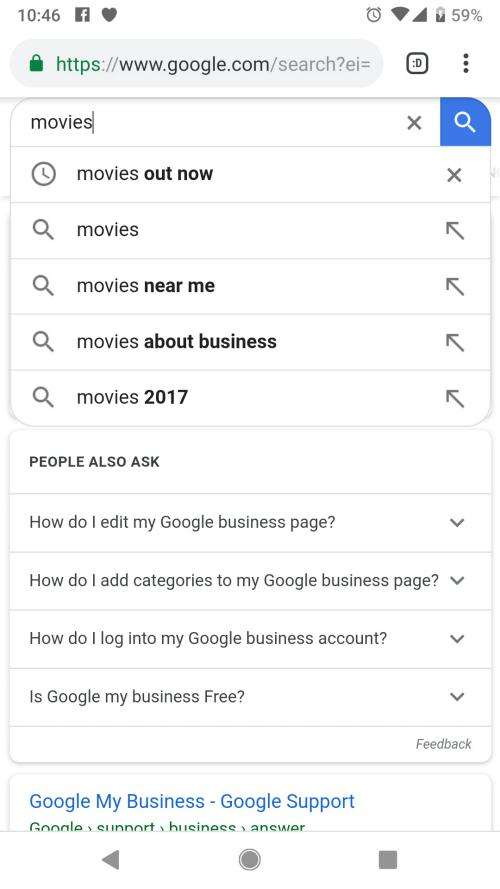

[Saketh Garuda](https://unsplash.com/@sakethgaruda?utm_medium=referral&utm_campaign=photographer-credit&utm_content=creditBadge)

## Context Clusters and Query Suggestions at Google

Context Clusters are topics or categories that might be selectable by a searcher to indicate the kind of search suggestion that might be shown to that searcher.

A new patent application from Google tells us about how the search engine may use context to find query suggestions before a searcher has completed typing in a full query. Think of Google as a Decision Engine focused upon bringing searchers more information about interests they may have. After seeing this patent, I’ve been thinking about previous patents I’ve seen from Google that have similarities.

It’s not the first time I’ve written about a Google Patent involving query suggestions. I’ve written about a couple of other patents that were very informative, in the past:

- 6/10/2016 – [Google Entity Search Suggestions Patent](https://www.seobythesea.com/2016/06/how-google-may-map-a-query-to-an-entity-for-suggestions/) ([Associating an entity with a search query](http://patft.uspto.gov/netacgi/nph-Parser?Sect1=PTO1&Sect2=HITOFF&d=PALL&p=1&u=%2Fnetahtml%2FPTO%2Fsrchnum.htm&r=1&f=G&l=50&s1=9,355,140.PN.&OS=PN/9,355,140&RS=PN/9,355,140))
- 5/26/2010[How a Search Engine Might Identify Possible Query Suggestions](https://www.seobythesea.com/2010/05/how-a-search-engine-might-identify-possible-query-suggestions/) ([Generating query suggestions using contextual information](http://patft.uspto.gov/netacgi/nph-Parser?Sect1=PTO1&Sect2=HITOFF&d=PALL&p=1&u=%2Fnetahtml%2FPTO%2Fsrchnum.htm&r=1&f=G&l=50&s1=7,725,485.PN.&OS=PN/7,725,485&RS=PN/7,725,485))

In both of those, the inclusion of entities in a query impacted the suggestions that were returned. This patent takes a slightly different approach by also looking at context.

## Context Clusters in Query Suggestions

We’ve seen the word Context spring up in Google patents recently. Context terms from knowledge bases appearing on pages that focus on the [same query term with different meanings](https://www.seobythesea.com/2016/10/google-patents-context-vectors-improve-search/), and we have also seen pages that are about [specific people using a disambiguation approach](https://www.seobythesea.com/2015/09/disambiguate-entities-in-queries-and-pages/). While these were recent, I did a blog about a paper in 2007, which talks about query context with an author from Yahoo. The paper was [Using Query Contexts in Information Retrieval](http://www.iro.umontreal.ca/~nie/Publication/bai-sigir-07.pdf). The abstract from the paper provides a good glimpse into what it covers:

> User query is an element that specifies an information need, but it is not the only one. Studies in literature have found many contextual factors that strongly influence the interpretation of a query. Recent studies have tried to consider the user’s interests by creating a user profile. However, a single profile for a user may not be sufficient for a variety of user queries. In this study, we propose to use query-specific contexts instead of user-centric ones, including context around query and context within a query. The former specifies the environment of a query, such as the domain of interest. At the same time, the latter refers to context words within the query, which is particularly useful for selecting relevant term relations. In this paper, both types of context are integrated into an IR model based on language modeling. Our experiments on several TREC collections show that each of the context factors brings significant improvements in retrieval effectiveness.

The Google patent doesn’t take a user-based approach but looks at some user contexts and interests. It sounds like searchers might be offered a chance to select a context cluster before showing query suggestions:

> In some implementations, a set of queries (e.g., movie times, movie trailers) related to a particular topic (e.g., movies) may be grouped into context clusters. Given a user device context, one or more context clusters may be presented to the user when the user is initiating a search operation, but before the user inputting one or more characters of the search query. For example, based on a user’s context (e.g., location, date and time, indicated user preferences and interests), when a user event occurs indicating the user is initiating a process of providing a search query (e.g., opening a web page associated with a search engine), one or more context clusters (e.g., movies) may be presented to the user for selection input before the user entering any query input. The user may select one of the context clusters that are presented, and then a list of queries grouped into the context cluster may be presented as options for a query input selection.

I often look up the inventors of patents to get a sense of what else they may have written and worked upon. I looked up [Jakob D. Uszkoreit in LinkedIn](https://www.linkedin.com/in/jakob-uszkoreit-b238b51/), and his profile doesn’t surprise me. He tells us there of his experience at Google:

> Previously, I started and led a research team in Google Machine Intelligence, working on large-scale deep learning for natural language understanding, with applications in Google Assistant and other products.

This passage reminded me of the search results being shown to me by the Google Assistant, which are based upon interests that I have shared with Google over time, and that Google allows me to update from time to time. So if the inventor of this patent worked on Google Assistant, that doesn’t surprise me. However, I haven’t been offered context clusters yet (and wouldn’t know what those might look like if Google did offer them. I suspect if Google does start offering them, I will realize that I have found them at the time they are offered to me.)

Like many patents do, this one tells us what is “innovative” about it. It looks at:

> …query data indicating query inputs received from user devices of a plurality of users, the query data also indicating an input context that describes, for each query input, an input context of the query input that is different from content described by the query input; grouping, by the data processing apparatus, the query inputs into context clusters based, in part, on the input context for each of the query inputs and the content described by each query input; determining, by the data processing apparatus, for each of the context clusters, a context cluster probability based on respective probabilities of entry of the query inputs that belong to the context cluster, the context cluster probability being indicative of a probability that at least one query input that belongs to the context cluster and provided for an input context of the context cluster will be selected by the user; and storing, in a data storage system accessible by the data processing apparatus, data describing the context clusters and the context cluster probabilities.

It also tells us that it will calculate probabilities that a searcher might request certain context clusters. So how does Google know what to suggest as context clusters?

> Each context cluster includes a group of one or more queries. The grouping is based on the input context (e.g., location, date and time, indicated user preferences and interests) for each of the query inputs when the query input was provided and the content described by each query input. One or more context clusters may be presented to the user for input selection based on a context cluster probability based on the context of the user device and the respective probabilities of entry of the query inputs that belong to the context cluster. The context cluster probability is indicative of a probability that the user will select at least one query input that belongs to the context cluster. Upon selecting one of the context clusters presented to the user, a list of queries grouped into the context cluster may be presented as options for a query input selection. This advantageously results in individual query suggestions for query inputs that belong to the context cluster, but that alone would not otherwise be provided due to their respectively low individual selection probabilities. Accordingly, users’ informational needs are more likely to be satisfied.

The Patent in this patent application is:

(US20190050450) [Query Composition System](http://appft.uspto.gov/netacgi/nph-Parser?Sect1=PTO1&Sect2=HITOFF&d=PG01&p=1&u=%2Fnetahtml%2FPTO%2Fsrchnum.html&r=1&f=G&l=50&s1=%2220190050450%22.PGNR.&OS=DN/20190050450&RS=DN/20190050450)
Publication Number: 20190050450
Publication Date: February 14, 2019
Applicants: Google LLC
Inventors: Jakob D. Uszkoreit
Abstract:

> Methods, systems, and apparatus for generating data describing context clusters and context cluster probabilities, wherein each context cluster includes query inputs based on the input context for each of the query inputs and the content described by each query input, and each context cluster probability indicates a probability that at a query input that belongs to the context cluster will be selected by the user, receiving, from a user device, an indication of a user event that includes data indicating a context of the user device, selecting as a selected context cluster, based on the context cluster probabilities for each of the context clusters and the context of the user device, a context cluster for selection input by the user device, and providing, to the user device, data that causes the user device to display a context cluster selection input that indicates the selected context cluster for user selection.

## What are Context Clusters as Query Suggestions?

The patent tells us that context clusters might be triggered when someone starts a query on a web browser. So I tried it out, starting a search for “movies,” and got several suggestions that were combinations of queries or what seem to be context clusters:

The patent says that context clusters would appear before someone began typing, based upon topics and user information such as location. So, if I were at a shopping mall that had a movie theatre, I might see Search suggestions for movies like the ones shown here:

One of those clusters involved “Movies about Business”, which I selected, and it showed me a carousel, and buttons with subcategories to also choose from. This seems to be a context cluster:

This seems to be a pretty new idea and maybe something that Google would announce as an available option when it becomes available, if it does become available, much like they did with the [Google Assistant](https://assistant.google.com/). For example, I usually check through the news from my Google Assistant at least once a day. So if it starts offering search suggestions based upon my location, it could be fascinating.

## User Query Histories

The patent tells us that context clusters selected to be shown to a searcher might be based upon previous queries from a searcher and provides the following example:

> Further, a user query history may be provided by the user device (or stored in the log data) that includes queries and contexts previously provided by the user, and this information may also factor into the probability that a user may provide a particular query or a query within a particular context cluster. For example, if the user that initiates the user event provides a query for “movie show times” many Friday afternoons between 4 PM-6 PM, then when the user initiates the user event on a Friday afternoon in the future between these times, the probability associated with the user inputting “movie show times” may be boosted for that user. Consequentially, based on this example, the corresponding context cluster probability of the context cluster to which the query belongs may likewise be boosted concerning that user.

It’s not easy to tell whether the examples I provided about movies above are related to this patent or if it is tied more closely to the search results that appear in Google Assistant results. It’s worth reading through and thinking about potential experimental searches to see if they might influence the results that you may see. Interestingly, Google may attempt to anticipate what it suggests to show to us as query suggestions, after showing us search results based upon what it believes are our interests based upon searches that we have performed or interests that we have identified for Google Assistant.

The context cluster may be related to the location and time that someone accesses the search engine. The patent provides an example of what might be seen by the searcher like this:

> In the current example, the user may be in the location of MegaPlex, which includes a department store, restaurants, and a movie theater. Additionally, the user context may indicate that the user event was initiated on a Friday at 6 PM. Upon the user initiating the user event, the search system and/or context cluster system may access the content cluster data 214 to determine whether one or more context clusters is to be provided to the user device as an input selection based at least in part on the context of the user. Based on the user’s context, the context cluster system and/or search system may determine, for each query in each context cluster, a probability that the user will provide that query and aggregate the probability for the context cluster to obtain a context cluster probability.
>
> In the current example, there may be four queries grouped into the “Movies” cluster, four queries grouped into the “Restaurants” cluster, and three queries grouped into the “Dept. Store” cluster. Based on the analysis of the content cluster data, the context cluster system may determine that the aggregate probability of the queries in each of the “Movies” clusters, “Restaurant” cluster, and “Dept. Store” cluster have a high enough likelihood (e.g., meet a threshold probability) to be input by the user, based on the user context, that the context clusters are to be presented to the user for selection input in the search engine web site.

I could see running such a search at a shopping mall to learn more about the location I was at and what I could find there, from dining places to movies being shown. That sounds like it could be the start of an interesting adventure.
