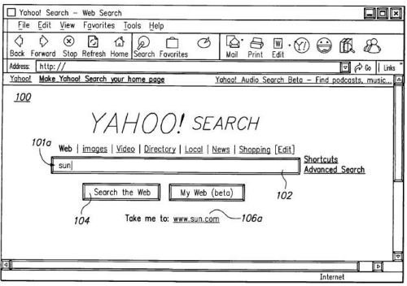
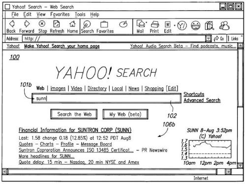
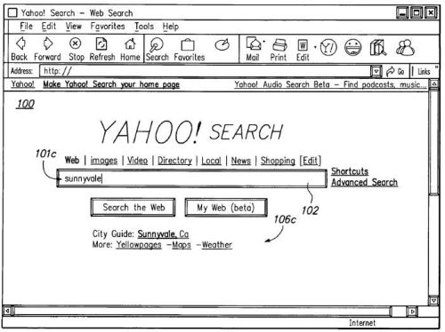
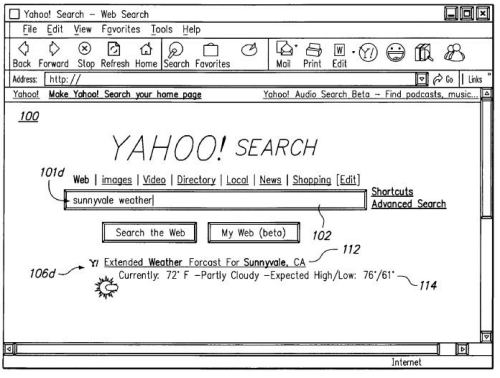

Google has received a great deal of attention recently for immediate updates to search results while searchers type query terms into the Google search box. Yahoo was granted a patent on a similar process this past March, but there seems to be a difference in Yahoo’s approach to Instant Search. Instead of updating search results for every letter typed for a query, the Yahoo process may only show updates when Yahoo believes those might provide meaningful results to a viewer, before a query is fully formed.

Some of the recent discussion about Google Instant has pointed out that Yahoo had developed an “Instant Search” back in 2005, though Yahoo’s Instant Search never made it to Yahoo’s main search page the way that Google’s has now. Would Yahoo bring Instant Search to their display of search results, even with Bing powering the search database behind Yahoo? Shashi Seth, the Senior Vice President of Yahoo! Search Products, hinted at the possibility about ten days ago in a Yahoo! Search Blog post, Back to the Future: Innovation is Alive in Search

The patent is:

[Speculative search result based on a not-yet-submitted search query](http://patft.uspto.gov/netacgi/nph-Parser?Sect1=PTO2&Sect2=HITOFF&u=%2Fnetahtml%2FPTO%2Fsearch-adv.htm&r=1&p=1&f=G&l=50&d=PTXT&S1=7672932.PN.&OS=pn/7672932&RS=PN/7672932)
Invented by Stephen Hood, Ralph Rabbat, Mihir Shah, Adam Durfee, Alastair Gourlay, Peter Anick, Richard Kasperski, Oliver Thomas Bayley, Ashley Woodman Hall, Shyam Kapur, and John Thrall
Assigned to Yahoo! Inc.
US Patent 7,672,932
Granted March 2, 2010
Filed: August 24, 2005

Abstract

> Providing a speculative search result for a search query prior to completion of the search query. In response to receiving a search query from a client node, a speculative search result is provided to the client node for the search query prior to receiving an indication from the client node that said search query is completely formed.
>
> The speculative search result may be displayed on the same web page on the client node as the search query, while the search query is being entered by the user. As the user further enters the search query, a new speculative search result may be provided to the user.

Under the Yahoo process for showing search results before a searcher is finished typing a query and clicking upon a search button, the search engine might look for signs that a not-yet-submitted search query meets certain criteria for starting a search. That criteria is referred to in the patent as “speculative search initiation criteria”.

The idea behind waiting is to attempt to limit instant, or “speculative” search results to highly relevant results.

One criteria might be that a searcher has entered what appears to be a complete word in the search box.

Another might be to show results for partially completed words in queries where returning results for those partially completed terms might potentially yield relevant results.

In addition to looking at the letters that are typed into the search box, the search engine might pay attention to the rate of speed at which someone is typing to determine if it should launch a speculative set of results.

Typing in certain characters, such as pressing the space bar might also be a signal to start a search.

Another technique that might be used is to determine if what is shown in the search box matches a term or phrase in a predefined dictionary filled with popular queries, as a condition for launching a search.

**Relevance Threshold**

The patent describes a “relevance threshold” that it might try to meet before beginning to show query results. When you perform a Google Instant search, it starts showing results for every letter that you type. Chances are that you may not care too much for the results that start showing in Google’s results for the first letter or two that populate their results. Chances are that those really aren’t relevant for what you may be trying to find. Should Google back off on showing updated results that quickly?

A wait on showing results based upon a relevancy threshold being met serves the purpose of providing “the user with highly relevant results and avoids overloading the user with results, as no results need be returned to the user if the speculative search result relevancy or other criterion is deemed too low.”

The patent does provide some more details on how Yahoo speculative search results might appear, but stresses that search results might not be updated with every keystroke made, the way that Google Instant results are presently. Following is a sequence of screenshots showing updated search results from the patent. In the screenshots, the results aren’t updated after each character typed in the search box, and the results show are very limited – mostly to just one link.

There’s no guarantee that Yahoo will start showing speculative search results, as described in this patent, but the approach indicated within the patent shows more restraint than Google provides with their instant results.

Would you prefer to see Yahoo’s approach to instant results, or Google’s?

Is Yahoo’s approach, as described in this patent, a smarter approach, or just one showing more restraint? After all, Google continues to show ads in their instant results, while there isn’t a single ad to be seen in the screenshots above.

Yahoo does have a pending patent application, [Search entry system with query log autocomplete](http://appft.uspto.gov/netacgi/nph-Parser?Sect1=PTO2&Sect2=HITOFF&u=%2Fnetahtml%2FPTO%2Fsearch-adv.html&r=1&p=1&f=G&l=50&d=PG01&S1=20080065617.PGNR.&OS=dn/20080065617&RS=DN/20080065617) which describes how they could locate and display drop down query suggestions similar to the ones that Google presently shows. Those query suggestions could be used to show more possible speculative search results than the limited examples in the screen shots above.

Perhaps there’s a better balance somewhere between the two? Do we really need to see search results for single letters like Google is presently showing in Google Instant?
