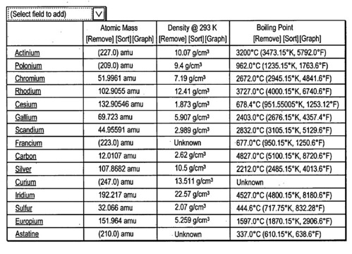
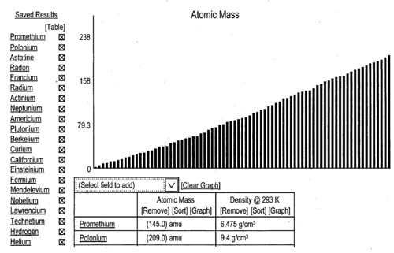

## How Might Google Handle Data Visualization?

Yesterday, I wrote about how Google might present facts extracted from pages in timelines or maps, according to a patent application filed last week.

It wasn’t the only piece of intellectual property coming out of the US Patent and Trademark Office for Google on the [extraction and visualization of facts](https://www.seobythesea.com/2007/08/google-timelines-fact-maps-and-fact-relevance-rankings/). Another that maybe even more interesting describes the possibility of a user extracting facts found in a query of the fact database, and choosing to present those facts in a number of ways.

[Designating data objects for analysis](http://appft1.uspto.gov/netacgi/nph-Parser?Sect1=PTO2&Sect2=HITOFF&u=%2Fnetahtml%2FPTO%2Fsearch-adv.html&r=1&p=1&f=G&l=50&d=PG01&S1=20070179965.PGNR.&OS=dn/20070179965&RS=DN/20070179965)
Invented by Andrew W. Hogue, David J. Vespe, Alexander Kehlenbeck, Michael Gordon, Jeffrey C. Reynar, and David B. Alpert
US Patent Application 20070179965
Published August 2, 2007
Filed: January 27, 2006

Abstract

> A fact repository stores objects. Each object includes a collection of facts, where a fact comprises an attribute and a value. An object access module receives objects from the fact repository. The objects can result from multiple different queries executed against the fact repository. A user interface (UI) generation module provides a UI enabling an end-user to designate objects from multiple different queries for subsequent analysis by storing the objects in a virtual collection.

**Components of a fact repository**

The patent application goes into a lot of detail on how this system might work. Here are some of those about the mechanical aspects of a fact repository.

The components used to manage facts in a fact repository include importers, janitors, a build engine, a service engine, and, a fact repository. These can all be implemented as software modules (or programs).

*Importers* – process documents received from web pages by reading the data content of those pages, and extracting facts from them. Importers also determine the subject or subjects with which the facts are associated and extract such facts into individual items of data for storage in the fact repository. There may be different types of importers for different types of documents, depending upon the format or document type.

*Janitors* – process facts extracted by importer, in areas like data cleansing, object merging, and fact induction. It’s possible to have a number of janitors that perform different types of data management operations on the facts, such as:

- Finding duplicate facts (that is, facts that convey the same factual information), to merge them
- Normalize facts into standard formats
- Removing unwanted facts from a repository (pornographic content, for instance)
- Other janitors performing data management functions such as translation, compression, spelling or grammar correction

## Example of normalization

One page may have Britney Spears’ “birthday” as “12/2/1981” while another page that her “date of birth” listed at “Dec. 2, 1981.” One janitor could rewrite both “birthday” and “date of birth” as “birthdate.” Another janitor may notice that “12/2/1981” and “Dec. 2, 1981” are the same day, and could choose the preferred form, remove the other fact and combine the source lists for the two facts. Looking at source pages for facts, some may be exact matches, while others may present the information in different forms.

*Build engine* – builds and manages the repository.

*Service engine* – an interface used to query the repository. It processes queries, scores matching objects, and returns them to the caller.

*Repository* – stores facts extracted from a number of pages. A page from which a particular fact may be extracted is a considered a source document (or “source”) of that particular fact. In a repository, each fact may be associated with exactly one object, with an object ID that uniquely identifies the object of the association. This way, any number of facts may be associated with an individual object, by including the object ID for that object in the facts.

Data VisualizationI’m going to let the pictures tell the story on this one. A collection of facts might be gathered after a search, or a combination of searches, and used to put together a table of data, like the following table of facts about atomic properties.

Given a choice of ways to present the information about the facts collected, the following shows data visualization of the atomic mass of those elements:

I can see how this would be fun to use in a lot of different ways, from grabbing and displaying baseball statistics to website visit information, from looking at the rise and fall of stock prices to building historical timelines and maps.
