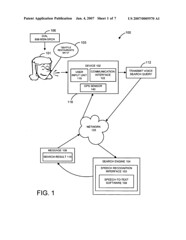

You pick up your mobile phone, dial “888 MSN-srch*” and say “pizza.” (*warning, phone number is used for illustration purposes only.)

On your screen appears the addresses, links to web sites, and phone numbers for the closest pizza places around you.

A new patent application from Microsoft describes a way to search by voice, and receive text results by SMS message, IM, or search result listings in a web browser. While someone searching can add geographical information, such as a zip code, this system may be able to identify a location through a variety of other methods, such as GPS or cell tower triangulation.

Speech-to-text software would be used to convert the voice search query into a text search query.

Here’s the patent application:

[Searching for content using voice search queries](http://appft1.uspto.gov/netacgi/nph-Parser?Sect1=PTO1&Sect2=HITOFF&d=PG01&p=1&u=%2Fnetahtml%2FPTO%2Fsrchnum.html&r=1&f=G&l=50&s1=%2220070005570%22.PGNR.&OS=DN/20070005570&RS=DN/20070005570)
Invented by Oliver Hurst-Hiller and Julia H. Farago
Assigned to Microsoft
US Patent Application 20070005570
Published January 4, 2007
Filed June 30, 2005

Abstract

> A system, method and computer-readable media are disclosed for searching for content from a device. The system, method, and computer-readable media are adapted to transmit a voice search query from a device and can in return allow the device to receive corresponding non-voice search result data. Once non-voice search result data is received it can be displayed to the user on a display of the device.

This post has made me hungry.
