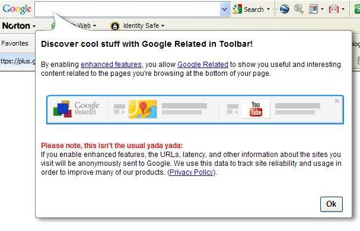
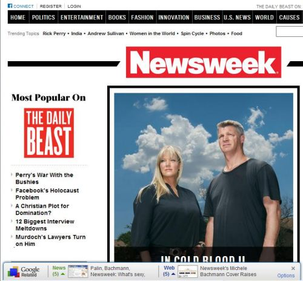
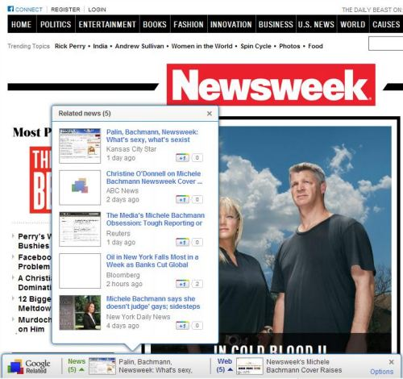
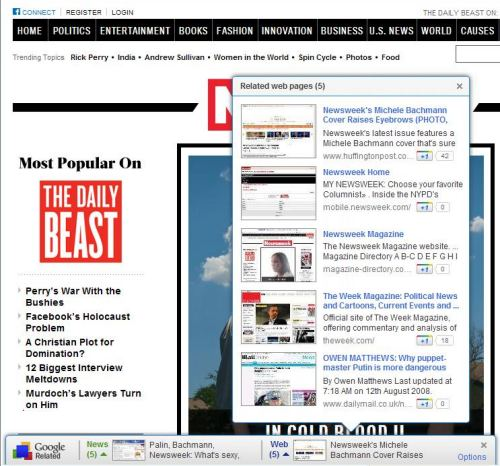
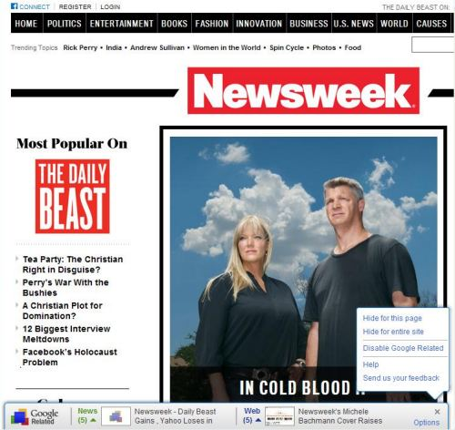
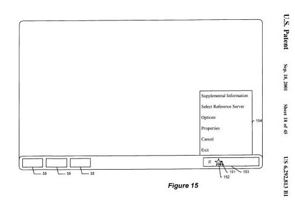
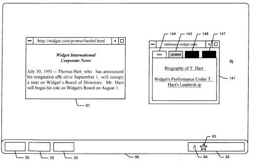
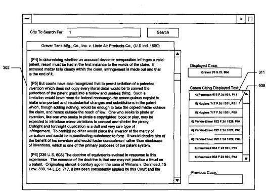

My Google toolbar updated on me earlier today, and a notification window popped up, telling me about one of Google’s newest features, Google Related, which has some interesting implications. Ran Ben-Yair, a Product Manager from the Google Related team located at the Israel R&D Center introduced the feature in a blog post titled [Find more while you browse with Google Related](https://search.googleblog.com/2011/08/find-more-while-you-browse-with-google.html)

I haven’t had much time to explore the use of Google Related on more than a couple of sites, but I’ll be looking for more signs of it on the Web. I noticed a couple of days ago a number of patents that Google had recorded as being acquired from Northbrook Digital LLC which looked like they shared some very similar features to Google Related. Interesting to see them possibly incorporated into Google so quickly.

Google Related shows a toolbar at the bottom of some pages providing links to other content on the Web. An example from the toolbar help page tells us that if you are on the homepage for a restaurant in San Francisco, Google Related might provide you with links to click upon to show you information such as “the location of the restaurant on a map, user reviews, related restaurants in the area, and other webpages related to San Francisco restaurants.”

I went looking around to see if I could see the Google Related toolbar in the wild, and found it in use on the [Daily Beast Newsweek](https://www.newsweek.com/2014/01/24/issue.html) pages. The first image showed the toolbar as it appeared on the site:

There were two informational widgets available for me to hover over with my mouse pointer and view on the Newsweek pages, as well as an “options” widget. The first of them showed 5 related news stories, along with thumbnails and Google + buttons and a count of how many times those had been plussed:

The second displayed 5 pages which includes blog posts and more news, and thumbnails and plus buttons again.

The options widget provides a number of controls, such as the ability to hide the Google Related Toolbar for a particular page or an entire site, disable the feature, access help, or send feedback. Here’s what that looks like:

It’s probably time to sneek in a screenshot from one of the patents Google recently acquired at this point which shows a toolbar at the bottom of the page with rectagular widgets included in the toolbar, and a control at the right of the toolbar that provides control features for the toolbar:

There are some differences, but the similarities are interesting.

Here’s another image from one of the patents showing a couple of informational widgets:

The patent claims from the first batch of patents appear to be pretty good matches for Google Related as well. The description doesn’t quite match up 100%, but most patent descriptions are illustrative examples, and the claims sections are the important parts.

According to the Google Related help page, additional content that might be displayed might cover a number of categories, including “videos, news articles, maps, reviews, images, web sites and more.” Most of these seem like they might present previews of content, but the help page does say that if you hover over a video content item, the video will appear in the preview box and can be played from there.

For Google Related to work in Internet Explorer, you need to have the newest version of the toolbar and your Google Toolbar needs to be configured so that the search site it uses is Google.com. It also tells us that sometime in the future that might change to be available with country-specific versions of Google search. There is also a Google Related Chrome Extension for people using Google Chrome.

**The Northbrook Digital LLC Patents**

In two separately recorded sets of patent assignments at the USPTO from Northbrook Digital LLC to Google over the past week, with an execution date of July 21, 2011, Google acquired a number of granted patents and a pending patent application from NorthBrook Digital, LLC. All of the patents are listed as having been invented by Mark A. Wolfe

The first batch were various continuations of a granted patent with the same name, and a pending patent application that looks like it covers the same territory, but with a slightly different name. The second batch also all seem to be continuations of a different patent. All of the filings in the first group have the same abstract, except the second patent to be filed, where the abstract is expanded upon a little. The 4 granted patents in the second group all have slightly different titles, and three of them share an abstract.

[System and method for communicating information relating to a network resource](http://patft.uspto.gov/netacgi/nph-Parser?Sect1=PTO2&Sect2=HITOFF&p=1&u=%2Fnetahtml%2FPTO%2Fsearch-adv.htm&r=1&f=G&l=50&d=PALL&S1=06006252&OS=PN/06006252&RS=PN/06006252)
US Patent 6,006,252
Granted December 21, 1999
Filed: September 25, 1997

[System and method for communicating information relating to a network resource](http://patft.uspto.gov/netacgi/nph-Parser?Sect1=PTO2&Sect2=HITOFF&u=%2Fnetahtml%2FPTO%2Fsearch-adv.htm&r=1&p=1&f=G&l=50&d=PTXT&S1=6341305.PN.&OS=pn/6341305&RS=PN/6341305)
US Patent 6,341,305
Granted January 22, 2002
Filed: November 16, 1999

[System and method for communicating information relating to a network resource](http://patft.uspto.gov/netacgi/nph-Parser?Sect1=PTO2&Sect2=HITOFF&p=1&u=%2Fnetahtml%2FPTO%2Fsearch-adv.htm&r=1&f=G&l=50&d=PALL&S1=06336131&OS=PN/06336131&RS=PN/06336131)
US Patent 6,336,131
Granted January 1, 2002
Filed: April 5, 2000

[System and method for communicating information relating to a network resource](http://patft.uspto.gov/netacgi/nph-Parser?Sect1=PTO2&Sect2=HITOFF&p=1&u=%2Fnetahtml%2FPTO%2Fsearch-adv.htm&r=1&f=G&l=50&d=PALL&S1=07043526&OS=PN/07043526&RS=PN/07043526)
US Patent 7,043,526
Granted May 9, 2006
Filed: December 12, 2001

[System and method for communicating information relating to a network resource](http://patft.uspto.gov/netacgi/nph-Parser?Sect1=PTO2&Sect2=HITOFF&p=1&u=%2Fnetahtml%2FPTO%2Fsearch-adv.htm&r=1&f=G&l=50&d=PALL&S1=07257604&OS=PN/07257604&RS=PN/07257604)
US Patent 7,257,604
Granted August 14, 2007
Filed: August 5, 2003

[System and method for communicating information relating to a network resource](http://patft.uspto.gov/netacgi/nph-Parser?Sect1=PTO2&Sect2=HITOFF&p=1&u=%2Fnetahtml%2FPTO%2Fsearch-adv.htm&r=1&f=G&l=50&d=PALL&S1=07433874&OS=PN/07433874&RS=PN/07433874)
US Patent 7,433,874
Granted October 7, 2008
Filed: December 30, 2005

[System and method for communicating information relating to a network resource](http://patft.uspto.gov/netacgi/nph-Parser?Sect1=PTO2&Sect2=HITOFF&p=1&u=%2Fnetahtml%2FPTO%2Fsearch-adv.htm&r=1&f=G&l=50&d=PALL&S1=07536385&OS=PN/07536385&RS=PN/07536385)
US Patent 7,536,385
Granted May 19, 2009
Filed: September 6, 2006

Abstract

> A system and method for communicating information relating to a network resource. A computer for displaying supplemental information about another document on a display screen for a user. Guiding individuals to places of interest on a network where information is stored, and/or displaying or otherwise presenting useful information to the user.

[System and method for communicating information relating to a network resource](http://patft.uspto.gov/netacgi/nph-Parser?Sect1=PTO2&Sect2=HITOFF&p=1&u=%2Fnetahtml%2FPTO%2Fsearch-adv.htm&r=1&f=G&l=50&d=PALL&S1=06292813&OS=PN/06292813&RS=PN/06292813)
US Patent 6,292,813
Granted September 18, 2001
Filed: November 17, 1998

Abstract

> A system and method for communicating information relating to a network resource. Upon detecting a hypertext document displayed on the screen a request identifying the document to a supplemental information server and retrieving information related to the hypertext document. The supplemental information is also displayed and the user may be provided opportunity to select further information or links. Guiding individuals to places of interest on a network where information is stored, and/or displaying or otherwise presenting useful information to the user.

[Communicating Information Relating to a Network Resource](http://appft.uspto.gov/netacgi/nph-Parser?Sect1=PTO1&Sect2=HITOFF&d=PG01&p=1&u=%2Fnetahtml%2FPTO%2Fsrchnum.html&r=1&f=G&l=50&s1=%2220070136418%22.PGNR.&OS=DN/20070136418&RS=DN/20070136418)
US Patent Application 20070136418
Published June 14, 2007817
Filed: January 19, 2007

Abstract

> In an information retrieval system, a system and method for presentation of information and/or resources that are pertinent to an individual’s interests or task. Guiding individuals to places of interest on a network where information is stored. Displaying or otherwise presenting useful information to the user.

=========================================

The following patents are continuations of an original patent, now abandoned, filed Jun. 7, 1995, with the Serial No. 08/487,925. There are some slight differences in the names, and the last three granted patents use the same abstract.

They appear to describe an electronic online version of a [Shepard’s guide to citations for legal cases](https://en.wikipedia.org/wiki/Shepard%27s_Citations), as seen in the following screenshot from the patent, but if you read through the claims to the patents, those don’t appear to be limited to providing case or statute citations for legal cases until a mention of judicial opinions in one of the later claims. It might be possible that this patent could be used in a broader manner:

[Document research system and method for displaying citing documents](http://patft.uspto.gov/netacgi/nph-Parser?Sect1=PTO2&Sect2=HITOFF&p=1&u=%2Fnetahtml%2FPTO%2Fsearch-adv.htm&r=1&f=G&l=50&d=PALL&S1=05870770&OS=PN/05870770&RS=PN/05870770)
US Patent 5,870,770
Granted February 9, 1999
Filed: January 28, 1998

Abstract

> A method for displaying on a computer screen information concerning the interrelationships of documents. A first document is retrieved over a network and displayed in a document display window on a display screen while simultaneously displaying, in a second window on the display screen, separately selectable representations of related documents which are relevant to the subject matter of the first document. When a user selects a representation of a second document, the second document is displayed in the document display window, and the representations of related documents in the second window are automatically updated when the second document is displayed in the document display window.

[Document research system and method for efficiently displaying and researching information about the interrelationships between documents](http://patft.uspto.gov/netacgi/nph-Parser?Sect1=PTO2&Sect2=HITOFF&p=1&u=%2Fnetahtml%2FPTO%2Fsearch-adv.htm&r=1&f=G&l=50&d=PALL&S1=06263351&OS=PN/06263351&RS=PN/06263351)
US Patent 6,263,351
Granted July 17, 2001
Filed: February 5, 1999

[Efficiently displaying and researching information about the interrelationships between documents](http://patft.uspto.gov/netacgi/nph-Parser?Sect1=PTO2&Sect2=HITOFF&u=%2Fnetahtml%2FPTO%2Fsearch-adv.htm&r=1&p=1&f=G&l=50&d=PTXT&S1=7302638.PN.&OS=pn/7302638&RS=PN/7302638)
US Patent 7,302,638
Granted November 27, 2007
Filed: August 29, 2003

[Efficiently displaying and researching information about the interrelationships between documents](http://patft.uspto.gov/netacgi/nph-Parser?Sect1=PTO2&Sect2=HITOFF&p=1&u=%2Fnetahtml%2FPTO%2Fsearch-adv.htm&r=1&f=G&l=50&d=PALL&S1=07246310&OS=PN/07246310&RS=PN/07246310)
US Patent 7,246,310
Granted July 17, 2007
Filed: April 5, 2006

Abstract

> A system for displaying, on a computer screen, information concerning the interrelationships of documents. A system employing the present invention also allows for the efficient research of documents that cite a document shown on the computer screen. In one embodiment, the present invention involves displaying at least a portion of a first document and simultaneously displaying a representation of one or more citing documents. The citing documents cite some portion of the displayed document. In another embodiment, the invention involves displaying at least a portion of a first document, and displaying a representation of one or more citing documents, wherein the displayed citing documents cite the displayed portion of the first document.

**Conclusions**

Since the patents aren’t from Google, it’s hard to tell how much of what the first batch of patents describe might be incorporated into Google Related, but it does appear that these patents are related to Google’s new feature. Not sure if Google will use the processes from the second set of patents, and if they have any interest in providing that kind of legal information. They do have a patent search, so the idea isn’t necessarily outrageous. And I’d love to see a feature like the one described in the second group of patents used to provide links to the documents appearing as references in Google patents.

The idea of Google providing a feature that appears on other peoples’ websites probably should be a little disturbing, especially if it might potentially lead people away from those sites. If you’re a restaurant owner in San Francisco, and you can access Google Reviews without leaving the page, and links to other restaurants in the immediate area, that could potentially be troublesome if some of your reviews might not be that good, or if there are a lot of other good restaurants in the area.

It’s uncertain as well whether Google might enable Website owners with the ability to turn off the Google Related toolbar on their sites. The toolbar help page is silent on the topic, but there might be a good number of upset webmasters when they see the toolbar appear on their pages for the first time.

We also don’t know if Google might take advantage of displaying this extra content to show advertisements, or links to pages like Google Places which contain advertisements.

It’s impossible to tell if Google acquired Northbrook Digital LLC, or if it just acquired the patents. Did Google acquire them to use the technology described within them, or were they working on something similar, and decided that they patents might help shield them from possible patent infringement litigation from either Northbrook or someone who may possible have patented something similar?

Finally, I’m also using the image at the top of this post, with the Google Related Logo as part of a test. In my last post, [Google’s Asymmetric Social Network and Plus Authoring Patent](https://www.seobythesea.com/2011/08/googles-asymmetric-social-network-and-plus-authoring-patent/), I wrote about a patent from Google that looked like it described how authors at Google Plus might be able to add a link to a post and choose amongst a number of images from the page linked to, to appear next to the post.

The patent noted that it might not include some images as options to show based upon whether they were so small that they might be decorations or icons. It stated that it might do that by not offering the options to use images that were smaller than 30 pixels on any one side. The “Google Related” logo that starts this post is 39 pixels long on its shortest side. Once I publish this post, I’m going to write a new post at Google Plus, and link to this post, and see if that logo image is available to me. I suspect that it will be.

*Added August 18, 2011 at 7:21pm (edt) – my image experiment at Google Plus wasn’t successful. Google didn’t offer me the option to use the Google Related Logo at the start of this post. That could be because it’s too small, or maybe because there were too many other larger images to choose from. :(*
