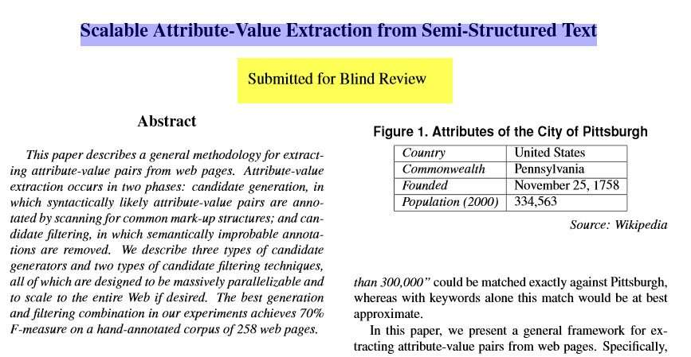
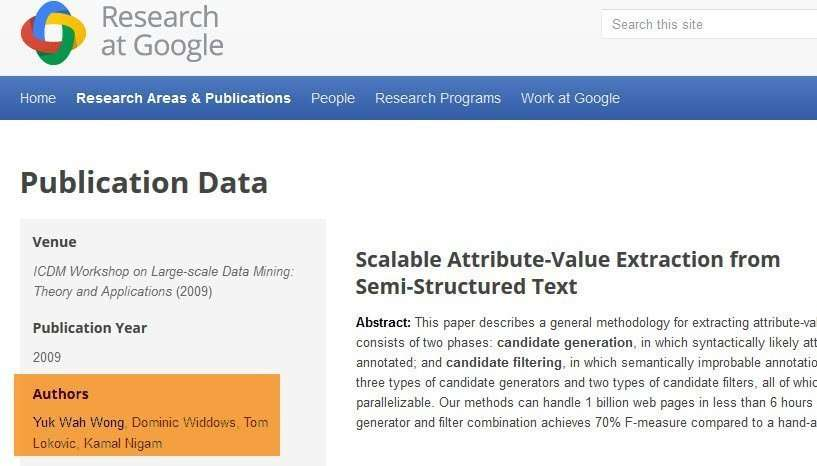
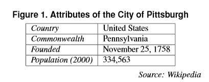
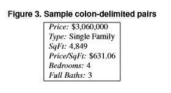

I’ve been writing recently about a [patent from Google on Featured Snippets](https://www.seobythesea.com/2014/12/direct-answers-natural-language-search-results-intent-queries/), and how Google might take those from [authoritative sources](https://www.seobythesea.com/2014/12/direct-answers-taken-authority-websites/), using an [intent template process](https://www.seobythesea.com/2014/12/direct-answers-using-query-intent-templates-identify-answers/) (“what are the symptoms for [measles, flu, athlete’s foot,ebola]”) to include many direct answer responses to natural language queries, while also showing keyword-based search results.

The patent doesn’t tell us about how such natural language featured the search engine chooses snippets. Still, the following document, which shared the same authors as the inventors of the patent and filed by them as a provisional patent, gives us some ideas on how those are found on the web.

We know that Google is looking for responses from pages that they consider “authoritative” pages.

We also knew that Google uses query templates to help identify the right pages among those authoritative pages to use content from to answer questions such as:

- What are the symptoms for measles
- What are the symptoms for chicken pox
- What are the symptoms for the flu

When it was published, as we can see just below, the authors’ identities were protected since it was “submitted for blind review.”

_This paper is from the same authors as the natural language query patent I’ve been writing about and was filed as an early provisional patent by them._

The paper tells us about how Google might be extracting answers from pages on the Web, and can be found at:

[Scalable Attribute-Value Extraction from Semi-Structured Text](http://static.googleusercontent.com/media/research.google.com/en/us/pubs/archive/34460.pdf)

The authors/inventors names are on the version at the [Google research abstract](https://research.google/pubs/pub34460/) (in orange, below):

_The paper was originally filed to be presented at a conference on large scale data mining. Perhaps that’s where it was “blindly submitted” to._

The paper tells us right up front that it uses a process that makes it easy to engage in extracting Answers from Pages on the Web.

## Extracting answers based on Structural Contexts

In this paper, we present a general framework for extracting attribute-value pairs from web pages.

Specifically, we restrict our attention to attribute-value pairs that are expressed in structural contexts such as tables and colon-delimited pairs.

The main motivation is that a large number of attribute-value pairs that exist on the Web are encoded in such formats, and identifying these formats is relatively straightforward.

So information might be extracted from tables like the following from a Wikipedia infobox:

_On the left are atrributes, and on the right are values for them._

In addition to two-column tables like that, tables with additional rows are pointed to in the paper. It also tells us that it might grab attribute value information from pairs of things that are formatted and separated by colons, like this:

_when items on a page are separated by colons like this, they are often related._

## Extracting Answers based upon Patterns

The paper points out another source that could be used to extract information in the form of patterns. These patterns are like the [query intent templates](https://www.seobythesea.com/2014/12/direct-answers-using-query-intent-templates-identify-answers/) that the patent points at:

Most such work has been devoted to the acquisition of WordNet-style relations between pairs of concepts. Work specifically directed towards extracting attributes of concepts was performed by Poesio and Almuhareb [14].

Their system generates candidates using the pattern “the X of the Y (is Z)”, the hypothesis is that X is an attribute of the concept described by the noun phrase Y, and Z if it appears, is the corresponding value.

Google has published much more detailed looks at how they might capture [information from patterns](https://www.seobythesea.com/2014/10/patterns-templates-entities/).

## Take Aways

If you think you might like it if your pages were shown as the sources for featured Snippets, striving to make your pages seen as authoritative pages is a good first step.

Understanding how tables and colon-delimited pairs might be used as sources for information can be important too.

Using patterns for content on your pages for related topics can be another way of enticing Google to extract information from your pages.

The paper also refers to a program called Text Runner, which involves an [Open Information Extraction](https://openie.allenai.org/) approach to learning from the Web. The processes described in the paper have a lot of parts. They involve many complex looks at the information being extracted to avoid extracting information that doesn’t answer questions.

The paper also describes the process of using wrappers, which I haven’t discussed here before. I will in the next and final post for this series.

Of course, we will probably look at many other posts and topics that involve how SEO and the Semantic Web are crossing paths and finding answers to questions that people might pose at the search engines.

[Featured Snippets – Natural Language Search Results for Intent Queries, Part 1](https://www.seobythesea.com/2014/12/direct-answers-natural-language-search-results-intent-queries/)
[Featured Snippets – Taken from Authority Websites, Part 2](https://www.seobythesea.com/2014/12/direct-answers-taken-authority-websites/)
[Featured Snippets – Using Query Intent Templates to Identify Answers, Part 3](https://www.seobythesea.com/2014/12/direct-answers-using-query-intent-templates-identify-answers/)
[Featured Snippets: How Answers are Extracted from Web Pages, Part 4](https://www.seobythesea.com/2015/01/direct-answers-answers-extracted-web-pages/)
[Featured Snippets: Extracting Text from Pages Citations, Part 5](https://www.seobythesea.com/2015/01/direct-answers-extracting-text-from-pages/)

Also see: [Does Google Use Schema to Write Answer Passages for Featured Snippets?](https://gofishdigital.com/schema-answer-passages-featured-snippets/)

Last Updated August 8, 2019.
