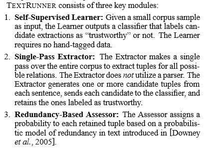
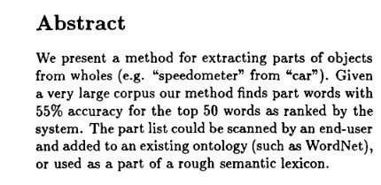
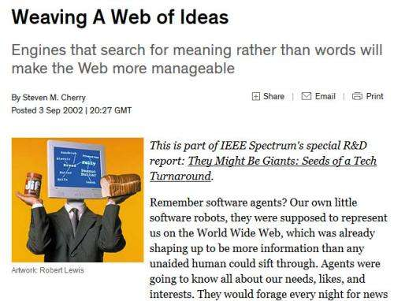
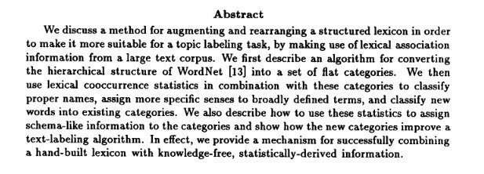
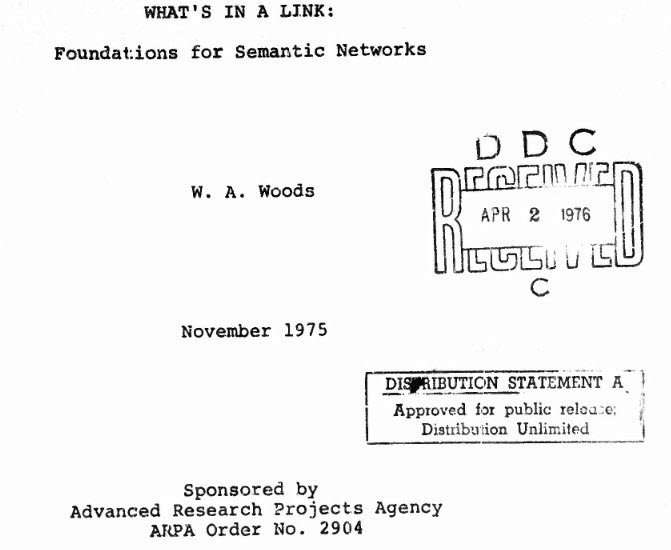

This is the last post in a series about Google’s International patent application [Natural Language Search Results for Intent Queries](https://patentscope.wipo.int/search/en/detail.jsf?docId=WO2014197227).

The citations list inspired this section at the end of a paper used by the listed inventors as a provisional patent that preceded that patent. The paper was [Scalable Attribute-Value Extraction from Semi-Structured Text](http://static.googleusercontent.com/media/research.google.com/en/us/pubs/archive/34460.pdf) (pdf).

I sometimes like to start looking through the documents I see listed as citations or footnotes in a paper I find interesting. As I started looking at the documents in that paper, I found many of them to be very interesting.

And then an idea struck me.

Rather than me trying to take just one or two of these papers, I’d share the process. Since the original paper was a PDF without any links to it, the chances of most people exploring those links were minimal.

And yet, some of these papers should be read.

There’s one on the Semantic Web from 1975, created by the Department of the Navy. There’s another from the 80s and three more from the early 90s. Some basic concepts that people interested in the Semantic Web and Search Engines such as Wrappers are covered.

I don’t know all of the classic papers of the Semantic Web and whether or not many of these fit into that category. But that’s why I’m sharing links to them – so that we can work on learning that together.

If you see something that strikes you as really interesting, please let me know in the comments.

Thanks, and I hope you find something exciting in these.

_The key modules involved in TextRunner: from “Open Information Extraction from the Web.”_

[1] M. Banko, M. J. Cafarella, S. Soderland, M. Broadhead, and O. Etzioni. Open information extraction from the web. (pdf) In Proceedings of the 20th International Joint Conference on Artificial Intelligence (IJCAI-07), pages 2670–2676, Hyderabad, India, January 2007.

_From “Finding parts in very large corpora.”_

[2] M. Berland and E. Charniak. [Finding parts in very large corpora](https://www.aclweb.org/anthology/P99-1008/) (pdf). In Proceedings of the 37th Annual Meeting of the Association for Computational Linguistics (ACL-99), pages 57–64, College Park, MD, June 1999.

[3] R. C. Bunescu and R. J. Mooney. [Collective information extraction with relational Markov networks](http://www.cs.utexas.edu/~ml/papers/cie-icml-wkshp-04.pdf) (pdf). In Proceedings of the 42nd Annual Meeting of the Association for Computational Linguistics (ACL-04), pages 439–446, Barcelona, Spain, July 2004.

[4] S. A. Caraballo. [Automatic construction of a hypernym labeled noun hierarchy from text](https://www.aclweb.org/anthology/P99-1016/) (pdf). In Proceedings of the 37th Annual Meeting of the Association for Computational Linguistics (ACL-99), pages 120–126, College Park, MD, June 1999.

_From ” Weaving a web of ideas.”_

[5] S. M. Cherry. [Weaving a web of ideas.](https://spectrum.ieee.org/telecom/internet/weaving-a-web-of-ideas) IEEE Spectrum, 39(9):65–69, September 2002.

[6] W. W. Cohen, M. Hurst, and L. S. Jensen. [A flexible learning system for wrapping tables and lists in HTML documents](http://www.cs.cmu.edu/~wcohen/postscript/ws-chap-2002.pdf) (pdf). In Proceedings of the 11th International World Wide Web Conference (WWW-02), pages 232–241, Honolulu, HI, May 2002. ([Presentation](http://www.cs.cmu.edu/~wcohen/postscript/ws-chap-2002.pdf) (PDF))

[7] K. Crammer, O. Dekel, J. Keshet, S. Shalev-Shwartz, and Y. Singer. [Online passive-aggressive algorithm](http://www.jmlr.org/papers/volume7/crammer06a/crammer06a.pdf) (pdf). Journal of Machine Learning Research, 7:551–585, 2006.

[8] D. Freitag and N. Kushmerick. [Boosted wrapper induction](https://www.aaai.org/Papers/AAAI/2000/AAAI00-088.pdf) (pdf). In Proceedings of the 17th National Conference on Artificial Intelligence (AAAI-00), pages 577–583, Austin, TX, July 2000.

[9] M. A. Hearst. [Automatic acquisition of hyponyms from large text corpora](https://www.aclweb.org/anthology/C92-2082.pdf). In Proceedings of the 15th International Conference on Computational Linguistics (COLING-92), Nantes, France, August 1992.

_From Customizing a lexicon to better suit a computational task._

[10] M. A. Hearst and H. Schutze. [Customizing a lexicon to ¨better suit a computational task](https://www.aclweb.org/anthology/W93-0106/). In Proceedings of the ACL-SIGLEX Workshop on Acquisition of Lexical Knowledge from Text, Columbus, Ohio, June 1993.

[11] I. Muslea, S. Minton, and C. A. Knoblock. [Hierarchical wrapper induction for semistructured information sources](https://www.isi.edu/integration/papers/muslea01-jaamas.pdf) (pdf).Journal of Autonomous Agents and Multi-Agent Systems, 4:93–114, 2001.

[12] M. Pasca and B. Van Durme. Weakly supervised acquisition of open-domain classes and class attributes from web documents and query logs (pdf). In Proceedings of the 46th Annual Meeting of the Association for Computational Linguistics (ACL-HLT-08), pages 19–27, Columbus, OH, June 2008.

[13] J. Pearl. [Probabilistic Reasoning in Intelligent Systems: Networks of Plausible Inference](https://www.amazon.com/Probabilistic-Reasoning-Intelligent-Systems-Representation/dp/1558604790?ie=UTF8&*Version*=1&*entries*=0) (book in Amazon). Morgan Kaufmann, San Mateo, CA, 1988.

[14] M. Poesio and A. Almuhareb. [Identifying concept attributes using a classifier](https://www.aclweb.org/anthology/W05-1003/) (pdf). In Proceedings of the ACL Workshop on Deep Lexical Semantics, Ann Arbor, Michigan, June 2005.

[15] J. Pustejovsky. [The Generative Lexicon](https://mitpress.mit.edu/books/generative-lexicon) (Book atg MIT). MIT Press, Cambridge, MA, 1995.

[16] Y. Shinyama and S. Sekine. [Preemptive information extraction using unrestricted relation discovery](https://www.aclweb.org/anthology/N06-1039/) (pdf). In Proceedings of the Human Language Technology Conference of the North American Chapter of the ACL (HLT-NAACL-06), pages 304–311, New York City, NY, June 2006.

_From What’s in a link: Foundations for semantic networks_

[17] W. A. Woods. [What’s in a link: Foundations for semantic networks](https://apps.dtic.mil/dtic/tr/fulltext/u2/a022584.pdf) (pdf). In D. G. Bobrow and A. M. Collins, editors, Representation, and Understanding: Studies in Cognitive Science, pages 35–82. Academic Press, New York, 1975.

[18] S. Zhao and J. Betz. [Corroborate and learn facts from the web](https://research.google/people/author17490/)(Paid ACM Access Only). In Proceedings of the 13th ACM SIGKDD International Conference on Knowledge Discovery and Data Mining, pages 995–1003, San Jose, CA, August 2007.

[Featured Snippets – Natural Language Search Results for Intent Queries, Part 1](https://www.seobythesea.com/2014/12/direct-answers-natural-language-search-results-intent-queries/)
[Featured Snippets – Taken from Authority Websites, Part 2](https://www.seobythesea.com/2014/12/direct-answers-taken-authority-websites/)
[Featured Snippets – Using Query Intent Templates to Identify Answers, Part 3](https://www.seobythesea.com/2014/12/direct-answers-using-query-intent-templates-identify-answers/)
[Featured Snippets: How Answers are Extracted from Web Pages, Part 4](https://www.seobythesea.com/2015/01/direct-answers-answers-extracted-web-pages/)
[Featured Snippets: Extracting Text from Pages Citations, Part 5](https://www.seobythesea.com/2015/01/direct-answers-extracting-text-from-pages/)

Last Updated June 5, 2019.
